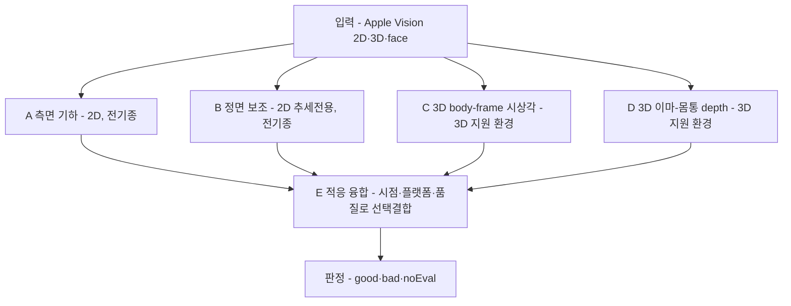

# 자세 추정 알고리즘 추천안

`turtlemeck`(macOS 메뉴바 자세 알림 앱)에 어떤 자세 추정 알고리즘·판정 로직을 적용할지 정리한다. 설정 저장·메뉴 UI·파이프라인 배선 등 구조는 범위 밖이며 **무엇을·왜·어떻게 판정하는가**(알고리즘 로직)만 다룬다. 아래 후보는 특정 구현체가 아니라 독립 판정 로직 후보다.

---

## 요약 다이어그램



---

## 0. 온디바이스 실측 (2026-06-19 · M1 Pro · macOS 15.7.2 · 노트북 웹캠 · 직접 촬영)

이전까지 "상체-only 3D 동작 여부 미검증"으로 두었던 항목을 실제 기기에서 측정해 갱신한다. 라이브 `CMSampleBuffer`(앱과 동일 입력 경로)로 캡처하고, 동일 프레임을 AI 시각 판독(ground truth)과 대조했다.

**3D (`VNDetectHumanBodyPose3DRequest`) — 간헐적·불안정 → 주 경로 부적합:**
- **발화 자체가 간헐적**: 상체-only 입력에서 라이브 10회 중 5회만 observation 반환(초근접 0/3, 정상 착석거리 약 4/6). 따라서 "전신 아니면 절대 불가"는 거짓이고, "안정 동작"도 거짓이다.
- **발화 시 17관절 전체를 반환하나 hip/knee/ankle은 카메라가 못 본 추론값**이다 — `heightEstimation=.reference`(LiDAR 없음).
- **마진 입력에서 각이 부정확**: 명백한 거북목 프레임에서 body-frame 시상각이 88.3°(거의 직립)·good을 산출했다. root/하반신 추론에 의존(§2.2 hip-rooted 불안정의 실증).
- **JPEG 재인코딩이 3D 거동을 바꾼다**(라이브 발화 ↔ 정지 JPEG 미발화). ⇒ 오프라인 정지 이미지(`analyze-image`)로는 3D 경로를 충실히 평가할 수 없다(2D는 정지 이미지로 충실히 평가 가능).

**2D — 견고, 단 baseline 보정이 정확도의 핵심:**
- 정면/3-4 2D는 매 프레임 견고하게 신호를 산출했다(2D body confidence 1.00).
- **보정 시 거북목을 정확히 가른다**: 바른자세 three-quarter 75.3° → 거북목 67.1° < 75.3 − 7°(`profileRelativeDrop`) → bad. **미보정 절대 임계(medium 58°)로는 둘 다 good**(67·75 모두 >58)이라 경미~중등 FHP를 놓친다. ⇒ baseline 보정이 핵심.
- 시점 분류는 borderline 비대칭(한쪽 귀 confidence ≈ 0.19로 추적 임계 0.2 바로 아래)에서 front↔three-quarter로 뒤집힐 수 있다. front로 가면 양어깨 모두 필요해 한쪽 어깨가 약하면 noEval이 되는 반면, three-quarter는 근측+neck 폴백으로 평가가 가능하다 → 분류 변동은 양날. **보정 시 여러 시점 baseline을 함께 캡처**해 런타임 분류 변동에 견디게 한다.

**실측 반영 코드 수정:** ① 3D 품질 게이트가 가려진 랜드마크(confidence 0)로 *신뢰도 0짜리 신호*를 만들던 버그 수정(미추적 proxy 제외 + 추적 임계 미만 noEval). ② fusion은 3D 입력이 실제 있을 때만 3D 분기를 평가(없으면 2D로 깔끔히 degrade).

### 0.1 "바른 자세 탐지"가 최우선 — 그리고 단안 2D의 노이즈 바닥(2026-06-19 추가 실측)

요구사항: 거북목만이 아니라 **삐딱·턱괴기·리클라인 등 "바른 자세가 아닌 모든 것"이 비정상**이고, **바른 자세를 정확히 탐지하는 것이 최우선**(= 비정상을 good으로 오판하지 말 것).

**핵심 실측 — 단일 프레임 2D로는 good과 경미한 비정상을 가를 수 없다(노이즈 바닥):**
- 같은 **바른 자세**를 연속 촬영해도 three-quarter 각이 **68.1~79.2°로 요동**(±6°). 경미한 비정상(리클라인+회전)은 **67~69°** → **good 범위와 완전히 겹친다**(good 68.1° ≈ 비정상 69.0°). ⇒ 어떤 각도 임계로 비정상(69°)을 잡아도 바른 자세(68°)를 bad로 오판 → 최우선 위반. 보정해도 격차(~6°)가 노이즈(~6°)와 같아 해소되지 않는다.
- **faceYaw 요동**: 같은 바른 자세에서 0°↔45°로 튄다 → 시점/정면응시 판정에 신뢰 불가.
- **어깨 저신뢰**: 근측 반대 어깨 confidence가 0.16~0.22(추적 임계 0.2 근처) → 어깨 기울기/대칭 신호 불안정.
- **faceRoll**: 라이브 캡처에선 항상 0으로 나와 무용이라 판단했으나, **2026-06-21 정지 PNG 실측에선 삐딱(머리 ~30° 기울임) 시 roll=30.0°로 정확히 감지**됐다(§0.2). 라이브/정지·환경 의존적이라 단정 불가 — body pose 실패 시 faceRoll을 삐딱 감지 보조로 쓸 수 있도록 반영하되, eye-line roll이 있으면 그것을 우선한다.

**그나마 강건한 신호 = 눈-선 기울기(eye-line roll)**: 눈은 고신뢰(0.7~0.95)라 좌우 기울기를 비교적 안정적으로 준다. 실측 바른 자세 0~−19°, 명확한 삐딱 −33°, 전방머리 −24°.

**채택한 판정 철학·로직(코드 반영):**
- **good은 양성 증거가 있어야 한다** — 시상 신호가 통과해도 **머리가 명확히 기울면(eye-line roll > 28°) good에서 제외하고 bad**로 본다(`AlgorithmSupport.applyUprightGate`, 공용·라이브 동일 적용). 임계 28°는 바른 자세 변동(최대 ~19°)보다 충분히 높여 **false-bad(바른데 알림)를 방지**(최우선 보호). 단일 프레임 노이즈는 버스트+상태기계 2회 지속 요건이 흡수.
- **사람 없음/판정 불가는 noEval**(거짓 good 금지) — 실측에서 빈 장면은 정확히 noEval.
- **한계(정직)**: 경미한 전방머리·리클라인(각·깊이가 노이즈 바닥 내)은 단안 2D로 신뢰성 있게 못 잡는다. 신뢰 가능한 검출은 (a) 명확한 머리 기울기(삐딱), (b) 큰 슬라우치/전방머리, (c) 회전·가림으로 2D 검출 실패(→noEval), (d) **개인 보정 기반 상대 판정**에서 나온다. 경미 케이스까지 잡으려면 **더 안정적인 카메라 배치(측면 등) 또는 보정**이 필요.

### 0.2 정면 거북목 클로즈업 = Vision body pose 완전 실패 (2026-06-21 추가 실측 · FaceTime HD · `analyze-image` raw 랜드마크 덤프)

정면 노트북 웹캠에서 거북목을 취하면 머리가 카메라로 다가와 얼굴이 화면을 채우고, **`VNDetectHumanBodyPoseRequest`가 신체를 아예 검출하지 못한다(2D 관절 전부 nil)**. raw 랜드마크 비교:

- **정자세**: nose c0.81 · eyes c0.77~0.90 · ears · neck c0.36 · shoulders c0.29~0.44 모두 검출 → fusion `good`.
- **거북목(2회 — 어깨 프레임밖 / 어깨 화면하단)**: **모든 2D 관절 nil**, faceYaw=0.0(얼굴은 검출됨). → `ViewpointClassifier`가 귀/눈/어깨 부재로 `unknown` → fusion `noEval`.

**함의(원래 증상의 메커니즘):**
- fusion은 거북목을 `good`으로 **오판하지 않는다(noEval)** — false-good 방지는 통과. 그러나 **탐지도 못 한다** → 알림 누락. UI가 noEval과 정상을 구분하지 않으면 사용자는 "비정상인데 정상"으로 체감.
- **3D(bodyFrame3D)만 발화**하나 명백한 거북목을 89.6~90.3°(직립)=`good`으로 **오판**(§0 "거북목인데 88°" 재현 → 3D 실험적 격하 근거 실증).
- 근본 원인은 **정면 단일 웹캠 + 거북목 = 얼굴 클로즈업 → body pose 실패**다. 측면/3-4 배치 유도 결론([viewpoint §3](pose-estimation/viewpoint-robust-geometry.md), [cva §1](pose-estimation/cva-and-fhp-metrics.md))을 강하게 뒷받침. 보완책: "카메라에서 충분히 떨어져 상체가 보이게" 안내 + noEval/정상 UI 구분.
- **단, 측면 검증은 단일 정지 프레임의 한계에 부딪혔다**: 상체가 화면에 충분히 보여도 머리를 ~45° 돌린 정지 프레임(faceYaw=-45)에서 2D body 관절이 **전부 nil**이었다(시점은 `threeQuarterLeft`로 분류되나 profileGeometry는 관절 부재로 noEval; bodyFrame3D만 88.3°=good 오판). 정자세조차 20프레임 중 일부만 2D 성공(간헐성). ⇒ Vision 2D body pose는 단일 정지에서 **정면 응시(yaw≈0)일 때 가장 안정**하고 머리 회전·근접에서 취약. '측면 유도'의 실효는 **라이브 버스트(여러 프레임 중 일부 성공 활용) + 몸 전체 프로파일**에서 재검증해야 하며, 정지 프레임 단일 관측으로 단정하면 안 된다(실측은 라이브 경로 권장 — §0과 동일).
- **삐딱(머리 기울임)도 동일 패턴**: 상체가 화면에 보여도 머리를 ~30° 기울이면(faceRoll=30.0° 정확 감지) 2D body 관절이 전부 nil → 기존 body 기반 `uprightGate`는 무력화된다. ⇒ **Vision 2D body pose는 머리가 "정면+수직"에서 벗어나면(yaw≠0·roll≠0·거북목 근접) 정지 프레임에서 실패**한다. **반면 face yaw/roll은 비정상 자세에서도 정확**(거북목 yaw0, 측면 yaw-45, 삐딱 roll30) → body 실패 시 faceRoll을 명확한 삐딱 감지 보조로 사용한다. 단, 얼굴 박스 위치는 카메라 높이·방향에 민감하므로 baseline 없이는 전방머리/숙임 bad·good 판정에 쓰지 않는다.

**5자세 실측 종합(2026-06-21):**

| 자세 | viewpoint | 2D body | faceYaw/Roll | fusion | bodyFrame3D |
|---|---|---|---|---|---|
| 정면 정자세 | front/3-4 | 검출(간헐) | 0 / 0 | **good** ✓ | (미요청) |
| 정면 거북목(클로즈업) | front(face 기반 약신뢰) | nil | 0 / 0 | noEval(얼굴 위치 baseline 필요) | **90.3° good** ❌ |
| 어깨보이는 거북목 | front(face 기반 약신뢰) | nil | 0 / 0 | noEval(얼굴 위치 baseline 필요) | **89.6° good** ❌ |
| 측면/3-4(고개돌림) | threeQuarterLeft | nil | -45 / 0 | noEval | **88.3° good** ❌ |
| 삐딱(머리기울임) | front(face 기반 약신뢰) | nil | 0 / 30 | **bad(faceRoll)** | (미요청) |

→ **fusion은 비정상을 good 오판하지 않는다(✓)**. body 실패 시에는 (a) faceRoll이 명확히 크면 bad, (b) 얼굴 위치만 있으면 카메라 높이/방향 의존 때문에 **baseline 없이는 noEval**, baseline이 있으면 상대 변화로만 약신호 처리한다. **bodyFrame3D는 모든 비정상을 88~90°=good 오판(❌, 기본 사용 금지)**. 라이브 버스트는 일부 프레임이라도 잡으면 활용하므로 정지보다 유리.
- **[2026-06-21 라이브 후속 검증]** 개선(face 보조)을 라이브로 재검증: ① **삐딱**은 faceRoll>28°로 baseline 무관 `bad`(5프레임 중 4, 1프레임은 faceYaw 0↔-45 요동으로 noEval→버스트가 흡수). ② **정자세**는 body 실패 세션에서도 baseline 주입 시 face proxy로 `good`(false-bad 0), 같은 baseline에서 **거북목 `bad`**. ③ **깊은 고개 숙임/젖힘(정수리·턱 뷰)**: face·body 둘 다 nil → noEval. 얼굴이 정면 평면을 크게 벗어나면 **face detector도 실패**한다 → 단안 정면 웹캠+face 기반의 탐지 한계(안전=false-good 아님, 단 미탐지). 적당한 숙임(얼굴 보임)은 face box y 하락으로 baseline 상대 탐지 가능.

---

## 1. 판정 원칙 (모든 로직 공통)

리서치 검증에서 도출한, 어떤 알고리즘이든 지켜야 하는 규칙.

1. **"측정"이 아니라 "신호"** — 앱 출력은 임상 CVA가 아니다. C7/tragus가 웹캠에 없고 사진 CVA조차 방사선과 R2 0.30 수준. 절대 수치를 임상값처럼 다루지 않는다. ([cva-and-fhp-metrics.md](pose-estimation/cva-and-fhp-metrics.md))
2. **baseline 상대 > 절대 임계** — FHP 단일 임계는 임상 합의가 없다(40/45/50/53° 혼용, 증상↔무증상 중첩). 개인 baseline 대비 변화(delta)를 주신호로. 절대 임계는 미보정 시 보수적 폴백으로만. ([cva §2](pose-estimation/cva-and-fhp-metrics.md))
3. **신호종류별 baseline 분리** — 정의·스케일이 다른 신호(2D 각·3D 각·depth delta·front 비율)를 한 baseline에 섞지 않는다. ([baseline-calibration.md](pose-estimation/baseline-calibration.md))
4. **실제 품질 게이팅(하드코딩 confidence 금지)** — Apple 3D는 구·신 API 모두 per-joint confidence가 없다. 고정 `0.9`/`0.85` 대신 대체 품질신호로 게이팅(§2.3). ([current-usage-and-gaps G-1](apple-body-pose/current-usage-and-gaps.md))
5. **단일 각 하나로 가르지 않기** — 단일 2D 각 임계만으로는 FHP/정상 분포가 겹친다(JMIR e55476). 가능하면 다중 feature·상대 판정. ([viewpoint-robust-geometry.md](pose-estimation/viewpoint-robust-geometry.md))
6. **시간 누적 후 판정** — 단일 프레임으로 단정하지 않는다. 버스트 일관성 + One-Euro 스무딩 뒤에만 bad로 본다. ([monocular-limits §4·§5](pose-estimation/monocular-limits.md))
7. **학습 모델 금지** — 온디바이스·무번들·Apple Vision-only 제약 + "모델 교체로 정확도 해결 불가". JMIR의 GCN은 *인사이트(다중 feature)* 만 차용, 학습 모델은 안 쓴다. ([model-comparison.md](pose-estimation/model-comparison.md))
8. **good은 양성 증거가 있을 때만** — "bad가 아니면 good"이 아니라 "바른 자세 조건을 충족해야 good". 비정상(삐딱·턱괴기·리클라인·거북목)은 good이 아니며, 명확히 검출되면 bad(지속 시 알림). 판정 불가·사람 없음은 noEval(거짓 good 금지). 바른 자세 오탐(false-bad)은 최우선 회피(§0.1). 단 단안 2D 노이즈 바닥상 경미한 비정상은 보정 없이는 신뢰성 있게 못 가른다.

---

## 2. 공통 로직 요소

### 2.1 입력/출력

- 입력: Apple Vision 2D landmarks(nose/eyes/ears/neck/shoulders + faceYaw/Roll) + 3D pose(centerHead/topHead/left·rightShoulder/spine/root).
- 출력: 프레임 단위 판정 `good / bad / noEval` + 신호(종류·값·신뢰도). (알림 전이는 별도 레이어, §6)

### 2.2 좌표계

- **2D**: 좌상단 원점, y 아래로 증가(머리가 어깨 위면 `head.y < shoulder.y`).
- **3D**: 미터, hip(root) 기준. **hip이 프레임 밖이면 root 불안정** → 상체 관절 anchor로 회피.

### 2.3 품질 게이팅 (하드코딩 confidence 대체)

3D 경로는 고정 신뢰도 대신 대체 신호로 품질 점수 `q`를 만든다:
- observation 레벨 confidence가 있으면 반영하되, `1.0`만으로 충분 신뢰로 보지 않음,
- `heightEstimation == .reference` 또는 `heightEstimationTechnique == .reference`면 감점,
- `bodyHeight` 범위 sanity,
- 2D 동일 관절 confidence proxy(3D엔 per-joint conf 없음),
- 기하 sanity(어깨폭·머리-어깨 거리·좌우 대칭 범위),
- 합성 어깨(±0.2m)는 감점.

`q < q_min`이면 noEval. signal 신뢰도 = `q`.

### 2.4 시점·플랫폼 게이트

- viewpoint band(front/threeQuarter/profile/unknown)로 경로 선택.
- **고개 돌림 vs 거북목**: 어깨는 정면인데 face yaw 큼 → "고개 돌림" → 측면 2D 각 안 씀(noEval/3D).
- 3D 경로(C/D/E)는 3D pose request가 사용 가능하고 런타임 품질 검사를 통과할 때만 쓴다. **Apple Silicon 전용은 Apple 문서상 macOS API 강제 요건이 아니라 앱의 성능/지원 정책으로만 다룬다.**

### 2.5 baseline(상대 판정)

- 좋은-자세 구간의 **percentile/median** baseline + rolling-window 갱신 + CUSUM류 drift 재보정. 신호종류별 분리.
- percentile·window·임계는 **자체 로그로 튜닝**(추측 하드코딩 금지). 고변동 사용자는 윈도우 확대/임계 보수화. ([baseline-calibration.md](pose-estimation/baseline-calibration.md))

---

## 3. 알고리즘 후보

각 후보: 개요 → feature → 판정 → noEval → 플랫폼/시점 → 의사코드 → 강점/약점 → 근거 → 단위테스트.

### 후보 A — 측면 기하 (Profile 2D)

**개요.** 측면/3-4 시점에서 머리-어깨 단조 수직각을 재고 baseline 대비 감소를 거북목 신호로. 단순·견고, 전 기종.

**feature.**
- head = nearSide `ear→eye→nose` 첫 reliable. anchor = nearSide `shoulder→neck` 첫 reliable.
- `horizontal = |head.x − shoulder.x|`
- `vertical = max(0, shoulder.y − head.y)`  ← **부호 보존**(머리가 어깨 아래면 0)
- `θ = atan2(vertical, horizontal)·180/π` → [0°,90°], **90°=수직 정렬(좋음), 작을수록 나쁨, 전 구간 단조.** (비단조 각 정의 배제 = "거북목→정상" 오판 방지.)

**판정.** baseline 상대: `θ < baseline[profile2D].median − Δ(sensitivity)` → bad. 미보정 시 보수적 절대 폴백.

**noEval.** head/shoulder unreliable · 정면/unknown · 어깨 정면인데 큰 yaw(고개 돌림) · 급격한 jump.

**플랫폼/시점.** 전 기종(2D). profile·three-quarter 전용(정면 noEval → B/E 보완).

```swift
guard let side = viewpoint.nearSide, viewpoint.band.isProfileOrThreeQuarter else { return .noEval }
guard !isLikelyHeadOnlyRotation(pose) else { return .noEval("head rotation") }
guard let head = headRef(pose, side), let sh = shoulderRef(pose, side) else { return .noEval }
let theta = monotonicAngle(head: head, shoulder: sh)          // [0,90], 클수록 좋음
return judgeRelative(theta, baseline: baseline?[.profile2D], sensitivity: sensitivity)
```

**강점.** 측면 CVA 표준 기하에 근접, 단순·견고, 모든 Mac. **약점.** 정면 침묵, 단일 각 분포 겹침(→ E에서 다중화).

**근거.** 측면=CVA 표준([cva §1](pose-estimation/cva-and-fhp-metrics.md)); baseline 상대화([cva §2](pose-estimation/cva-and-fhp-metrics.md)); 단조성([viewpoint §1](pose-estimation/viewpoint-robust-geometry.md)).

**테스트.** ① 머리 수직→전방→어깨아래 스윕 시 θ 단조 비증가(I-1 회귀). ② 어깨 정면+큰 yaw → noEval. ③ baseline 있을 때 delta로만 판정.

---

### 후보 B — 정면 보조 (Front 2D, 추세전용)

**개요.** 정면에서 어깨폭 정규화 proxy를 *약한 추세 신호*로만. 정면 2D로는 전방머리를 정량화할 수 없다는 검증을 반영해 의도적으로 보수적.

**feature (어깨폭 정규화).**
- `shoulderWidth = |rShoulder.x − lShoulder.x|` (`>0.05` 필수)
- `headDropRatio = ((lShoulder.y+rShoulder.y)/2 − mean(headPoints.y)) / shoulderWidth`
- `shoulderSlope`, `headRoll(=faceRoll)`; 가드: 큰 `|faceYaw|`/pitch면 noEval.

**판정. (추세전용)** baseline 없으면 noEval(절대 폴백 안 씀). 있으면 `headDropRatio < baseline − Δ`를 **약한 bad**(낮은 confidence)로만 → 버스트 누적이 더 필요. 단일 프레임 강한 bad 금지.

**noEval.** 어깨/머리 unreliable · 어깨폭 과소 · 큰 yaw/pitch · baseline 없음.

**플랫폼/시점.** 전 기종(2D), 정면 전용. **3D 미지원 또는 품질 미달 정면 사용자**가 주 대상.

**강점.** 3D를 못 쓰거나 3D가 불안정/품질 미달인 정면 환경(실측 §0)에서도 부드러운 신호. **약점.** 전방머리를 실제로 못 봄 → 강하게 쓰면 false-positive 폭증 → *약하게* 유지가 핵심.

**근거.** 정면 단독 정량화 약함·perspective 왜곡·PreventFHP=depth 필요([monocular-limits §2](pose-estimation/monocular-limits.md), [viewpoint §3](pose-estimation/viewpoint-robust-geometry.md)).

**테스트.** ① 단일 프레임 강한 bad 안 나옴. ② yaw/pitch 큼 → noEval. ③ baseline 없으면 noEval.

---

### 후보 C — 3D body-frame 시상각 (3D 지원 환경)

**개요.** Apple Vision 3D 관절로 머리-몸통 시상각을 **신체중심 좌표**에서 계산. 카메라/hip 좌표 의존을 피해 시점 강건.

**body frame.**
- `shoulderCenter = (L+R)/2`, `lateral = normalize(R−L)`
- `bodyUp = normalize(shoulderCenter − spine)`(spine reliable 시); 불량이면 neck/관측 상체 관절. **root(hip) 프레임밖/저품질이면 안 씀.**
- `forward = normalize(lateral × bodyUp)`, `headVec = (centerHead ?? topHead) − shoulderCenter`
- `forward` 축의 전/후 부호는 `cameraOriginMatrix`, face orientation, viewpoint와 대조해 검증한다. 부호가 모호하면 noEval.
- `up = headVec · bodyUp` (보통 양수), `fwd = headVec · forward` ← **부호 보존**(양수=앞=거북목, 음수=뒤=과교정). `abs` 안 씀.
- `θ = atan2(up, fwd)·180/π`. 앞으로 갈수록 θ↓; 뒤로 가면 과교정을 거북목으로 오판 안 함.

**판정.** baseline 상대 + 품질 게이팅. `q < q_min`이면 noEval. 있으면 `θ < baseline[body3D].median − Δ` → bad. signal 신뢰도 = `q`(가짜 0.85 아님).

**noEval.** 3D 미가용/미발화(간헐) 환경 · 품질 미달 · 관절 부족 · forward 부호 모호 · hip 의존 불가피한데 root 저품질.

**플랫폼/시점.** 3D pose request 사용 가능 환경. 앱이 성능상 일부 기기만 3D를 지원하면 그 정책 gate를 별도로 둔다. 정면 포함 전 시점(시점 강건). 단안 3D는 추정값 → baseline 상대 + 시간 누적 전제.

```swift
guard runtime.supportsBodyPose3D, let p3 = pose.pose3D else { return .noEval }
let q = quality(of: p3, pose2D: pose, observation: pose.observationQuality)
guard q.value >= minQuality3D else { return .noEval(q.reasons) }
guard let theta = bodyFrameSagittalAngle(p3) else { return .noEval }   // signed forward
return judgeRelative(theta, baseline: baseline?[.body3D], sensitivity: sensitivity, conf: q.value)
```

**강점.** 시점 강건, 정면 forward-head 대응. **약점.** 단안 3D ill-posed(깊이 오차 2-3배), hip-rooted 불안정 → 게이팅·상체 anchor 필수.

**근거.** body-centered canonical frame(3DPCNet/CanonPose 원리)·hip 회피·3D 게이팅([viewpoint §2·§4](pose-estimation/viewpoint-robust-geometry.md), [monocular-limits §1](pose-estimation/monocular-limits.md), [current-usage-and-gaps G-1](apple-body-pose/current-usage-and-gaps.md)).

**테스트.** ① hip 보임/잘림 두 조건 θ 분산 비교. ② 머리 *뒤로* 기울이면 거북목으로 채점 안 됨(부호 보존). ③ forward 부호가 뒤집히거나 모호하면 보정 또는 noEval. ④ 품질 미달 → noEval. ⑤ profile2D baseline 안 새어듦.

---

### 후보 D — 3D 이마-몸통 depth delta (3D 지원 환경, PreventFHP식)

**개요.** 정면에서 성공한 유일한 FHP系(PreventFHP)의 **이마-몸통 전방거리 차**를 Apple Vision 3D로 재현. 거북목 1차 신호인 *전방 깊이 이동*을 직접 노림.

**feature.**
- body frame은 후보 C와 동일. `torsoRef = spine ?? shoulderCenter`
- `depthDelta = (head − torsoRef) · forward` (부호 있는 전방 깊이차; 양수=머리가 앞)
- `scale = max(ε, shoulderWidth3D 또는 |shoulderCenter − spine|)`, `depthDeltaNorm = depthDelta / scale`

**판정. (추세전용 + 강한 게이팅)** 절대값 의미 없음(단안 깊이) → **baseline 상대만**. `depthDeltaNorm > baseline + Δ` → bad. 깊이축이 가장 부정확(2-3배)하므로 **버스트 일관성 요건을 다른 후보보다 높게**, 품질도 더 엄격(`minQuality3DDepth > minQuality3D`).

**noEval.** 3D 미가용/미발화(간헐) 환경 · 품질 미달 · torsoRef 불량 · forward 부호 모호 · baseline 없음.

**플랫폼/시점.** 3D pose request 사용 가능 환경. 정면에 특히 유효(전방 깊이).

**강점.** FHP에 가장 특이적(전방 깊이 직접). **약점.** 깊이가 단안에서 가장 부정확 → 절대값 금지, 강한 게이팅·누적 필수.

**근거.** PreventFHP=Kinect depth 이마-몸통 차([viewpoint §3](pose-estimation/viewpoint-robust-geometry.md)); 깊이축 오차 2-3배([monocular-limits §1](pose-estimation/monocular-limits.md)).

**테스트.** ① 머리 앞으로 → `depthDeltaNorm` 증가. ② forward 부호가 뒤집히거나 모호하면 보정 또는 noEval. ③ 카메라 거리 변화에 scale 정규화 견딤. ④ baseline 없으면 noEval. ⑤ 품질 미달 → noEval. ⑥ 단일 프레임 강한 bad 안 나옴.

---

### 후보 E — 적응 융합 (Fusion) — *권장 기본 로직*

**개요.** 시점·플랫폼·품질에 따라 A/B/C/D 중 가용 신호를 선택·결합하고, 다중 feature 상대점수로 판정. 모든 환경 graceful degrade.

**선택 로직.**
1. profile/three-quarter → **A**.
2. front + 3D 지원 + 3D 품질 충분 → **C와 D 결합**(시상각 + depth delta).
3. front + 3D 미지원/품질 미달 → **B**(약 추세) 또는 noEval.
4. 어느 신호도 reliable하지 않으면 noEval.

**융합 규칙.** 각 가용 신호의 **baseline 대비 정규화 편차**(나쁜 방향 +)를 confidence 가중 평균 → `fusedScore`. `fusedScore > τ(sensitivity)` → bad. 단일 신호만 가용하면 confidence 낮춤. 신호종류별 baseline만 사용. 누적·스무딩은 공유 레이어.

**강점.** 가장 견고, 환경별 최적 신호. **약점.** 복잡·귀속 어려움 → 진단 로깅 필수.

**근거.** 게이팅+baseline+다중feature+시간누적 종합.

**테스트.** ① 시점/플랫폼별 올바른 신호 선택. ② 단일 신호만 가용 시 confidence 하향. ③ 미보정/저품질 → noEval.

---

## 4. 추천 — 무엇을 적용할까

| 후보 | 적용 권장 | 이유 |
|---|---|---|
| **A 측면 기하** | ✅ 우선 적용 | 가장 견고·전 기종, 측면 CVA 표준 기하. I-1 비단조성을 단조 각으로 해결 |
| **B 정면 보조** | ✅ 우선 적용(약하게) | 3D를 못 쓰거나 3D가 불안정한 정면 환경에 *약 추세* 제공. 강하게 쓰면 안 됨 |
| **C 3D 시상각** | △ 실험적(opt-in) | 실측(§0) 결과 노트북 웹캠 상체 입력에서 3D 발화가 간헐적·마진 시 각 부정확 → 기본 경로 아님 |
| **D 3D depth delta** | △ 실험적(opt-in) | FHP에 가장 특이적이나 3D 자체가 불안정(§0) + 깊이 부정확 → 기본 경로 아님 |
| **E 적응 융합** | ★ 최종 기본 | 2D(A/B)를 시점별로 선택. 3D는 입력이 실제 들어올 때만 보조. **기본 적용 로직으로 권장** |

**적용 순서:** `A·B(2D, 전 기종, 주 경로)` → `E(융합, 기본값)` → `C·D(3D 지원 환경, 실험적 보조)`.

- E 완성 전 잠정 기본은 **A(측면 기하)**, 정면이면 B 폴백.
- 3D 미지원·미발화·품질 미달 환경에서 C·D는 noEval만 나오므로 기본 적용 대상에서 제외(E가 자동으로 B/A로 degrade).

**핵심 메시지:** 정확도 개선은 *모델 교체*가 아니라 **(1) 단조 기하(A의 단조 각), (2) 신호별 baseline 상대화, (3) 실제 품질 게이팅, (4) 정면은 baseline 보정 기반 2D 추세, (5) 다중 feature** 에서 나온다. 실측(§0) 결과 **상체-only 3D는 간헐적·불안정·마진 부정확**이므로 C/D는 *주 경로가 아니라 실험적 보조*로만 둔다.

---

## 5. 검증 방법 (적용 전/중)

리서치 원칙: **측정 먼저, 추측 튜닝 금지**(임계 추측 변경 → false-positive 풍선효과).

1. **진단 로깅(선행 필수).** 버스트마다: viewpoint·선택 관절+confidence·각 feature 값·baseline delta·품질 reasons·최종 판정·noEval 사유. ([current-usage-and-gaps §4](apple-body-pose/current-usage-and-gaps.md))
2. **수동 비교 매트릭스.** 자세{정상·거북목·고개숙임(pitch)·고개돌림(yaw)} × 시점{정면·측면·3-4} × 플랫폼{3D 지원·3D 미지원}. 후보별 false-negative/false-positive 기록.
3. **후보별 단위테스트.** §3 각 항목.
4. **공통 성공 기준.** 어떤 후보든 "거북목→정상" false-negative를 제거하면서 "정상→주의" false-positive를 늘리지 않을 것.

---

## 6. 미해결 / 주의 (로직 관점)

- **임계·가중·percentile/window·품질 임계(`minQuality3D`, `minQuality3DDepth`, `τ`)**: 전부 자체 로그로 튜닝. 본 문서 수치 자리는 *구조*일 뿐 확정값 아님.
- **hip 프레임 밖 시 3D root 거동**: 온디바이스 실측 완료(§0) → 발화가 간헐적이고 마진 입력에서 시상각이 부정확(거북목인데 88.3°/good). C/D를 실험적 보조로 격하한 근거. ([viewpoint §7](pose-estimation/viewpoint-robust-geometry.md))
- **B/D "추세전용"**: 강하게 쓰면 false-positive 폭증. 약 신호 유지 + 버스트 누적이 핵심.
- **알림 결정 레이어**: 본 후보들은 프레임 단위 good/bad/noEval만 낸다. 알림 전이(hysteresis/debounce)는 별도 미해결 주제(HCI 문헌 조사 필요). ([monocular-limits §4](pose-estimation/monocular-limits.md))
- **로직 구현에 필요한 입력 보강(범위 외 플러밍 아님, 신호 차원)**: 3D 좌표의 *부호 있는* forward, `cameraOriginMatrix`/face orientation 기반 forward 부호 검증, observation 레벨 품질신호(`confidence`, `heightEstimation` 또는 `heightEstimationTechnique`, `bodyHeight`)·합성 어깨 플래그, face `pitch`(현재 미사용). 이 신호들이 없으면 C/D/품질 게이팅이 약해진다.
