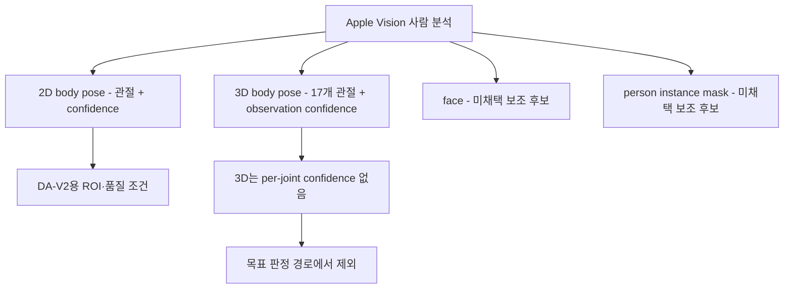

# Apple Vision 기반 자세 추정 — 조사 인덱스

## 문서 요약

| 항목 | 내용 |
|---|---|
| 문서 유형 | Apple Vision 리서치 인덱스 |
| 적용 상태 | Vision 2D body pose는 채택, face·mask는 미채택 보조 후보, Vision 3D는 제외 |
| 입력 | 카메라 RGB 프레임 |
| 출력 | 2D 관절·confidence와 선택적인 얼굴 자세·사람 mask |
| 다루는 범위 | Apple Vision의 사람 관절·얼굴·사람 mask API와 목표 설계 적합성 |
| 제품 내 역할 | Apple 플랫폼 조사 문서의 진입점과 기술별 상태 안내 |

## 요약 다이어그램

## 이 디렉토리의 목적

이 디렉토리는 Apple Vision의 관절·얼굴·사람 mask API 원리, 좌표계, 한계를 정리한다. 구현 상태는 다루지 않는다. 확정 흐름에서는 Vision 2D body pose가 신체 관절과 depth ROI·품질 정보를 제공한다. Depth Anything V2는 상대 깊이만 추정하고, 프로젝트 자세 분석기가 두 출력을 결합해 판정한다. face·person mask는 핵심 흐름에 넣지 않으며, Vision 3D도 목표 판정 경로에서 제외한다.

일반 컴퓨터 비전 자세 추정(모델 비교·CVA 지표·모노큘러 한계 등)은 별도 디렉토리 [`../pose-estimation/`](../pose-estimation/)에 정리한다. 본 디렉토리는 Apple 플랫폼 고유의 사실에 집중한다.

## 제품 적용 판단

- `VNDetectHumanBodyPoseRequest`는 2D 관절과 per-joint confidence를 제공한다. macOS 11.0+
- face observation의 bounding box와 요청 revision에서 계산된 yaw·roll·pitch는 회전 가드 후보가 될 수 있다. 각도는 계산되지 않으면 `nil`일 수 있으며 현재 확정 흐름에는 사용하지 않는다.
- `VNGeneratePersonInstanceMaskRequest`는 개별 사람 전체 mask를 제공하지만 신체 부위 mask나 depth는 아니다. macOS 14.0+이며 현재 확정 흐름에는 사용하지 않는다.
- `VNDetectHumanBodyPose3DRequest`는 17-joint skeleton을 제공한다. macOS 14.0+이며 macOS용 Apple Silicon 강제 요건은 공식 문서에 명시되지 않았다.
- 3D point에는 per-joint confidence가 없지만 observation-level confidence는 상속된다. `bodyHeight`, `heightEstimation`, `cameraOriginMatrix`를 per-joint 품질 점수로 오해하지 않는다.
- Vision 2D는 정규화 좌표 + 좌하단 원점이다. depth map과 결합할 때 두 출력을 동일 원본 프레임 좌표로 정렬한다.
- 정면 영상의 전방 상대 변화는 Depth Anything V2의 relative-depth feature를 사용한다. Vision 2D 관절은 ROI와 품질 판단에 사용하며, 최종 판정은 프로젝트 자세 분석기의 baseline·시간 처리 단계에서 수행한다.

## 한계와 검증 상태

- Vision API의 가용성은 확인했지만 목표 촬영 환경의 landmark 누락률과 ROI 안정성은 제품 데이터로 검증해야 한다.
- face와 person mask는 현재 경로의 실패가 확인되고 추가 이득을 별도 검증하기 전에는 도입하지 않는다.
- Vision 3D는 실행 가능 여부와 무관하게 목표 자세 판정과 depth 대체 경로에서 제외한다.

자세한 내용은 아래 문서를 참조한다.

## 문서 구성

| 문서 | 유형 | 적용 상태 | 역할 |
|---|---|---|---|
| 본 README | 리서치 인덱스 | 근거 문서 | Apple Vision 관련 문서의 진입점과 기술별 상태 요약 |
| [analysis.md](analysis.md) | 로직 분석·설명 | 2D body pose는 채택, face·mask는 미채택, 3D는 제외 | 출력 구조, 좌표계, 관절 목록, 가용성 정리 |
| [references.md](references.md) | 공식·관련 자료 | 근거 문서 | API 사실과 채택·제외 판단의 출처 정리 |
| [checklist.md](checklist.md) | 검증 체크리스트 | 보조 | 목표 설계를 구현 단계에서 확인하는 비규범 항목 |
