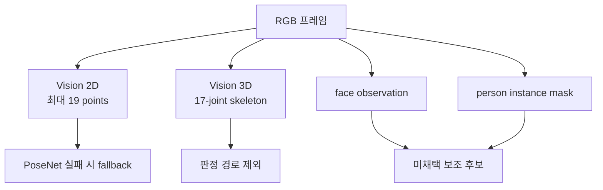

# Apple Vision 사람 자세 API — 조사 인덱스

## 문서 요약

| 항목 | 내용 |
|---|---|
| 문서 유형 | Apple Vision API 리서치 인덱스 |
| 적용 상태 | Vision 2D는 PoseNet fallback, Vision 3D는 제외, face·mask는 미채택 |
| 입력 | 카메라 RGB 프레임과 선택적인 API별 metadata |
| 출력 | Vision 요청별 2D/3D 관절, 얼굴 observation, 사람 mask |
| 다루는 범위 | 운영체제 Vision framework가 제공하는 사람 분석 API |
| 제품 내 역할 | Vision 2D·3D의 계약과 채택·제외 범위를 분리해 안내 |

## 기술별 경계

이 디렉토리는 Apple **Vision framework API**만 다룬다. Apple Core ML 샘플이 배포하는 서드파티 PoseNet 모델은 [`../apple-posenet/`](../apple-posenet/)에서 별도로 관리한다.

## 제품 적용 판단

| 기술 | 제공 정보 | 현재 상태 |
|---|---|---|
| Vision 2D body pose | 최대 19개 2D point와 per-joint confidence | PoseNet 상체 품질 실패 시 fallback |
| Vision 3D body pose | 가장 두드러진 사람의 17-joint 3D skeleton | sparse skeleton·품질 계약 불일치로 제외 |
| face observation | face box와 선택적인 yaw·roll·pitch | 추가 이득 검증 전 미채택 |
| person instance mask | 사람별 전체 2D mask | 신체 부위·depth가 아니므로 미채택 |

- Vision 2D는 좌하단 원점의 정규화 좌표를 반환하므로 제품 좌상단 좌표로 명시적으로 변환한다.
- Vision 2D landmark는 ROI와 입력 품질에만 사용한다. 자세 판정이나 z축 깊이를 제공하지 않는다.
- Vision 3D의 meter 단위 skeleton을 호환 depth 없는 Mac 내장 카메라의 실제 머리 전방 거리로 해석하지 않는다.
- 최종 상태는 Depth Anything V2 relative-depth feature, 개인 baseline, 시간 조건을 결합한 프로젝트 자세 분석기가 결정한다.

## 한계와 검증 상태

- API 가용성과 출력 계약은 Apple 공식 자료로 확인했지만 목표 카메라의 landmark 누락률과 fallback 안정성은 제품 fixture로 검증해야 한다.
- Vision 2D와 PoseNet은 관절 집합, 좌표 전처리, confidence 척도가 다르다. 공통 도메인 모델로 변환한 뒤에도 detector별 검증을 유지한다.
- face와 person mask는 현재 확정 흐름의 실패 원인과 추가 이득이 입증되기 전에는 넣지 않는다.
- Vision 3D는 실행 가능 여부와 무관하게 현재 판정 feature·baseline·fallback에서 제외한다.

## 문서 구성

| 문서 | 유형 | 적용 상태 | 역할 |
|---|---|---|---|
| 본 README | 리서치 인덱스 | 근거 문서 | Vision 기술별 상태와 문서 진입점 |
| [analysis.md](analysis.md) | API 분석 | fallback | Vision 2D의 19개 point, 좌표계, confidence와 실패 조건 |
| [related-vision-3d.md](related-vision-3d.md) | 관련 API 분석 | 제외 | 17-joint 3D, scale·depth·confidence 한계 |
| [related-person-observations.md](related-person-observations.md) | 관련 API 분석 | 미채택 | face observation과 person instance mask의 제공 범위 |
| [references.md](references.md) | 공식·관련 자료 | 근거 문서 | API 사실과 채택·제외 판단의 출처 |
| [checklist.md](checklist.md) | 검증 체크리스트 | 보조 | 목표 설계 적합성 확인 |
