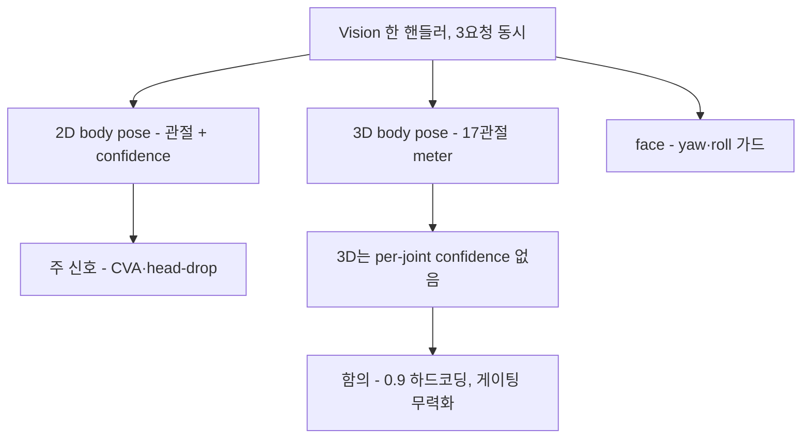

# Apple Vision 기반 자세 추정 — 조사 인덱스

## 요약 다이어그램

## 이 디렉토리의 목적

`turtlemeck`의 자세 추정은 전적으로 **Apple Vision 프레임워크**로 구현돼 있다. 이 디렉토리는 당장의 코드 수정이 아니라 **Vision의 원리·작동 방식·좌표계·한계**를 정리하고, 그로부터 *상체 전용* 자세 추정의 개선 방향을 도출하는 데 목적이 있다.

일반 컴퓨터 비전 자세 추정(모델 비교·CVA 지표·모노큘러 한계 등)은 별도 디렉토리 [`../pose-estimation/`](../pose-estimation/)에 정리한다. 본 디렉토리는 **Apple 플랫폼 고유의 사실**에 집중한다.

## 문서 구성

| 문서 | 내용 |
|---|---|
| [vision-pose-apis.md](vision-pose-apis.md) | Vision의 3개 자세/얼굴 요청 API — 출력 구조, 좌표계, 관절 목록, 가용성, 성능 모델 |
| [current-usage-and-gaps.md](current-usage-and-gaps.md) | 현 앱(`PoseDetector`)의 Vision 사용 실태 분석 + 발견된 한계 + 개선 방향 |

> 검증 표기: **[코드]** = 현 저장소 코드에서 직접 확인 / **[Apple]** = Apple 공식 문서·WWDC 근거 / **[확인필요]** = 1차 출처 재확인 대기.

## 한눈에 보는 요약

- 앱은 3개 Vision 요청을 **한 핸들러에서 동시 수행**한다 [코드]:
  - `VNDetectHumanBodyPoseRequest` — 2D 신체 관절 (어깨/목/귀/눈/코 등). macOS 11.0+ [Apple]
  - `VNDetectFaceLandmarksRequest` — 얼굴 yaw/roll (시점 판단·가드용)
  - `VNDetectHumanBodyPose3DRequest` — 3D 골격 17 joints, macOS 14+ [Apple]. 앱은 이를 **Apple Silicon에서만** 켜는데, 이는 **앱의 선택**이지 Apple이 요구한 게 아니다 [Apple 확정] [코드]
- **핵심 비대칭:** 2D 관절은 Vision이 주는 *실제 confidence*를 쓰지만, **3D 관절은 confidence를 `0.9`로 하드코딩**한다 [코드, `PoseDetector.swift:97`]. 이는 **Vision 3D API에 per-joint confidence가 실제로 없기 때문**(`VNHumanBodyRecognizedPoint3D`는 `localPosition`+`parentJoint`만) [Apple 확정]. 즉 데이터 폐기가 아니라 *API 공백 우회*지만, 부작용으로 3D 신뢰도 게이팅이 무력화된다 (개선 1순위 후보 — observation 레벨 `heightEstimation`/`bodyHeight` 등으로 대체 신호 구성).
- Vision 2D는 **정규화 좌표 + 좌하단 원점**이라, 앱은 `y → 1−y`로 뒤집어 좌상단 기준으로 변환한다 [코드, `:58`].
- 거북목의 핵심인 "머리 전방 이동"은 **정면 단일 카메라 2D로는 거의 안 보이며**, Vision 3D도 모노큘러 추정값이라 깊이 신뢰도에 한계가 있다(→ [`../pose-estimation/`](../pose-estimation/) A-3·A-4 참조).

자세한 내용은 위 두 문서를 참조.
