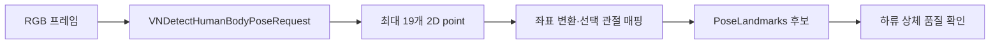

# Apple Vision 2D body pose — 구현 근거

## 문서 요약

| 항목 | 내용 |
|---|---|
| 문서 유형 | 채택한 보조 API의 구현 근거 인덱스 |
| 적용 상태 | 보조 — PoseNet 실행 실패 또는 상체 품질 미달 시 Vision 2D 사용 |
| 입력 | 카메라 RGB 프레임과 orientation |
| 출력 | 선택한 2D 관절점과 신뢰도를 담은 `PoseLandmarks` 후보 |
| 다루는 범위 | Vision 2D의 출력, 좌표 변환, 품질과 대체 경로 계약 |
| 제품 내 역할 | PoseNet이 유효한 상체를 만들지 못한 프레임의 보조 관절점 추출 |

## 처리 경계

```mermaid
flowchart LR
    FRAME["RGB 프레임"] --> REQUEST["VNDetectHumanBodyPoseRequest"]
    REQUEST --> POINTS["최대 19개 2D point"]
    POINTS --> MAP["좌표 변환·선택 관절 매핑"]
    MAP --> OUTPUT["PoseLandmarks 후보"]
    OUTPUT --> GATE["하류 상체 품질 확인"]
```

이 디렉터리는 현재 보조 경로에서 사용하는 Apple **Vision 2D body pose API**만 다룬다.
Apple Core ML 샘플이 배포하는 서드파티 PoseNet 모델은 [`../apple-posenet/`](../apple-posenet/)에서 별도로 관리한다.

## 제품 적용 판단

- PoseNet 실행이 실패하거나 결과가 상체 품질 조건을 통과하지 못하면 같은 프레임에 Vision 2D를 실행한다.
- Vision 2D는 좌하단 원점의 정규화 좌표를 반환하므로 제품 좌상단 좌표로 명시적으로 변환한다.
- nose·eyes·ears·neck·양쪽 어깨·양쪽 손목을 공통 모델에 보존한다.
- `neck`과 손목은 진단 정보이며 상체 품질의 공통 필수점은 아니다.
- Vision 2D 관절점은 ROI·입력 품질과 자세 기하 판단을 지원하지만 z축 깊이나 최종 자세 상태를 직접 제공하지 않는다.
- 최종 상태는 Depth Anything V2 상대 깊이 특성값, 개인 기준 자세와 시간 조건을 결합한 프로젝트 자세 분석기가 결정한다.

## 한계와 검증 상태

- API 가용성과 출력 계약은 Apple 공식 자료로 확인했지만 목표 카메라의 관절점 누락률과 대체 경로 안정성은 제품 테스트 입력으로 검증해야 한다.
- Vision 2D와 PoseNet은 관절 집합, 좌표 전처리와 신뢰도 척도가 다르므로 공통 도메인 모델로 변환한 뒤에도 검출기별 검증을 유지한다.
- Vision 3D, 얼굴 관찰과 사람 마스크는 현재 관절점·특성값·기준 자세 입력에 사용하지 않는다.

## 문서 구성

| 문서 | 유형 | 적용 상태 | 역할 |
|---|---|---|---|
| 본 README | 구현 근거 인덱스 | 근거 문서 | Vision 2D의 역할과 문서 진입점 |
| [analysis.md](analysis.md) | API 분석 | 보조 | Vision 2D의 19개 point, 좌표계, confidence와 실패 조건 |
| [references.md](references.md) | 공식·구현 자료 | 근거 문서 | Vision 2D 계약과 현재 통합의 출처 |
| [checklist.md](checklist.md) | 검증 체크리스트 | 보조 | 목표 설계 적합성 확인 |
