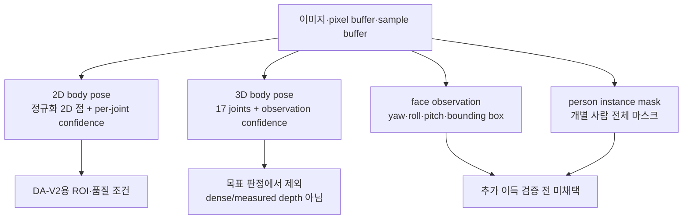

# Apple Vision 기반 자세 추정 — 로직 분석

## 문서 요약

| 항목 | 내용 |
|---|---|
| 문서 유형 | 플랫폼 로직 분석·설명 |
| 적용 상태 | 2D body pose는 채택, face·mask는 미채택 보조 후보, 3D body pose는 제외 |
| 입력 | 카메라 RGB 프레임 |
| 출력 | Vision 요청별 관절·confidence·얼굴 자세·사람 mask 또는 3D skeleton |
| 다루는 범위 | 각 Vision 요청의 출력, 좌표계, confidence, 가용성과 한계 |
| 제품 내 역할 | 신체 landmark·ROI 품질 입력의 출처와 Vision 3D 제외 근거 제공 |

Apple Vision의 2D body pose, 3D body pose, face observation, person instance mask가 제공하는 정보와 제공하지 않는 정보를 공식 문서 기준으로 정리한다. 구현 상태는 다루지 않는다.

## 요약 다이어그램

## 1. Vision 요청 실행 모델

Vision은 이미지 기반 요청을 입력 이미지나 버퍼에 수행하고 observation을 반환한다. 같은 프레임에 여러 요청을 수행하더라도 각 요청의 출력 의미와 좌표계를 별도로 확인해야 한다.

- 입력 orientation을 실제 카메라·파일 메타데이터와 일치시켜야 한다.
- 미러링은 화면 표시와 모델 입력 좌표의 문제를 분리해 다룬다.
- 카메라 프레임과 오프라인 fixture는 같은 orientation·색공간·해상도 정책을 사용해야 비교할 수 있다.
- JPEG 재인코딩본은 원본 pixel buffer와 동등한 입력이 아니다. 오프라인 검증에는 무손실 fixture를 사용할 수 있으며, 라이브 경로 검증도 별도로 수행한다.

## 2. `VNDetectHumanBodyPoseRequest` — 2D body pose

### 출력

- 결과는 `VNHumanBodyPoseObservation`이다.
- 각 recognized point는 정규화된 2D 위치와 confidence를 제공한다.
- 지원 관절에는 nose, eyes, ears, neck, shoulders와 사지·몸통 관절이 포함된다.
- `VNDetectHumanBodyPoseRequest`는 2D 요청이다. 3D 관절은 별도 `VNDetectHumanBodyPose3DRequest`의 출력이다.

### 좌표계

- 2D 위치는 `[0, 1]` 정규화 좌표이며 Vision 좌표계의 원점은 좌하단이다.
- 좌상단 원점을 쓰는 영상·UI 좌표계로 옮길 때 y축 변환을 명시해야 한다.
- 좌표 변환과 resize/crop 변환을 섞으면 pose anchor와 depth map ROI가 어긋나므로 동일한 원본 좌표계로 역투영한다.

### 목표 설계상 역할

- 머리·목·어깨 ROI anchor
- landmark confidence와 기하 조건을 이용한 품질 게이트

이 값은 DA-V2 depth map의 ROI와 평가 가능성을 정한다. Vision observation 자체가 `good`·`bad`를 직접 판정하는 것은 아니다.

낮은 confidence 점을 존재하는 좌표라는 이유만으로 사용하지 않는다. 화면 경계, 가림, 비정형 자세, 의복은 별도 실패 조건으로 검증한다.

## 3. `VNDetectHumanBodyPose3DRequest` — 3D body pose

### 가용성과 출력

- macOS 14.0+, iOS 17.0+에서 제공된다. Apple 문서에는 macOS용 Apple Silicon 강제 요건이 명시되어 있지 않다.
- 초기 revision은 프레임에서 가장 두드러진 한 사람의 17-joint skeleton을 반환한다.
- `topHead`, `centerHead`, `centerShoulder`, 양쪽 shoulder/elbow/wrist, `spine`, `root`, 양쪽 hip/knee/ankle을 제공한다. `root`는 hip 중심이다.
- RGB 이미지만으로 요청할 수 있으며, 호환 depth metadata가 있으면 실제 scale과 정확도에 도움을 줄 수 있다.

### 세 좌표 표현

| 표현 | 기준 |
|---|---|
| `position` | skeleton root인 hip 중심 기준 model position |
| `localPosition` | 해당 관절의 parent joint 기준 위치 |
| camera-relative position / `cameraOriginMatrix` | 카메라와 skeleton의 상대 변환 |

`position`과 `localPosition`을 같은 좌표로 해석하면 각도와 벡터가 틀어진다. `cameraOriginMatrix`는 hip-to-camera transform이며 품질 점수가 아니다.

### confidence와 height 정보

- `VNHumanBodyRecognizedPoint3D`에는 per-joint confidence가 없다.
- `VNHumanBodyPose3DObservation`은 `VNObservation` 계층을 상속하므로 observation-level `confidence`는 제공된다.
- Apple은 일반적으로 confidence를 0~1로 정규화하지만, `1.0`은 최고 신뢰 또는 해당 observation이 confidence에 별도 의미를 부여하지 않음을 뜻할 수 있다고 설명한다. 따라서 observation confidence 하나만으로 관절 품질을 보장하지 않는다.
- `bodyHeight`는 `heightEstimation`이 measured일 때 측정 높이이고, 그렇지 않으면 reference height를 반환한다. WWDC23은 reference 값을 1.8m로 설명한다.
- `heightEstimation`은 scale 산출 방식을 구분하는 메타데이터이지 자세 정확도의 직접 점수가 아니다.

### 목표 설계상 결정 — 판정 경로에서 제외

이 API는 기술적으로 실행 가능하지만 turtlemeck의 주 판단 로직에는 사용하지 않는다.

- 출력은 17-joint skeleton 추정이며 DA-V2 같은 조밀한 머리·몸통 depth map이 아니다.
- 목표 Mac 내장 RGB 카메라는 scale·정확도를 보강할 호환 `AVDepthData`를 제공하지 않는다.
- depth가 없으면 `bodyHeight`는 WWDC23이 설명한 기준 신장 1.8m를 사용하며 실제 신장 측정값이 아니다.
- 관절별 confidence가 없어 머리·몸통 전후 차의 품질을 직접 판별할 수 없다.

따라서 Vision 3D 좌표와 관련 메타데이터는 판정 feature·baseline·융합 입력으로 만들지 않는다. 이 결론은 “API가 macOS에서 실행되지 않는다”는 뜻이 아니라, 이 제품이 요구하는 깊이 판단 근거가 아니라는 뜻이다.

## 4. face observation

face observation은 bounding box와 선택적인 yaw·roll·pitch 얼굴 자세 정보를 제공한다. Apple 문서상 요청이 특정 angle을 계산하지 않으면 값이 `nil`일 수 있다. 회전 가드와 head ROI 보조 후보가 될 수 있지만, 확정 흐름에는 넣지 않는다.

face box 크기와 위치는 카메라 거리·높이·crop에 민감하다. 향후 검토하더라도 baseline 없는 전방 머리 직접 판정이나 임상 각도 추정에는 사용하지 않는다.

## 5. `VNGeneratePersonInstanceMaskRequest`

- 입력에서 찾은 개별 사람 전체의 mask를 생성한다.
- WWDC23은 최대 네 사람의 개별 mask와 instance confidence를 설명한다. 혼잡 장면에서는 누락·병합 가능성도 언급한다.
- mask는 신체 부위 segmentation이나 depth map이 아니다.

배경·다른 사람을 제외하는 보조 후보가 될 수 있지만, 확정 흐름에는 넣지 않는다. 머리·몸통 ROI는 Vision 2D body landmark만으로 정의하고 이 경로를 먼저 검증한다.

## 6. 목표 역할 분담

| 요청 | 산출 | 목표 역할 |
|---|---|---|
| 2D body pose | 2D 관절 + per-joint confidence | DA-V2용 ROI anchor·품질 게이트 |
| face observation | face box·yaw·roll·pitch | 미채택 보조 후보 |
| person instance mask | 개별 사람 전체 mask | 미채택 보조 후보 |
| 3D body pose | 17-joint 3D skeleton + observation confidence | 목표 판정 경로에서 제외 |

정면 상대 depth는 Depth Anything V2에서 얻는다. Core ML은 DA-V2의 실행 형식이다. 최종 `good`·`bad`·`noEval`은 프로젝트 자세 분석기가 feature·baseline·시간 일관성을 결합해 결정한다. 전체 목표 흐름은 [`../posture-analysis-workflow.md`](../posture-analysis-workflow.md)를 따른다.

출처와 관련 자료는 [references.md](references.md)에 정리한다.
