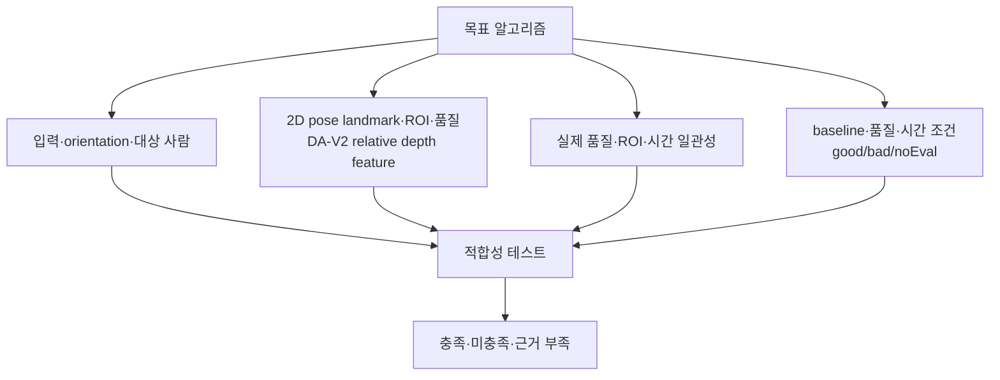

# Apple Vision 기반 자세 추정 — 목표 설계 적합성 체크리스트

## 문서 요약

| 항목 | 내용 |
|---|---|
| 문서 유형 | 비규범 검증 체크리스트 |
| 적용 상태 | 보조 |
| 다루는 범위 | 입력, 신체 추정, ROI, depth, baseline, 판정 계약 |
| 제품 내 역할 | 구현이 목표 설계와 일치하는지 기록하며 설계 자체는 변경하지 않음 |

이 문서는 현재 코드를 설명하는 문서가 아니며, 현재 코드에 맞춰 설계를 바꾸는 기준도 아니다. [`posture-analysis-workflow.md`](../posture-analysis-workflow.md)의 상세 흐름과 채택·제외 범위를 구현 단계에서 검증하기 위한 비규범 체크리스트다. [`../../workflow.md`](../../workflow.md)는 상위 개론으로만 사용한다.

API 사실은 Vision 2D [analysis.md](analysis.md)와 [related-vision-3d.md](related-vision-3d.md), 목표 알고리즘은 [`posture-analysis-workflow.md`](../posture-analysis-workflow.md)를 기준으로 한다. 구현 상태·완료 여부·특정 코드 라인은 이 문서의 근거로 사용하지 않는다.

## 요약 다이어그램

## 1. 입력 계약

- 프레임 orientation과 미러링 정보를 실제 입력과 일치시킨다.
- 분석 세션을 최소 20초 간격으로 실행한다.
- 한 번의 분석에서 3~5장의 짧은 이미지 버스트를 사용한다.
- 한 burst 안에서 같은 대상 사람을 추적한다.
- 다인 장면에서는 `first` 같은 배열 순서가 아니라 명시적인 대상 선택 규칙을 사용한다.
- 사람 전체가 아닌 머리·어깨·상부 몸통이 필요한 비율로 보이는지 확인한다.
- 입력이 불충분하면 관절이나 ROI를 합성해 `good`을 만들지 않고 `noEval`로 보낸다.

## 2. PoseNet·Apple Vision 2D 신체 추정 계약

- Apple Core ML 샘플 PoseNet과 운영체제 Vision 2D API를 같은 기술로 설명하지 않는다.
- PoseNet을 우선 실행하고 상체 품질 실패 시 같은 프레임에 Vision 2D를 fallback으로 실행한다.
- 한 프레임에서 두 detector의 부분 관절을 합성하지 않는다.
- PoseNet에는 `neck`이 없으므로 Vision의 `neck`을 공통 필수점으로 만들지 않는다.
- 2D 점은 Vision의 좌하단 정규화 좌표와 제품 내부 좌표계를 명시적으로 변환한다.
- PoseNet의 `scaleFill` 좌표가 원본·depth 좌표와 일치하는지 별도로 검증한다.
- 관절별 confidence를 보존하고, 추적 가능 여부와 판정 적합 여부를 구분한다.
- 2D 관절 자체가 `good`·`bad`를 반환한다고 설명하지 않는다.
- PoseNet·Vision 2D는 DA-V2용 ROI와 품질 정보로만 사용한다.
- 임상 C7·tragus가 없으므로 자체 머리-어깨 각을 CVA라고 표시하지 않는다.

## 3. ROI 계약

- 머리·몸통과 정규화 기준 ROI는 PoseNet·Vision 2D의 공통 body landmark로 정의한다.
- face·person mask를 확정 흐름의 필수 입력으로 추가하지 않는다.
- ROI 경계 침식, 최소 픽셀 수, 화면 경계 접촉률, 유효 depth 비율을 품질 값으로 기록한다.
- 한쪽 어깨나 머리 anchor가 없을 때 고정 거리로 가짜 관절을 만들지 않는다.

## 4. Depth Anything V2 깊이 추정 계약

- 기본 depth 모델은 Depth Anything V2 Small이며, Core ML은 해당 모델의 실행·배포 형식임을 구분한다.
- DA-V2가 자세·관절이나 `good`·`bad`를 직접 출력한다고 설명하지 않는다.
- DA-V2 출력이 affine-invariant inverse depth임을 전제로 한다.
- 절대 cm, 카메라와의 실제 거리, 임상 심각도 점수로 변환하지 않는다.
- 단순 ROI 평균 차이나 비율만을 최종 feature로 확정하지 않는다.
- 목표 feature는 landmark 기반 reference ROI의 robust scale로 정규화한 머리-몸통 대비다.
- 출력 near/far 방향은 고정 fixture로 확인한다.
- reference ROI의 IQR이 너무 작거나 depth가 유효하지 않으면 `noEval`로 처리한다.

## 5. Apple Vision 3D 제외 계약

- Vision 3D는 macOS 14+에서 RGB 입력으로 실행할 수 있으므로 API 자체를 “실행 불가”라고 설명하지 않는다.
- 목표 Mac 내장 RGB 카메라는 호환 `AVDepthData`를 제공하지 않으므로 measured-depth 보강을 사용할 수 없음을 명시한다.
- 호환 depth가 없을 때의 hip-rooted skeleton과 reference-scale `bodyHeight`를 실제 머리 전방 거리로 해석하지 않는다.
- 3D point, observation confidence, `bodyHeight`, `heightEstimation`, `cameraOriginMatrix`를 판정 feature·baseline·융합 입력에 넣지 않는다.
- 3D point에 존재하지 않는 per-joint confidence를 임의 상수로 채우지 않는다.

## 6. baseline·시간 처리 계약

- baseline은 안내된 중립 자세의 여러 프레임 분포로 만든다.
- 나쁜 자세나 고분산 구간을 정상 baseline에 자동 흡수하지 않는다.
- 버스트 중앙값과 MAD/IQR을 함께 계산한다.
- 필터 전후의 분산 감소와 지연 증가를 모두 측정한다.
- 단일 프레임의 강한 값만으로 `bad` 알림을 확정하지 않는다.

## 7. 판정 계약

- `good`은 필수 입력과 품질 조건을 충족한 양성 증거가 있을 때만 반환한다.
- `bad`는 정의된 악화 패턴이 시간적으로 지속될 때 반환한다.
- 프로젝트 자세 분석기가 relative depth feature에 baseline·품질·시간 일관성을 적용해 `good`·`bad`·`noEval`을 반환한다.
- 사람 없음, 관절·ROI 부족, 신호 충돌, 높은 분산은 `noEval`이다.
- `noEval`을 정상으로 표시하거나 정상 streak에 합산하지 않는다.
- 판정 결과와 함께 사용한 feature, baseline delta, 품질 값, 제외 사유를 남긴다.

## 8. 검증 결과 기록 형식

구현 단계에서는 각 항목을 다음 세 상태로만 기록한다.

| 상태 | 의미 |
|---|---|
| 충족 | 사전 정의한 테스트와 데이터로 목표 계약을 확인함 |
| 미충족 | 목표와 다른 동작을 재현함 |
| 근거 부족 | 테스트·데이터가 없어 판단할 수 없음 |

“현재 코드와 동일함”이나 “수정 완료”는 충족의 근거가 아니다. 문서의 입력·feature·품질·판정 계약을 재현하는 테스트 결과가 있어야 한다.

## 참고 자료

- 상위 개론: [`../../workflow.md`](../../workflow.md)
- 상세 목표 알고리즘과 채택·제외 범위: [`../posture-analysis-workflow.md`](../posture-analysis-workflow.md)
- Apple Core ML 샘플 PoseNet: [`../apple-posenet/analysis.md`](../apple-posenet/analysis.md)
- Apple Vision 2D API: [analysis.md](analysis.md)
- Apple Vision 3D API: [related-vision-3d.md](related-vision-3d.md)
- Apple Vision 보조 사람 분석 API: [related-person-observations.md](related-person-observations.md)
- depth feature: [`../../depth-estimation/etc/related-feature-design.md`](../../depth-estimation/etc/related-feature-design.md)
- baseline: [`../pose-estimation/related-baseline-calibration.md`](../pose-estimation/related-baseline-calibration.md)
