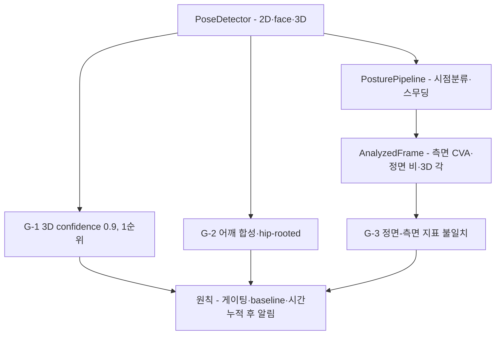

# 현 앱의 Vision 사용 분석 · 한계 · 개선 방향

현 앱(`PoseDetector`)의 Apple Vision 사용 실태와 한계·개선 방향을 분석한다(코드 수정 지시가 아님). 표기 — **[코드]** 저장소 직접 확인 · **[Apple]** 공식 근거 · **[가설]** 분석상 추론(미검증). API 원리는 [vision-pose-apis.md](vision-pose-apis.md), 자세 판정 로직 전반은 앱 코드 및 [`../pose-estimation/`](../pose-estimation/) 참조.

## 요약 다이어그램



---

## 1. 현 데이터 흐름 (Vision → 자세 신호)

```
PoseDetector.perform()                       [PoseDetector.swift:20]
  ├─ 2D body  → nose/eyes/ears/neck/shoulders (+실제 confidence)
  ├─ face     → yaw, roll
  └─ 3D body  → head/shoulder/spine/root (meter, confidence=0.9 고정) [:97]
        ↓ PoseLandmarks
PosturePipeline → viewpoint 분류 + One-Euro 스무딩
        ↓ AnalyzedFrame
(측면) CVA 각도 · (정면) head-drop 비 · (3D) 시상면 각
```

---

## 2. 발견된 한계 (Vision 사용 측면)

### G-1. 3D confidence 하드코딩 → 게이팅 무력화 ★개선 1순위
- `point3D`가 모든 3D 점에 `confidence: 0.9`를 박는다 [코드, `:97`].
- **이유는 실재하는 API 공백이다 [Apple 확정].** `VNHumanBodyRecognizedPoint3D`는 `localPosition`·`parentJoint`만 노출하고 `confidence`가 **없다**(2D `VNDetectedPoint`는 있음). 즉 0.9 하드코딩은 *데이터 폐기가 아니라 공백 우회*. (→ [vision-pose-apis.md §3](vision-pose-apis.md))
- 그러나 **부작용은 그대로**: 3D 경로에서 `isReliable`(≥0.5)이 **항상 참** → 빈약한 추정도 판정에 반영. 2D는 실측 confidence로 거르는데 3D만 무방비 → **비대칭 신뢰**. (개선 1순위인 이유.)
- 개선 방향(분석) — Vision이 confidence를 안 주므로 **대체 품질 신호를 조합**:
  - **관찰(observation) 레벨 신호** 활용: `heightEstimation`(측정 vs 참조추정 구분 — 참조추정이면 3D 신뢰 낮춤), `bodyHeight` 범위 sanity check [Apple].
  - 2D 동일 관절의 confidence를 3D 신뢰 proxy로 차용. 2D 요청(`VNDetectHumanBodyPoseRequest`)에는 per-joint confidence가 *있고* 3D에는 *없다* → **2D+3D 융합 게이팅**(2D confidence로 3D 관절 신뢰 cross-check)이 유망한 방향이다(→ [`../pose-estimation/viewpoint-robust-geometry.md` §4](../pose-estimation/viewpoint-robust-geometry.md)). 단 실효성은 자체 실측 필요.
  - 관절 간 거리·대칭성 sanity check(어깨폭·머리-어깨 거리 범위)로 outlier 배제.
  - 합성 어깨(보간)로 만든 점은 더 낮은 신뢰로 가중.

### G-2. 어깨 3D 보간 휴리스틱 + 어깨폭 가정 불일치
- 좌/우 어깨 3D가 없으면 `centerShoulder ± 0.2m`로 합성 [코드, `:74-75`] → **0.4m** 고정 어깨폭 가정 → 체형·자세에 따라 시상면 각·정규화에 오차.
- ⚠️ **코드에 두 어깨폭 가정이 공존**: 여기 3D 보간은 0.4m(meter), 한편 2D `Tuning.headOnlyShoulderWidth = 0.32`(정규화 단위)다. 단위계가 달라 직접 모순은 아니나, 어깨폭 기준이 분산돼 있어 일관성 검토 권장.
- 개선: 합성 시 신뢰도 낮춤(G-1과 연계), 또는 2D 어깨폭으로 스케일 보정.
- ⚠️ **더 근본적 문제 — 3D 프레임이 hip-rooted다.** `VNDetectHumanBodyPose3DRequest`의 17관절은 hip(root) 기준이고 `cameraOriginMatrix`는 hip→camera 변환이다 [Apple/WWDC23]. **근접 데스크 착석(상체-only)에서는 hip/root가 프레임 밖**이라, hip 기준으로 계산하는 모든 head-torso 각이 *가장 덜 관측된* 점에 묶이는 root 불안정이 생긴다. → **각을 hip이 아니라 관측 가능한 상체 관절(어깨/목/spine)에 anchor**하라(상세 [`../pose-estimation/viewpoint-robust-geometry.md` §4](../pose-estimation/viewpoint-robust-geometry.md)). Apple은 truncation/occlusion 거동을 미문서화하므로 자체 처리 필요.

### G-3. 정면 카메라 ↔ 측면 지표의 구조적 불일치
- Mac 내장 카메라는 정면. 그러나 거북목의 1차 신호(머리 전방 이동)는 **측면**에서 드러난다. 정면 2D에서는 전방 이동이 이미지 평면에 거의 안 나타난다(원리: 깊이축이 카메라 광학축과 평행) [Apple/가설].
- 3D 경로가 이를 보완하도록 설계됐으나 G-1(confidence)·모노큘러 한계(→ [`../pose-estimation/monocular-limits.md`](../pose-estimation/monocular-limits.md))로 신뢰가 제한적.
- 개선 방향: (a) 정면에서는 *심각도*를 단정하지 말고 baseline 대비 *추세*만; (b) 사용자에게 카메라 측면 배치/3-4 측면 착석을 유도; (c) 3D를 쓰되 baseline 상대화 강제.

### G-4. 단일 인물·단일 결과 가정
- `results?.first`만 사용 [코드, `:34-35`]. 다인 환경(뒤에 사람)에서 엉뚱한 사람을 잡으면 오판. 메뉴바 단일 사용자 시나리오엔 대체로 무방하나, **가장 큰 바운딩박스/중앙 인물 선택** 같은 방어가 더 견고.

### G-5. orientation 고정 `.up`
- 핸들러에 `.up` 고정 [코드, `:11,16`]. 내장 웹캠 기본 방향엔 맞지만, 외장/회전 카메라·미러링 환경에서 좌우/상하가 어긋날 수 있음. 좌우 반전(미러)은 left/right 관절 의미를 뒤집어 nearSide 판정에 영향.

### G-6. face pitch 미사용
- 얼굴에서 yaw/roll만 추출, **pitch 미사용** [코드, `:46-47`]. 그런데 "고개를 숙임(pitch)"은 거북목과 자주 동반되고, "고개만 숙임 vs 목이 앞으로"를 구분하는 데 pitch가 단서가 된다. 시점 가드·오판 차단에 pitch 활용 여지.

---

## 3. 개선 방향 — 우선순위(분석)

| 순위 | 항목 | 근거 | 성격 |
|---|---|---|---|
| 1 | 3D 품질 대체 신호 도입(G-1) | confidence 부재는 API 사실[Apple], 게이팅 무력화 | 정확도 직결 |
| 2 | 정면 정책 보수화 + 측면 유도(G-3) | 정면 2D 전방머리 관측 한계 | 오판↓ |
| 3 | baseline 상대화 강제(G-1·G-3 공통) | 절대 임계 비합의([`../pose-estimation/cva-and-fhp-metrics.md`](../pose-estimation/cva-and-fhp-metrics.md)) | 견고성 |
| 4 | 어깨 보간 신뢰도 가중(G-2) | 합성 좌표 오차 | 정확도 |
| 5 | 다인/미러/pitch 방어(G-4·5·6) | 엣지 케이스 | 견고성 |

> **공통 원칙:** Vision이 주는 좌표를 "측정값"이 아니라 "신호"로 다루고, **품질 게이팅 + 개인 baseline 상대화 + 시간적 누적(버스트/스무딩)** 3중으로 거른 뒤에만 알림으로 승격한다. 단일 프레임·절대 임계 단독 판정은 피한다.

---

## 4. 검증/측정 제안 (코드 수정 전)

원인 확정을 위해 **진단 계측**을 먼저 권장:
- 버스트마다 (viewpoint, 선택된 head/shoulder 관절, 2D confidence, CVA/3D 각, baseline, 최종 assessment)를 로깅/표시.
- 거북목 자세를 실제로 취했을 때 어떤 경로(2D측면/정면/3D)가 타고 어떤 각도/신뢰도가 나오는지 측정 → G-1~G-3 중 실제 지배 원인 식별.
- 이 데이터 없이 임계만 바꾸면 false-positive(정상→주의)로 풍선효과가 날 수 있다.

---

## 5. 관련 코드 위치

| 항목 | 파일:라인 |
|---|---|
| 요청 구성/수행 | `Camera/PoseDetector.swift:20-32` |
| 2D 관절 추출·y반전 | `Camera/PoseDetector.swift:57-89` |
| 얼굴 yaw/roll/pitch·bounding box 추출 | `Camera/PoseDetector.swift:66-76` |
| 3D 추출·confidence 0.9 | `Camera/PoseDetector.swift:92-119` |
| 신뢰도 임계 | `Detection/Tuning.swift:4-7`, `Detection/Calibrator.swift:17-19` |
| 3D 가용성 분기 | `Camera/PoseDetector.swift:26`, `Camera/SystemInfo.swift` |
