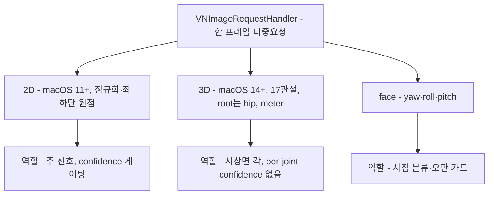

# Apple Vision 자세/얼굴 API — 원리와 작동 방식

`turtlemeck`이 쓰는 Vision 요청들의 작동 원리를 정리한다(코드 사용 분석은 [current-usage-and-gaps.md](current-usage-and-gaps.md)). 표기 — **[코드]** 저장소 확인 · **[Apple]** 공식 문서/WWDC · **[확인필요]** 1차 출처 재확인 대기.

## 요약 다이어그램



---

## 1. Vision 요청 실행 모델

Vision은 "**요청(VNRequest)을 만들어 핸들러(VNImageRequestHandler)로 수행**"하는 구조다. 한 핸들러에 여러 요청을 배열로 넘기면 **같은 프레임에 대해 함께 처리**된다. [Apple]

```
VNImageRequestHandler(이미지/샘플버퍼)  ──perform([req1, req2, req3])──▶  각 req.results
```

- 입력: `CMSampleBuffer`(카메라 프레임) 또는 `CGImage`. 앱은 둘 다 지원한다 [코드, `PoseDetector.swift:10-18`].
- `orientation`을 핸들러에 넘긴다(앱은 `.up`) [코드]. 카메라 방향이 어긋나면 관절 좌표 전체가 틀어지므로 **orientation 정합이 중요**하다.
- 동기 호출: `try handler.perform(requests)`는 블로킹이다. 앱은 이를 전용 capture 큐에서 호출한다(메인 스레드 차단 방지).

---

## 2. `VNDetectHumanBodyPoseRequest` (2D 신체 포즈)

### 출력 구조
- 결과는 `VNHumanBodyPoseObservation` 배열(사람당 하나). 앱은 `results?.first`만 사용 → **단일 인물 가정** [코드, `:34`].
- 관절은 `recognizedPoint(_:)`로 이름(JointName)별 조회. 각 점은 `location`(좌표)과 `confidence`(0~1)를 가진다. [Apple]

### 좌표계 — 정규화 + 좌하단 원점
- 2D 관절 `location`은 **정규화 좌표 [0,1]** 이며 **원점이 좌하단(lower-left)** 이다. [Apple]
- 앱은 `Point2D(x: loc.x, y: 1 - loc.y, ...)`로 **y를 뒤집어 좌상단 기준으로 변환**한다 [코드, `:56-60`]. 이미지/화면 좌표계(좌상단 원점)와 맞추기 위함이며, 이 변환이 빠지면 위/아래가 반전돼 CVA 부호가 뒤집힌다.

### 앱이 쓰는 관절 [코드, `:38-45`]
`nose, leftEye, rightEye, leftEar, rightEar, neck, leftShoulder, rightShoulder`
→ 상체 자세에 필요한 머리(귀/눈/코)·목·어깨만 골라 쓴다. 손목/엉덩이/무릎 등 하체·사지는 무시 → "상체만 추적" 요구에 부합.

### 가용성·성능
- 2D body pose(`VNDetectHumanBodyPoseRequest`)는 **macOS 11.0+(Big Sur), iOS 14.0+** 에서 동작한다 [Apple, WWDC20 세션 10653]. CPU/Neural Engine 가속.
- 단일 프레임 추론이며, 앱은 버스트(2.8s) 동안 다수 프레임을 모아 통계 판정한다.

### 한계 [Apple]
- 화면 가장자리, 가림(occlusion), 비정형 자세, 헐렁한 옷에서 품질 저하.
- **confidence가 낮은 점을 그대로 쓰면 오판**으로 직결 → 게이팅 필요(앱은 보정 저장용 body landmark는 `Tuning.minimumLandmarkConfidence = 0.5`, 실시간/얼굴 보조 신호는 더 낮은 tracking 기준을 별도 사용).

---

## 3. `VNDetectHumanBodyPose3DRequest` (3D 신체 포즈)

### 가용성
- **macOS 14.0+, iOS 17.0+** [Apple, `VNDetectHumanBodyPose3DRequest`, WWDC23 세션 111241]. 앱은 `#available(macOS 14.0, *)`로 게이트 [코드 `:26`].
- ⚠️ **Apple Silicon 요구는 Apple 문서에 없다.** API 가용성은 OS 버전(macOS 14.0+)만 명시한다 [Apple]. iOS 쪽 샘플만 "A12 칩 이상"을 요구할 뿐, **macOS용 실리콘 요구는 문서화되지 않았다.** 앱이 `include3D`를 Apple Silicon에서만 켜는 것은 **앱의 성능적 선택**이지 Apple이 강제한 요건이 아니다 [코드, `current-usage-and-gaps.md` 참조]. Intel Mac에서의 실제 동작은 Apple 미문서.

### 출력 구조 — 3D 골격 (17 joints) [Apple]
- 결과는 `VNHumanBodyPose3DObservation`이며 **17개 관절** 스켈레톤을 반환한다 [Apple]. 전체 `JointName`: `topHead, centerHead, centerShoulder, leftShoulder, rightShoulder, leftElbow, rightElbow, leftWrist, rightWrist, spine, root, leftHip, rightHip, leftKnee, rightKnee, leftAnkle, rightAnkle`. (`root`은 "좌우 hip의 중점"으로 정의.) 앱은 이 중 상체 7개만 사용 [코드, `:69-75`].
- `recognizedPoint(_:)`는 `VNHumanBodyRecognizedPoint3D`를 주고, 그 `localPosition`(또는 상위 `position`)은 **`simd_float4x4`** 변환 행렬이다 [Apple]. 앱은 `position.columns.3`(평행이동 열 = x,y,z)을 좌표로 추출 [코드, `:92`].
- 좌표는 **미터(meter) 단위**다 [Apple]. ⚠️ **좌표 기준:** Apple 문서상 스켈레톤 전체의 **원점은 `root`(좌우 hip 중점)**이지만, 개별 관절의 **`localPosition`은 `parentJoint` 기준 상대 위치**다. 즉 "localPosition = root 기준"은 부정확하며, root는 skeleton 원점이고 localPosition은 parent 기준임을 구분해야 한다. 앱 코드는 `recognizedPoint(_:).position.columns.3`을 좌표로 추출하는데, 이 `position`/`localPosition`의 기준계를 정확히 가정해야 시상면 각 계산이 틀어지지 않는다. 별도로 `cameraRelativePosition(_:)`·`cameraOriginMatrix`는 카메라 기준 좌표를 제공한다 — **세 좌표계(parent-relative localPosition, root 원점, camera 기준)를 혼동하면 안 된다.**

### ⚠️ 핵심 발견 — 3D에는 per-joint confidence가 없다 [Apple 확정]
- `VNHumanBodyRecognizedPoint3D`는 `localPosition`과 `parentJoint`만 노출하고, 상위 `VNRecognizedPoint3D`/`VNPoint3D`에도 **`confidence` 속성이 없다** [Apple]. 반면 2D의 `VNDetectedPoint`는 `confidence`를 명시 제공한다 → **2D/3D 비대칭은 Apple API의 실제 사실.**
- 그래서 앱의 **`confidence: 0.9` 하드코딩은 "데이터 폐기"가 아니라 *실재하는 API 공백을 메우는 우회*** 다 [코드, `:97`]. 다만 부작용은 동일: 모든 3D 점이 `isReliable`(≥0.5)을 **항상 통과** → 저품질 3D 추정도 무방비로 판정에 유입.
- **유일하게 가용한 품질 신호는 관찰(observation) 레벨**: `bodyHeight`(추정 키, m), `heightEstimation`(측정 vs 참조추정 구분), `cameraOriginMatrix`(hip→camera 변환) [Apple]. per-joint 대체 게이팅을 만들려면 이들 + 2D 동일관절 confidence + 기하 sanity check를 조합해야 한다.
- ⚠️ **truncation/occlusion 거동은 미문서 + full-limb 권장 [Apple].** Apple 3D 샘플은 입력 이미지에 *"all limbs of the subject visible"* 를 권장한다(full body가 문서화된 정상 경로). 출력은 **hip-rooted**(전체 17관절이 root=hip 중점 기준, `cameraOriginMatrix`=hip→camera) — **근접 데스크 착석으로 hip이 잘리면 root 기준 좌표가 불안정**해질 수 있는데, Apple은 truncation/occlusion 시 거동·per-joint 유효성 플래그를 문서화하지 않는다. → 자체 truncation 처리 + 상체 관절 anchor 필요(→ [`../pose-estimation/viewpoint-robust-geometry.md` §4](../pose-estimation/viewpoint-robust-geometry.md)).
- ✅ **[온디바이스 실측] 상체-only 3D는 "절대 불가"도 "안정 동작"도 아닌 "간헐적·불안정"이다.** M1 Pro·macOS 15.7.2·노트북 웹캠에서 라이브 `CMSampleBuffer`(앱과 동일 경로)로 측정한 결과: ① `VNDetectHumanBodyPose3DRequest`가 상체-only 입력에서 **간헐적으로 발화**(라이브 10회 중 5회; 초근접 0/3, 정상 착석거리 약 4/6) — 따라서 "전신이 아니면 3D가 절대 동작하지 않는다"는 거짓이다. ② 발화 시 **17관절 전체를 반환하나 hip/knee/ankle은 카메라가 못 본 추론값**이고 `heightEstimation=.reference`(LiDAR 없음)다. ③ **마진 입력에서 각이 부정확** — 명백한 거북목 프레임에서 body-frame 시상각이 88.3°(거의 직립)로 나온다(hip-rooted root 추론 의존). ④ **JPEG 재인코딩이 거동을 바꾼다**(라이브 발화 ↔ 정지 JPEG 미발화) → 오프라인 정지 이미지로는 3D를 충실히 평가할 수 없고 라이브 버퍼 경로로만 검증해야 한다. **결론: 상체-only Apple 3D는 노트북 단독 사용에서 주 경로로 부적합(실험적 보조).**

### 누락 관절 보간
- `leftShoulder/rightShoulder` 3D가 없으면 `centerShoulder`에서 x를 ±0.2m 밀어 **합성**한다 [코드, `:74-75`] → 어깨폭 **0.4m** 가정. ⚠️ 그런데 2D 경로의 `Tuning.headOnlyShoulderWidth = 0.32`(정규화 단위)와 **다른 어깨폭 가정이 코드에 공존**한다(단위계는 다르나 일관성 검토 필요).

### 모노큘러 3D의 본질적 한계
- 단일 RGB에서의 3D는 **추정(ill-posed)** 이다 — 같은 2D가 여러 3D에 대응(깊이 모호성). 상세 근거는 [`../pose-estimation/monocular-limits.md`](../pose-estimation/monocular-limits.md). → 3D 좌표를 "측정값"처럼 신뢰하면 안 되고 baseline 상대화가 필요.

---

## 4. `VNDetectFaceLandmarksRequest` (얼굴 — 시점 판단용)

- 앱은 얼굴 랜드마크 자체보다 **머리 자세 각도**만 추출: `yaw`, `roll`(라디안→도 변환) [코드, `:46-47`]. `pitch`는 미사용.
- 용도: 정면/측면/3-4 **시점(viewpoint) 분류**와 false-positive 가드. 예) yaw가 크면 "고개 돌림"이지 "거북목"이 아님 → 측면 CVA를 그대로 쓰면 안 됨.
- 자세 점수의 *직접* 신호로 쓰지 않고 **가드로만** 쓰는 것이 안전(→ pose-estimation README와 동일 결론).

---

## 5. 세 요청의 역할 분담 (현 설계)

| 요청 | 산출 | 앱에서의 역할 |
|---|---|---|
| 2D body pose | 머리/목/어깨 2D + confidence | **주 신호** — CVA·head-drop 계산 |
| 3D body pose | 머리/어깨/척추 3D (meter, root기준) | **보조/우선 신호**(앱이 Apple Silicon에서만 켬 — Apple 요건 아님) — 시상면 각도, yaw 불변 |
| face landmarks | yaw/roll | **가드** — 시점 분류, 회전 오판 차단 |

이 분담 자체는 합리적이다. 문제는 *구현 디테일*(3D confidence 하드코딩, 어깨 보간, 정면 한계)에 있으며 [current-usage-and-gaps.md](current-usage-and-gaps.md)에서 다룬다.

---

## 참고 (1차 출처 — Apple 공식 문서)

- Apple, `VNDetectHumanBodyPoseRequest` (2D, macOS 11.0+): <https://developer.apple.com/documentation/vision/vndetecthumanbodyposerequest>
- Apple, `VNDetectHumanBodyPose3DRequest` (3D, macOS 14.0+, 17 joints): <https://developer.apple.com/documentation/vision/vndetecthumanbodypose3drequest>
- Apple, `VNHumanBodyPose3DObservation` (bodyHeight·heightEstimation·cameraOriginMatrix): <https://developer.apple.com/documentation/vision/vnhumanbodypose3dobservation>
- Apple, `VNHumanBodyRecognizedPoint3D` (localPosition·parentJoint, **confidence 없음**): <https://developer.apple.com/documentation/vision/vnhumanbodyrecognizedpoint3d>
- Apple, `VNDetectedPoint` (2D, **confidence 있음**): <https://developer.apple.com/documentation/vision/vndetectedpoint>
- Apple, "Detecting human body poses in 3D with Vision" (iOS A12 요구 — macOS 실리콘 요건 없음): <https://developer.apple.com/documentation/vision/detecting-human-body-poses-in-3d-with-vision>
- WWDC23, "Explore 3D body pose and person segmentation in Vision": <https://developer.apple.com/videos/play/wwdc2023/111241/>
- WWDC20, "Detect Body and Hand Pose with Vision": <https://developer.apple.com/videos/play/wwdc2020/10653/>
