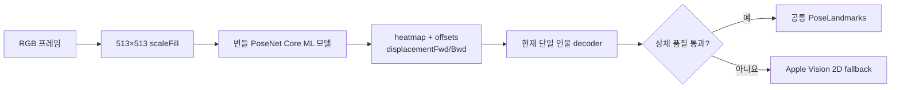

# Apple Core ML 샘플 PoseNet — 조사 인덱스

## 문서 요약

| 항목 | 내용 |
|---|---|
| 문서 유형 | PoseNet 모델·Apple Core ML 샘플 리서치 인덱스 |
| 적용 상태 | 상체 landmark 우선 추출기로 채택 |
| 입력 | RGB 이미지, 현재 제품 모델 입력은 513×513 |
| 출력 | 17개 2D 관절용 heatmap·offset과 다인 해석용 displacement |
| 다루는 범위 | 모델 출처, 출력 해석, 좌표계, confidence, 현재 통합 경계 |
| 제품 내 역할 | 머리·양쪽 어깨 landmark와 ROI 품질 입력 제공 |

## 기술 경계

이 문서에서 “Apple PoseNet”은 Apple이 개발한 Vision API를 뜻하지 않는다. Apple의 Core ML 샘플이 배포하는 서드파티 PoseNet 모델과 샘플 통합 방식을 뜻한다. Apple 공식 문서도 PoseNet 샘플과 Vision 2D body pose를 별도 기술로 안내한다.

| 구분 | Apple Core ML 샘플 PoseNet | Apple Vision 2D |
|---|---|---|
| 소유 경계 | 앱에 모델 파일을 번들하고 직접 실행·해석 | 운영체제 Vision 요청을 실행 |
| 제품 API | `MLModel.prediction(from:)` | `VNDetectHumanBodyPoseRequest` |
| 관절 수 | 17개 COCO 계열 관절 | 최대 19개 body point |
| 모델 출력 | heatmap, offsets, forward/backward displacement | `VNHumanBodyPoseObservation` |
| 좌표·confidence | 앱 decoder가 계산 | Vision이 정규화 점과 confidence 제공 |
| 현재 역할 | 우선 추출기 | PoseNet 상체 품질 실패 시 fallback |

Vision 2D의 상세 계약은 [`../apple-body-pose/analysis.md`](../apple-body-pose/analysis.md)에서 별도로 관리한다.

## 제품 적용 판단

- 번들 모델은 `PoseNetMobileNet075S16FP16.mlmodel`이며 MobileNetV1 0.75, output stride 16 변형이다.
- PoseNet의 17개 관절 중 현재 제품 계약에는 nose, eyes, ears, shoulders만 전달한다. PoseNet에는 Vision 2D의 `neck` 관절이 없다.
- 현재 decoder는 joint별 heatmap 최댓값과 offset만 사용해 한 사람의 관절을 만든다. 모델이 제공하는 displacement tensor와 Apple 샘플의 다인 decoder는 사용하지 않는다.
- 머리 anchor와 양쪽 어깨가 confidence·기하 조건을 통과한 경우에만 결과를 사용한다. 실패하면 같은 프레임을 Apple Vision 2D로 다시 분석한다.
- PoseNet은 ROI와 입력 품질을 제공할 뿐 `good`·`bad`를 판정하지 않는다. 자세 상태는 Depth Anything V2 feature, 개인 baseline, 시간 조건을 결합한 프로젝트 분석기가 결정한다.

## 한계와 검증 상태

- `scaleFill` 전처리는 crop 없이 원본을 513×513로 늘여 모델이 보는 신체 비율을 바꾼다. 정규화 좌표의 선형 대응과 별개로 landmark 편향과 depth ROI 정렬을 제품 fixture로 검증해야 한다.
- 현재 decoder는 다인 분리 정보를 사용하지 않으므로 한 화면에 여러 사람이 있으면 관절이 서로 다른 사람에게서 선택될 수 있다. 대상 선택을 지원한다고 간주하지 않는다.
- heatmap 값은 모델의 joint score이며 Vision confidence와 같은 척도로 보정됐다고 가정하지 않는다. 모델별 threshold는 별도로 검증한다.
- 모델 파일을 앱이 소유하므로 번들 누락, Core ML compile/load 실패, 모델 라이선스와 업데이트도 제품 책임 범위다.
- 2026-07-21 제품 카메라 검증에서 Vision 단독 경로보다 유효한 상체 anchor를 더 안정적으로 확보해 우선 경로로 채택했지만, 이는 일반 정확도 벤치마크가 아니라 현재 제품 환경의 통합 결과다.

## 문서 구성

| 문서 | 유형 | 역할 |
|---|---|---|
| 본 README | 리서치 인덱스 | PoseNet과 Vision 2D의 경계, 현재 적용 상태 요약 |
| [analysis.md](analysis.md) | 로직 분석·설명 | 모델 I/O, 단일 인물 decoding, 좌표계와 fallback 계약 |
| [references.md](references.md) | 공식·1차 자료 | Apple 샘플, TensorFlow 원본, 로컬 모델 근거 추적 |
