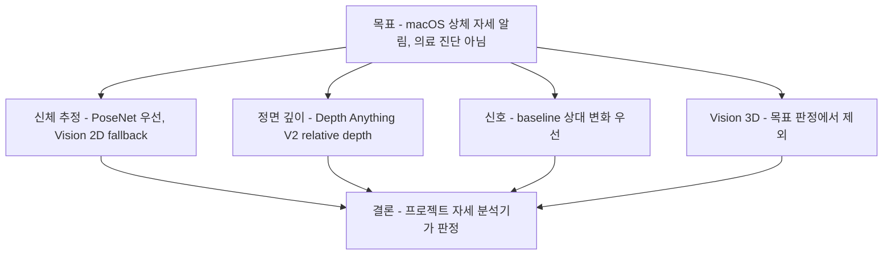

# 상체 중심 자세 추정 조사

## 문서 요약

| 항목 | 내용 |
|---|---|
| 문서 유형 | 자세 추정 종합 리서치 인덱스 |
| 적용 상태 | PoseNet 우선 채택, Apple Vision 2D fallback |
| 입력 | 카메라 RGB 프레임과 모델별 사람 landmark·depth 후보 |
| 출력 | 자세 분석에 사용할 landmark·feature 후보와 품질 조건 |
| 다루는 범위 | 모델, 임상 지표, 시점 기하, 단안 한계, 개인 baseline |
| 제품 내 역할 | 자세 추정 리서치의 진입점과 상세 문서 연결 |

## 요약 다이어그램

## 목적

이 문서는 `turtlemeck`의 자세 추정 로직을 개선하기 위해 컴퓨터 비전 기반 pose estimation 자료를 조사하고, 전신 추정보다 상체 중심 추적에 적합한 접근을 정리한 것이다.

앱의 목표는 의료 진단이 아니라 macOS 메뉴바에서 동작하는 일반 웰니스 알림이다. 따라서 절대적인 forward head posture(FHP) 진단값보다, 사용자의 기준 자세 대비 머리-목-어깨 정렬이 반복적으로 나빠지는지를 안정적으로 감지하는 방향이 적합하다.

## 제품 적용 판단

- 목표 기본 경로는 PoseNet·Apple Vision 2D 신체 추정 + Depth Anything V2 상대 깊이 + 프로젝트 자세 분석기다. PoseNet을 우선 사용하고 유효한 상체가 없을 때 Vision 2D로 fallback한다.
- 2D 기반 상체 자세 감지 로직에는 전신 keypoint 전체가 필요하지 않다. `nose`, `eyes`, `ears`, `neck`, `shoulders`가 주 재료다.
- Apple Vision 3D는 17개 관절의 hip-rooted skeleton과 observation-level confidence를 제공하지만 per-joint confidence와 dense depth를 제공하지 않는다. 목표 내장 카메라에는 measured-depth 보강도 없으므로 판정 경로에서 제외한다.
- 고정 카메라 시점에서는 forward/back 이동을 2D만으로 안정적으로 알기 어렵다. 2D body landmark로 머리·몸통 ROI와 품질 조건을 정하고, relative depth의 affine-invariant 표준화 대비를 baseline과 비교한다.
- 전통적인 CVA(craniovertebral angle)는 측면 사진에서 C7과 귀의 tragus를 기준으로 측정한다. 일반 웹캠 pose landmark에는 C7이 직접 없으므로 앱 내부 점수와 CVA를 동일시하면 안 된다.

## 한계와 검증 상태

- 정면 단일 RGB에서 FHP를 절대 거리나 임상 CVA로 측정하는 근거는 확보되지 않았다.
- relative depth feature와 개인 baseline 파라미터는 동일 제품 데이터에서 반복성·분리도·오경보율을 검증해야 한다.
- 2026-07-21 제품 카메라 검증에서 Vision 단독 경로는 모델 준비 실패와 상체 landmark 미검출로 초기 보정 0/5를 반복했다. Apple 공식 Core ML 샘플의 PoseNet을 같은 입력에 적용했을 때 유효 landmark가 확보되어 우선 경로로 채택했다.
- 자동 baseline 적응과 시점별 알고리즘 라우팅은 추가하지 않는다.

## 문서 구성

이 README는 전반 조사이며, 주제별 심화는 별도 문서로 분리한다. Apple Core ML 샘플 PoseNet은 [`../apple-posenet/`](../apple-posenet/), 운영체제 Vision 2D·3D API는 [`../apple-body-pose/`](../apple-body-pose/)에서 각각 관리한다.

| 문서 | 유형 | 적용 상태 | 역할 |
|---|---|---|---|
| 본 README | 종합 조사 | 근거 문서 | 모델·feature·판정 후보의 전체 지도와 결론 요약 |
| [analysis.md](analysis.md) | 로직 분석·설명 | 근거 문서 | 모델 특성, feature, 판정 후보와 기술적 한계 상세 |
| [references.md](references.md) | 공식·관련 자료 | 근거 문서 | 종합 조사의 공식 문서와 1차 연구 목록 |
| [comparison.md](comparison.md) | 대안 비교 | PoseNet 우선, Vision 2D fallback | 상체 관점의 모델·라이선스 비교와 pose anchor 선정 근거 |
| [related-cva-metrics.md](related-cva-metrics.md) | 관련 연구 | 근거 문서 | CVA 정의, FHP 임계 비합의, 앱 점수와 임상값의 구분 |
| [related-monocular-limits.md](related-monocular-limits.md) | 관련 연구 | 근거 문서 | 단안·정면 카메라의 구조적 한계와 완화 후보 |
| [related-viewpoint-geometry.md](related-viewpoint-geometry.md) | 관련 연구 | 미채택 | 시점별 분기를 현재 플로우에 넣지 않는 근거 |
| [related-baseline-calibration.md](related-baseline-calibration.md) | 관련 연구 | 자동 적응 미채택 | 개인 baseline 방식과 자동 적응의 도메인 전이 한계 |
