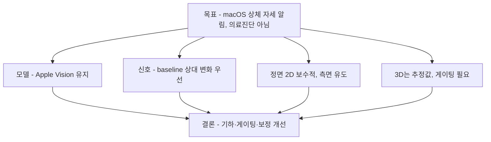

# 상체 중심 자세 추정 조사

## 요약 다이어그램

## 목적

이 문서는 `turtlemeck`의 자세 추정 로직을 개선하기 위해 컴퓨터 비전 기반 pose estimation 자료를 조사하고, 전신 추정보다 상체 중심 추적에 적합한 접근을 정리한 것이다.

앱의 목표는 의료 진단이 아니라 macOS 메뉴바에서 동작하는 일반 웰니스 알림이다. 따라서 절대적인 forward head posture(FHP) 진단값보다, 사용자의 기준 자세 대비 머리-목-어깨 정렬이 반복적으로 나빠지는지를 안정적으로 감지하는 방향이 적합하다.

## 문서 구성 (주제별 분할)

이 README는 전반 조사이며, 주제별 심화는 별도 문서로 분리한다. Apple Vision 전용 분석은 [`../apple-body-pose/`](../apple-body-pose/) 참조.

| 문서 | 내용 |
|---|---|
| 본 README | 모델 개요·feature 설계·판정 파이프라인 + [추가 조사 보강](#추가-조사-보강) |
| [cva-and-fhp-metrics.md](cva-and-fhp-metrics.md) | CVA 정의·FHP 임계 비합의·사진 CVA 한계 (동료심사) |
| [monocular-limits.md](monocular-limits.md) | 단안 3D ill-posed·정면 카메라 한계·깊이 완화 기법·One-Euro filter |
| [model-comparison.md](model-comparison.md) | 모델 비교(상체 관점)·라이선스·현 Vision 유지 타당성 |
| [baseline-calibration.md](baseline-calibration.md) | 개인 baseline 보정·적응 전략 — percentile/median·CUSUM drift |
| [viewpoint-robust-geometry.md](viewpoint-robust-geometry.md) | 시점 강건 머리-몸통 각도 기하 — 2D atan2 한계·body-frame 3D·정면=depth·hip-rooted root |

> CVA 임계·정면 proxy·단안 한계·One-Euro는 동료심사 문헌으로 확정됐으며, 세부는 각 분할 문서에서 다룬다. 주요 보강: (1) baseline 보정 방법론(percentile/median + CUSUM, [baseline-calibration.md](baseline-calibration.md)), (2) 단안 깊이 오차 2~3배·임상 5도 미달 정량화, (3) 깊이 완화 3수단(temporal·prior·metric-space, [monocular-limits.md §5](monocular-limits.md)), (4) One-Euro의 Kalman/EMA 대비 정량 우월 확인. Molaeifar/Work 2021 정면 proxy 주장은 성립하지 않는다([monocular-limits.md §2](monocular-limits.md)).
>
> 자세 추정 정확도 관점에서(알림 정책 제외): (1) 단순 2D `atan2` 각은 비단조성 수정 후에도 *단일 임계*로는 FHP/정상 분포가 겹쳐 부족하므로 **body-frame 3D 각 + 다중 feature**가 필요하고, (2) 정면 FHP는 **depth가 필요**하며(성공 선례 PreventFHP = Kinect depth) Apple Vision 3D 경로·이마-몸통 depth 차이 feature를 쓰며, (3) Apple 3D는 **hip-rooted**라 근접착석 root가 불안정하므로 상체 관절 anchor + 2D/3D 융합 게이팅이 필요하다([viewpoint-robust-geometry.md](viewpoint-robust-geometry.md)). "정면 각으로 CVA 예측"과 "정면 얼굴이미지 FHP 분류기"는 채택하지 않는다.

## 요약 결론

- 현재 macOS 네이티브 앱에는 Apple Vision 기반 접근이 가장 현실적이다. 별도 모델 번들 없이 온디바이스 처리, 카메라 프레임/이미지 입력이 가능하다. (단 **joint confidence는 2D 점에만** 있고 **3D 점에는 없다** — [Apple 확정, apple-body-pose/vision-pose-apis.md §3](../apple-body-pose/vision-pose-apis.md).)
- 2D 기반 상체 자세 감지 로직에는 전신 keypoint 전체가 필요하지 않다. `nose`, `eyes`, `ears`, `neck`, `shoulders`가 주 재료다.
- Apple 3D는 별도 주의가 필요하다. `VNDetectHumanBodyPose3DRequest` 출력은 17관절 hip-rooted skeleton이고, **온디바이스 실측(M1 Pro·노트북 웹캠) 결과 상체-only 입력에서 발화가 간헐적(라이브 10회 중 5회)이며 발화해도 하반신 관절은 추론값, 마진 입력에서 각이 부정확(거북목인데 88°)했다.** ⇒ 상체-only 3D는 주 경로로 부적합한 실험적 보조이며, 주 경로는 2D + baseline 보정이다. (상세 [algorithm-draft §0](../algorithm-draft.md), [apple-body-pose/vision-pose-apis.md §3](../apple-body-pose/vision-pose-apis.md).)
- 측면(profile)에서는 ear/head proxy와 shoulder/neck anchor의 상대 각도 또는 수평 이동이 가장 직접적이다.
- 정면(front)에서는 forward/back 이동을 2D만으로 안정적으로 알기 어렵다. shoulder width로 정규화한 head offset, head tilt, shoulder symmetry를 보조 신호로 쓰고, 강한 확신이 없으면 `noEval`이 낫다.
- 3D pose가 가능하면 head-to-torso sagittal angle을 계산하는 것이 좋다. 다만 단일 RGB 기반 3D pose는 추정값이므로 confidence, temporal smoothing, 사용자별 baseline이 필요하다.
- 전통적인 CVA(craniovertebral angle)는 tragus-ear와 C7 기준의 임상/사진 측정값이다. 일반 웹캠 pose landmark에는 C7이 직접 없으므로 앱 내부 점수와 CVA를 동일시하면 안 된다.

## 주요 자료

### Apple Vision

Apple Vision은 `VNDetectHumanBodyPoseRequest`로 2D body pose를 제공한다. WWDC20 자료 기준으로 face group에는 nose, left/right eye, left/right ear가 있고, torso group에는 shoulders, neck, hips, root가 포함된다. Vision은 point별 confidence를 제공하며, 카메라 feed나 still image 모두에서 사용할 수 있다. 또한 Apple은 edge, occlusion, 특이한 자세, 흐르는 옷 등에서 pose 품질이 나빠질 수 있다고 설명한다.

`VNDetectHumanBodyPose3DRequest`는 3D skeleton을 반환하며, WWDC23 자료 기준 17 joints를 제공한다. 3D skeleton에는 center/top head, shoulders, spine, root 등이 있고, 좌표는 root joint 기준 meter 단위로 표현된다. Apple은 local position이 특정 body part만 다룰 때 유용하고 parent-child joint angle 계산을 단순화한다고 설명한다.

적용 판단:

- macOS 네이티브, 개인정보 보호, 의존성 최소화 요구에는 Vision이 가장 맞다.
- 현재 앱처럼 짧은 burst만 처리하는 구조와 잘 맞는다.
- 2D confidence gating과 3D fallback을 같이 쓰는 하이브리드 방식이 적합하다.

### MediaPipe BlazePose / Pose Landmarker

MediaPipe Pose Landmarker는 image, decoded video frame, live video feed를 입력으로 받아 normalized image coordinates와 world coordinates를 반환한다. 모델은 body detector와 pose landmarker의 2단계 구조이며, 33개 3D pose landmarks를 출력한다. Google 문서는 posture analysis와 movement categorization을 사용 사례로 언급한다.

BlazePose 논문은 모바일 실시간 inference를 목표로 한 lightweight CNN 구조를 제안한다. 단일 인물에 대해 33 keypoints를 출력하고, heatmap과 coordinate regression을 결합한다.

적용 판단:

- cross-platform 또는 자체 모델 파이프라인을 원하면 좋은 후보이다.
- Apple Vision보다 더 많은 face/hand/foot landmark를 제공하지만, 이 앱에는 하체와 손가락 keypoint 대부분이 불필요하다.
- macOS Swift 앱에 넣으려면 모델 번들, 런타임 통합, 배포 크기, 라이선스/업데이트 정책을 별도로 관리해야 한다.

### MoveNet

MoveNet은 TensorFlow Hub에서 제공하는 17 keypoint pose model이다. Lightning은 latency-critical 용도, Thunder는 정확도 우선 용도로 설명된다. TensorFlow 문서는 대부분의 현대 desktop, laptop, phone에서 30 FPS 이상 실시간 동작을 목표로 한다고 설명한다.

적용 판단:

- 17 keypoint 구조라 상체 중심에는 충분할 수 있다.
- TensorFlow Lite/TF Hub 기반 파이프라인이 필요하므로 현재 Apple Vision 기반 macOS 앱에는 통합 비용이 있다.
- 3D world coordinates가 기본 강점인 MediaPipe Pose Landmarker와 비교하면, 상체 sagittal 판단에는 추가 추정이나 baseline 보정이 더 중요하다.

### OpenPose / HRNet 계열

OpenPose는 Part Affinity Fields 기반의 bottom-up multi-person 2D pose estimation 접근이다. HRNet은 고해상도 representation을 유지해 keypoint heatmap 정밀도를 높이는 계열이다.

적용 판단:

- 연구/서버/고정 카메라 분석에는 참고 가치가 크다.
- 메뉴바 웰니스 앱에는 모델 크기, 계산량, 배포 복잡도가 과하다.
- 다중 인물보다 단일 사용자 상체 추적이 목적이므로 실용 우선순위는 낮다.

### 상체 자세와 CVA 관련 연구

상체 자세 사진 측정 문헌 리뷰는 head, neck, shoulder, thoracic region을 평가하는 여러 각도를 다룬다. PubMed abstract 기준으로 craniovertebral angle, sagittal head tilt, sagittal shoulder-C7 angle 등은 중등도 이상 신뢰도와 타당도를 보이는 측정법으로 정리되어 있다.

컴퓨터 비전 기반 CVA 측정 앱 연구는 smartphone lateral photo 기반 CVA 측정에서 test-retest와 inter-rater reliability가 우수하고 Kinovea와 높은 상관을 보였다고 보고한다. 다만 이 유형의 CVA 측정은 일반적으로 lateral photo, marker/기준점, 측정 절차 표준화가 전제된다.

2024년 FHP 인식 연구는 2D 이미지에서 3D pose estimation joint를 추정하고 GCN으로 FHP feature를 학습하는 접근을 제시한다. 이 연구는 C7의 정확한 3D 위치를 전용 장비 없이 얻기 어렵고, 일반 3D pose estimation 모델이 CVA를 직접 추정하도록 설계된 것은 아니라는 한계를 언급한다.

적용 판단:

- 앱에서 CVA라는 임상 용어를 직접 수치로 표시하는 것은 피해야 한다.
- C7 대신 shoulder midpoint, neck, spine/root, head center 같은 proxy를 쓰는 것은 “자세 신호”로는 가능하지만 의료 측정값은 아니다.
- 사용자별 baseline과 반복 판정이 핵심이다.

## 알고리즘 분류

### Top-down vs bottom-up

Top-down 방식은 사람을 먼저 detect/crop한 뒤 각 사람의 keypoint를 추정한다. 단일 사용자 앱에는 단순하고 정확도 관리가 쉽다.

Bottom-up 방식은 이미지 전체에서 body part를 먼저 찾고 사람별로 조립한다. 다중 인물에는 강하지만, 단일 사용자 메뉴바 앱에는 필요 이상으로 복잡하다.

이 앱에는 single-person top-down 또는 플랫폼 제공 pose request가 적합하다.

### Heatmap, coordinate regression, hybrid

- Heatmap 방식: keypoint 위치 확률 분포를 예측한다. 위치 정밀도와 confidence 해석이 좋지만 연산량이 늘 수 있다.
- Direct coordinate regression: keypoint 좌표를 바로 예측한다. 빠르지만 occlusion/uncertainty 표현이 약할 수 있다.
- Hybrid: BlazePose처럼 heatmap supervision과 regression을 조합해 속도와 안정성을 절충한다.

이 앱은 모델 내부 구조를 직접 선택하기보다, 출력 landmark의 confidence와 temporal consistency를 잘 사용하는 쪽이 중요하다.

### 2D, 3D, face pose

2D pose:

- 장점: 빠르고 플랫폼 지원이 안정적이다.
- 단점: 카메라 위치, yaw, perspective 때문에 forward/back head translation 판단이 흔들릴 수 있다.

3D pose:

- 장점: head-to-torso sagittal angle처럼 자세와 직접 관련된 feature를 만들기 좋다.
- 단점: 단일 RGB 기반 3D는 추정값이며, landmark가 실제 해부학적 지점과 다를 수 있다.

Face pose:

- Apple Vision은 face pose의 roll, yaw, pitch metric을 제공한다.
- head yaw가 큰 경우 ear/shoulder 기반 2D profile 판단을 그대로 쓰면 “고개를 돌린 것”과 “목이 앞으로 나온 것”을 혼동할 수 있다.
- face pose는 posture score의 직접 신호보다는 viewpoint classification과 false positive guard에 쓰는 편이 안전하다.

## 상체 중심 feature 설계

### 필요한 landmark subset

| Landmark | 용도 | 주의점 |
| --- | --- | --- |
| nose | head center fallback, frontal alignment | pitch/yaw에 따라 이동량이 커짐 |
| left/right eye | ear가 안 보일 때 head proxy | 안경/눈 감김/얼굴 각도 영향 |
| left/right ear | profile에서 CVA 유사 head point | 한쪽 귀만 보일 수 있음 |
| neck | head-to-torso anchor | confidence가 낮으면 shoulder midpoint fallback |
| left/right shoulder | shoulder midpoint, shoulder width normalization, shoulder slope | 팔/옷/의자 등 occlusion 영향 |
| spine/root 3D | torso vector, sagittal angle | 3D request availability와 추정 품질 확인 필요 |
| center/top head 3D | head vector, sagittal angle | hair/headwear 영향 가능 |

### Profile view

측면 카메라 또는 사용자가 옆으로 보이는 경우:

1. head point를 선택한다.
   - 우선 ear
   - fallback: eye
   - fallback: nose
2. torso anchor를 선택한다.
   - 우선 neck
   - fallback: shoulder midpoint
3. head point와 torso anchor의 상대 위치를 계산한다.
4. 사용자 baseline 대비 head-forward shift 또는 angle 감소를 bad evidence로 본다.

절대 threshold만 사용하면 체형, 카메라 높이, 좌석 위치에 취약하다. baseline 대비 변화량과 shoulder width normalization이 필요하다.

### Front view

정면 카메라에서는 2D만으로 전방 이동을 직접 관측하기 어렵다. 사용할 수 있는 신호는 다음 정도이다.

- shoulder width로 정규화한 head center의 좌우/상하 offset
- head roll과 shoulder slope
- face pitch/yaw가 큰 경우 no-eval 또는 confidence penalty
- 3D pose가 있으면 head-to-spine/root sagittal relation 사용

정면 2D 신호만으로 “목이 앞으로 나왔다”고 강하게 판정하면 false positive가 많아질 수 있다. 이 경우는 `noEval` 또는 약한 evidence로 다루는 것이 낫다.

### Three-quarter view

3/4 시점은 profile과 front의 중간이다. yaw와 ear visibility를 보고 다음처럼 처리한다.

- visible ear와 shoulder relation이 안정적이면 profile path 사용
- face yaw가 작고 양쪽 어깨/귀가 안정적이면 front path 사용
- yaw가 큰데 shoulder/head anchor가 불안정하면 no-eval

### 3D path

3D landmark가 충분하면 다음 feature가 가장 직접적이다.

- torso vector: `spine/root -> shoulder/neck`
- head vector: `shoulder/neck -> centerHead/topHead`
- sagittal plane angle: 카메라 yaw 영향을 줄이기 위해 body coordinate 기준으로 투영
- shoulder rounding proxy: shoulder와 spine/root의 상대 z/x 위치

단, 3D skeleton의 root는 hip center이고 이 앱은 상체만 보기 때문에 root가 프레임 밖이거나 confidence가 낮을 수 있다. 이 경우 spine/shoulder 기반 local coordinate를 우선해야 한다.

## 판정 파이프라인 제안

1. Camera frame sampling
   - 계속 켜두기보다 2-3초 burst를 주기적으로 실행한다.
   - privacy indicator가 켜지는 시간을 짧고 예측 가능하게 유지한다.

2. Landmark extraction
   - Apple Vision 2D body pose + face landmarks/face pose
   - Apple Silicon 또는 지원 환경에서는 3D body pose 추가

3. Quality gating
   - landmark confidence threshold 적용
   - head/neck/shoulder 필수점이 부족하면 no-eval
   - 화면 edge, severe yaw, occlusion, 급격한 jump는 no-eval 또는 낮은 weight

4. Viewpoint classification
   - ear visibility, face yaw, shoulder symmetry로 front/profile/three-quarter 분류
   - viewpoint가 burst 안에서 안정될 때만 판정

5. Feature extraction
   - profile: head-to-shoulder/neck angle, shoulder-width normalized forward offset
   - front: head center offset, shoulder slope, face roll/pitch 보조 신호
   - 3D: body-coordinate sagittal head-to-torso angle

6. Baseline comparison
   - 사용자별 좋은 자세 baseline을 저장한다.
   - 절대 각도보다 baseline 대비 delta를 주로 사용한다.
   - baseline은 percentile/median 기반으로 노이즈에 강하게 만든다.

7. Temporal filtering
   - One Euro Filter, EMA, Kalman filter 중 하나로 jitter를 줄인다.
   - 짧은 bad spike는 무시하고, 연속 bad evidence가 있을 때만 알림 상태로 전환한다.
   - no-eval gap은 bad streak를 끊어 false positive를 줄인다.

8. Alert policy
   - posture assessment와 notification policy를 분리한다.
   - 알림은 state transition과 rate limit 기준으로만 보낸다.

## 현재 앱 구현에 대한 제안

현재 코드 방향은 대체로 적절하다.

- Vision 기반 2D/3D pose 사용
- profile/front/3D path 분리
- shoulder width normalization
- baseline calibration
- burst processor와 state machine 분리
- no-eval gap 처리
- confidence 기반 fallback 제한

추가로 고려할 점:

- 메뉴 UI에는 `카메라 점검 중`, `다음 점검 N초 후`, `현재 자세 정상/주의/확인 중`을 분리해서 보여주는 것이 좋다.
- 2D front path의 bad 판정은 보수적으로 유지한다.
- face yaw/pitch/roll은 posture 자체보다 viewpoint guard로 쓰는 편이 안전하다.
- 3D path는 Apple Silicon에서만 강하게 쓰고, Intel/미지원 환경에서는 profile path 중심으로 fallback한다.
- 사용자에게 “정확한 CVA 측정”이 아니라 “자세 알림 신호”라는 표현을 유지해야 한다.

## 구현 시 피해야 할 것

- C7을 직접 감지하지 않았는데 CVA 수치를 임상값처럼 표시하지 않는다.
- 정면 2D pose만으로 forward head를 확정하지 않는다.
- 단일 프레임 판정으로 알림을 보내지 않는다.
- 낮은 confidence landmark를 fallback으로 무조건 사용하지 않는다.
- 하체 landmark가 부족하다는 이유로 상체 판정을 포기하지 않는다.
- 카메라를 계속 켜두는 방식으로 정확도를 얻으려 하지 않는다.

---

# 추가 조사 보강

본 절은 위 내용을 1차 출처 인용으로 보강하고, 추가 검증에서 확인된 근거와 남은 미해결 쟁점을 정리한다.

## 검증된 모델 사실

BlazePose / MediaPipe 서술을 1차 출처 인용으로 뒷받침한다.

- **BlazePose는 온디바이스 실시간이 1차 출처로 확인된다.** 단일 인물 33 keypoint를 Pixel 2(모바일 CPU)에서 **30 FPS 이상**으로 추론한다.
  > "the network produces 33 body keypoints for a single person and runs at over 30 frames per second on a Pixel 2 phone." — BlazePose (arXiv:2006.10204)
- **상체 지표에 필요한 랜드마크가 토폴로지에 포함된다** — nose, eyes, ears, mouth, left/right shoulder (0–12번). 즉 CVA류 머리-어깨 기하를 만들 재료가 있다.
- **BlazePose는 상체 부분 관측(upper-body-only) 상황에서도 추적을 유지할 수 있음을 원논문에서 사례로 언급한다.** 학습 시 가림(occlusion)을 시뮬레이션하고 per-point visibility classifier로 가려진/부정확한 점을 표시해, 하체가 프레임 밖이어도 추적을 유지한다.
  > "we simulate occlusions ... per-point visibility classifier ... This allows tracking a person constantly even for cases of significant occlusions, like upper body-only or when the majority of person body is out of scene." — BlazePose (arXiv:2006.10204)
  - **앱 함의:** "상체만 추적하면 된다"는 요구는 BlazePose류 모델에서도 가능한 시나리오다. 단 원논문은 이를 독립 기능/모드가 아니라 occlusion 처리 능력의 사례로 제시한다.
- **MediaPipe Pose Landmarker = BlazePose + GHUM 3D 파이프라인**으로 33개 3D landmark를 normalized + world 좌표로 출력한다. 즉 위에서 분리 서술한 "BlazePose"와 "Pose Landmarker"는 사실상 같은 모델 계열의 논문/제품 두 얼굴이다.

## CVA 임상 정의·임계

CVA를 앱 점수와 동일시해서는 안 되며, 임계값 또한 논쟁적이다.

- **CVA 정의:** 귀 tragus→C7 극돌기 선과, C7을 지나는 지면 평행 수평선 사이의 각. (PMC7559098)
- **광학식(photogrammetry) CVA는 *신뢰도(재현성·평가자간 일치)* 가 확립돼 임상 스크리닝 지표로 쓰인다.** 측면 사진 CVA는 *재현성*이 높아 정면 proxy보다 정당하다. 따라서 앱이 **측면 뷰를 유도**할 수 있다면 CVA 유사 지표의 정당성이 강해진다.
  - 단, 사진 CVA는 *재현성(reliability)* 은 높으나 *방사선 대비 기준타당도(criterion validity)* 는 낮다 — 둘을 구분해야 한다. PMC11012400은 사진 CVA가 방사선 정렬과 **R²≈0.30**에 그쳐 *"방사선 측정을 대체할 수 없다"*고 결론한다([cva-and-fhp-metrics.md §3](cva-and-fhp-metrics.md)). 측면 뷰가 정면보다 나은 근거는 "표준 기하 + 재현성"이지 "방사선 타당성"이 아니며, 어느 경우든 앱은 "측정"이 아니라 "신호"다.
- **임계값은 단일하지 않다.** "CVA < ~50° → FHP (비정상 50–53° 구간)"는 출처 간 합의가 없으며, 다른 출처는 48° 기준도 제시한다. **임계 수치를 하드코딩하지 말 것.** 절대 임계 단독 의존은 위험하고, **개인 baseline 대비 변화**를 주신호로 쓰는 방향을 강화한다.
- **변하지 않는 핵심 제약:** CVA의 C7 기준점은 일반 웹캠 랜드마크에 **직접 존재하지 않는다.** shoulder midpoint/neck을 C7 proxy로 쓰는 것은 "자세 신호"로는 가능하나 **임상 CVA가 아니다.** CVA 수치를 임상값처럼 표시해서는 안 된다.

## 정면-only 전방머리 추정의 한계

정면 2D는 보조 신호로 다루고 강한 확신이 없으면 noEval로 두는 것이 적절하며, 정량화는 구조적으로 어렵다.

- "**정면 평면 측정(흉골 midpoint + 양쪽 귀 tragus)만으로 시상면 CVA를 예측할 수 있다**"는 주장은 성립하지 않는다. 같은 출처조차 "frontal proxy는 3D CVA와 **moderate(중등도) 상관일 뿐, 완전 대체 불가**"라고 명시한다(WOR-213451). 이 주장은 긍정 근거가 아니라 정면 proxy 불충분의 근거로만 남는다(상세 [monocular-limits.md §2](monocular-limits.md)).
- **함의:** Mac 내장 카메라(정면) 단독으로 전방머리를 *정량화*하려는 시도는 구조적으로 오차가 크다. 정면은 보수적으로/noEval로 유지하되, 전방머리 *심각도 점수*를 제시하지 말고 (a) baseline 대비 *상대 악화 추세*만 약한 신호로 쓰거나, (b) 사용자에게 **측면/3-4 측면 착석 또는 카메라 측면 배치를 유도**하는 편이 정직하다.
- 정면 2D 보조 지표(머리 bbox 크기·코-어깨 수직비 등)는 검증에서 실효 근거가 부족했다. 채택 전 자체 데이터 검증이 필요하다.

## 모노큘러 깊이 모호성과 3D 경로 신뢰도

- 단일 카메라 3D 추정은 **본질적으로 ill-posed**다: 하나의 2D 관측이 카메라 광선 위 무한히 많은 3D 점과 일치(깊이 모호성). 다중 카메라/depth 센서와 달리 단안은 직접 깊이 정보가 없다. 단안 3D의 ill-posed 성질은 컴퓨터비전에서 광범위하게 합의된 사실이며 다수 출처(PMC12031093 / arXiv:2411.13026)가 동일 진술한다.
- **앱 함의:** `VNDetectHumanBodyPose3DRequest`의 head/spine 전방거리도 *추정값*이다. "3D는 Apple Silicon에서만 강하게, 그 외 profile fallback"이 타당하다. 추가로 — **근접 착석(상체만 프레임)에서는 root(hip center)가 프레임 밖**이라 3D root/spine 신뢰도가 떨어질 수 있다. 따라서 3D 경로도 **무조건 신뢰가 아니라 confidence gating + baseline 상대화**가 필요하다.
- **온디바이스 실측:** 직접 촬영 라이브 캡처(M1 Pro·macOS 15.7.2·노트북 웹캠)로 측정한 결과, 상체-only 입력에서 3D 발화는 **간헐적**(라이브 10회 중 5회; 초근접 0/3, 정상 착석 약 4/6)이고, 발화해도 hip/knee/ankle은 추론값이며, 마진 입력에서 시상각이 부정확(거북목인데 88°)했다. 또 **JPEG 재인코딩이 3D 거동을 바꿔** 정지 이미지로는 충실히 평가할 수 없음을 확인했다. ⇒ 상체-only 3D는 주 경로 부적합(실험적 보조). 상세 [algorithm-draft §0](../algorithm-draft.md).

## 확정된 근거와 미해결·추가 검증 필요 쟁점

다음 항목은 동료심사 문헌·실측으로 확정됐다.

- **One-Euro filter** — 속도적응 cutoff·jitter↔lag 트레이드오프가 원논문(CHI 2012)으로 확정. Kalman·EMA·이동평균 대비 오차(SEM 0.004 vs 0.015)·lag 모두 우월 → 교체 불필요. → [monocular-limits.md §4](monocular-limits.md). (2-파라미터 튜닝 세부는 원논문 참조.)
- **CVA 임계 비합의** — 단일 합의 임계 없음, 증상↔무증상 중첩. → [cva-and-fhp-metrics.md §2](cva-and-fhp-metrics.md).
- **개인 baseline 보정 전략** — rolling-window percentile/median + CUSUM drift 트리거가 인접 도메인(CGM·wearable)에서 검증됨. **단 파라미터는 도메인 특수라 자체 데이터 검증 필요.** → [baseline-calibration.md](baseline-calibration.md).
- **단안 깊이 완화 기법** — temporal consistency·anatomical prior·metric-space heatmap. → [monocular-limits.md §5](monocular-limits.md).
- **정면 proxy 한계** — Molaeifar/Work 2021의 정면-proxy 타당성 주장은 성립하지 않으며, 정면 단독 정량화는 강한 근거가 없다. → [monocular-limits.md §2](monocular-limits.md).
- **주요 대안 모델 라이선스** — MediaPipe/MoveNet은 Apache-2.0, Ultralytics YOLO는 AGPL-3.0 또는 Enterprise License, OpenPose는 비상업 연구용(상용은 CMU 별도 협의)으로 공식 출처 확인. → [model-comparison.md §3](model-comparison.md).
- **hip 프레임 밖 시 3D root 안정성** — 노트북 웹캠 상체 입력에서 측정: 3D 발화가 간헐적(10회 중 5회)이고, 발화 시 hip/knee/ankle은 추론값, 마진 프레임에서 head-torso 시상각이 부정확(거북목인데 88°). ⇒ 근접 착석에서 3D root/하반신은 신뢰 불가 → 3D는 실험적 보조로 다룬다. ([algorithm-draft §0](../algorithm-draft.md))

다음 항목은 미해결이며 추가 검증이 필요하다.

- **알림 *결정* 레이어 (최대 잔여 공백)** — hysteresis/debounce/state-machine 기반 알림 전이(false-positive 억제)는 직접 근거 미확보. per-channel 스무딩과 구분되는 별도 주제. HCI 알림/방해 문헌 조사 필요.
- **모델별 정량 벤치(mAP/FPS)** — 상호비교 가능한 통일 벤치 미확보.
- **정면 2D 보조 지표(머리 bbox·코-어깨 비) 실효성** — 카메라 거리 perspective가 비율을 왜곡(Cognition 2017)하고, 정면 FHP 성공 선례는 depth 카메라가 필요했다 → 2D 비율만으로는 약한 proxy. 미검증 가설로 유지하되 우선순위 낮음. → [viewpoint-robust-geometry.md §3](viewpoint-robust-geometry.md).
- **2D+3D 융합 게이팅 실효성** — 2D(per-joint confidence 有)로 3D(無) 관절을 cross-check 게이팅하면 self-occlusion·truncation 하 각 안정성이 개선되는가.
- **이마-몸통 depth 차이 feature** — PreventFHP 개념을 Apple 3D 관절만으로 데스크 거리(~50–70cm)에서 신뢰성 있게 복원 가능한가.
- **단일 대상 선택·미러링** — max-bbox vs center vs confidence 선택, 정면 미러 좌우 관절 swap. 연구 근거 없음, 엔지니어링 결정+테스트 필요.
- **MediaPipe CVA 앱(CVA-CVapp)** 실측 신뢰도 — 미검증.

## 종합 결론 요약

| 쟁점 | 결론 |
|---|---|
| 주 모델 | Apple Vision이 현실적 (대안 BlazePose/MediaPipe는 통합비용 ↑) |
| 상체-only 추적 | 전신 keypoint 불필요. BlazePose가 occlusion 처리 사례로 상체 부분 관측에서도 추적 가능함을 언급 |
| CVA 사용 | 앱 점수=CVA 동일시 금지. 측면 CVA는 표준 기하·재현성 측면에서 정면 proxy보다 낫지만 방사선 정렬 대체 지표는 아니며, 임계도 논쟁적 |
| 정면 2D | 보조 신호/noEval. frontal-only CVA 추정은 성립하지 않고 측면 유도 권장 |
| 3D 경로 | Apple Silicon 한정 강사용. 단 단안 3D는 ill-posed, 근접착석 root 불안정 |
| baseline 상대화 | 절대보다 delta 우선. 임계 비합의가 이를 뒷받침 |

**한 줄 결론:** Vision 기반·상체 subset·baseline 상대화·정면 보수의 방향이 적절하다. 핵심은 — (1) BlazePose가 상체 부분 관측에서도 추적 가능함을 원논문 사례로 확인, (2) 정면-only 전방머리 정량화는 어려우며 **측면 뷰 유도**가 정공법, (3) CVA 임계는 출처마다 달라 **수치 하드코딩 금지**.

---

## 참고 자료

- Apple Developer Documentation, `VNDetectHumanBodyPoseRequest`: <https://developer.apple.com/documentation/vision/vndetecthumanbodyposerequest>
- Apple Developer, WWDC20 “Detect Body and Hand Pose with Vision”: <https://developer.apple.com/videos/play/wwdc2020/10653/>
- Apple Developer, WWDC23 “Explore 3D body pose and person segmentation in Vision”: <https://developer.apple.com/videos/play/wwdc2023/111241/>
- Apple Developer, WWDC21 “Detect people, faces, and poses using Vision”: <https://developer.apple.com/videos/play/wwdc2021/10040/>
- Google AI Edge, MediaPipe Pose Landmarker guide: <https://developers.google.com/edge/mediapipe/solutions/vision/pose_landmarker>
- Google AI Edge, MediaPipe Face Landmarker guide: <https://developers.google.com/edge/mediapipe/solutions/vision/face_landmarker>
- Bazarevsky et al., “BlazePose: On-device Real-time Body Pose tracking”: <https://arxiv.org/abs/2006.10204>
- TensorFlow Hub, “MoveNet: Ultra fast and accurate pose detection model”: <https://www.tensorflow.org/hub/tutorials/movenet>
- Cao et al., “OpenPose: Realtime Multi-Person 2D Pose Estimation using Part Affinity Fields”: <https://arxiv.org/abs/1812.08008>
- Sun et al., “Deep High-Resolution Representation Learning for Human Pose Estimation”: <https://arxiv.org/abs/1902.09212>
- Singla et al., “Photogrammetric Assessment of Upper Body Posture Using Postural Angles: A Literature Review”: <https://pubmed.ncbi.nlm.nih.gov/28559753/>
- Lee et al., “Recognition of Forward Head Posture Through 3D Human Pose Estimation With a Graph Convolutional Network”: <https://formative.jmir.org/2024/1/e55476>
- A Computer Vision-Based Application for the Assessment of Head Posture: <https://www.mdpi.com/2076-3417/13/6/3910>
- Modelling Proper and Improper Sitting Posture of Computer Users Using Machine Vision: <https://www.mdpi.com/2076-3417/13/9/5402>

### 추가 조사 인용 출처

- MediaPipe Pose Landmarker guide (33 3D landmarks, GHUM): <https://ai.google.dev/edge/mediapipe/solutions/vision/pose_landmarker>
- 사진 CVA와 방사선 정렬 비교(R²≈0.30, 한계 근거): <https://pmc.ncbi.nlm.nih.gov/articles/PMC11012400/>
- CVA 정의 및 FHP 임계 논의 (tragus–C7, <50–53°): <https://pmc.ncbi.nlm.nih.gov/articles/PMC7559098/>
- 정면 평면 sternum-tragi 각 ↔ 3D CVA 상관 (frontal proxy 한계): <https://journals.sagepub.com/doi/abs/10.3233/WOR-213451>
- 단안 3D pose의 깊이 모호성(ill-posed) 서베이: <https://pmc.ncbi.nlm.nih.gov/articles/PMC12031093/>, <https://arxiv.org/html/2411.13026v1>
- 1€ filter (속도적응 스무딩): <https://gery.casiez.net/1euro/>
