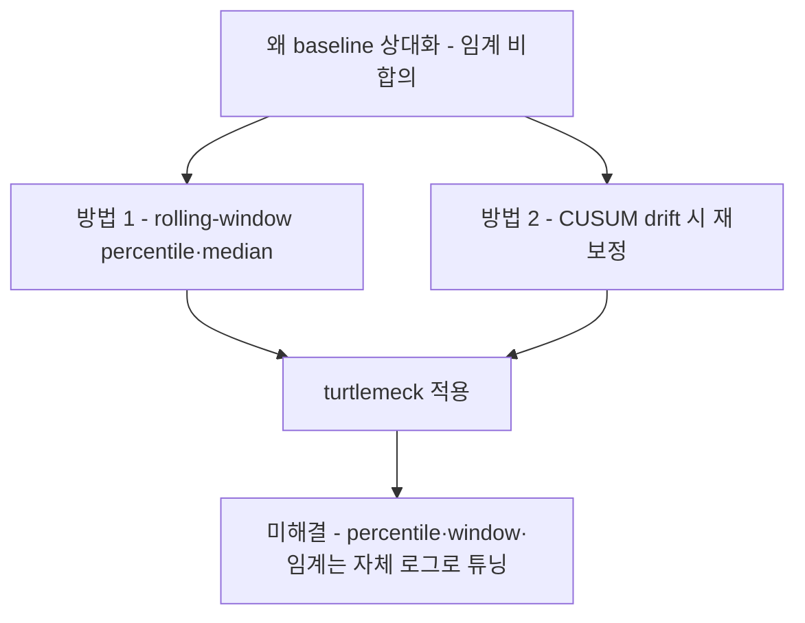

# 개인 baseline 보정·적응 전략

"baseline 상대화를 주신호로 쓰라"는 결론([cva-and-fhp-metrics.md §2](cva-and-fhp-metrics.md), [model-comparison.md §5](model-comparison.md))의 *방법론*(어떻게 baseline을 잡고 갱신하는가)을 채운다.

> ⚠️ **도메인 전이 경고(문서 전체에 적용).** 아래 근거의 핵심은 **자세/FHP가 아닌 인접 도메인**(연속혈당, wearable 활동인식)에서 나왔다. **방법론 원리는 전이되지만 구체 파라미터(percentile 값·window 크기·임계)는 전이되지 않는다.** turtlemeck은 이를 자체 로그 데이터로 튜닝해야 한다(→ §5).

## 요약 다이어그램

---

## 1. 왜 baseline 상대화인가 (복습)

- FHP 단일 임계는 **임상적으로 합의 없음**(증상↔무증상 중첩 — [cva-and-fhp-metrics.md §2](cva-and-fhp-metrics.md)).
- 앱이 출력하는 각은 임상 CVA가 아니라 **자체 정의 신호**이며, 체형·카메라 높이·좌석에 의존한다.
- → 절대 임계 단독보다 **개인별 좋은-자세 분포 대비 상대 변화(delta)**가 견고하다. 이 방향은 문헌으로 뒷받침된다(아래).

## 2. rolling-window percentile/median baseline (단 파라미터는 도메인 특수)

**검증된 원리:** 인구 임계 대신 **개인의 슬라이딩 윈도우 percentile(또는 median)**을 baseline으로 쓰는 것은 검증된 개인화 패턴이다.

- 1차 근거(Frontiers in Nutrition 2023, **PMC10425768**, n=219): 연속혈당(CGM)에서 최적 basal 추정기는 **"이전 24h의 40th percentile"**이었고, 7개 percentile × 5개 window를 시험해 *"robust and unbiased estimate"*가 되도록 의도적으로 보정했다(bias −0.02 mmol/L, r=0.86, p<0.01).
- **그러나 이 40th/24h 수치는 turtlemeck에 그대로 가져올 수 없다.** 혈당에는 보정 기준이 되는 **객관적 gold standard(공복혈당)**가 있지만, 자세/FHP에는 그런 개인 baseline 참조값이 **없다.** 전이되는 것은 *"인구 임계 대신 슬라이딩 윈도우 percentile/median을 쓰라"는 방법*뿐이다.
- **고변동(high-variability) 사용자에게는 percentile baseline도 noisy**하다. 이를 전제로 설계해야 한다(고변동 사용자엔 윈도우를 늘리거나 신뢰구간을 넓힘).

## 3. drift 감지 → 재보정 트리거: CUSUM detect-then-update

**검증된 원리:** 고정 타이머로 재보정하지 말고, 신호 분포가 *실제로* 바뀔 때만 재보정을 트리거한다.

- 1차 근거(**PMC12916610**, "Agile human activity recognition for wearable devices"): 엣지 디바이스에서 *"an efficient recursive CUSUM-based algorithm to precisely identify concept drift occurrences"*를 **detect-then-update** 패러다임으로 사용. turtlemeck과 인접한 온디바이스 wearable 모니터링 도메인.
- 교차확인: concept drift 감지의 교과서적 기법(MOA 프레임워크, ScienceDirect 개관, ACM 2020 CUSUM drift detector, MDPI Sensors 2025 하이퍼파라미터 튜닝)으로 독립 뒷받침.
- ⚠️ **한계:** CUSUM은 파라미터 민감(오경보↔감지 트레이드오프)하고 **급격한 drift엔 강하지만 점진적 drift엔 약하다** → 느린 윈도우 기반 보조 기제를 병행.

**turtlemeck 적용:** 책상/의자/모니터 높이 변경, 자세 습관 변화 등으로 분포가 *진짜* 이동할 때만 재보정을 권유/실행하고, 점진 drift는 느린 갱신으로 보완.

## 4. turtlemeck 적용 설계 (권고)

1. **baseline = 좋은-자세 구간의 슬라이딩 윈도우 percentile/median.** 단일 보정 스냅샷보다 분포 기반이 노이즈에 강하다.
2. **판정은 절대 임계가 아니라 baseline 대비 delta로.** 절대 임계는 미보정 시 *보수적 폴백*으로만(= [cva-and-fhp-metrics.md §2](cva-and-fhp-metrics.md), 현 `Tuning` 임계는 이 폴백 역할로 한정).
3. **고변동 사용자 방어:** percentile baseline도 noisy할 수 있으므로(§2), 분산이 큰 사용자는 윈도우를 넓히거나 delta 임계를 보수화.
4. **재보정은 CUSUM류 drift 트리거로**(§3) — 고정 타이머 대신 분포 이동 시점에. 점진 drift는 느린 윈도우로 보완.
5. **3D root/hip 상대량은 baseline 상대화 우선.** 근접 착석 시 root는 외삽일 수 있어(=[monocular-limits.md §5](monocular-limits.md)) 절대 위치보다 baseline 대비가 안전.

## 5. 미해결 — turtlemeck 자체 데이터로만 풀린다

문헌은 *방법*을 주지만 **자세 도메인에서 검증된 파라미터는 없다.** 다음은 자체 로그 데이터 연구가 필요하다(= [current-usage-and-gaps.md §4](../apple-body-pose/current-usage-and-gaps.md) 진단 계측과 연계):

- 어떤 **percentile·window 크기**가 자세 신호의 false-positive를 최소화하는가?
- 개인 baseline이 신뢰할 만해지는 **최소 표본 수(보정 시간·프레임 수)**는?
- CUSUM **임계·민감도** 튜닝(오경보↔감지)과 점진 drift 보조 기제.

> 즉 본 문서는 "확정 파라미터"가 아니라 **"검증된 방법론 + turtlemeck 적용 골격 + 측정해야 할 것"**이다. 추측 파라미터를 하드코딩하지 말 것.

---

## 참고 자료
- 개인화 percentile baseline (CGM, 40th/24h, r=0.86) — Frontiers in Nutrition 2023: <https://www.ncbi.nlm.nih.gov/pmc/articles/PMC10425768/>
- CUSUM detect-then-update concept drift (wearable, 온디바이스) — PMC12916610: <https://www.ncbi.nlm.nih.gov/pmc/articles/PMC12916610/>
- Concept drift 감지 개관 (ScienceDirect): <https://www.sciencedirect.com/topics/computer-science/concept-drift-detection>
- CUSUM 기반 drift detector (ACM 2020): <https://dl.acm.org/doi/10.1145/3421537.3421548>
- drift 감지 하이퍼파라미터 튜닝 (MDPI Sensors 2025): <https://pmc.ncbi.nlm.nih.gov/articles/PMC12074366/>
