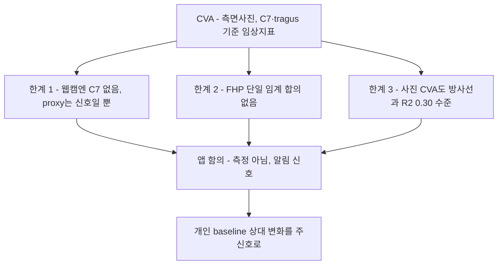

# CVA와 전방머리자세(FHP) 정량 지표 — 임상 근거

"앱이 출력하는 자세 점수를 임상 CVA와 동일시하면 안 된다"는 [README.md](README.md) 결론의 **근거**를 정리한다. 신뢰도 표기 **[high]** = 다수 1차 출처 일치.

## 요약 다이어그램

---

## 1. CVA(craniovertebral angle)의 표준 정의 [high]

CVA는 거북목/FHP의 **표준 정량 측정치**로, 다음 프로토콜이 문헌상 일관된다:

- **측면(sagittal/lateral) 사진**에서 측정.
- **C7 극돌기**와 **귀의 tragus**에 마커(9.5~20mm) 부착.
- 카메라를 시상면에 **직교 배치**(1.5~3m 거리).
- **C7을 지나는 수평선**과 **C7→tragus 선**이 이루는 각 = CVA.

> 측정 표준 자체에는 이견이 없다. 출처: PMC11042887, ResearchSquare rs-9627702, PMC11012400, Physiopedia.

### 앱 함의 — 결정적
- **C7과 tragus는 일반 웹캠 랜드마크에 직접 없다.** Vision/MediaPipe는 C7 극돌기를 점으로 주지 않는다. 앱은 shoulder midpoint/neck을 C7 *proxy*로 쓰는데, 이는 "자세 신호"일 뿐 **임상 CVA가 아니다.**
- **표준은 측면 사진**이다. Mac 내장 **정면** 카메라는 CVA의 측정 기하와 애초에 다르다(→ §3, [monocular-limits.md](monocular-limits.md)).

---

## 2. FHP 판정 임계값에는 단일 합의가 없다 [high]

연구 질문이 가정했던 "48° vs 50° vs 50–53° 중 하나의 합의"는 **문헌상 성립하지 않는다.**

- 문헌은 서로 다른 값을 **동시에** 사용: 정상 ~53°, FHP <50°, 중증 FHP <40° / <45° / <50°.
- PMC11042887(동료심사): *"severe FHP has been designated as CVAs < 40°, < 45°, or < 50°"*, *"CVA cutoff values ... vary amongst research studies."*
- ResearchSquare rs-9627702: 정상 53°/FHP <50°/중증 <44° 제시하면서 *"these CVA thresholds have not been consistently validated, and considerable overlap exists between symptomatic and asymptomatic populations."*
- **메타분석 PMC6942109**(Curr Rev Musculoskelet Med 2019): 15개 단면 연구를 검토했고, neck pain군과 asymptomatic군을 비교한 10개 연구에서 **성인 neck pain군은 FHP가 더 컸다**(MD 4.84°, 95% CI 0.14~9.54). 반면 청소년군은 유의하지 않았다(MD −1.05°, 95% CI −4.23~2.12).
  - 따라서 "FHP↔목통증 무관"으로 단정하면 과장이다. 정확한 진술은 **"연령이 중요한 교란요인이며, 성인에서는 관련이 보이나 청소년에서는 일관되지 않다"**이다. 이 문헌은 절대 임계 단독의 취약성을 뒷받침하지만, FHP와 목통증 사이에 차이가 *전혀* 없다는 근거는 아니다.

> 가장 흔히 인용되는 값은 **FHP cutoff ≈ 50°**, 정상 경계 ≈ 53°이나, 어느 것도 엄밀히 검증된 합의가 아니다.

### 앱 함의 — 결정적
- **절대 임계값을 코드에 하드코딩하지 말 것.** 현 앱의 `mediumAbsoluteBadAngle = 58°` 같은 고정 임계는 (a) 출처별 임계 비합의, (b) 증상↔무증상 중첩 때문에 근본적으로 취약하다.
  - ⚠️ **주의 — 앱의 58°와 임상 CVA <50°는 직접 비교 불가.** 앱 각도는 머리-어깨의 **수직 기준** 각(`atan2(dy,dx)`, 90°가 수직 정렬)으로 *작을수록* 전방머리. 임상 CVA는 C7-tragus와 **수평선** 기준 각이다. 둘 다 "작을수록 나쁨" 방향이지만 **기준선·정의가 달라 58 vs 50을 수치로 비교하면 오해**다. 앱 점수는 어디까지나 자체 정의된 신호.
- → **개인 baseline 대비 상대 변화**를 주신호로 쓰라는 방향이 문헌으로 뒷받침된다.
- **임계 *수치*만이 아니라 "단일 각도 하나로 가르는 방식" 자체가 부족하다.** JMIR Formative 2024(e55476)는 명시적 어깨 각을 실측해 FHP군·정상군 분포가 *"significant overlap"* 함을 보이고 *"the use of shoulder angles alone for the detection of FHP is not sufficient"* 라 결론, learned 다중-feature 방식으로 전환했다. → baseline 상대화에 더해 **다중 feature / body-frame 3D 기하**로 보강할 것(상세 [viewpoint-robust-geometry.md §5](viewpoint-robust-geometry.md#5-multi-feature--상대-판정--단일-각-임계)).

---

## 3. 외부(사진) CVA 자체의 한계 [high]

체외 카메라 측정은 "정답"이 아니다 — 사진 CVA조차 실제 경추 정렬과 약한 상관이다.

- Oakley/Harrison/Moustafa et al. (J. Clin. Med. 2024, PMC11012400), n=120, 사진 CVA vs 측면 경추 **방사선**:
  - CVA vs C2–C7 SVA: Spearman r = −0.549, **R² = 0.30**
  - CVA vs ARA C2–C7 lordosis: r = 0.524, **R² = 0.275** (둘 다 p<0.001)
  - 저자 결론: *"only 30% of the variance in radiographic FHP is shared with photographic FHP measures"*, *"The CVA cannot replace radiographically measured cervical lordosis."* (원문은 "cervical **lordosis**")
- 주의: 대상이 만성 근막통 환자(CVA≤50°)라 일반 사용자 일반화엔 한계. 단일 출처.

### 앱 함의
- **사진 CVA가 방사선 정렬의 30%만 설명**한다면, *웹캠 추정 proxy*는 그보다 더 약하다. 앱은 "정밀 측정"이 아니라 "**자세 습관 알림 신호**"라는 포지셔닝을 반드시 유지해야 한다(의료기기 아님). 현 면책고지 방향과 일치.

---

## 4. 요약 — 지표 설계 원칙

| 원칙 | 근거 |
|---|---|
| 앱 점수 ≠ 임상 CVA | C7/tragus 부재, proxy는 신호일 뿐 [§1] |
| 절대 임계 하드코딩 금지 | 임계 비합의·증상중첩 [§2] |
| baseline 상대 변화 우선 | 임계 미검증의 논리적 귀결 [§2] |
| "측정"이 아니라 "알림 신호" | 사진 CVA조차 R²≈0.30 [§3] |
| 측면 기하가 표준, 정면은 약함 | CVA는 sagittal 측정 [§1, §3] |

---

## 참고 자료
- CVA 정의·중증 임계 다양성 (Int J Exerc Sci): <https://pmc.ncbi.nlm.nih.gov/articles/PMC11042887/>
- CVA 임계 미검증·증상중첩 (preprint, 동료심사 메타로 독립 입증): <https://www.researchsquare.com/article/rs-9627702/v1>
- 목통증군↔무증상군 CVA 차이 메타분석: <https://pmc.ncbi.nlm.nih.gov/articles/PMC6942109/>
- 사진 CVA vs 방사선 정렬 R²≈0.30 (J Clin Med 2024): <https://pmc.ncbi.nlm.nih.gov/articles/PMC11012400/>
- Physiopedia, Forward Head Posture: <https://www.physio-pedia.com/Forward_Head_Posture>
