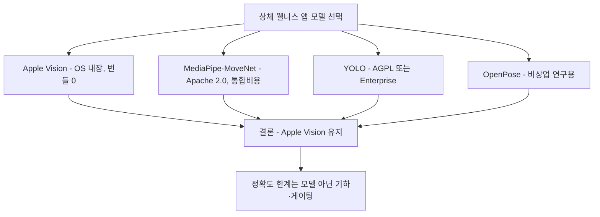

# 자세 추정 모델 비교 — 상체 추적 관점

상체 웰니스 앱 관점에서 자세 추정 모델을 비교한다([README.md](README.md)에 상세 모델 서술, Apple Vision 전용은 [`../apple-body-pose/`](../apple-body-pose/)). 신뢰도 **[high]** 1차 출처 일치 / **[미검증]** 1차 근거 미확보.

> ⚠️ **중요 한계:** **모델별 정량 벤치(mAP/FPS)는 1차 근거가 확보되지 않아 미확정**이다. 라이선스는 공식 모델 카드/라이선스 문서로 확인했다.

## 요약 다이어그램

---

## 1. 검증된 사실 (1차 출처 일치) [high]

- **BlazePose는 온디바이스 실시간**: 33 keypoint, Pixel 2(모바일 CPU)에서 **30+ FPS**. (arXiv:2006.10204)
- **BlazePose 토폴로지에 상체 지표 재료 포함**: nose/eyes/ears/mouth/shoulders(0–12). CVA류 머리-어깨 기하 가능.
- **BlazePose는 상체 부분 관측(upper-body-only)에서도 추적을 유지**: 가림 시뮬레이션 학습 + per-point visibility classifier로 하체 프레임 밖에서도 추적 가능. 원논문은 "upper-body-only"를 occlusion 처리 능력의 *한 사례*로 언급할 뿐, 독립된 "설계 기능/모드"로 정의하지는 않는다.
- **MediaPipe Pose Landmarker = BlazePose + GHUM 3D**: 33개 3D landmark(normalized + world).

→ "상체만 추적" 요구는 BlazePose류·Apple Vision 모두 상체 부분 관측에서 동작하므로 충족 가능하다. 둘 다 상체 부분 관측을 처리하며, BlazePose의 upper-body 동작은 occlusion 처리의 한 사례다.

---

## 2. 모델별 정성 비교 (상체 웰니스 앱 관점)

| 모델 | 상체 적합성 | 온디바이스(macOS) | 비고 |
|---|---|---|---|
| **Apple Vision** (`VNDetectHumanBodyPoseRequest`/3D) | 높음 — 머리/목/어깨 관절 제공, 3D **17 joints** | **최적** — OS 내장, 모델 번들 불필요, Neural Engine | 현 앱 채택. 2D macOS 11+, 3D **macOS 14+**(Apple Silicon 한정은 앱 선택, Apple 요건 아님) [Apple] |
| **MediaPipe BlazePose / Pose Landmarker** | 높음 — 33 3D, 상체 부분 관측 처리 가능 [high] | 가능하나 **통합비용** — 모델 번들·런타임·Swift 바인딩 부재 | cross-platform 원하면 후보 |
| **MoveNet** | 중 — 17 keypoint | TF Lite 파이프라인 필요 | latency(Lightning)/정확도(Thunder) 변형 |
| **YOLO-Pose** | 중~높음 | Core ML 변환 필요 | **라이선스 주의(아래)** |
| **OpenPose / HRNet** | 연구용 | 과중 — 메뉴바 앱엔 부적합 | 다인/서버 분석용 |

---

## 3. 라이선스 — 상용 배포 시 결정적

아래는 공식 출처로 재확인한 내용이다. 단, 실제 상용 배포 전에는 사용하는 모델 버전·패키징 형태·서비스 형태 기준으로 법무 검토가 필요하다.

- **Apple Vision**: OS 프레임워크. 별도 라이선스/번들 없음 → 배포 가장 단순. (현 앱에 유리)
- **MediaPipe**: GitHub 공식 LICENSE가 Apache License 2.0. 상용 앱에서 쓰더라도 notice/license 보존 등 Apache-2.0 조건을 따르면 된다.
- **MoveNet**: Google MoveNet.SinglePose model card가 Apache 2.0을 명시한다. TensorFlow 튜토리얼은 MoveNet이 17 keypoint 모델이며 Lightning/Thunder 변형과 30+ FPS 목표를 설명한다.
- **YOLO-Pose (Ultralytics)**: Ultralytics 공식 라이선스 페이지 기준, Ultralytics YOLO code/model/trained model은 AGPL-3.0 또는 Enterprise License 선택 구조다. closed-source 또는 상용 제품에 포함하려면 Enterprise License가 필요하다고 명시한다.
- **OpenPose**: CMU OpenPose LICENSE는 "academic or non-profit organization noncommercial research use only"를 전제로 한다. 따라서 **기본 라이선스로는 상용 메뉴바 앱에 부적합**하다. 단, CMU는 별도 상용 라이선스 문의 경로(FlintBox)를 두고 있어 "상용 완전 불가"가 아니라 "별도 협의 필요"가 정확하다.

→ **라이선스만으로도 Apple Vision 유지가 합리적.** 모델 교체를 검토한다면 라이선스를 1순위 게이트로.

---

## 4. 결론 — 현 앱(Apple Vision) 유지 타당성

| 기준 | 판단 |
|---|---|
| 상체 추적 | Vision으로 충분(머리/목/어깨) [코드 확인] |
| 온디바이스/프라이버시 | Vision 최적(OS 내장, 영상 비전송) |
| 통합 비용 | Vision 최저(번들 0) |
| 라이선스 | Vision 최단순 |
| 정확도 한계 | 모델 교체로 해결 안 됨 — 한계는 **모노큘러·정면 기하**(→ [monocular-limits.md](monocular-limits.md))와 **지표 설계**(→ [cva-and-fhp-metrics.md](cva-and-fhp-metrics.md))에 있음 |

**핵심:** 거북목 오판은 *모델 선택*보다 **(1) 정면 단일 카메라 기하의 구조적 한계, (2) 절대 임계 의존, (3) 3D confidence 게이팅 무력화**에서 비롯된다. 따라서 모델 교체보다 **지표·보정·게이팅 개선**이 우선이다.

---

## 5. 미해결 (다음 라운드)
- 모델별 **정량 벤치(mAP/FPS)** — 일부 수치는 확보했으나 **상호 비교 불가**: BlazePose는 저자 in-house PCK@0.2(Full AR 84.1 / Yoga 84.5), MovePose는 self-report COCO mAP 68.0, MoveNet은 FPS 위주(Lightning/Thunder 30+ FPS, Thunder ~12 FPS WebGL Pixel5)로 **측정 기준이 제각각**이라 모델 교체 결정 근거로는 부적합. 통일된 벤치(동일 데이터셋·동일 측정)는 여전히 추가 검증 필요.
- **개인 baseline 파라미터의 자세 도메인 근거** — rolling-window percentile/median + CUSUM drift 트리거의 인접 도메인 근거는 확보했지만, turtlemeck 자세 신호에 적용할 percentile·window·임계는 자체 로그로 검증해야 한다. → [baseline-calibration.md](baseline-calibration.md).

---

## 참고 자료
- BlazePose 원논문 (arXiv): <https://arxiv.org/abs/2006.10204>
- MediaPipe Pose Landmarker: <https://ai.google.dev/edge/mediapipe/solutions/vision/pose_landmarker>
- MediaPipe LICENSE (Apache-2.0): <https://github.com/google-ai-edge/mediapipe/blob/master/LICENSE>
- MoveNet (TF Hub): <https://www.tensorflow.org/hub/tutorials/movenet>
- MoveNet.SinglePose model card (Apache-2.0): <https://storage.googleapis.com/movenet/MoveNet.SinglePose%20Model%20Card.pdf>
- Apple Vision 3D body pose: <https://developer.apple.com/documentation/vision/vndetecthumanbodypose3drequest>
- Ultralytics license options: <https://www.ultralytics.com/license>
- OpenPose LICENSE: <https://github.com/CMU-Perceptual-Computing-Lab/openpose/blob/master/LICENSE>
