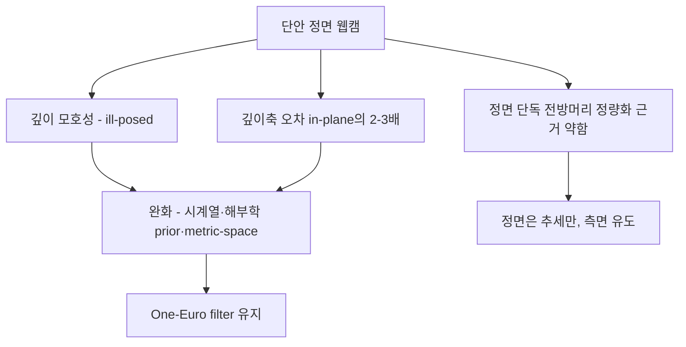

# 모노큘러 단일 카메라의 한계와 대응

`turtlemeck`은 Mac 내장 **단일 정면 웹캠**을 쓴다. 이 구성의 구조적 한계와 대응을 정리한다. 신뢰도 **[high]** = 다수 1차 출처 만장일치.

## 요약 다이어그램

---

## 1. 단안 3D pose는 본질적으로 ill-posed [high]

6개 독립 동료심사/arXiv 출처가 **만장일치**(13개 세부 claim이 모두 3-0):

- 3D→2D 투영에서 **깊이 정보가 손실**되어, 동일한 2D 점이 카메라 광선 위 여러 3D 점에 대응한다 → **여러 3D 자세가 같은 2D로 투영**된다(깊이 모호성).
- *"a single 2D image can correspond to multiple plausible 3D poses ... highly ill-posed"* (PMC12031093, Sensors 2025 서베이)
- *"the same 2D point relates to multiple 3D points along the ray of light"* (arXiv 2411.13026)
- 핵심 난제 둘: **깊이 모호성** + **(자기)가림(self-occlusion)**.

### 앱 함의
- 거북목의 1차 신호인 **머리 전방(깊이) 이동**은 정확히 이 "깊이축"에 놓인다 → 단안에서 가장 추정이 약한 차원.
- **깊이축 오차는 정량적으로 in-plane(좌우·상하) 오차의 약 2~3배다 [3차 신규, 3-0]** — Nature Sci Rep 2025(PMC12589393), 2.2M 프레임 vs 모션캡처: *"the mean absolute depth error is approximately two to three times greater than the mean absolute horizontal and vertical errors for all pose estimators."* 거북목의 1차 신호가 바로 이 *가장 부정확한* 깊이축에 놓이므로, G-1의 `confidence=0.9` 하드코딩은 **가장 불확실한 차원을 가장 신뢰하는** 셈이다. (단 이 2~3배 비율은 3~3.5m·4카메라 환경 측정치 — 책상 거리 단일 웹캠의 정확한 배율은 미검증이나, *비율의 존재*는 단안 기하의 일반 성질로 독립 교차확인됨.)
- `VNDetectHumanBodyPose3DRequest`의 3D 좌표는 **절대 측정값이 아니라 추정값**이다. 절대 거리/각을 신뢰하지 말고 **각도 기반 상대 측정 + 사전정보(prior) + 시간적 제약**으로 보강해야 한다.
- → Apple Vision 3D confidence 하드코딩 문제(`docs/algorithm/apple-body-pose/current-usage-and-gaps.md` G-1)가 더 위험한 이유: 가장 불확실한 차원을 "신뢰도 0.9"로 취급.

---

## 2. 정면 단일 카메라로 전방머리 정량화 — 강한 근거 없음 [3차 정정]

> ⚠️ **정정 (중요).** 이전 판본은 이 절을 "부분적으로만 가능"으로 적고 Molaeifar et al.(Work 2021)을 "정면 proxy가 3D CVA와 moderate 상관"이라는 **긍정 근거**로 인용했다. 그러나 3표 적대적 검증에서 이 논문 기반 두 핵심 주장 — (a) "정면 흉골-tragi 각이 시상면 CVA와 moderate 상관해 정면 proxy를 *검증*한다", (b) "정면 각 변화로 CVA(FHP 심각도) 변화를 예측할 수 있다" — 이 **모두 0-3으로 기각**됐다. 인용을 "moderate 상관(긍정 근거)"에서 **"정면 proxy 타당성은 반증/불충분"**으로 강등한다.

- Molaeifar et al. (2021, *Work* 68(4):1221-1227, PMID 33867381)이 moderate 상관을 *보고*한 것 자체는 사실이나(논문 서술), **그 상관이 정면 단독 FHP proxy의 사용 가능성을 입증하지는 않는다** — moderate 상관은 sagittal CVA 대체 근거가 못 된다.
- 더 결정적으로, **고정확 landmark FHP 탐지 결과(예: Extra Tree Classifier 82.4% acc / 80.6% sens / 85.5% spec)는 전부 측면(side/sagittal) 뷰에서 얻어졌다** [3차 신규, 3-0]. 변별 feature가 acromion 기준 시상면 각·거리(NAH/ENA/PAH/EAH 등)라 **정면 카메라로는 계산조차 안 된다.** 즉 **정면 단독 FHP 탐지에는 검증된 고정확 선례가 존재하지 않는다.** (Yang et al. 2023, BMC Med Inform Decis Mak, 10.1186/s12911-023-02285-2)
- 결론: **정면 단독 정량화는 강한 근거가 없고 sagittal CVA를 대체하지 못한다.** ("부분적으로 가능"이라는 이전 표현은 과한 긍정이었음.)

### 앱 함의 — 정면 정책 (반증으로 오히려 강화)
정책 *방향*(보수적·추세 only·측면 유도)은 이전과 동일하며, 반증이 이를 **더 강하게 뒷받침**한다.
1. 정면에서는 전방머리 **심각도 점수를 단정하지 말 것.** baseline 대비 **상대 악화 추세**만 약한 신호로.
2. 강한 확신이 없으면 `noEval`(초안 방침 유지).
3. **측면/3-4 측면 착석 또는 카메라 측면 배치 유도**가 정공법(측면이 CVA 표준 기하 — [cva-and-fhp-metrics.md](cva-and-fhp-metrics.md) §1).
4. 정면 2D 보조 지표(머리 bbox 스케일·코-어깨 수직비·어깨폭 정규화 head offset)는 **여전히 미검증 가설**이다 — 3차에서도 실효성을 뒷받침하는 출처가 없었다. "가능성 있는 신호"일 뿐 권고가 아니며, 채택 전 자체 데이터 검증이 필수다.

---

## 3. 미지의 카메라 배치 대응

- 카메라 위치(정면/좌/우)와 사용자 실제 시점이 어긋나면 분석 경로가 틀어진다(앱은 수동 "카메라 위치" 설정에 의존).
- 대응: **얼굴 yaw + 어깨 대칭/귀 가시성으로 viewpoint를 자동 분류**하고(앱의 `ViewpointClassifier`), viewpoint가 버스트 내에서 **안정될 때만** 판정. 자동 분류와 수동 설정이 충돌하면 자동 분류를 우선하거나 사용자에게 재확인.

---

## 4. One-Euro(1€) filter — 실시간 스무딩 표준 [high]

(1차 부록 A-5 미해결 항목을 **해소**)

- 원저자 논문(Casiez, Roussel, Vogel, **CHI 2012**, "A Simple Speed-based Low-pass Filter") 원문 검증:
  - *"first order low-pass filter with an adaptive cutoff frequency: at low speeds, a low cutoff stabilizes the signal by reducing jitter, but as speed increases, the cutoff is increased to reduce lag."*
- **속도 적응형 cutoff** → 저속에서 jitter 억제, 고속에서 lag 감소(jitter↔lag 트레이드오프를 명시 설계).
- MediaPipe 등이 채택하는 **사실상 표준**. 앱이 이미 One-Euro를 쓰는 것은 적절(`Detection/OneEuroFilter.swift`).
- **3차 갱신 — 대안 필터 대비 정량 우월 [3-0]:** 원 CHI 2012 벤치마크(약 1시간 커서 입력)에서 1€ filter가 **Kalman·이동평균·단일/이중 지수평활(EMA)보다 오차와 lag 모두에서 우수**했다 — *"1e filter has the smallest SEM (0.004) followed by ... the moving average and the Kalman filter (0.015) ... [1e] has less lag across all speed intervals."* 튜닝 규칙도 명확: *"if high speed lag is a problem, increase beta; if slow speed jitter is a problem, decrease fcmin."* → **Kalman/EMA로 교체할 이유가 없다.** 현 선택은 근거 있음.
- 주의: 2-파라미터(최소 cutoff `fcmin`, 속도계수 `beta`) 튜닝 세부는 이번 검증 범위 밖 — 원논문 참조해 신호 채널별로 별도 튜닝.
- ⚠️ **알림 *결정* 레이어는 스무딩과 별개의 미해결 공백이다 [3차 미해소].** hysteresis/debounce/state-machine 기반 알림 전이(false-positive 억제)는 3차에서도 직접 뒷받침 출처를 찾지 못했다 — per-channel 스무딩(1€)과 개념적으로 구분되며, HCI 알림/방해(interruption) 문헌·활동인식의 이중임계 hysteresis로 별도 조사가 필요하다.

---

## 5. 깊이 모호성 완화 — 검증된 수단 [3차 신규]

§1의 ill-posed 문제를 *해결*하진 못해도 *완화*하는, 교차검증된 3가지 수단. **모델 교체는 비목표**이므로 turtlemeck은 이들의 *원리*를 Apple Vision 출력 위에 적용한다.

1. **시계열 일관성(temporal consistency) [3-0].** 연속 프레임의 2D keypoint 시퀀스에 장기 시간 의존성을 모델링(dilated TCN, VideoPose3D)하면 단일 프레임으로는 풀 수 없는 깊이 모호성이 완화된다 — *"3D poses in video can be effectively estimated with a fully convolutional model based on dilated temporal convolutions over 2D keypoints"* (VideoPose3D, arXiv:1811.11742). 일관된 bone length·느린 관절 변화가 모호성을 줄인다(Springer AI Review 2024).
   - **turtlemeck 적용:** 이미 있는 **버스트 누적 + 1€ 스무딩이 이 원리의 경량 구현**이다. 새 모델 없이, 알림 승격 전에 *프레임 간 일관성*을 활용하면 된다.
2. **해부학적/생체역학 prior [3-0].** 관절 관계 GCN·bone-length 일관성 같은 신체 구조 제약을 넣으면 다수 독립 baseline에서 정확도가 향상된다(PMC12031093; ACCV 2024 Bone Length Adjustment, arXiv:2410.20731, MPJPE 46.8→45.2mm).
   - ⚠️ **한계:** 이 이득은 **전신·오프라인 lifting 벤치(~1–3mm)** 에서 나온 것으로, turtlemeck의 상체-only·근접착석·root 프레임밖 영역은 직접 검증되지 않았다 → **hard 제약이 아니라 soft sanity check**(어깨폭 범위·머리-어깨 거리 범위·좌우 대칭)로 outlier만 거르는 용도가 안전(= [`current-usage-and-gaps.md`](../apple-body-pose/current-usage-and-gaps.md) G-1 제안과 일치).
3. **metric-space heatmap (truncation 대응) [3-0].** 표준 image-aligned 2.5D heatmap은 **이미지 밖 관절을 못 잡아** truncated 입력에서 불완전·불안정해진다. 반면 좌표를 실세계 metric 공간으로 정의하면(MeTRAbs, arXiv:2007.07227) 프레임 밖 관절까지 복원한다 — *"2.5D methods cannot localize body joints outside the image boundaries ... [metric-space heatmaps] always return a complete pose ... even outside of the image boundaries (truncation)."*
   - **turtlemeck 적용 (핵심):** 근접 착석 시 Apple Vision의 **`root`(hip 중점)는 프레임 밖이라 *관측이 아니라 외삽*일 가능성이 높다.** 따라서 root/hip 상대량은 낮은 신뢰로 다루거나 baseline 상대화하고, **신뢰 관측되는 상체 관절(어깨·목·머리)에 지표를 anchor**하라(= G-2 강화). 단, Apple Vision이 내부적으로 image-aligned인지 metric-space heatmap인지는 **미문서** → root/hip 분산을 로깅해 경험적으로 확인 권장.

---

## 참고 자료
- 단안 3D ill-posedness 서베이 (Sensors 2025): <https://pmc.ncbi.nlm.nih.gov/articles/PMC12031093/>
- 깊이 모호성 (MDPI Appl. Sci. 2022): <https://www.mdpi.com/2076-3417/12/20/10591>
- Wehrbein et al., 정규화 흐름 3D pose (ICCV 2021): <https://arxiv.org/abs/2107.13788>
- 단안 깊이 모호성 (arXiv 2411.13026): <https://arxiv.org/html/2411.13026v1>
- 정면 proxy (Work 2021) — ⚠️ **3차 검증서 정면 proxy 타당성 주장 0-3 기각**, "moderate 상관"은 proxy 검증 근거가 아님: <https://journals.sagepub.com/doi/abs/10.3233/WOR-213451>
- One-Euro filter 원논문 (CHI 2012): <https://gery.casiez.net/publications/CHI2012-casiez.pdf>

### 추가 인용 출처
- 단안 깊이 오차 2~3배·임상 5도 미달 (Nature Sci Rep 2025): <https://pmc.ncbi.nlm.nih.gov/articles/PMC12589393/>
- 측면 뷰 landmark FHP 분류 82.4% (BMC Med Inform Decis Mak 2023): <https://bmcmedinformdecismak.biomedcentral.com/articles/10.1186/s12911-023-02285-2>
- VideoPose3D, dilated TCN 시계열 3D pose (CVPR 2019): <https://arxiv.org/abs/1811.11742>
- Bone Length Adjustment, 해부학 prior (ACCV 2024): <https://arxiv.org/abs/2410.20731>
- MeTRAbs metric-space heatmap, truncation 대응: <https://arxiv.org/abs/2007.07227>
