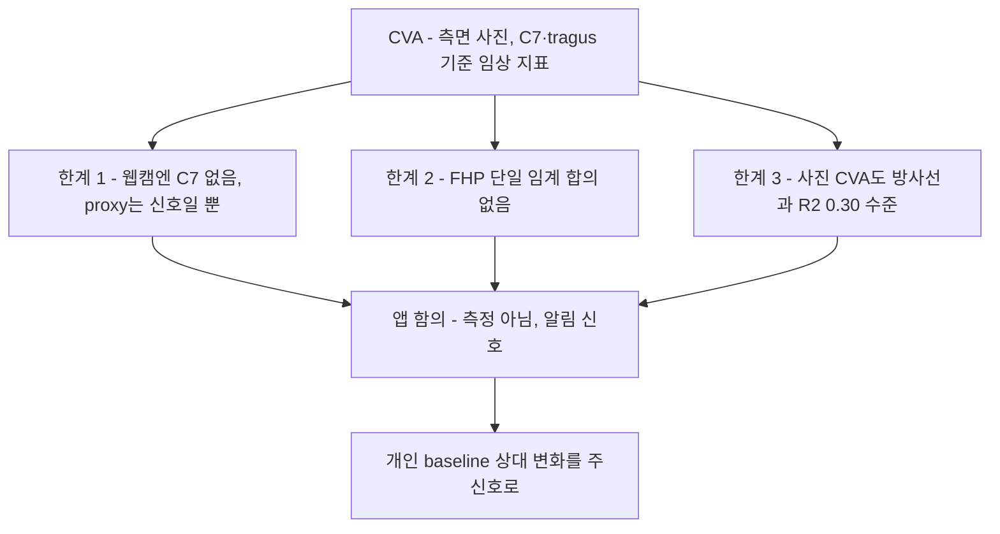

# 관련 연구 — CVA와 전방 머리 자세(FHP) 정량 지표

## 문서 요약

| 항목 | 내용 |
|---|---|
| 문서 유형 | 임상 지표 근거 조사 |
| 적용 상태 | 근거 문서 |
| 다루는 범위 | CVA 정의, FHP 임계 비합의, 사진 측정의 한계 |
| 제품 내 역할 | 앱 점수를 임상 CVA나 의료 진단값으로 해석하지 않도록 범위 제한 |

"앱이 출력하는 자세 점수를 임상 CVA와 동일시하면 안 된다"는 [README.md](README.md) 결론의 근거를 정리한다.

## 요약 다이어그램

---

## 1. CVA(craniovertebral angle)의 대표적인 사진 측정 정의

CVA는 거북목/FHP 연구에서 널리 쓰이는 사진 기반 정량 지표다. 다음 프로토콜이 흔히 사용된다.

- 측면(sagittal/lateral) 사진에서 측정.
- C7 극돌기와 귀의 tragus에 마커(9.5~20mm) 부착.
- 카메라를 시상면에 직교 배치(1.5~3m 거리).
- C7을 지나는 수평선과 C7→tragus 선이 이루는 각 = CVA.

> 이 문서에서 확인한 출처들은 위 정의와 측면 측정 방식을 공통으로 사용한다. 이 검색 결과를 모든 임상 프로토콜의 완전한 합의로 확대하지 않는다.

### 앱 적용
- C7과 tragus는 일반 웹캠 랜드마크에 직접 없다. Vision/MediaPipe는 C7 극돌기를 점으로 주지 않는다. 앱은 shoulder midpoint/neck을 C7 proxy로 쓰는데, 이는 "자세 신호"일 뿐 임상 CVA가 아니다.
- 확인한 사진 측정 연구는 측면 사진을 사용한다. Mac 내장 정면 카메라는 CVA의 측정 기하와 애초에 다르다([단안 카메라의 한계](related-monocular-limits.md)).

---

## 2. FHP 판정 임계값에는 단일 합의가 없다

문헌에서는 48°, 50°, 50–53° 중 하나의 임계값으로 합의되지 않았다.

- 문헌은 서로 다른 값을 동시에 사용: 정상 ~53°, FHP <50°, 중증 FHP <40° / <45° / <50°.
- PMC11042887은 중증 FHP 기준으로 40°, 45°, 50° 미만이 각각 사용됐으며 연구마다 CVA 임계값이 다르다고 정리한다.
- 메타분석 PMC6942109(Curr Rev Musculoskelet Med 2019): 15개 단면 연구를 검토했고, neck pain군과 asymptomatic군을 비교한 10개 연구에서 성인 neck pain군은 FHP가 더 컸다(MD 4.84°, 95% CI 0.14~9.54). 반면 청소년군은 유의하지 않았다(MD −1.05°, 95% CI −4.23~2.12).
  - 따라서 FHP와 목 통증이 무관하다고 단정하면 과장이다. 연령이 중요한 교란 요인이며, 성인에서는 관련이 보이나 청소년에서는 일관되지 않는다는 해석이 적절하다. 이 문헌은 절대 임계 단독의 취약성을 뒷받침하지만, FHP와 목 통증 사이에 차이가 전혀 없다는 근거는 아니다.

> 가장 흔히 인용되는 값은 FHP cutoff ≈ 50°, 정상 경계 ≈ 53°이나, 어느 것도 엄밀히 검증된 합의가 아니다.

### 제품 설계 함의
- 임상 CVA cutoff를 자체 머리-어깨 feature의 임계값으로 그대로 옮기지 않는다. 두 값은 기준점·기준선·관측 조건이 다르다.
- 출처별 임계 비합의와 증상↔무증상 중첩 때문에 개인 baseline 대비 상대 변화를 주신호로 둔다.
- 고정 절대 임계가 필요하다면 제품 도메인 라벨에서 목적·허용 오경보·coverage를 사전 정의해 별도로 검증한 보수적 fallback으로만 사용한다. “절대 임계는 언제나 금지”까지 문헌이 증명하는 것은 아니다.
- 확인한 연구에서는 특정 어깨 각 하나로 군을 가르기에 분포 중첩이 있다. JMIR Formative 2024(e55476)는 어깨 각 분포의 겹침 때문에 그 각 하나만으로 두 범주를 구분하기 어렵다고 설명한다. 이 결과가 모든 각도 feature의 단독 사용을 원리적으로 부정하지는 않지만, 목표 설계에서는 단일 보편 임계를 적용하지 않고 baseline·품질·다중 feature의 추가 이득을 검증한다([시점별 자세 기하](related-viewpoint-geometry.md)).

---

## 3. 외부(사진) CVA 자체의 한계

사진 CVA는 실제 경추 정렬을 완전히 대변하지 않는다.

- Oakley/Harrison/Moustafa et al. (J. Clin. Med. 2024, PMC11012400), n=120, 사진 CVA vs 측면 경추 방사선:
  - CVA vs C2–C7 SVA: Spearman r = −0.549, R² = 0.30
  - CVA vs ARA C2–C7 lordosis: r = 0.524, R² = 0.275 (둘 다 p<0.001)
  - 저자들은 사진 FHP와 방사선 FHP가 공유하는 분산이 30%에 불과하고, CVA가 방사선으로 측정한 경추 전만을 대체할 수 없다고 결론 내렸다.
- 주의: 대상이 만성 근막통 환자(CVA≤50°)라 일반 사용자 일반화엔 한계. 단일 출처.

### 앱 함의
- 사진 CVA와 방사선 지표의 `R²≈0.30`은 서로 다른 개념을 측정한다는 경고다. 이 값만으로 웹캠 proxy가 더 약하다는 수치적 상한을 추론할 수는 없지만, 웹캠 feature도 독립적인 준거 타당도 검증 없이 임상 측정값으로 표시해서는 안 된다. 제품 표현은 "정밀 측정"이 아니라 "자세 습관 알림 신호"로 제한한다.

---

## 4. 요약 — 지표 설계 원칙

| 원칙 | 근거 |
|---|---|
| 앱 점수 ≠ 임상 CVA | C7/tragus 부재, proxy는 신호일 뿐 [§1] |
| 임상 cutoff 직접 전용 금지 | 정의 차이·임계 비합의·증상 중첩 [§2] |
| baseline 상대 변화 우선 | 임계 미검증의 논리적 귀결 [§2] |
| "측정"이 아니라 "알림 신호" | 사진 CVA조차 R²≈0.30 [§3] |
| 확인한 CVA 사진 연구는 측면 기하 사용 | 정면 입력과 관측 조건이 다름 [§1, §3] |

---

## 참고 자료
- CVA 정의·중증 임계 다양성 (Int J Exerc Sci): <https://pmc.ncbi.nlm.nih.gov/articles/PMC11042887/>
- 비방사선 FHP 측정의 신뢰도·타당도 문헌고찰: <https://pmc.ncbi.nlm.nih.gov/articles/PMC9354067/>
- 목 통증군과 무증상군의 CVA 차이 메타분석: <https://pmc.ncbi.nlm.nih.gov/articles/PMC6942109/>
- 사진 CVA vs 방사선 정렬 R²≈0.30 (J Clin Med 2024): <https://pmc.ncbi.nlm.nih.gov/articles/PMC11012400/>
