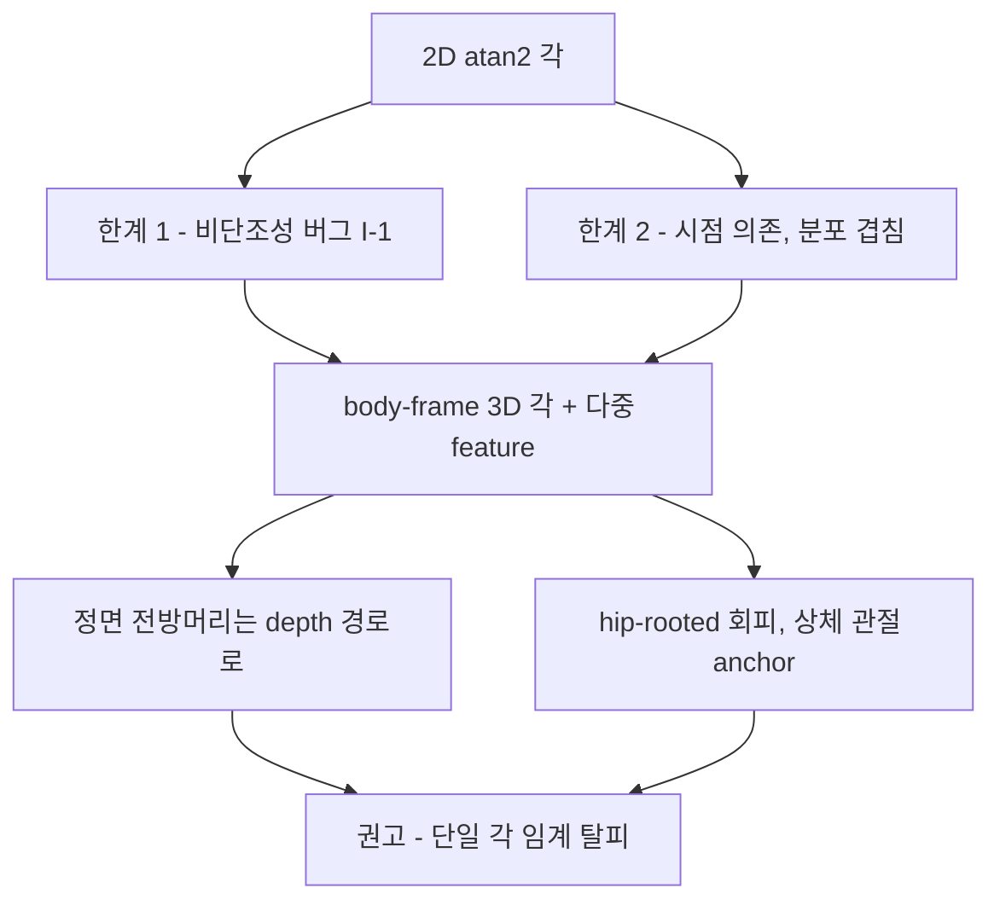

# 시점에 강건한 머리-몸통 각도 기하

자세 추정·판정의 *각도 기하* 정확도에 집중한다(알림 정책은 범위 밖). **핵심 결론: 단순 2D `atan2` 각은 버그를 고쳐도 부족하다 — 더 나은 기하는 body-frame 3D 각 + multi-feature 분리다.**

## 요약 다이어그램

---

## 1. 단순 2D `atan2` 각의 두 가지 한계

현 코드 `Geometry.cvaAngleDegrees`(2D `atan2(dy, dx)`)에는 한계가 둘이다.

1. **비단조성 (이미 알려진 버그).** `abs(dy)` 때문에 머리가 어깨선 위/아래 어느 쪽으로 멀어져도 각이 커진다 → 심한 거북목이 정상과 같은 점수. **수정 필요.**
2. **시점 의존 + 단일 임계로는 분포가 겹친다.** 비단조성을 고쳐도, *단일 2D 각도 임계*만으로 FHP와 정상을 가르기엔 부족하다.
   - JMIR Formative 2024(e55476)는 명시적 어깨 각을 실측한 결과 **FHP군과 정상군 분포가 "significant overlap"** 한다며 *"the use of shoulder angles alone for the detection of FHP is not sufficient"* 라고 결론, learned GCN으로 전환했다.
   - 원인: 2D 관절 기하는 본질적으로 **시점 의존**이다 — 같은 3D 자세도 카메라 상대 깊이·foreshortening에 따라 다른 2D 각으로 보인다(Pr-VIPE, arXiv:2010.13321; 3DPCNet, arXiv:2509.23455).

> **함의:** I-1을 고치는 것은 *필요*하지만 *충분*하지 않다. 단일 2D 각 임계 의존을 줄이고 (a) 3D body-frame 각, (b) 다중 feature/상대 판정으로 옮겨야 한다.

## 2. 시점 강건성의 정공법 — body-centered canonical frame

- **카메라 좌표가 아니라 신체 중심(body-centered) 정준 좌표에서 각을 계산**하는 것이 시점 강건성의 정공법이다.
  - 3DPCNet(arXiv:2509.23455, 2025): 단안 3D 추정기는 *"camera-centered skeletons, creating view-dependent kinematic signals"* 를 내므로, 예측된 SO(3) 회전으로 자세를 *"consistent, body-centered canonical frame"* 으로 정렬(평균 회전오차 >20° → 3.4°).
  - CanonPose(CVPR 2021, arXiv:2011.14679): 관측 2D 자세를 **시점 독립 정준 3D 자세 + 카메라 회전**으로 분해, 보정 불필요.
- ⚠️ **단순 hip/shoulder 정렬 정규화는 임의 회전에 강건하지 않다.** 3DPCNet 원문: *"Rule-based normalizations that align the hips or shoulders are not robust to arbitrary rotations."*
  - turtlemeck은 **고정 정면 웹캠**이라 임의 회전이 아닌 *제한된* 회전을 마주하지만, **가장 중요한 out-of-plane 변화(전방 머리/몸통 기울임 = FHP 그 자체)는 어깨폭/torso 정규화로 완전히 풀리지 않는다.** 정규화는 *도움은 되나 완전 해법은 아니다.*

> **turtlemeck 적용(모델 교체는 비목표):** 정준화 *모델*(3DPCNet/CanonPose)을 도입하는 게 아니라 그 *원리*를 차용한다 — Apple Vision **3D** 관절로 각을 계산하되, **카메라 좌표가 아니라 어깨선·torso로 정의한 body-frame에 투영**한다(= [monocular-limits.md §5](monocular-limits.md)의 상체 관절 anchor와 연결). hip-rooted 절대 좌표 의존은 피한다(§4).

## 3. 정면에서 전방머리를 보려면 *depth*가 필요하다

정면 단독 FHP의 핵심 난점은 전방 머리이동이 **카메라 깊이축**에 놓인다는 것이다([monocular-limits.md §1](monocular-limits.md)). 선행 연구가 이를 직접 보여준다.

- **정면 카메라로 성공한 유일한 FHP 시스템(Lee et al., *PreventFHP*, 2014 IEEE Haptics Symp)은 depth 카메라(Kinect)를 썼다.** *"depth image analysis was used to measure the distances between the camera and the forehead, as well as between the camera and the torso. The difference between these two distances was then used to determine the FHP status."* (메커니즘은 PreventFHP 원논문 Lee et al. 2014, IEEE Haptics Symp 귀속. 위 인용문은 후속 IMU 기반 논문 Park & Jung 2024[Appl. Sci. 14(19):9075]의 related-work **재인용**으로, 재인용 문장 자체의 verbatim은 미검증 — 1차 확인 시 원논문 직접 인용으로 교체 권장.)
- 즉 정면 FHP 탐지가 *작동*하려면 **명시적 depth**가 필요하다. 평범한 2D 정면 웹캠으로는 불가.
- **정면 2D landmark 비율(코-어깨 수직비, 머리 bbox 스케일)은 카메라 거리에 confound된다.** Noyes & Jenkins 2017(Cognition 165:97-104): 카메라-피사체 거리(0.32m vs 2.70m)가 *"동일 크기로 제시해도"* perspective 투영으로 얼굴 형상 비율을 체계적으로 왜곡한다.

> **turtlemeck 적용:** 정면에서의 전방머리 신호는 **Apple Vision 3D 경로**가 담당해야 한다(2D 정면 비율이 아니라). *PreventFHP의 "이마-몸통 depth 차이"* 는 Apple Vision 3D 관절(centerHead/topHead ↔ spine/어깨)로 재현 가능한 **이식 가능 feature 개념**이다 — 단 단안 3D 깊이 자체가 추정값이므로(=[monocular-limits.md §1](monocular-limits.md)) baseline 상대화·시간 누적이 전제.

## 4. Apple Vision 3D는 hip-rooted — 근접 착석에서 root가 불안정

- `VNDetectHumanBodyPose3DRequest`의 전체 17관절 프레임은 **hip(root)에 anchor**된다. `cameraOriginMatrix`는 *"A transform from the skeleton hip to the camera"* 이고, 관절 model position은 *"always relative to the skeleton's root joint at the center of the hip"* (WWDC23 111241).
- **데스크 근접 착석(상체-only crop)에서는 hip/root가 프레임 밖**일 때가 많다 → 모든 head-torso 각이 *가장 덜 관측된* hip 기준으로 계산되는 root 안정성 위험([`current-usage-and-gaps.md` G-2](../apple-body-pose/current-usage-and-gaps.md)와 [monocular-limits.md §5](monocular-limits.md) 강화).
- **Apple 3D API는 truncation/occlusion 처리·per-joint confidence를 문서화하지 않는다**; 3D 점 타입에 per-joint confidence가 **없다**(2D 요청에는 있음). 샘플은 *"all limbs of the subject visible"* 를 권장(full body가 문서화된 정상 경로).

> **turtlemeck 적용:** ① body-frame 각은 **관측 가능한 상체 관절(어깨/목/spine)에 정의**하고 hip에 의존하지 않는다. ② **2D 요청(per-joint confidence 존재)으로 3D 관절 신뢰를 cross-check 게이팅**하는 융합이 유망(= G-1 개선 방향에 1차 근거 보강). ③ truncation/occlusion 처리는 **자체 구현** 필요.

## 5. multi-feature / 상대 판정 > 단일 각 임계

- JMIR 2024가 단일 어깨 각에서 **learned GCN(다중 관절 feature)** 으로 전환한 것은 위 §1.2의 직접 귀결이다.
- **view-invariant embedding(Pr-VIPE, ECCV 2020/IJCV 2021)** 은 2D keypoint만으로 시점 불변 표현을 학습한다. 단 이는 **pose 유사도/검색**이지 *절대 FHP 각*이 아니며 multi-view 3D 학습데이터가 필요하다 → turtlemeck엔 *상대 good/bad 분류* 개념으로만 제한 적용.
- **채택하지 않는 것:** "정면 각으로 sagittal CVA를 *예측* 가능", "정면 얼굴이미지 FHP 분류기"(K-FACE, 0.69 acc). 정면 단독 정량/분류는 근거 약함.

## 6. turtlemeck 권고 요약

1. **I-1(2D 각 비단조성)은 고치되, 단일 2D 각 임계에 의존하지 말 것** — 분포 겹침으로 부족(§1).
2. **각은 3D body-frame(어깨/torso 기준)에 정의**, 카메라 좌표·hip-rooted 절대좌표 회피(§2, §4).
3. **정면 전방머리는 3D depth 경로로** — PreventFHP식 이마-몸통 depth 차이 feature, baseline 상대화 전제(§3).
4. **2D confidence로 3D 관절 게이팅 cross-check**, truncation 자체 처리(§4).
5. **단일 각 대신 다중 feature/상대 판정**(§5). 단 learned 모델 도입은 모델-교체 비목표와 충돌하므로 경량 휴리스틱 우선.

## 7. 미해결 (자체 실측 필요)

- hip이 프레임 밖일 때 `VNDetectHumanBodyPose3DRequest`의 실제 root 안정성·관절 신뢰 거동 — Apple 미문서, **온디바이스 실측 필요**(hip 보임/잘림 시 head-torso 각 안정성 비교).
- PreventFHP식 이마-몸통 depth 차이를 Apple 3D 관절만으로 데스크 거리(~50–70cm)에서 신뢰성 있게 복원 가능한가.
- 2D(confidence 있음)+3D(없음) 융합 게이팅이 self-occlusion·truncation 하에서 각 안정성을 실제로 개선하는가.
- 단일 대상 선택(max-bbox vs center vs confidence)·정면 미러링 처리(좌우 관절 swap) — 연구 근거 없음, 엔지니어링 결정+테스트 필요.

---

## 참고 자료
- 3DPCNet, body-centered canonical frame (arXiv 2025): <https://arxiv.org/html/2509.23455>
- CanonPose, 시점 독립 정준 자세 분해 (CVPR 2021): <https://arxiv.org/pdf/2011.14679>
- Pr-VIPE, 2D keypoint 시점 불변 임베딩 (ECCV 2020 / IJCV 2021): <https://arxiv.org/pdf/2010.13321>
- 단일 어깨 각의 분포 겹침 → GCN 전환 (JMIR Formative 2024): <https://formative.jmir.org/2024/1/e55476>
- 측면 뷰 landmark FHP 분류 82.4%·sagittal feature (BMC Med Inform Decis Mak 2023): <https://www.ncbi.nlm.nih.gov/pmc/articles/PMC10496156/>
- PreventFHP 원논문 (Lee et al., 2014 IEEE Haptics Symposium — Kinect depth로 이마-몸통 거리차 측정, 메커니즘 1차 출처): <https://ieeexplore.ieee.org/document/6775470/>
- 위 PreventFHP를 related-work로 요약한 후속 IMU 논문 (Park & Jung 2024, Appl. Sci. 14(19):9075 — 본문 인용문의 *재인용* 출처): <https://www.mdpi.com/2076-3417/14/19/9075>
- 카메라 거리에 따른 perspective 얼굴 왜곡 (Cognition 2017): <https://www.sciencedirect.com/science/article/abs/pii/S0010027717301294>
- Apple `VNHumanBodyPose3DObservation`·`cameraOriginMatrix` (hip→camera): <https://developer.apple.com/documentation/vision/vnhumanbodypose3dobservation>
- Apple WWDC23 "Explore 3D body pose" (root=hip, meters): <https://developer.apple.com/videos/play/wwdc2023/111241/>
