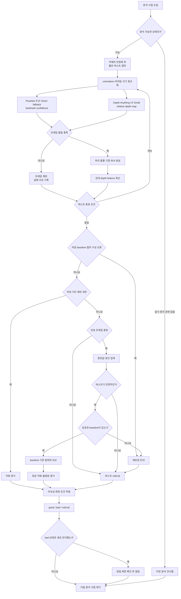
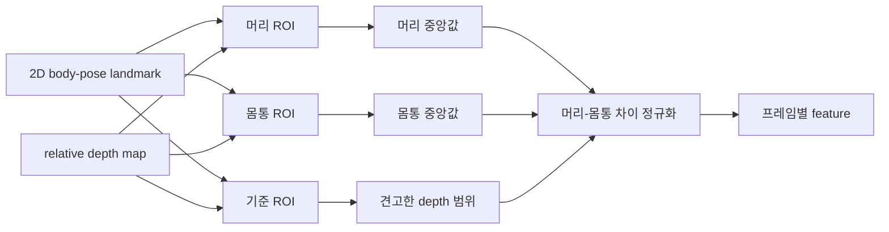
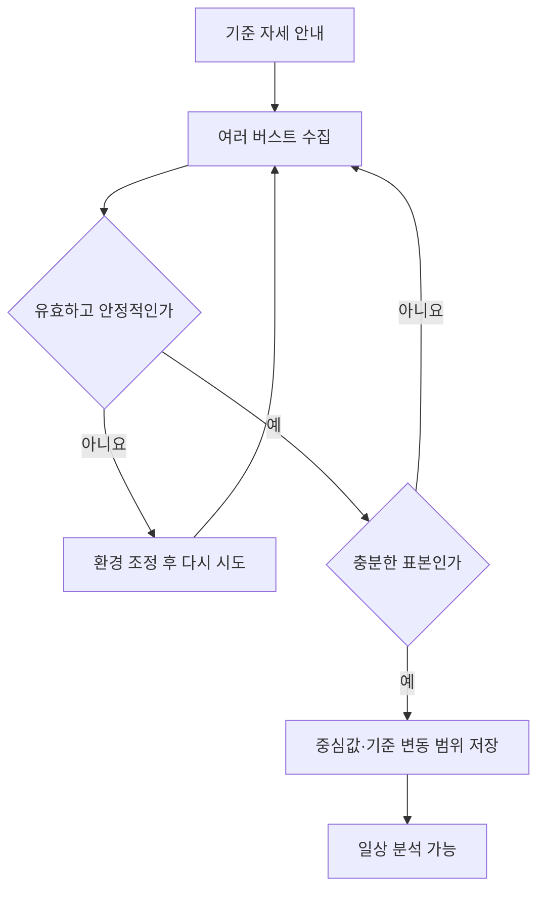
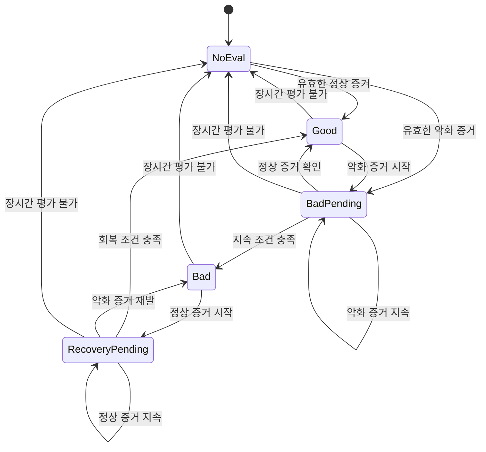

# 자세 분석 상세 워크플로우

> 상태: 확정된 목표 설계. 구현은 이 문서의 역할 분담, 판단 순서와 제외 범위를 따른다. 2026-07-21 제품 카메라 검증에서 Vision 단독 landmark 검출 실패가 확인되어, 같은 2D landmark 역할을 PoseNet 우선·Vision fallback으로 구현한다. 나머지 처리 순서는 바꾸지 않는다.

상위 개론은 [`../workflow.md`](../workflow.md)에서 관리한다. 이 문서는 이미지 캡처부터 feature 생성, baseline 비교, 상태 전이와 알림까지의 상세 로직을 정의한다.

수치 임계와 상태 전이 지속 시간은 제품 데이터 검증 전에는 확정하지 않는다. 분석 세션은 최소 20초 간격으로 실행하고, 한 세션에서는 3~5장의 짧은 이미지 버스트를 사용한다. 정규화 feature의 기준 ROI와 견고한 통계도 검증 대상이지만, 이 때문에 모델이나 전체 처리 경로를 다시 선택하지는 않는다.

prod와 debug의 출력 차이, local AI CLI 추가 경로는 [상위 개론의 실행 환경과 출력 구분](../workflow.md#실행-환경과-출력-구분)에서 다룬다. prod와 debug는 이 문서의 자세 분석 정보 전체를 동일하게 수집하고 같은 판정 조건을 사용한다. debug 설정은 화면과 파일의 출력 범위만 바꾸며 판정에 관여하지 않는다. local 환경에서는 같은 원본 이미지와 Depth V2 결과를 local AI CLI에도 전달하지만, 응답은 이 문서의 판정에 반영하지 않는다.

## 목표와 입력 조건

목표는 Mac 내장 RGB 카메라의 고정된 시점에서 사용자가 저장한 기준 자세와 머리·몸통 상대 신호가 충분히 다른 상태가 지속되는지 감지하는 것이다.

입력 조건은 다음과 같다.

- 한 명의 사용자가 카메라 앞에 앉은 상반신 장면
- 머리와 양쪽 어깨가 검출 가능하며 같은 baseline 촬영 시점을 유지하는 구도
- 하드웨어 depth가 없는 단일 RGB 이미지
- 연속 영상 전체가 아닌 주기적인 짧은 이미지 버스트

출력은 `good`, `bad`, `noEval` 세 상태다. 실제 이동 거리, 임상 CVA와 의료 진단값은 출력하지 않는다.

## 역할 분담

| 구성 | 입력 | 출력 | 담당 역할 | 담당하지 않는 역할 |
|---|---|---|---|---|
| 카메라 | 사용자와 촬영 환경 | RGB 이미지 버스트 | 같은 조건의 여러 프레임 수집 | 자세 판정 |
| PoseNet + Apple Vision 2D | RGB 프레임 | 상체 landmark와 관절별 confidence | PoseNet 우선·Vision fallback으로 대상 선택, 머리·몸통 ROI, 품질 조건 제공 | 전방 깊이와 최종 자세 |
| Depth Anything V2 Small | 같은 RGB 프레임 | relative inverse-depth map | 한 이미지 안의 상대적인 앞뒤 구조 | 신체 부위, 절대 거리, 자세 상태 |
| 자세 분석기 | landmark, depth map, baseline | 상대 자세 feature와 버스트 증거 | ROI 집계, 정규화, baseline 비교 | 의료 진단 |
| 시간 처리 | 버스트별 정상·악화 증거 | 확정 상태 | 지속성, 회복과 평가 불가 처리 | 원본 feature 생성 |
| 알림 정책 | 확정 상태와 최근 알림 시각 | 알림 또는 무동작 | 알림 시점과 반복 제한 | 자세 재판정 |

## 디버그 산출물 경로

모든 임시 산출물은 프로젝트 루트의 `debug/` 아래에만 생성한다. 한 번의 debug 분석 세션을 시작할 때 실행 기기의 현재 시각을 `yyyyMMdd-HHmmss` 형식으로 만들고, 일반 분석과 local AI CLI가 같은 값을 사용한다.

```text
debug/{timestamp}/
├── capture-1.png
├── overlay-1.png
├── depth-1.png
├── frame-1.json
└── session.json

debug/{timestamp}-local/
├── request.md
└── analysis.md
```

| 파일 | 내용 |
|---|---|
| `capture-{n}.png` | 카메라 원본 프레임 |
| `overlay-{n}.png` | 원본 위에 landmark와 ROI를 표시한 이미지 |
| `depth-{n}.png` | relative inverse depth를 확인하기 위한 시각화 이미지 |
| `frame-{n}.json` | 해당 프레임의 landmark, ROI, feature, 품질과 제외 사유 |
| `session.json` | 버스트 대표값, 분산, baseline delta, 이번 버스트의 평가 결과, 현재 제품 상태와 단계별 처리 시간 |
| `request.md` | local AI CLI에 전달한 요청문 |
| `analysis.md` | local AI CLI가 생성한 자세 분석 결과 |

프레임 번호 `{n}`은 캡처 순서에 따라 `1`부터 시작한다. 한 세션은 3~5장이므로 `001` 같은 자릿수 채우기를 사용하지 않는다. 같은 프레임에서 생성된 파일은 같은 번호를 사용한다.

local AI CLI에는 `debug/{timestamp}`의 `capture-{n}.png`와 `depth-{n}.png`를 입력으로 전달하고, 모든 결과를 `debug/{timestamp}-local`에 생성하도록 요청한다. CLI가 원본 입력 디렉토리를 수정하거나 `debug/` 밖에 임시 파일을 만들도록 요청하지 않는다.

`depth-{n}.png`는 분석기가 사용하는 raw depth map을 사람이 볼 수 있게 변환한 이미지다. local AI CLI 요청에는 이 이미지가 절대 거리나 cm 값이 아니며, 원본 이미지 안의 상대적인 앞뒤 구조만 나타낸다는 조건을 포함한다.

debug 산출물 생성은 공통 분석이 끝난 뒤 결과를 복사하는 출력 단계다. 디렉토리 생성, 파일 저장 또는 local AI CLI 실행이 실패해도 `good`, `bad`, `noEval`, 상태 전이와 알림 판정을 바꾸지 않는다.

## 전체 처리 순서



## 1. 분석 시작과 이미지 캡처

분석은 최소 20초 간격의 짧은 버스트 단위로 수행한다. 버스트는 단일 프레임의 우연한 오류를 줄이면서 카메라 사용 시간과 연산량을 제한한다.

1. 분석이 일시 정지되지 않았고 카메라 권한이 있는지 확인한다.
2. 카메라를 준비하고 노출과 초점이 안정되기 전 프레임은 제외한다.
3. 제한된 시간 동안 3~5장의 프레임을 수집한다.
4. 유효 프레임이 목표 수에 도달하거나 시간 예산이 끝나면 종료한다.
5. prod에서는 공통 분석이 끝나면 원본 프레임을 폐기한다. debug에서는 `debug/{timestamp}`에 원본을 출력한 뒤 메모리의 프레임을 해제한다. local AI CLI는 해당 디렉토리에 저장된 원본과 Depth V2 결과를 사용한다.

유효 프레임을 얻지 못해도 카메라를 계속 유지해서 억지로 판정하지 않는다. 해당 버스트를 `noEval`로 끝내고 다음 분석 시점에 다시 시도한다.

## 2. 프레임 정규화와 대상 선택

2D pose landmark와 depth map은 같은 원본 프레임에 대응해야 한다. 두 경로의 회전, 미러링, crop 또는 resize가 다르면 잘못된 위치의 depth를 읽게 된다.

- 입력 orientation을 실제 카메라 방향과 일치시킨다.
- 화면 표시용 미러링과 분석 좌표계를 분리한다.
- pose 좌표와 depth 좌표를 원본 이미지 좌표로 되돌릴 변환 정보를 유지한다.
- 한 버스트 안에서는 해상도와 crop 정책을 바꾸지 않는다.

한 버스트에서는 위치와 크기가 연속적인 같은 사람을 대상으로 사용한다. 다인 장면에서 배열의 첫 결과를 그대로 선택하지 않는다. 두 사람이 비슷한 크기로 잡혀 대상을 안정적으로 고를 수 없으면 `noEval`이다.

## 3. 프레임 품질 판단

품질 판단은 자세 feature를 만들기 전에 수행한다. 모델·depth 같은 기술적 품질 실패는 나쁜 자세로 해석하지 않는다. 다만 머리는 감지됐지만 가림·기울기·숙임·회전 때문에 정상 자세를 확인할 수 없는 프레임은 §12의 자세 기인 평가 불가 규칙을 적용한다.

| 확인 항목 | 통과 기준 | 실패 처리 |
|---|---|---|
| 대상 | 같은 사용자의 상반신을 구분할 수 있음 | 프레임 제외 |
| 필수 landmark | 머리 anchor와 양쪽 어깨가 필요한 confidence를 충족 | 프레임 제외 |
| 화면 범위 | 머리와 상부 몸통이 잘리지 않음 | 프레임 제외 |
| 촬영 관점 | 큰 측면 회전이나 심한 가림이 없음 | 프레임 제외 |
| ROI 기하 | 머리·몸통 ROI가 유효하고 과도하게 겹치지 않음 | 프레임 제외 |
| depth 유효성 | 충분한 유효 픽셀과 정규화 범위가 있음 | 프레임 제외 |

일부 프레임이 제외되어도 버스트에 충분한 유효 프레임이 남으면 분석을 계속한다. 제외가 많거나 유효 feature가 크게 흔들리면 버스트 전체를 `noEval`로 처리한다.

## 4. 2D body-pose landmark와 ROI

PoseNet을 우선 사용하고 유효한 상체를 만들 수 없을 때 Apple Vision 2D로 fallback한다. 두 추출기는 동일한 `PoseLandmarks` 계약을 제공하며 다음 세 역할만 담당한다.

1. 분석할 사용자의 상체 위치를 찾는다.
2. 머리와 양쪽 어깨를 기준으로 depth 값을 읽을 ROI를 만든다.
3. landmark confidence와 기하 조건으로 프레임의 평가 가능성을 판단한다.

머리 ROI는 nose, eyes, ears 중 품질을 충족하는 점들의 견고한 중심을 기준으로 만든다. 몸통 ROI는 양쪽 shoulder의 중점 기준, 어깨선 바로 아래(중점 + 0.05×shoulder width)의 얇은 상흉부 밴드(높이 0.20×shoulder width)로 만든다. 어깨 아래 깊은 위치는 노트북 내장 카메라의 전형 구도(어깨가 화면 하단)에서 항상 화면 밖으로 나가 프레임을 잃는다는 것이 2026-07-21~22 장치 검증으로 확인되어 채택하지 않는다. neck은 검출되면 진단 정보로 보존하지만 필수점은 아니다. ROI 크기는 고정 픽셀이 아니라 shoulder width 같은 신체 기준 길이에 비례시킨다.

ROI 경계에는 머리카락, 옷과 배경이 섞이기 쉽다. 가능한 경우 중심 영역을 사용하고, 화면 밖으로 나가거나 두 ROI가 과도하게 겹치면 해당 프레임을 제외한다. 보이지 않는 landmark를 고정 좌표나 임의의 대칭점으로 만들지 않는다.

2D 관절 자체를 `good` 또는 `bad` 판정으로 해석하지 않는다. 채택 근거는 [자세 모델 비교](pose-estimation/comparison.md), PoseNet의 모델·decoder 계약은 [Apple Core ML 샘플 PoseNet](apple-posenet/analysis.md), Vision fallback 계약은 [Apple Vision 2D](apple-body-pose/analysis.md)에서 관리한다.

## 5. Depth Anything V2 Small

Depth Anything V2 Small은 한 장의 RGB 이미지에서 픽셀별 relative inverse-depth map을 만든다. 이 지도는 한 이미지 안에서 픽셀이 상대적으로 앞이나 뒤에 있는 구조를 제공한다.

제공하지 않는 정보는 다음과 같다.

- 픽셀이 머리인지 몸통인지에 대한 신체 부위 정보
- 카메라에서 몇 cm 떨어졌는지에 대한 절대 거리
- 사용자의 자세가 좋은지 나쁜지에 대한 판정
- 프레임 사이에서 그대로 비교할 수 있는 고정 scale과 offset

자세 분석기는 2D pose landmark로 만든 ROI를 depth map에 정렬한 뒤 머리와 몸통 영역의 상대값만 읽는다. raw depth 숫자를 절대 임계와 직접 비교하지 않는다.

모델의 출력과 해석 경계는 [Depth Anything V2 로직 분석](../depth-estimation/depth-anything-v2/analysis.md)에서 관리한다.

## 6. 프레임별 relative depth feature

feature는 머리가 몸통보다 카메라 방향으로 얼마나 더 나와 있는지를 나타내는 상대 신호다.

1. 머리 ROI의 depth 중앙값을 구한다.
2. 몸통 ROI의 depth 중앙값을 구한다.
3. landmark 기반 기준 ROI에서 견고한 depth 범위를 구한다.
4. 머리와 몸통 중앙값의 차이를 기준 범위로 정규화한다.
5. 값이 커질수록 악화 방향이 되도록 near/far 방향을 통일한다.

```text
head = median(depth in head ROI)
torso = median(depth in torso ROI)
scale = robust depth range in reference ROI
feature = direction × (head - torso) / scale
```

머리와 몸통의 차이는 공통 offset을 제거한다. 이 차이를 기준 범위로 나누면 프레임별 scale 변화의 영향도 줄어든다. `scale`이 너무 작거나 불안정하면 값을 보정해서 만들지 않고 `noEval`로 처리한다.

near/far 방향은 모델 이름이나 시각화 색상으로 가정하지 않는다. 가까운 물체와 먼 물체가 명확한 고정 입력으로 먼저 확인한다.



이 정규화는 출력 전체의 scale·shift 변화만 완화한다. 머리카락 경계, 의복, 가림과 잘못된 ROI 같은 국소 오류는 해결하지 못한다. 후보 식과 대안 통계는 [relative depth feature 설계](../depth-estimation/etc/related-feature-design.md)에서 관리한다.

## 7. 버스트 대표값

프레임별 feature를 바로 자세 상태로 사용하지 않는다. 품질을 통과한 값만 모아 중앙값을 대표값으로 사용하고 변동 범위를 함께 기록한다.

- 유효 프레임 수와 전체 프레임 대비 비율
- feature 중앙값
- MAD 또는 IQR 기반 변동 범위
- 주요 프레임 제외 사유

중앙값은 일부 프레임의 잘못된 depth나 ROI가 전체 결과를 크게 움직이는 것을 줄인다. 유효 프레임이 부족하거나 분산이 크면 `noEval`이다.

비디오 depth나 별도 시간 필터를 먼저 추가하지 않는 근거는 [시계열·비디오 depth 조사](../depth-estimation/etc/related-temporal-video-depth.md)에서 관리한다.

## 8. 개인 baseline 보정

사용자 체형, 카메라 높이, 의자 위치와 촬영 거리의 영향을 줄이기 위해 사용자가 명시적으로 저장한 기준 자세 baseline을 사용한다. UI는 중립 자세를 안내하지만 알고리즘이 그 기준의 객관적 바름을 별도로 판정하거나 교정하지는 않는다.



baseline 생성 규칙은 다음과 같다.

1. 사용자가 명시적으로 시작한 기준 자세 보정 세션만 사용한다.
2. 일상 분석과 같은 품질·feature 계산 절차를 사용한다.
3. 품질을 통과한 여러 버스트의 중앙값과 변동 범위를 저장한다.
4. 분산이 크면 baseline을 저장하지 않고 다시 안내한다.
5. 일상에서 `good`으로 나온 결과를 baseline에 자동 추가하지 않는다.
6. 카메라, 해상도, 방향 또는 책상 배치가 바뀌면 재보정을 안내한다.

원본 이미지는 baseline에 저장하지 않는다. 상세 보정 원칙은 [개인 baseline 보정](pose-estimation/related-baseline-calibration.md)에서 관리한다.

## 9. baseline 대비 증거 생성

버스트 대표값과 baseline 중심값의 거리를 기준 자세로부터의 이탈로 해석한다.

```text
delta = burst feature - baseline center
distance = abs(delta)
```

signed `delta`는 머리-몸통 상대 깊이가 어느 방향으로 이동했는지 진단하는 데 보존한다. 최종 판정은 `distance`를 사용한다. 따라서 사용자가 객관적으로 비정상인 자세를 기준으로 저장했다면, 객관적으로 정상인 자세라도 그 기준에서 충분히 멀어 `bad`가 될 수 있다. 기준 자세의 객관적 품질보다 사용자가 저장한 기준과의 유사성이 우선한다.

판정에는 악화 진입 경계와 정상 복귀 경계를 분리한다. 하나의 경계만 사용할 때 발생하는 상태 반복 전환을 줄이기 위한 최소한의 hysteresis다.

| 조건 | 버스트 증거 | 의미 |
|---|---|---|
| 품질 부족 또는 분산 과다 | `noEval` | 판단 근거 부족 |
| baseline 기준 범위 안 | 정상 증거 | 사용자가 저장한 기준 자세와 유사함 |
| 이탈 경계를 넘음 | 악화 증거 | 기준 자세와 충분히 다름 |
| 두 경계 사이 | 불충분 증거 | 상태를 바꾸기에는 차이가 작음 |

경계는 임상 각도나 다른 논문의 수치를 가져오지 않는다. 제품 촬영 환경의 라벨 데이터에서 오경보, 미탐, 판정 지연과 `noEval` 비율을 함께 측정해 정한다.

## 10. 시간 처리와 상태 전이

한 번의 악화 증거는 `bad`가 아니라 악화 후보다. 다음 정기 점검도 악화일 때 `bad`로 전이한다. 예를 들어 점검 주기가 60초이면 현재 캡처 시작 시각과 60초 뒤 정기 캡처가 모두 악화여야 한다. 처리 완료 시각부터 다시 60초를 세지 않으며, 악화 확인을 위한 별도 타이머나 즉시 재촬영도 실행하지 않는다. 정상 복귀도 여러 번 확인한다.

이번 버스트의 평가 결과와 사용자에게 유지되는 제품 상태는 구분한다. 한 버스트가 `noEval`이면 정상·악화 증거에 포함하지 않지만, 직전 제품 상태를 즉시 바꾸지도 않는다. 평가 불가가 오래 이어질 때만 제품 상태를 `noEval`로 전환한다.



- `noEval`을 `good`으로 계산하지 않는다.
- 한 번의 `noEval`로 직전 상태를 즉시 뒤집지는 않는다.
- 평가 불가 상태가 오래 이어지면 오래된 판정을 유지하지 않고 `noEval`로 전환한다.
- 경계 사이의 불충분 증거는 악화·회복 연속 횟수에 포함하지 않는다.
- 악화 후보와 회복 후보는 내부 상태이며 사용자에게는 확정 상태만 표시한다.

## 11. 결과와 알림

| 결과 | 사용자 의미 | 알림 처리 |
|---|---|---|
| `good` | 사용자가 저장한 baseline 기준 범위의 자세가 확인됨 | 알림 없음 |
| `bad` | 사용자가 저장한 baseline에서 충분히 벗어난 상태가 지속됨 | 새로 전이했을 때만 알림 후보 |
| `noEval` | 사람, ROI, depth, 안정성 또는 baseline이 부족함 | 자세 알림 없음 |

알림 정책은 자세 분석과 분리한다. `bad`가 유지되는 동안 매 분석마다 반복 알림을 보내지 않고, 상태 전이와 최소 알림 간격을 함께 확인한다. 회복 알림은 보내지 않는다.

## 12. 실패 처리

사람이 없어 판정이 불가능한 경우와, 머리는 감지되지만 자세 때문에 정상을 확인할 수 없는 경우를 구분한다. 후자(턱 괴기 등 팔에 가려 어깨 신뢰도가 무너짐, 머리가 어깨선에 비정상적으로 가까움, 큰 회전, 필수 landmark 잘림)는 프레임을 feature 계산에서 제외하되, 그런 프레임이 버스트의 과반이면 `noEval`이 아니라 악화 증거로 처리한다. 이 악화 판정은 baseline 비교를 요구하지 않는다(다만 baseline이 없으면 제품 상태는 재보정 안내가 우선한다). 최소 캡처 수를 확보한 버스트에서 저장된 baseline 자체가 무효하거나 현재 캡처 구성과 다르다는 독립적인 오류가 확인되면 프레임 증거보다 먼저 `noEval`과 재보정을 반환한다. depth 품질·기하 실패는 자세 기인이 아니므로 악화 증거로 승격하지 않는다. 사용자 크기에 못 미치는 원거리 인물의 머리는 대상이 아니므로 사람 없음으로 처리한다.

| 상황 | 처리 |
|---|---|
| 사람이 없음(원거리 배경 인물 포함) | `noEval`, 알림 없음 |
| 대상 사용자를 구분할 수 없음 | `noEval` |
| 머리는 있으나 어깨 신뢰도 미달(턱 괴기 등 가림) | 프레임 제외, 버스트 과반 시 악화 증거 |
| 머리가 어깨선에 비정상적으로 가까움(기울기·숙임) | 프레임 제외, 버스트 과반 시 악화 증거 |
| 머리 또는 양쪽 어깨가 잘림 | 프레임 제외, 버스트 과반 시 악화 증거 |
| 큰 회전 | 프레임 제외, 버스트 과반 시 악화 증거 — 다른 알고리즘으로 전환하지 않음 |
| depth map과 landmark 좌표 불일치 | 분석 중단, `noEval` |
| ROI 기하 오류·유효 depth 픽셀·기준 ROI depth 범위 부족 | 프레임 제외, `noEval` (자세 증거 아님) |
| 버스트 분산 과다 | `noEval` |
| baseline 없음·수치 또는 version 무효·불안정·촬영 조건 변경 | 재보정 안내 후 `noEval` |
| 보정 시점과 구도가 다름(어깨 기준 위치·폭 이탈 — 리드 각도·책상 배치 변경) | 재보정 안내 후 `noEval` |
| feature 정의(ROI 기하) 변경 | 저장된 baseline 무효화 후 재보정 안내 |
| 자세 때문에 평가 불가한 프레임이 과반인 보정 시도 | 보정 거부, 바른 자세 안내(구도 안내와 구분) |
| 모델 실행 실패 | 해당 버스트 `noEval`, 값을 추정해 채우지 않음 |

## 13. 현재 사용하지 않는 것

- Apple Vision 3D body pose와 Mac 카메라의 하드웨어 depth 가정
- Depth Pro, metric depth 모델과 video depth 모델
- MediaPipe, MoveNet, OpenPose와 YOLO-Pose
- 정면·측면·3/4 시점별 자동 알고리즘 라우팅
- 얼굴 추정, 사람 mask와 별도 segmentation 모델
- 여러 자세 feature의 가중 합산
- 일상 결과를 사용한 baseline 자동 갱신
- 절대 cm, 임상 CVA와 의료 진단 표현

현재 경로가 충분한 제품 데이터에서도 요구 성능을 충족하지 못한 경우에만 실패 원인을 특정하고 필요한 구성 하나를 별도 기획으로 검토한다.

## 14. 검증 항목

| 구간 | 핵심 검증 |
|---|---|
| 캡처 | 노출·초점 안정화 시간, 버스트 길이, 유효 프레임 비율 |
| PoseNet·Vision 2D | landmark 반복성, fallback 동작, 대상 선택 안정성, ROI 경계 오류 |
| Depth Anything V2 | near/far 방향, 동일 자세 반복성, 머리·몸통 국소 depth 오류 |
| feature | 중립·악화 자세 분리도, 기준 ROI와 정규화 방식의 안정성 |
| baseline | 같은 날·다른 날 재현성, 환경 변경 영향, 재보정 조건 |
| 시간 처리 | 오경보·미탐·알림 지연, `noEval` 연속 처리 |
| 제품 성능 | 전체 지연, 발열, 배터리와 카메라 점유 시간 |

최종 평가는 정확도 하나만 보지 않는다. 오경보율, 미탐률, `noEval` 비율, 판정 지연과 사용자별 편차를 함께 기록한다.

## 관련 문서

- 개론: [`../workflow.md`](../workflow.md)
- 2D pose 모델 비교: [pose-estimation/comparison.md](pose-estimation/comparison.md)
- Apple Core ML 샘플 PoseNet: [apple-posenet/analysis.md](apple-posenet/analysis.md)
- Apple Vision 2D: [apple-body-pose/analysis.md](apple-body-pose/analysis.md)
- Apple Vision 3D 제외 근거: [apple-body-pose/related-vision-3d.md](apple-body-pose/related-vision-3d.md)
- 자세 분석 원리: [pose-estimation/analysis.md](pose-estimation/analysis.md)
- Depth Anything V2: [../depth-estimation/depth-anything-v2/analysis.md](../depth-estimation/depth-anything-v2/analysis.md)
- relative depth feature: [../depth-estimation/etc/related-feature-design.md](../depth-estimation/etc/related-feature-design.md)
- 개인 baseline: [pose-estimation/related-baseline-calibration.md](pose-estimation/related-baseline-calibration.md)
- 자세 적용 타당성: [../depth-estimation/etc/related-posture-feasibility.md](../depth-estimation/etc/related-posture-feasibility.md)
