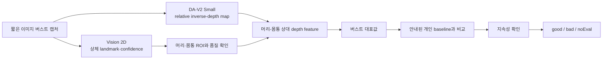

# 자세 분석 확정 워크플로우

> 상태: 확정. 구현은 이 문서의 역할 분담과 제외 범위를 따른다.

## 한 줄 요약

Apple Vision 2D로 사람과 상체 위치를 찾고, Depth Anything V2 Small로 상대 깊이를 얻은 뒤, 프로젝트 자세 분석기가 개인 기준 대비 변화를 시간적으로 확인해 판정한다.

## 처리 흐름

## 역할 분담

| 구성 | 담당 역할 | 담당하지 않는 역할 |
|---|---|---|
| Apple Vision 2D | 사람·상체 landmark, confidence, 머리·몸통 ROI의 기준점 | 전방 깊이 측정, 최종 자세 판정 |
| Depth Anything V2 Small | 한 이미지 안의 relative inverse-depth map 생성 | 자세 landmark, 절대 거리(cm), `good`·`bad` 판정 |
| 프로젝트 자세 분석기 | ROI depth 집계, 개인 baseline 비교, 품질·시간 조건 적용, 최종 상태 결정 | 임상 CVA나 의료 진단값 산출 |

## 판정 원칙

1. DA-V2 값은 절대 거리가 아니라 scale·shift가 정해지지 않은 상대값으로 다룬다.
2. 머리와 몸통 ROI는 Vision 2D landmark로 정의하고, 영역의 대표값은 평균보다 median 같은 견고한 통계를 우선한다.
3. 한 프레임이 아니라 짧은 버스트의 대표값을 사용한다.
4. 사용자가 안내에 따라 만든 중립 자세 baseline과 비교한다. 일상 판정 결과로 baseline을 자동 갱신하지 않는다.
5. 입력·landmark·ROI·depth 품질이 부족하면 `noEval`이다. `noEval`을 `good`으로 처리하지 않는다.
6. `bad`는 변화가 일정 시간 지속될 때만 확정한다.

## 현재 사용하지 않는 것

- Apple Vision 3D body pose와 Mac 카메라의 하드웨어 depth 가정
- Depth Pro, metric depth 모델, video depth 모델
- MediaPipe, MoveNet, OpenPose, YOLO-Pose 등 별도 pose 모델
- 정면·측면·3/4 시점별 자동 알고리즘 라우팅
- CUSUM·rolling percentile 기반 baseline 자동 갱신
- 절대 cm, 임상 CVA, 의료 진단 표현

## 구현 전에 검증할 것

- 동일 자세에서 Vision 2D landmark와 머리·몸통 ROI가 충분히 반복되는가
- DA-V2의 near/far 방향과 ROI 상대값이 고정 입력에서 일관적인가
- 선택한 상대 depth feature가 중립 자세와 악화 자세를 분리하는가
- 버스트 크기와 판정 지속 시간이 오경보를 줄이면서 지연을 과도하게 늘리지 않는가
- 지원 Mac에서 전체 처리 지연·발열·배터리 사용이 허용 범위인가

수치 임계와 버스트 프레임 수는 리서치 문헌에서 가져와 고정하지 않는다. 제품 데이터의 사전 정의된 평가 지표로 결정한다.
