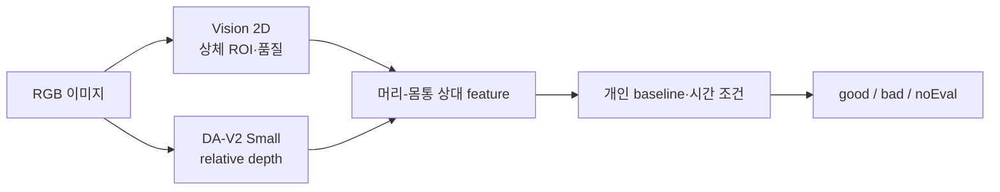

# AI 깊이 추정 기반 자세 판단 — 리서치 인덱스

> 이 문서는 참고용 리서치이며, 현재 확정된 제품 플로우를 직접 정의하거나 구현 기준으로 활용하지 않습니다.

## 문서 요약

| 항목 | 내용 |
|---|---|
| 문서 유형 | 단안 깊이 추정 리서치 인덱스 |
| 적용 상태 | DA-V2 Small 채택, 다른 depth 모델·시계열 방식은 미채택 |
| 입력 | Mac 내장 카메라의 단일 RGB 이미지 |
| 출력 | relative inverse-depth map과 자세 분석용 상대 feature |
| 제품 내 역할 | depth 기술별 사실·한계·적용 상태 안내 |

## 핵심 결론

Depth Anything V2 Small은 깊이 추정 모델이지 자세 추정 또는 자세 판정 모델이 아니다.

- Apple Vision 2D: 사람·상체 landmark, 머리·몸통 ROI, 품질 값
- DA-V2 Small: scale·shift가 정해지지 않은 relative inverse depth
- 프로젝트 자세 분석기: ROI depth 집계, 개인 baseline 비교, 시간 조건, 최종 `good`·`bad`·`noEval`

Core ML은 DA-V2를 Mac에서 실행하는 형식이다. Apple Vision 3D, 하드웨어 depth, Depth Pro, metric depth 모델, video depth 모델은 현재 플로우에 사용하지 않는다.

## 요약 플로우

## 기술별 적용 상태

| 문서 | 상태 | 결론 |
|---|---|---|
| [depth-anything-v2/](depth-anything-v2/README.md) | 채택 | Apple 배포 Core ML Small 모델로 relative depth 생성 |
| [apple-vision-depth/](apple-vision-depth/README.md) | 근거 문서 | Vision 2D body pose 채택, Core ML은 실행 형식, measured depth·Vision 3D 제외 |
| [apple-depth-pro/](apple-depth-pro/README.md) | 미채택 | metric 출력은 유용하지만 현재 모델·실행 경로를 변경하지 않음 |
| [metric-depth-models/](metric-depth-models/README.md) | 미채택 | intrinsic·라이선스·배포 의존성이 있고 현재 필요 없음 |
| [etc/related-feature-design.md](etc/related-feature-design.md) | 검증 필요 | DA-V2 출력에서 상대 자세 feature를 만드는 설계 가설 |
| [etc/related-posture-feasibility.md](etc/related-posture-feasibility.md) | 근거 문서 | 일반 depth 지표와 자세 판정 정확도의 차이 |
| [etc/related-temporal-video-depth.md](etc/related-temporal-video-depth.md) | 미채택 | video depth 대신 먼저 짧은 버스트 대표값 검증 |

`etc/`는 독립 모델 디렉토리가 아니라 여러 방식에 걸친 feature·타당성·시계열 연구를 모으는 예외 디렉토리다. 각 문서는 `related-<topic>.md` 이름을 사용한다.

## 공식 자료로 확인한 사실

1. DA-V2 기본 모델은 affine-invariant inverse depth를 출력한다. 절대 cm로 해석할 수 없다.
2. 별도 metric checkpoint는 meter 단위 출력을 제공하지만, Apple이 배포한 Core ML Small 패키지는 기본 relative 모델이다.
3. Apple Core ML 모델 카드 기준 Small F16은 24.8M parameters, 49.8MB이며 M1 Max 32.80ms, M3 Max 24.58ms로 측정됐다. 이는 모델 단독·해당 기기의 수치다.
4. Small은 Apache-2.0이고 Base/Large/Giant는 CC-BY-NC-4.0이다.
5. 공개 장면 depth 지표는 근거리 상체의 머리-몸통 국소 차이나 거북목 판정 정확도를 직접 검증하지 않는다.

## 과장하지 말아야 할 표현

- depth 논문의 δ1 0.95~0.98을 “거북목 정확도 95%”로 표현하지 않는다.
- relative depth를 실제 거리(cm), 임상 CVA 또는 의료 진단값으로 변환하지 않는다.
- Vision 3D를 실행 불가능하다고 쓰지 않는다. RGB에서 실행 가능하지만 현재 요구에 맞는 dense/measured depth가 아니어서 제외한 것이다.
- `AVCaptureDepthDataOutput`은 네이티브 macOS 가용 API가 아니지만 `AVDepthData` 컨테이너는 macOS에도 존재한다. 이를 섞어 “macOS의 모든 depth 자료형이 없다”거나 “RGB 입력이 measured depth를 준다”고 쓰지 않는다.

## 현재 남은 검증

- Vision 2D로 정의한 머리·몸통 ROI의 반복성
- DA-V2 near/far 방향과 relative-depth feature의 안정성
- 중립 자세와 악화 자세의 분리도
- 버스트 대표값·임계·지속 시간에 따른 오경보와 지연
- 지원 Mac에서 전체 파이프라인의 지연·발열·배터리 사용

확정 처리 흐름은 [`../algorithm/posture-analysis-workflow.md`](../algorithm/posture-analysis-workflow.md)를 따른다.

## 핵심 자료

- Depth Anything V2 공식 저장소: <https://github.com/DepthAnything/Depth-Anything-V2>
- Depth Anything V2 논문: <https://arxiv.org/abs/2406.09414>
- Apple Core ML DA-V2 Small: <https://huggingface.co/apple/coreml-depth-anything-v2-small>
- Apple Vision 3D·person segmentation 설명: <https://developer.apple.com/videos/play/wwdc2023/111241/>
- AVFoundation depth output: <https://developer.apple.com/documentation/avfoundation/avcapturedepthdataoutput>
