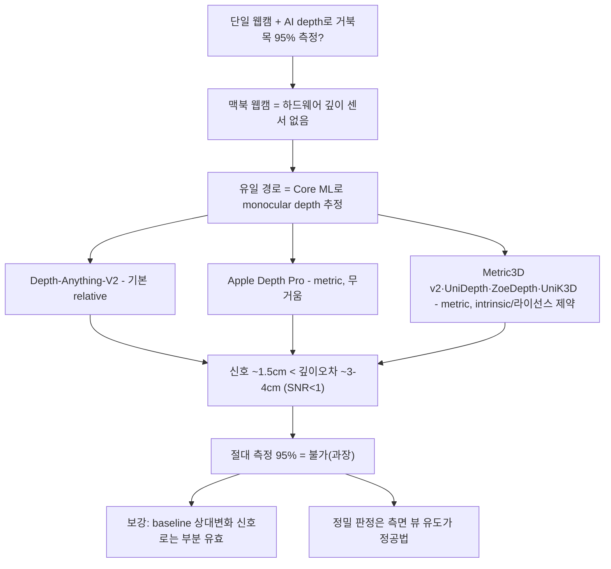

# AI 깊이 추정 기반 자세 측정 전환 — 타당성 조사

`turtlemeck`(맥북 내장 **단일 정면 웹캠**, 2D RGB)에서 기존 pose 기반 로직을 **AI 깊이 추정(monocular depth estimation)·이미지 깊이 분석**으로 전환하면, 거북목(전방머리, FHP)을 **70%급 근사 신호가 아니라 95%+ 정확도로 측정**할 수 있는가를 검증한다.

이 디렉토리는 기존 [`../algorithm/`](../algorithm/) 리서치의 후속이다. 기존 리서치는 "단안 정면 2D로는 절대 측정 불가, baseline 상대 신호가 한계"로 수렴했고([algorithm/pose-estimation/monocular-limits.md](../algorithm/pose-estimation/monocular-limits.md)), 동시에 **"정면 전방머리를 보려면 depth가 필요하다"**([algorithm/pose-estimation/viewpoint-robust-geometry.md §3](../algorithm/pose-estimation/viewpoint-robust-geometry.md))고 명시했다. 본 조사는 그 **"필요한 depth"를 AI 모델로 단일 RGB에서 복원할 수 있는지**, 그것이 95% 목표를 뒷받침하는지를 본다.

> 신뢰도 표기: **[high]** = 다수 1차 출처 일치 / **[검증필요]** = 단일·약한 근거 / **[미검증]** = 1차 근거 못 찾음.

## 요약 다이어그램

## 문서 구성

**타당성·핵심 검증**

| 문서 | 내용 |
|---|---|
| **본 README** | 전환 타당성 전반 조사 + 종합 결론 |
| [**posture-feasibility.md**](posture-feasibility.md) | **핵심 검증** — "단일 RGB 깊이맵으로 거북목 95% 측정 가능한가" 정량 반례·선례·조건부 시나리오 |

**기술별 조사 (모델·플랫폼)**

| 문서 | 내용 |
|---|---|
| [depth-anything-v2/](depth-anything-v2/README.md) | Depth-Anything-V2 — relative vs metric, Core ML 변환, 라이선스 |
| [apple-depth-pro/](apple-depth-pro/README.md) | Apple Depth Pro — zero-shot metric, 0.3초의 진실, macOS 실행 현실성 |
| [metric-depth-models/](metric-depth-models/README.md) | Metric3D v2·UniDepth·ZoeDepth + 2025+ 후보 — 카메라 intrinsic·라이선스·배포성 비교 |
| [apple-vision-depth/](apple-vision-depth/README.md) | Apple 네이티브 경로 — 하드웨어 깊이 부재 확정, Core ML이 유일 경로 |

**설계·심화 (교차 주제)**

| 문서 | 내용 |
|---|---|
| [**depth-feature-design.md**](depth-feature-design.md) | **설계/측정** — segmentation+depth 융합으로 머리-어깨 깊이순서를 뽑는 파이프라인 + 채택 전 자체 측정 프로토콜 |
| [**temporal-video-depth.md**](temporal-video-depth.md) | 시계열·비디오 depth — flicker 원인·비디오 depth 모델군·"flicker는 줄여도 절대정밀도는 못 푼다" |

**기존 algorithm 리서치와의 구성 대응**

| algorithm 리서치 축 | AI depth 리서치에서 보강한 문서 | 확인 결과 |
|---|---|---|
| 단안/정면 2D의 깊이 한계([monocular-limits.md](../algorithm/pose-estimation/monocular-limits.md)) | [posture-feasibility.md](posture-feasibility.md), [depth-anything-v2/](depth-anything-v2/README.md) | AI depth도 절대 cm 정밀도 부족(SNR<1) |
| 시점 강건 기하·정면은 depth 필요([viewpoint-robust-geometry.md](../algorithm/pose-estimation/viewpoint-robust-geometry.md)) | [depth-feature-design.md](depth-feature-design.md) | depth는 segmentation/pose와 결합한 상대 feature로만 후보 |
| baseline 상대화·시계열 안정화([baseline-calibration.md](../algorithm/pose-estimation/baseline-calibration.md), [monocular-limits.md §5](../algorithm/pose-estimation/monocular-limits.md)) | [temporal-video-depth.md](temporal-video-depth.md) | 비디오 depth도 flicker 완화일 뿐 scale/절대오차 해결은 아님 |
| 모델·플랫폼 선택([model-comparison.md](../algorithm/pose-estimation/model-comparison.md), [apple-body-pose](../algorithm/apple-body-pose/README.md)) | [apple-vision-depth/](apple-vision-depth/README.md), [metric-depth-models/](metric-depth-models/README.md) | macOS 현실 경로는 Core ML relative depth 보조 신호 |

---

## 1. 조사 대상 기술 요약

| 기술 | 출력 | 절대 깊이 정확도(실내) | macOS 통합 | 라이선스 | 95% 절대측정 |
|---|---|---|---|---|---|
| **Depth-Anything-V2** | 기본 **relative**(scale·shift 미정), 별도 metric 버전 | metric AbsRel 5.6~7.3%(NYU δ1=0.961~0.984) → 60cm서 ~3.4~4.4cm, 근거리 도메인 밖이라 실제론 더 클 수 있음 [검증필요] | **우수** — Apple 공식 Core ML(`coreml-depth-anything-v2-small`) 49.8MB·M3 Max **24.58ms** [high] | Small=Apache-2.0(상용 OK), Base/Large/Giant=CC-BY-NC-4.0 [high] | **불가** |
| **Apple Depth Pro** | **metric**(intrinsic 불필요) | 근거리 ~10%(67cm→68~71cm) [검증필요] | 무거움 — 504M ViT, 공식 Core ML 없음(미병합 PR뿐) [검증필요] | `apple-amlr` research-only(상업적 이용·제품 개발 제외) [high] | **불가** |
| **Metric3D v2** | metric | AbsRel 6~8% → ~3~4cm [검증필요] | ONNX, Core ML 직접지원 없음 | BSD-2 but **focal 필수**(미지 웹캠과 충돌) | **불가** |
| **UniDepth / UniK3D** | metric(**focal/카메라 자가추정**) | 동급 + scale 실패 자인 | ONNX(V2), Core ML 직접지원 없음 | **CC-BY-NC-4.0(상용 불가)** | **불가** |
| **ZoeDepth** | metric(도메인 고정) | 동급 | 직접지원 없음 | MIT(상용 OK) | **불가** |
| **Apple Vision segmentation** | **깊이 아님**(2D 마스크) | — | 네이티브 | OS 내장 | 보조만 |

세부 수치·출처는 각 하위 문서 참조. 위 정확도는 모두 **NYU/KITTI 등 일반 실내·실외 벤치마크 카메라**에서 나온 값이며, **책상 거리(50~70cm) 근접 인물·미지 웹캠 도메인의 직접 검증치는 어느 1차 출처에도 없다**(공통 [미검증]). 따라서 실제 오차는 위 표보다 클 가능성이 높다.

---

## 2. 종합 결론 — 5개 관점의 수렴

기술 4 + 타당성 1, 5개 관점이 **같은 방향으로 수렴**한다.

1. **맥북 웹캠엔 하드웨어 깊이가 없다 [high].** `AVCaptureDepthDataOutput`은 Apple 공식 플랫폼 목록상 iOS/iPadOS/Mac Catalyst/tvOS뿐 macOS 네이티브가 없고, TrueDepth(IR 도트)·ARKit·LiDAR도 맥북 미지원. 맥북 FaceTime 웹캠은 IR 없는 일반 RGB다. ⇒ **깊이는 반드시 *추정*해야 하고, 유일한 현실 경로는 Core ML로 monocular depth 모델을 돌리는 것**이다([apple-vision-depth](apple-vision-depth/README.md)).

2. **단일 RGB depth는 절대 거리를 신뢰성 있게 주지 못한다 [high].** 강력한 모델(Depth-Anything-V2)의 기본 출력은 **affine-invariant relative depth**라 scale·shift가 미정 → 절대 cm 자체가 없다. metric 버전·metric 모델(Depth Pro/Metric3D v2/UniDepth)도 실내 AbsRel 약 5~10%로 **60~70cm에서 평균 3~4cm 절대오차**를 남긴다. Apple Depth Pro는 `apple-amlr` research-only라 제품 후보에서도 제외된다.

3. **결정적 반례 — 신호가 오차보다 작다 [high].** 거북목의 머리 전방 이동은 전형적으로 **~15mm(1~2cm)** 인데, 위 깊이 오차(~3~4cm)가 **그 신호의 2배 이상**이다. SNR<1 ⇒ 단일 프레임 절대 측정은 원리적으로 신뢰 불가([posture-feasibility.md §2](posture-feasibility.md)).

4. **선례는 하드웨어 depth에만 있다 [high].** 정면 카메라로 성공한 유일한 FHP 시스템 PreventFHP(정확도 98%)는 **Kinect 하드웨어 depth**로 이마-몸통 거리차를 쟀다. **단일 RGB 추정 depth로 거북목을 측정·검증한 선행연구는 사실상 부재**하며, 가장 근접한 단일 RGB→3D pose→GCN 분류(JMIR 2024)조차 **78.27%**로 95%에 17%p 못 미친다.

5. **지표 혼동 경고 [high].** depth 모델의 δ1 accuracy 0.95~0.98은 **"장면 깊이 통계" 정확도**이지 "거북목 판정 정확도"가 아니다. 95% 목표와 직접 비교하면 오해다.

### 한 줄 결론

> **AI monocular depth는 기존 "절대 측정 불가, baseline 상대 신호가 한계"라는 결론을 뒤집지 못한다 — 오히려 정량적으로 *보강*한다.** 단일 웹캠 + AI 깊이맵으로 거북목을 95%+ **절대 측정**하는 것은 현재 1차 근거상 비현실적이다. 다만 ① 목표를 *측정→상대변화 알림/분류*로 재정의하고, ② Core ML depth를 **2D/3D pose의 보강 신호(머리-어깨 상대 깊이 순서)** 로 쓰며, ③ 개인 baseline 보정과 ④ 측면 뷰 유도를 결합하면 실용 정확도(80%대 후반~)는 노릴 여지가 있다 — 이는 "AI depth로 95% 측정"과는 **다른 설계**다.

---

## 3. 검토한 다른 경로 — depth 외 / 시계열 (모두 기각 또는 보조)

사용자 요청의 **"이미지 분석"** 축과 그 대안들을 함께 검토했다. 결론은 모두 "depth는 절대측정 아닌 보강 신호"라는 결론을 바꾸지 못한다.

- **이미지 직접 분류(end-to-end FHP classifier).** 깊이맵을 거치지 않고 얼굴/머리 이미지를 바로 거북목 분류하는 경로. 기존 [algorithm](../algorithm/pose-estimation/viewpoint-robust-geometry.md)에서 정면 얼굴 FHP 분류기(K-FACE)가 **0.69 acc로 기각**됐고, 별도 facial FHP 분류(EfficientNet-B7, IJASEIT 2024)도 **0.69**로 같은 자릿수다 → 정면 단독 이미지 분류는 95%는커녕 pose 기반 분류(JMIR 78%)보다도 낮다. **기각.**
- **Vision-Language Model(GPT-4o 등) 자세 평가.** 2025년 착석 자세를 평가한 선례(Sensors 2025)는 있으나 **온디바이스 불가(클라우드 전송=프라이버시 위배)·지연·~cm 미세 판별 부적합**으로 turtlemeck 요건과 충돌. **기각.**
- **Video depth(Video Depth Anything / Online VDA).** 시간적 일관성으로 단일프레임 flicker를 줄이는 후보 — **단 flicker만 줄이고 절대 정밀도(cm)는 그대로**다. VDA는 출력 자체가 affine-invariant이고, 논문 수치도 whole-video scale/shift alignment 뒤의 벤치마크 성능이다. oVDA는 scale drift를 낮추지만 1000프레임 이후 drift가 남는다고 명시한다. ⇒ depth를 *보조 신호*로 쓸 때 **안정화 용도로만** 가치, 별도 채택 아님([temporal-video-depth.md](temporal-video-depth.md)).
- **Marigold 등 diffusion depth.** affine-invariant(상대) 출력이라 절대 cm 불가 + 다단계 추론으로 무거워 상시 앱 부적합. **기각.**
- **단일 웹캠 시간차 SfM/스테레오 흉내.** 카메라가 **고정**이고 머리 운동이 **광축 방향**이라 SfM이 원리적으로 **degenerate**(near-range·small-baseline). **적용 불가.**

## 4. 전환 시 실용 제약 (정확도 외)

depth 모델을 상시 추론에 도입하면 정확도 외 운영 비용이 생긴다.

- **발열/배터리.** Apple Neural Engine은 미사용 시 완전 차단(누설 0)이라 **주기 burst 추론엔 매우 효율적**이나, **연속(매 프레임) 추론은 발열·throttling 위험**(능동 냉각 없는 얇은 맥북, Depth Pro 504M처럼 큰 모델). ⇒ 기존 앱의 **주기 burst 샘플링 구조를 유지**하고 상시 스트리밍 추론은 피한다.
- **프라이버시·수용성.** 카메라 상시 모니터링 자체가 거부감 요인. 온디바이스·영상 비전송은 필수이고(경쟁 제품도 "100% 로컬"이 핵심 셀링포인트), VLM 같은 클라우드 경로는 이 요건과 충돌한다.
- **캘리브레이션 UX.** "depth 절대측정 불가 → baseline 상대화" 결론은 **사용자가 중립 자세를 캡처하는 보정 단계**에 의존한다. 보정이 부정확하면 상대 판정도 무너지므로, 재보정 트리거·잘못된 baseline 감지 UX가 설계 핵심이 된다.

## 5. 기존 `algorithm/` 결론과의 관계

| 쟁점 | 기존 algorithm 결론 | 본 depth 조사 |
|---|---|---|
| 절대 측정 가능성 | 단안 3D ill-posed, 깊이축 오차 2~3배 → 절대 불가 | **동일** — AI depth도 절대 cm 신뢰 불가(오차>신호) |
| 정면 전방머리 | depth 필요(PreventFHP=Kinect) | **보강** — 그 depth를 단일 RGB로 복원해도 정확도 부족 |
| 권장 방향 | baseline 상대화·다중 feature·측면 유도 | **동일 유지** — depth는 보강 신호로만 |
| 모델 교체로 해결? | 불가 | **동일** — depth 모델 도입도 정확도 한계를 못 넘음 |
| 추가 확인 사실 | — | 맥북 깊이센서 부재 확정 / Core ML depth는 *기술적으론* 경량(~50MB·25ms) 실행 가능 |

**핵심 메시지:** 정확도 개선은 *depth 모델 도입*에서 오지 않는다. depth는 (절대값이 아니라) **상대 신호로서** 기존 2D/3D pose 파이프라인을 *보강*할 수 있을 뿐이며, 95%급 정밀 판정은 여전히 **측면 뷰 유도 + 개인 baseline 보정**이라는 기존 결론에 달려 있다.

---

## 참고 자료

각 하위 문서의 "참고 자료" 절에 1차 출처 URL을 수록했다. 핵심 교차 출처:

- Depth Anything V2 (arXiv:2406.09414): <https://arxiv.org/abs/2406.09414>
- Apple Depth Pro (arXiv:2410.02073): <https://arxiv.org/abs/2410.02073>
- Apple 공식 Core ML Depth Anything V2 Small: <https://huggingface.co/apple/coreml-depth-anything-v2-small>
- Apple `AVCaptureDepthDataOutput`(플랫폼 목록): <https://developer.apple.com/documentation/avfoundation/avcapturedepthdataoutput>
- PreventFHP (Lee et al., 2014 IEEE Haptics Symp — Kinect depth): <https://ieeexplore.ieee.org/document/6775470/>
- 단일 RGB→3D pose→GCN FHP 분류 78.27% (JMIR Formative 2024, e55476): <https://formative.jmir.org/2024/1/e55476>
