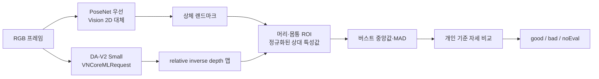

# 단안 깊이 기반 자세 분석 — 채택 설계 인덱스

이 디렉터리는 목바로(`turtlemeck`)에 채택한 깊이 추정 경로와 제품 적용 근거를 관리한다.

## 문서 요약

| 항목 | 내용 |
|---|---|
| 문서 유형 | 현재 깊이 추정 설계 인덱스 |
| 적용 상태 | DA-V2 Small 채택, 자세 특성 검증 필요 |
| 입력 | Mac 내장 카메라의 단일 RGB 프레임 |
| 출력 | relative inverse depth 맵과 자세 분석용 상대 특성값 |
| 제품 내 역할 | 모델 실행, 신체 영역 정의, 개인 기준 자세 비교의 책임 경계 안내 |

## 현재 처리 흐름

Depth Anything V2 Small은 깊이 추정 모델이며 자세 추정기나 자세 판정기가 아니다.

- PoseNet: 상체 랜드마크 우선 검출
- Apple Vision 2D: PoseNet이 유효한 상체를 만들지 못할 때 사용하는 대체 검출 경로
- DA-V2 Small: scale·shift가 정해지지 않은 relative inverse depth 맵 생성
- 자세 분석기: 랜드마크 기반 ROI 정의, 깊이 집계, 개인 기준 자세 비교
- 버스트 처리기: 대표 특성값과 변동성 집계, 최종 판정 근거 생성

```mermaid
flowchart LR
    RGB["RGB 프레임"] --> POSE["PoseNet 우선<br/>Vision 2D 대체"]
    RGB --> DEPTH["DA-V2 Small<br/>VNCoreMLRequest"]
    POSE --> LANDMARKS["상체 랜드마크"]
    DEPTH --> MAP["relative inverse depth 맵"]
    LANDMARKS --> FEATURE["머리·몸통 ROI<br/>정규화된 상대 특성값"]
    MAP --> FEATURE
    FEATURE --> BURST["버스트 중앙값·MAD"]
    BURST --> BASELINE["개인 기준 자세 비교"]
    BASELINE --> RESULT["good / bad / noEval"]
```

## 구현 대응

| 책임 | 현재 구현 |
|---|---|
| PoseNet 우선·Vision 2D 대체 | [`PoseDetector`](../../Sources/TurtleCore/Inference/PoseDetector.swift) |
| DA-V2 Small 로드·Vision 요청 | [`CoreMLRelativeDepthProvider`](../../Sources/TurtleCore/Inference/CoreMLRelativeDepthProvider.swift) |
| ROI·relative depth 특성값 계산 | [`PostureFrameAnalyzer`](../../Sources/TurtleCore/Detection/PostureAnalyzer.swift) |
| 버스트 중앙값·MAD와 기준 자세 비교 | [`BurstProcessor`](../../Sources/TurtleCore/Detection/BurstProcessor.swift) |
| 지속 조건과 상태 전이 | [`PostureStateMachine`](../../Sources/TurtleCore/Detection/PostureStateMachine.swift) |

저장소는 `Resources/DepthAnythingV2SmallF16.mlpackage`를 포함한다.
패키징 스크립트는 모델을 컴파일한 `.mlmodelc` 또는 원본 `.mlpackage` 형태로 앱 리소스에 넣는다.
`CoreMLRelativeDepthProvider`는 이 모델을 기본값으로 로드하고 `VNCoreMLRequest`로 실행한다.

## 채택 자료

| 문서 | 상태 | 역할 |
|---|---|---|
| [Depth Anything V2](depth-anything-v2/README.md) | 채택 | DA-V2 Small의 출력, Core ML 배포 조건, 해석 범위 |
| [Apple Vision·Core ML 경로](apple-vision-depth/README.md) | 채택 근거 | Vision 2D 대체 경로와 `VNCoreMLRequest`, 하드웨어 깊이 제외 근거 |
| [Relative depth 특성값 설계](etc/related-feature-design.md) | 검증 필요 | ROI 중앙값과 reference ROI IQR을 이용한 특성값 정의 |
| [자세 적용 타당성](etc/related-posture-feasibility.md) | 근거 문서 | 공개 깊이 지표와 제품 자세 정확도의 경계 |

## 해석 경계

- DA-V2 Small의 출력은 절대 거리(cm)가 아닌 relative inverse depth다.
- DA-V2 Small은 신체 랜드마크나 `good`·`bad` 상태를 출력하지 않는다.
- PoseNet과 Vision 2D는 깊이 값을 출력하지 않는다.
- 최종 판정은 개인 기준 자세, 버스트 품질, 지속 조건을 적용한 프로젝트 코드가 수행한다.
- 공개 장면 깊이 지표는 근거리 머리·몸통 차이 또는 자세 판정 정확도를 직접 보장하지 않는다.

## 검증 항목

- 랜드마크 기반 머리·몸통 ROI의 반복성
- DA-V2 출력 방향과 좌표 정렬
- 같은 자세에서 상대 특성값의 분산
- 기준 자세와 악화 자세의 개인 내 분리도
- 버스트 대표값·임곗값·지속 조건에 따른 오경보와 지연
- 지원 Mac에서 전체 파이프라인의 지연·발열·배터리 사용량

확정 처리 흐름은 [자세 분석 워크플로](../algorithm/posture-analysis-workflow.md)를 따른다.

## 핵심 자료

- Depth Anything V2 공식 저장소: <https://github.com/DepthAnything/Depth-Anything-V2>
- Depth Anything V2 논문: <https://arxiv.org/abs/2406.09414>
- Apple Core ML DA-V2 Small: <https://huggingface.co/apple/coreml-depth-anything-v2-small>
- Apple Vision 2D body pose: <https://developer.apple.com/documentation/vision/vndetecthumanbodyposerequest>
- Apple `VNCoreMLRequest`: <https://developer.apple.com/documentation/vision/vncoremlrequest>
