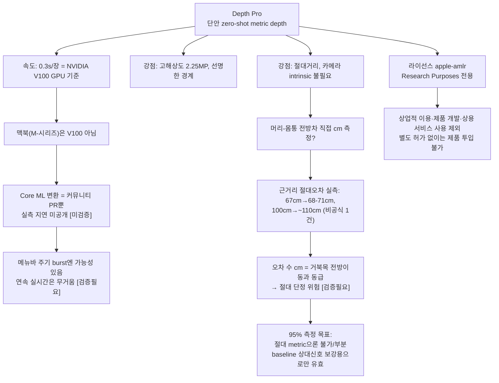

# Apple Depth Pro (ml-depth-pro) — turtlemeck 적합성 비판 검증

`turtlemeck`은 맥북 내장 **단일 정면 웹캠**(2D RGB, 깊이센서 없음)으로 거북목을 감지한다. 거북목의 1차 신호는 **머리가 몸통보다 카메라 쪽으로 나온 전방 깊이차**이고, 이는 단안 기하에서 가장 추정이 약한 "깊이축"이다([monocular-limits.md](../../algorithm/pose-estimation/monocular-limits.md)). 본 문서는 Apple의 단안 **metric depth** 모델 **Depth Pro**가 이 깊이차를 절대거리로 직접 잴 수 있는지, 맥북 온디바이스로 돌릴 수 있는지, 라이선스상 제품에 투입할 수 있는지를 1차 출처로 비판 검증한다.

신뢰도 표기: **[high]** = 다수 1차 출처 일치 / **[검증필요]** = 1차 출처 1개 또는 간접 / **[미검증]** = 1차 근거 못 찾음(추측 금지).

## 요약 다이어그램

---

## 1. Depth Pro란 무엇인가 [high]

- 정식 명칭: **"Depth Pro: Sharp Monocular Metric Depth in Less Than a Second"**, arXiv:2410.02073 (제출 2024-10-02), **ICLR 2025** 채택. 저자: Bochkovskii, Delaunoy, Germain, Santos, Zhou, Richter, Koltun (Apple).
- 코드/가중치: GitHub `apple/ml-depth-pro`, 모델 카드 HuggingFace `apple/DepthPro`.
- 정의(초록 원문, verbatim):
  > *"We present a foundation model for zero-shot metric monocular depth estimation. Our model, Depth Pro, synthesizes high-resolution depth maps with unparalleled sharpness and high-frequency details. The predictions are metric, with absolute scale, without relying on the availability of metadata such as camera intrinsics. And the model is fast, producing a 2.25-megapixel depth map in 0.3 seconds on a standard GPU."*

핵심: **단일 RGB 1장 → 절대거리(metric) depth map**, **카메라 intrinsic/메타데이터 불필요**, 고해상도(2.25MP), 선명한 경계.

---

## 2. 핵심 강점과 그 정확한 조건 [high]

### 2.1 Zero-shot metric depth (절대 거리, intrinsic 불필요) [high]
- 초록이 명시: *"metric, with absolute scale, without relying on ... camera intrinsics"*. 이 점이 turtlemeck에 잠재적으로 가장 흥미롭다 — **카메라 보정 없이 픽셀별 절대 거리(m)** 를 추정한다.
- 절대 스케일을 어떻게 얻나: 별도 **focal length estimation head** 가 이미지에서 화각(field-of-view)을 직접 추정한다. 논문 원문: *"a focal length estimation head ... predict the horizontal angular field-of-view"*. 즉 intrinsic을 *모델이 스스로 추정* 해서 metric 스케일을 복원하는 구조다 → **추정 focal length가 틀리면 절대 스케일도 함께 틀어진다**(아래 §3.2 정확도 참조). [high]

### 2.2 속도 0.3초 — *어떤 하드웨어인가* (중요) [high]
- 초록은 **"standard GPU"** 로만 표기하나, **논문 본문 HTML은 V100을 명시**: *"producing a 2.25-megapixel depth map in 0.3 seconds on a **V100 GPU**"* (arXiv:2410.02073 본문). 다수 2차 해설도 V100으로 일치.
- **즉 0.3초/장은 NVIDIA V100 데이터센터 GPU 기준이다. 맥북 M-시리즈가 아니다.** [high] 이 구분이 turtlemeck 판단의 핵심이다(§5).

### 2.3 고해상도·선명한 경계 [high]
- 2.25MP(=1536×1536급) 출력, 머리카락·털·식생 같은 미세구조 경계까지 살림. 경계 정확도 전용 metric(F1, recall)에서 SOTA 보고. turtlemeck엔 경계 선명도 자체는 직접 필요는 아니나, 머리/어깨 윤곽 분리에는 유리할 수 있음.

---

## 3. 정확도 지표와 절대 거리 오차의 실제 크기

### 3.1 벤치마크 수치 [검증필요]
- **Zero-shot metric depth 정확도(δ₁):** SUN-RGBD에서 δ₁ ≈ **0.89** (vs Depth Anything V2 ≈ 0.724) 보고 — 2차 해설(LearnOpenCV/Roboflow) 기준 [검증필요]. δ₁은 "예측/실측 비가 1.25 이내인 픽셀 비율".
- **Boundary recall/F1:** Sintel F1 ≈ 0.409 (이전 최고 0.321) 등 경계 metric SOTA [검증필요].
- **Zero-shot metric 평가 데이터셋(논문 본문):** *"Booster, Middlebury, Sun-RGBD, ETH3D, nuScenes, and Sintel, because ... they were never used in training."* → **전부 사물/실내·실외 장면 스케일이며, "책상 거리 단일 인물 상체"를 직접 측정한 metric 벤치마크는 아니다.** [high]

### 3.2 절대 거리 오차의 실제 크기 — turtlemeck에 결정적 [검증필요]
- 공식 논문은 책상거리 인물 절대오차를 직접 보고하지 않는다. **비공식 핸즈온(LearnOpenCV) 실측 1건**이 근거리 절대거리를 측정했고 [검증필요]:
  - 실제 **67cm → 추정 ~68–71cm** (오차 약 +1~4cm)
  - 실제 **100cm → 추정 ~110cm** (오차 약 +10cm, 약 10%)
  - focal length 추정도 실측 대비 **약 25.5% 차이**가 났다고 보고.
- 해석: **상대 오차가 거리에 비례(수 %~10%)하는 경향.** 50–70cm 책상 거리에서 절대오차는 **대략 수 cm 규모**일 수 있다.
- 학습이 **canonical inverse depth** 기반이라 *근거리(near-field)를 원거리보다 우선* 최적화한다(논문). turtlemeck의 50–70cm는 near-field라 **상대적으로 유리한 영역**이다. [high]
- 그러나 거북목의 **머리 전방 이동은 보통 수 cm** 규모다. 모델의 절대오차(수 cm)가 측정하려는 신호(수 cm)와 **동급**이면, **절대 metric 한 장으로 거북목 cm를 단정하는 것은 위험**하다. (§7 함의)

---

## 4. 모델 구조·크기·메모리 [high]/[검증필요]

- **구조:** efficient **multi-scale Vision Transformer**. patch encoder + image encoder 모두 **ViT-L/DINOv2** 백본(384×384, patch 16×16). patch encoder가 여러 스케일로 패치를 처리해 scale-invariant 표현을 만든다. [high]
- **파라미터 수:** 출처별로 표기가 갈린다 —
  - ViT-L DINOv2 백본 단위 **≈ 345M** (논문 비교표 인용) [검증필요]
  - **전체 모델 ≈ 504M** (LearnOpenCV) [검증필요]
  - → **공식 모델 카드/초록엔 총 파라미터 수가 명시되지 않음** [미검증]. "수억(≈3.5–5억) 규모의 ViT 기반 대형 모델"로 이해하면 안전.
- **메모리:** 비공식 테스트 기준 **half precision(fp16)으로 약 5GB VRAM**, "6GiB VRAM 노트북에 들어간다" / RTX4050에서 **이미지당 15초 미만**(fp16) 보고 [검증필요]. 공식 수치 아님.

**시사점:** 504M 규모 ViT + 2.25MP 출력은 모바일 SoC 기준 **무거운 편**이다. 데스크톱 GPU에서도 fp16로 수 초~십수 초가 걸린 비공식 사례가 있다.

---

## 5. macOS 온디바이스 실행 현실성 — 정직한 평가

### 5.1 0.3초의 함정
- §2.2대로 **0.3초/장은 V100(데이터센터 GPU) 기준**이다. 맥북 M-시리즈(GPU/Neural Engine)에서의 **공식 추론시간은 어디에도 없다** [미검증]. "맥북에서 0.3초"는 **근거 없는 외삽**이므로 절대 가정 금지.

### 5.2 Core ML / MLX 변환 현황 [검증필요]
- **공식 Core ML 변환은 없다.** 존재하는 것은 **커뮤니티 PR**: `apple/ml-depth-pro` **PR #45** — 기본 1536×1536을 **1024×1024 float16 Core ML 패키지**로 변환, **"stock Apple MacBook M2 Neural Engine"** 타깃. [검증필요]
- 그러나 PR #45는 **"not meant to be merged currently"**(병합 비대상)로 명시되고, **실측 추론시간·메모리·모델 파일크기 수치가 없으며**, Neural Engine에서 실제로 도는지(GPU 폴백 여부)도 **확인되지 않았다**. PR 작성자 본인이 *"DepthAnything의 더 작은 DINOv2가 모바일 최적화엔 낫다"* 고 첨언. [검증필요]
- MLX 포팅의 공식/주류 사례는 확인되지 않음 [미검증].

### 5.3 메뉴바 주기 burst vs 연속 실시간 [검증필요]
- turtlemeck는 **메뉴바 앱의 주기적 점검(burst)** 모델이라 연속 30fps가 필요하진 않다. 만약 M-시리즈에서 **장당 0.3~2초** 수준으로 떨어진다면, **수십 초~수 분 간격 burst 1~수 장**엔 충분히 들어갈 수 있다 [검증필요 — 맥북 실측치 부재].
- 반대로 **연속 실시간(매 프레임)** 용도로는 504M ViT는 명백히 무겁다. 발열·배터리·CPU/GPU 점유 측면에서 백그라운드 상주 앱엔 부담. [검증필요]
- **정직한 결론:** "맥북에서 burst마다 1장 metric depth" 는 **기술적으로 시도해 볼 만하나, 실측 지연이 공개되지 않아 단정 불가.** 채택 전 반드시 **대상 맥북에서 Core ML/MLX 변환 후 자체 latency·메모리·발열 실측**이 선결 조건.

---

## 6. 라이선스 — 제품 사용 가능 여부 [high]

- HuggingFace 모델 카드 라이선스 태그: **`apple-amlr`** (Apple Machine Learning Research License 계열). [high]
- HuggingFace LICENSE 원문은 Apple Machine Learning Research Model을 **과학 연구 목적만으로 공개**한다고 설명하고, 사용·수정·파생모델 생성·재배포 권한도 **"exclusively for Research Purposes"** 로 제한한다. [high]
- 원문 정의상 **"Research Purposes" = 비상업적 과학 연구·학술 개발 활동**이며, **상업적 이용, 제품 개발, 상용 제품/서비스 사용은 포함하지 않는다.** [high]
- 주요 제약: ① 재배포 시 라이선스 사본 제공 및 attribution 고지, ② 파생모델은 수정·변경 사항 표시, ③ **Apple 상표/로고로 파생모델이나 Apple과의 관계 홍보 금지**, ④ 무보증·책임면제 및 위반 시 종료 조항.
- **GitHub Issue #66**("상업적 사용 허용 여부 및 추가 제약 문의")은 **Apple/메인테이너 공식 답변 없이 미해결(open)** 상태다. [high] 다만 라이선스 원문 자체가 research-only 범위를 명시하므로, 이 이슈는 상용 예외가 확인되지 않았다는 보조 근거로만 본다.
- **종합 판단:** Depth Pro 모델/가중치는 **별도 Apple 허가 없이 turtlemeck 상용 제품·서비스에 넣을 수 없다.** 내부 연구·프로토타입 검증에는 쓸 수 있지만, 제품 후보로는 정확도·속도 이전에 **라이선스가 차단 조건**이다. [high — 법률 자문은 아님]

---

## 7. 사람 상체·근거리 인물에서의 metric 정확성 [검증필요]/[미검증]

- 논문이 **사람/근접 도메인을 metric으로 직접 평가한 근거는 약하다.** [high]
  - 인물 관련 언급은 **PPR10K(인물 포트레이트)** 인데, 이는 **focal length 추정** 평가용이지 **인물 상체 절대거리(metric depth) 정확도** 측정이 아니다. 논문: *"on PPR10K, a dataset of human portraits, our method leads with 64.6% of the images"* — 이는 focal length 추정 승률이다.
  - zero-shot metric 데이터셋(Booster/Middlebury/SUN-RGBD/ETH3D/nuScenes/Sintel)은 모두 **장면 스케일**이며 책상거리 단일 인물 metric 벤치마크가 아니다.
- **유리한 점:** inverse-depth 학습이 **near-field 우선**이라 50–70cm 책상 거리는 상대적으로 학습 강점 영역. [high]
- **불리한 점:**
  - 절대 스케일이 **추정 focal length에 의존** → focal 추정 오차(비공식 25%)가 절대거리를 직접 오염. [검증필요]
  - **프레임 간 일관성(temporal consistency) 보장 없음** — 단일 프레임 metric 모델이라 연속 프레임에서 절대값이 흔들릴 수 있다(거북목은 baseline 대비 *변화*를 봐야 하므로 일관성이 중요). 공식 비디오 일관성 보장 근거 **[미검증]**.

---

## 8. turtlemeck 적용 함의 (필수 결론)

### 8.1 머리-몸통 전방 깊이차를 직접 cm로 잴 수 있나?
- **원리상 가능, 실무상 신뢰 부족.** Depth Pro는 픽셀별 절대거리를 내므로 머리 픽셀 거리 − 어깨/몸통 픽셀 거리 = **전방 깊이차(cm)** 를 *직접 뽑을 수 있는 형태*다. 이는 Apple Vision 3D의 "추정값(절대 아님)"보다 개념적으로 진일보.
- **그러나 오차가 신호와 동급이다.** 비공식 실측상 근거리 절대오차가 **수 cm**(67cm→±1~4cm, 100cm→~+10cm). 거북목 전방이동도 **수 cm**. **신호 ≈ 오차이면 단일 프레임 절대 metric으로 거북목을 단정할 수 없다.** [검증필요]
- **유효한 사용법:** 절대값 단정 대신, **같은 세션 내 baseline(중립 자세) 대비 전방 깊이차의 *상대 변화***를 신호로 쓰면 모델·focal 추정의 계통오차(bias)가 상쇄돼 더 안정적이다. 이는 turtlemeck 기존 결론(절대측정 불가, baseline 상대신호가 한계)과 **정합**한다.

### 8.2 0.3초/장 — burst엔 OK, 연속엔 부담
- 0.3초는 **V100 기준**이며 맥북 수치는 미공개. 메뉴바 **주기 burst(수십초~분 간격 1~수 장)** 엔 맥북에서 장당 수백 ms~수 초여도 수용 가능성 있음 [검증필요]. **연속 실시간(매 프레임)은 504M ViT라 무겁다** → 비권장.

### 8.3 프레임 간 일관성·근거리 편향
- 단일 프레임 metric은 **프레임 간 절대값 지터** 위험 → §8.1처럼 baseline 상대화 + 시간 스무딩(1€ filter) 필수.
- near-field 우선 학습은 책상거리에 **유리**한 방향. 단 사람 상체 metric 직접 검증은 부재 → 자체 데이터 검증 필수.

### 8.4 "95% 측정 가능" 목표에 대한 정직한 평가
- **결론: 절대 metric depth만으로 "95% 측정"은 불가/부분이다.** 근거:
  1. **절대 거리 정확도가 신호 크기(수 cm)와 동급**이라, 단일 프레임 절대값으론 95% 신뢰 판별이 성립하지 않는다 [검증필요].
  2. 사람 상체·책상거리 metric **공식 검증 부재** → "95%"를 뒷받침할 1차 근거 없음 [미검증].
  3. `apple-amlr` 라이선스가 research-only라 별도 허가 없이는 제품 투입 불가.
  4. 맥북 실측 지연·일관성 데이터 부재 → 실시간성·안정성 미확인.
- **다만 "부분적으로 유용"하다:** Apple Vision 단독보다 **추가 깊이 채널**을 제공하므로, **baseline 상대 전방차 + 측면 유도 + 시간 일관성**과 결합하면 *추세 신호의 신뢰도를 높이는 보조 입력*으로 가치가 있다. 즉 **"단독 95% 측정 도구"가 아니라 "상대신호 보강용 한 축"** 으로 자리매김하는 것이 정직한 평가다.
- **권고:** 제품에는 채택하지 말고, 연구용 실험에 한정한다. 별도 상용 허가를 받는 경우에만 (a) 대상 맥북 Core ML/MLX 변환 후 latency·메모리·발열 실측, (b) 책상거리 인물 상체에서 절대오차·프레임 일관성 자체 측정, (c) baseline 상대화 전제 설계 — 이 세 가지를 선결 조건으로 둔다.

---

## 참고 자료

- Depth Pro 논문 (arXiv:2410.02073, ICLR 2025): <https://arxiv.org/abs/2410.02073>
- Depth Pro 논문 본문 HTML (V100·구조·데이터셋 원문): <https://arxiv.org/html/2410.02073v1>
- GitHub `apple/ml-depth-pro`: <https://github.com/apple/ml-depth-pro>
- GitHub LICENSE 원문: <https://github.com/apple/ml-depth-pro/blob/main/LICENSE>
- HuggingFace 모델 카드 `apple/DepthPro` (라이선스 `apple-amlr`): <https://huggingface.co/apple/DepthPro>
- 상업 사용 문의 Issue #66 (미해결): <https://github.com/apple/ml-depth-pro/issues/66>
- Core ML 변환 커뮤니티 PR #45 (M2 Neural Engine, 미병합): <https://github.com/apple/ml-depth-pro/pull/45>
- OpenReview (ICLR 2025): <https://openreview.net/forum?id=aueXfY0Clv>

### 보조(2차) 출처 — 비공식, [검증필요]로만 인용
- LearnOpenCV 핸즈온 (504M·VRAM·근거리 절대오차 실측): <https://learnopencv.com/depth-pro-monocular-metric-depth/>
- Roboflow 깊이추정 모델 비교 (δ₁ 등): <https://blog.roboflow.com/depth-estimation-models/>
- HuggingFace transformers 문서(DepthPro 구조): <https://github.com/huggingface/transformers/blob/main/docs/source/en/model_doc/depth_pro.md>
