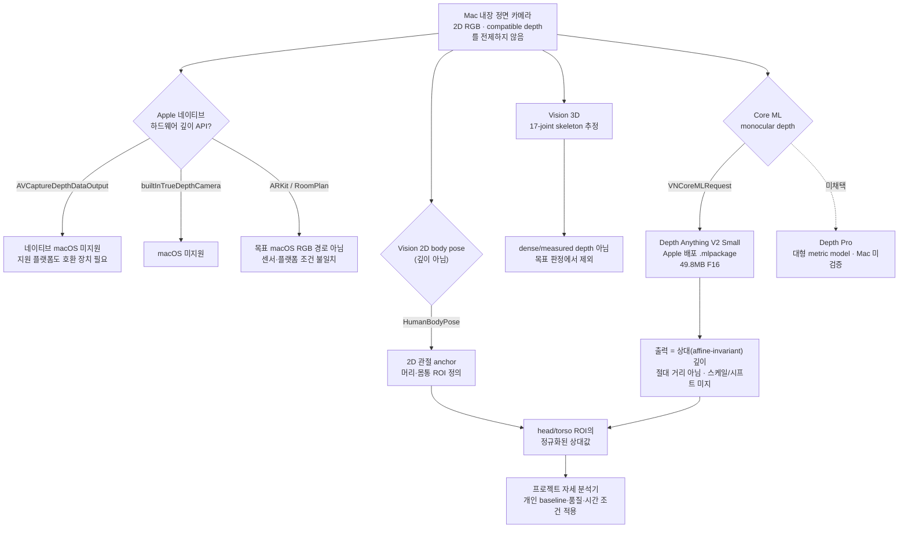

# Apple 2D 이미지 분석 / macOS 단일 RGB 깊이 경로 (Vision · Core ML · AVFoundation)

## 문서 요약

| 항목 | 내용 |
|---|---|
| 문서 유형 | Apple 플랫폼 경로 조사 |
| 적용 상태 | Vision 2D body pose는 채택, Core ML은 실행 형식, hardware depth·Vision 3D는 제외 |
| 입력 | Mac 내장 카메라의 단일 RGB 프레임 |
| 출력 | Vision 2D 신체 정보와 Core ML 단안 relative depth |
| 다루는 범위 | macOS 카메라·Vision·Core ML에서 가능한 깊이 관련 경로 |
| 제품 내 역할 | 측정 depth와 추정 depth를 구분하고 DA-V2 실행 경로의 플랫폼 근거 제공 |

`turtlemeck`은 Mac 내장 정면 카메라의 단일 RGB 입력만 사용하는 macOS 메뉴바 앱이다. 이 문서는 "macOS에서 단일 RGB로 깊이를 얻는 경로"를 Apple 1차 문서로 검증한다. 목표 입력은 호환 measured-depth 장치나 depth format을 전제하지 않으므로 Apple의 하드웨어 depth 경로를 사용하지 않는다. Vision 3D는 RGB에서 실행 가능하지만 dense/measured depth가 아닌 skeleton 추정이라 판정에서 제외한다. Depth Anything V2는 정면 상대 깊이를 제공하고, 자세 판정은 별도 프로젝트 자세 분석기가 수행한다.

## 요약 다이어그램

## 제품 적용 판단

Mac 내장 카메라에서 measured depth를 전제로 하지 않는다. Vision 2D는 신체 landmark·ROI 보조에 사용하고, DA-V2 Small은 Core ML로 relative depth를 생성한다. Vision 3D skeleton은 depth 대체나 최종 자세 판정에 사용하지 않는다.

## 한계와 검증 상태

- Mac 내장 카메라에는 목표 경로에서 사용할 measured-depth 입력이 없다.
- Core ML 실행 가능성과 자세 신호의 정확도는 별개이며, 종단 간 지연·발열·반복성은 제품 환경에서 측정해야 한다.
- Vision 2D와 relative depth의 좌표 정렬 및 ROI 누출은 별도 검증 항목이다.

## 문서 구성

| 문서 | 역할 |
|---|---|
| 본 README | 상태·요약·처리 흐름·제품 적용 판단 |
| [analysis.md](analysis.md) | Apple camera·Vision·Core ML 경로의 로직과 제약 분석 |
| [references.md](references.md) | Apple 공식 문서, 모델 자료와 관련 출처 |
