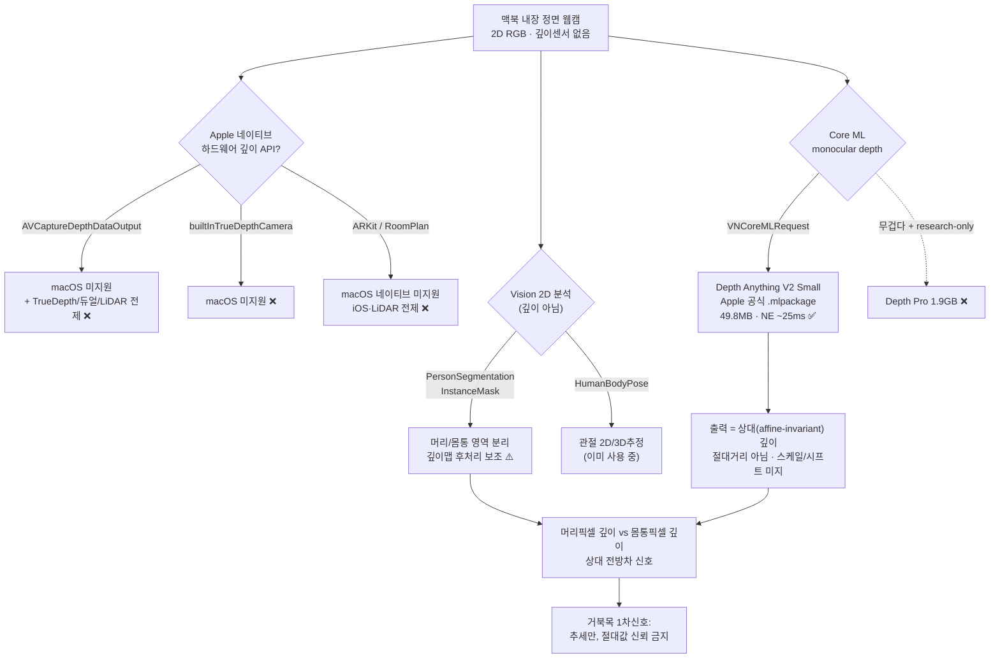

# Apple 2D 이미지 분석 / macOS 단일 RGB 깊이 경로 (Vision · Core ML · AVFoundation)

`turtlemeck`은 맥북 **내장 정면 웹캠**(2D RGB) 1대만 쓰는 macOS 메뉴바 앱이다. 이 문서는 "macOS에서 단일 RGB로 깊이를 얻는 경로"를 Apple 1차 문서로 검증한다. **핵심 결론: 맥북 웹캠에는 하드웨어 깊이 센서가 없고, Apple 네이티브 "깊이 API"는 대부분 센서 전제라 macOS 웹캠엔 해당 없다. 단일 RGB에서 깊이를 얻는 유일한 현실 경로는 Core ML로 monocular depth 모델을 돌리는 것이다.**

신뢰도 표기: **[high]** = Apple 공식 문서로 직접 확인 / **[검증필요]** = 출처는 있으나 turtlemeck 환경 적용은 미확인 / **[미검증]** = 추정.

## 요약 다이어그램

---

## 1. 하드웨어 깊이의 부재 — Apple 문서로 확인 [high]

거북목 1차 신호는 머리-몸통 전방 깊이차다. 그런데 맥북 내장 웹캠은 깊이를 **센서로 측정하지 못한다.** Apple 공식 문서가 이를 명확히 뒷받침한다.

### 1-1. `AVCaptureDepthDataOutput` — macOS 미지원 + 센서 전제 [high]

- Apple 정의: *"A capture output that records scene depth information on **compatible camera devices**."* 즉 깊이 출력은 **호환 카메라 기기**가 있어야 동작한다.
- **플랫폼 가용성(Apple 공식):** iOS 11.0 / iPadOS 11.0 / Mac Catalyst 14.0 / tvOS 17.0. → **네이티브 macOS는 목록에 없다.** (출처: developer.apple.com/documentation/avfoundation/avcapturedepthdataoutput)
- 깊이를 만드는 기기는 **TrueDepth(전면 구조광)**, **듀얼/듀얼와이드(스테레오 disparity)**, **LiDAR**뿐이다. 런타임에 `device.activeFormat.supportedDepthDataFormats`가 비어있지 않은지로 판별하며, 맥북 FaceTime 웹캠에는 이 포맷이 없다.

### 1-2. `AVDepthData` 컨테이너는 macOS에 있으나 — "측정"이 아니라 "컨테이너"일 뿐 [high]

혼동 주의: `AVDepthData`(깊이 데이터 컨테이너 클래스)는 **macOS 10.13+에도 존재한다.** 그러나 이는 깊이를 *만드는* 게 아니라 *담는* 그릇이다.

- Apple 정의: *"A container for per-pixel distance or disparity information captured by **compatible camera devices**."*
- macOS에서 `AVDepthData`를 얻는 경로는 (a) 호환 깊이 카메라(맥북 웹캠 아님), 또는 (b) **이미 깊이가 인코딩된 이미지 파일을 ImageIO로 읽기**다. → 맥북 라이브 웹캠 스트림에서 `AVDepthData`를 생성할 수 없다. **macOS에 클래스가 있다는 사실이 "맥북 웹캠이 깊이를 준다"를 뜻하지 않는다.**

### 1-3. `builtInTrueDepthCamera` — macOS 미지원, 그리고 iPhone Face ID 카메라 전용 [high]

- Apple 정의: *"A device that consists of two cameras, one Infrared and one YUV."* → 적외선 도트 프로젝터 + IR 카메라 기반 **구조광** 기기(iPhone/iPad Face ID·Animoji용).
- **플랫폼 가용성(Apple 공식):** iOS 11.1 / iPadOS 11.1 / Mac Catalyst 14.0 / tvOS 17.0 → **네이티브 macOS 없음.**
- **맥북 웹캠 ≠ iPhone TrueDepth.** 둘 다 "전면 카메라"지만 맥북은 IR 도트 프로젝터가 없는 일반 RGB FaceTime 카메라다. iPhone Face ID 카메라와 하드웨어가 다르다.

### 1-4. ARKit / RoomPlan — macOS 네이티브 미지원, LiDAR 전제 [high]

- ARKit 플랫폼 가용성(Apple 공식): iOS 11.0 / iPadOS 11.0 / Mac Catalyst 14.0 / visionOS 1.0 → **네이티브 macOS 없음.** 정의도 *"Integrate **hardware sensing** features..."* 로 하드웨어 센서 전제다.
- RoomPlan·Scene Reconstruction 등 고밀도 깊이 기능은 **LiDAR 탑재 iOS/iPadOS** 전제다. 맥북 웹캠과 무관.

> **정리 (절 1):** 맥북 단일 RGB 웹캠은 Apple 네이티브 하드웨어 깊이 경로(`AVCaptureDepthDataOutput`, TrueDepth, 듀얼카메라, LiDAR/ARKit) **어느 것도 쓸 수 없다.** 깊이는 *측정*이 아니라 *추정*해야 한다.

---

## 2. Apple Vision 2D 분석 API — 깊이는 못 주지만 영역 분리 보조 [high]

Vision의 사람 분석 API는 **깊이를 추정하지 않는다.** 다만 "머리 픽셀 vs 몸통 픽셀" 영역 분리(matte/mask)는 줄 수 있어, 깊이맵 후처리에서 **어느 영역의 깊이를 비교할지 마스크로 한정**하는 보조 용도로 쓸 수 있다.

| Vision 요청 | 산출물 | macOS 가용 | 거북목 활용 |
|---|---|---|---|
| `VNGeneratePersonSegmentationRequest` | 사람 1명 전체 matte(전경/배경 분리) | **macOS 12.0+** | 사람 픽셀 ↔ 배경 분리. 사람 영역 안에서만 깊이 비교 |
| `VNGeneratePersonInstanceMaskRequest` | **개인별** instance mask | **macOS 14.0+** | 다인 환경에서 사용자 1명만 격리 |
| `VNGenerateForegroundInstanceMaskRequest` | 두드러진 전경 객체 instance mask | **macOS 14.0+** | 사용자 전경만 분리 |
| `VNDetectHumanBodyPoseRequest` (이미 사용 중) | 2D/3D 관절 keypoint | iOS 14 / macOS 11+ | 머리·목·어깨 위치 추정(현 파이프라인) |

(위 가용성은 모두 Apple 공식 문서로 확인 [high].)

**한계 명시:** 이들 마스크는 **2D 픽셀 영역**일 뿐 **z(깊이) 값이 없다.** 즉 segmentation 단독으로는 "머리가 몸통보다 앞에 있다"를 말할 수 없다. 깊이값은 절 3의 Core ML monocular depth가 제공해야 하고, segmentation은 그 깊이맵에서 **"머리 영역 평균 깊이 − 몸통 영역 평균 깊이"를 계산할 때 영역을 정확히 떼어내는** 마스크로만 기여한다. [검증필요 — 이 후처리 조합의 거북목 정확도는 turtlemeck 자체 데이터로 미검증]

---

## 3. Core ML monocular depth — macOS 단일 RGB의 유일한 현실 경로 [high]

단일 RGB에서 깊이를 얻으려면 학습된 단안 깊이 추정(monocular depth estimation) 모델을 Core ML로 돌려야 한다. 이 경로는 **Apple이 공식 모델을 직접 제공**하므로 가장 현실적이다.

### 3-1. 표준 실행 경로: `VNCoreMLRequest` [high]

- Apple 정의: `VNCoreMLRequest` = *"An image-analysis request that uses a Core ML model to process images."*
- **macOS 10.13+** 포함 전 플랫폼 가용(이미지→이미지 모델의 결과는 `VNPixelBufferObservation`). depth 모델 출력은 이미지(깊이맵)이므로 이 경로가 표준이다.
- 즉 turtlemeck은 별도 추론 엔진 없이 **Vision 프레임워크 한 줄 경로로 Core ML depth 모델을 Neural Engine/GPU에서 실행**할 수 있다.

### 3-2. Apple 공식 제공 모델: Depth Anything V2 Small (Core ML) [high]

Apple이 **HuggingFace `apple/` 조직에서 직접** Core ML 변환본을 배포한다 (2024-06-25 Apple Core ML Models 라이브러리 편입).

- **모델:** `apple/coreml-depth-anything-v2-small` (`.mlpackage`)
- **번들 크기:** **F16 = 49.8 MB**, F32 = 99.2 MB → 메뉴바 앱 번들에 충분히 들어가는 크기.
- **온디바이스 성능(Apple 측정):** **MacBook Pro M3 Max에서 24.58 ms** (F16, Neural Engine 주 연산), iPhone 15 Pro Max 33.90 ms. → 책상 착석 실시간(수 fps 폴링)에 여유.
- **입력 해상도:** 평가 시 518×396로 리사이즈. 책상 거리 상반신엔 충분.
- **아키텍처:** DPT + DINOv2 백본.
- **변환 도구:** Apple `coremltools`로 변환·압축(Apple ML이 공식 지원).

> 이는 turtlemeck에 **변환 부담 없이 그대로 번들 가능한 Apple 공식 자산**이다. (별도 문서: `docs/depth-estimation/depth-anything-v2/` 참조 예정.)

### 3-3. 중대한 제약 — 출력은 "상대(relative) 깊이", 절대거리 아님 [high]

거북목 판정에 직결되는 한계다.

- Depth Anything V2는 **affine-invariant inverse depth(=상대 깊이)** 를 출력한다. scale·shift가 미지인 채 *"어느 점이 더 가깝다"는 순서(ordering)만 보존*한다.
- 즉 모델은 **"머리가 몸통보다 N cm 앞"** 같은 metric 값을 주지 않는다. **"머리 영역이 몸통보다 상대적으로 더 가깝다"는 정도**만 안다.
- metric으로 바꾸려면 scale/shift를 외부에서 정합(global alignment)해야 하는데, 단일 웹캠엔 그 기준(알려진 거리)이 없다 → **절대 전방차(cm)는 신뢰 불가, 상대 추세만 유효.** 이는 `docs/algorithm/pose-estimation/monocular-limits.md`의 "깊이축이 가장 부정확"·"추세만"이라는 결론과 정확히 일치한다.

### 3-4. 더 무거운 대안: Apple Depth Pro — 메뉴바 앱엔 부적합 [high]

- `apple/ml-depth-pro`: zero-shot **metric** 단안 깊이(절대 스케일·카메라 메타데이터 불요). ViT-L DINOv2 백본 345M 파라미터.
- **체크포인트 `depth_pro.pt` = 1.9 GB**, 2.25MP 깊이맵 0.3s(표준 GPU). **Apple 제공 Core ML 변환본 없음.**
- HuggingFace 모델/가중치 라이선스 `apple-amlr`는 **Research Purposes 전용**이며 상업적 이용·제품 개발·상용 제품/서비스 사용을 제외한다.
- → 메뉴바 앱 번들·상시 백그라운드 추론엔 **과도하게 무겁고**, 별도 Apple 허가 없이는 제품에 넣을 수 없다. turtlemeck엔 부적합. (metric 출력이 매력적이나 비용·라이선스 대비 비현실.)

---

## 4. 경로별 macOS 가용성·성능·번들 함의 요약 [high]

| 경로 | macOS 네이티브 | 깊이 종류 | 번들 | 온디바이스 | turtlemeck 적합성 |
|---|---|---|---|---|---|
| `AVCaptureDepthDataOutput` (HW) | ❌ 미지원 | metric | 0 | — | ❌ 맥북 웹캠 깊이센서 없음 |
| TrueDepth / 듀얼 / LiDAR / ARKit | ❌ 미지원(또는 Catalyst+센서) | metric | 0 | — | ❌ 하드웨어 부재 |
| Vision Person Segmentation/InstanceMask | ✅ 12/14+ | 깊이 없음(2D 마스크) | 0(내장) | 가벼움 | ⚠️ 깊이 후처리 **보조**만 |
| **Core ML Depth Anything V2 Small** | ✅ (VNCoreMLRequest 10.13+) | **상대(affine-invariant)** | **~50 MB** | **~25 ms (M3 Max NE)** | ✅ **유일한 현실 경로** |
| Core ML Depth Pro | ✅(이론상) | metric | 1.9 GB | 0.3s/2.25MP, CoreML 변환본 없음, `apple-amlr` research-only | ❌ 과중/제품 불가 |

---

## 5. turtlemeck 적용 함의 — "95% 측정" 정직한 평가 [검증필요]

1. **유일 경로 확정.** 맥북 단일 RGB에서 깊이는 **Core ML monocular depth(Depth Anything V2 Small, Apple 공식 .mlpackage)** 로만 얻는다. 하드웨어 깊이·Apple 네이티브 깊이 API는 전부 해당 없음(절 1). 통합 비용은 **변환 불요(Apple 제공)·번들 ~50MB·M3급 NE ~25ms** 로 낮은 편이다.

2. **Vision segmentation은 깊이 제공자가 아니라 보조자.** 깊이맵에서 "머리 영역 vs 몸통 영역"을 마스크로 떼어내 평균 깊이를 비교하는 후처리에만 기여한다. 깊이값 자체는 Core ML이 준다.

3. **"95% 측정"은 단일 정면 웹캠 + 상대깊이만으로는 보장 못 함 (과장 금지).** 근거:
   - Core ML depth 출력은 **상대(scale/shift 미지) 깊이**라 절대 전방차(cm)를 못 준다(3-3).
   - 거북목 1차 신호인 깊이축은 단안에서 **가장 부정확한 차원**이며 in-plane 오차의 약 2~3배다(`monocular-limits.md` §1).
   - 정면 단독 FHP 정량화는 **검증된 고정확 선례가 없고** 측면(sagittal) CVA를 대체 못 한다(`monocular-limits.md` §2).
   - 결론: **"단일 정면 웹캠 + AI로 거북목을 95% 정확도로 *측정*"은 현재 근거로 뒷받침되지 않는다.** 현실적 목표는 *측정*이 아니라 **개인 baseline 대비 상대 악화 추세를 보수적으로 감지(추세 알림)** 이며, 정밀 판정은 측면 뷰 유도가 정공법이다. Depth Anything V2의 상대 깊이는 이 **추세 신호의 보강재**로는 가치 있으나, 절대 심각도 점수의 근거로 단정해선 안 된다. [검증필요 — turtlemeck 자체 데이터로 정확도 미측정]

4. **권장 통합 설계(요지).** ① Apple 공식 `coreml-depth-anything-v2-small` F16(.mlpackage) 번들 → `VNCoreMLRequest`로 깊이맵 산출. ② `VNGeneratePersonInstanceMaskRequest`(macOS 14+)로 사용자 1명 격리, 머리/몸통 영역 마스크 추출. ③ 깊이맵에서 두 영역 평균 깊이차의 **상대 변화**를 baseline 대비 추적. ④ One-Euro 스무딩·버스트 일관성으로 노이즈 억제. ⑤ 절대 cm·확정 점수 금지, 추세 알림만. [검증필요 — 조합 정확도 자체 검증 필수]

---

## 참고 자료

- AVCaptureDepthDataOutput (플랫폼: iOS/iPadOS/MacCatalyst/tvOS — macOS 없음): <https://developer.apple.com/documentation/avfoundation/avcapturedepthdataoutput>
- AVDepthData (컨테이너, "compatible camera devices" 전제; macOS 10.13+이나 측정 아님): <https://developer.apple.com/documentation/avfoundation/avdepthdata>
- builtInTrueDepthCamera ("two cameras, one Infrared and one YUV"; macOS 없음): <https://developer.apple.com/documentation/avfoundation/avcapturedevice/devicetype-swift.struct/builtintruedepthcamera>
- Streaming depth data from the TrueDepth camera (TrueDepth 전제 샘플): <https://developer.apple.com/documentation/AVFoundation/streaming-depth-data-from-the-truedepth-camera>
- ARKit (macOS 네이티브 없음, 하드웨어 센싱 전제): <https://developer.apple.com/documentation/arkit>
- VNGeneratePersonSegmentationRequest (macOS 12.0+): <https://developer.apple.com/documentation/vision/vngeneratepersonsegmentationrequest>
- VNGeneratePersonInstanceMaskRequest (macOS 14.0+): <https://developer.apple.com/documentation/vision/vngeneratepersoninstancemaskrequest>
- VNGenerateForegroundInstanceMaskRequest (macOS 14.0+): <https://developer.apple.com/documentation/vision/vngenerateforegroundinstancemaskrequest>
- VNCoreMLRequest (Core ML 모델 실행, macOS 10.13+): <https://developer.apple.com/documentation/vision/vncoremlrequest>
- Apple 공식 Core ML 변환본 Depth Anything V2 Small (49.8MB F16, M3 Max NE 24.58ms): <https://huggingface.co/apple/coreml-depth-anything-v2-small>
- HuggingFace Core ML 예시 (DepthAnythingV2SmallF16.mlpackage Swift 데모): <https://github.com/huggingface/coreml-examples/blob/main/depth-anything-example/README.md>
- Depth Anything V2 원논문 (affine-invariant/상대 깊이): <https://arxiv.org/html/2406.09414v2>
- Apple Depth Pro (metric 단안, 345M ViT-L, depth_pro.pt 1.9GB, CoreML 미제공): <https://github.com/apple/ml-depth-pro>
- Apple Depth Pro HuggingFace LICENSE (`apple-amlr`, research-only): <https://huggingface.co/apple/DepthPro/blob/main/LICENSE>
- Apple Depth Pro 체크포인트(1.9GB 확인): <https://huggingface.co/apple/DepthPro/tree/main>
- (교차참조) 단안 깊이 한계·추세 only 결론: `docs/algorithm/pose-estimation/monocular-limits.md`
