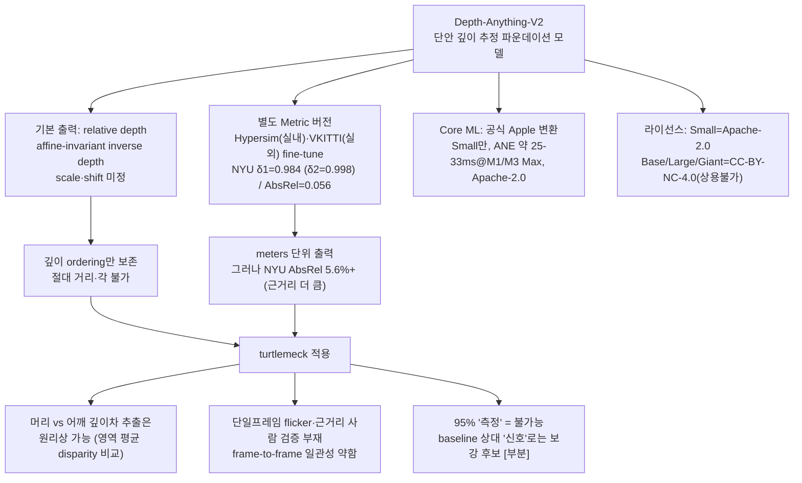

# Depth-Anything-V2 — 단안 깊이 추정으로 거북목을 측정할 수 있는가

`turtlemeck`은 맥북 내장 **단일 정면 웹캠**(2D RGB, 깊이센서 없음)으로 거북목을 감지한다. 거북목의 1차 물리 신호는 **머리가 몸통보다 카메라 쪽으로 나온 전방 깊이차(forward depth offset)** 다. 이 깊이차를 AI 깊이 추정 모델(Depth-Anything-V2)로 직접 잴 수 있는지, "단일 웹캠만으로 95%+ 정확도"가 타당한지 1차 출처로 비판적으로 검증한다.

신뢰도 표기: **[high]** = 다수 1차 출처 일치 / **[검증필요]** = 단일·약한 근거 / **[미검증]** = 1차 근거 못 찾음(추측).

## 요약 다이어그램

---

## 1. Depth-Anything-V2란 무엇인가 [high]

- **단안(monocular) 깊이 추정 파운데이션 모델.** Yang et al., *"Depth Anything V2"*, NeurIPS 2024, arXiv:2406.09414 (2024-06-13 제출). DPT 헤드 + **DINOv2 백본** 구조.
- **V1 대비 핵심 개선 3가지(원문):** *"1) replacing all labeled real images with synthetic images, 2) scaling up the capacity of the teacher model, and 3) teaching student models via the bridge of large-scale pseudo-labeled real images."* → 즉 **라벨된 실사진을 전부 합성(synthetic) 이미지로 교체**하고, 큰 teacher 모델로 **~62M 실사진에 pseudo-label**을 달아 student를 학습.
- 학습 규모(모델 카드): *"trained on ~600K synthetic labeled images and ~62 million real unlabeled images."*
- 강건성 개선 근거: 투명 표면 챌린지에서 *"83.6% in a zero-shot manner"* (V1은 53.5%) — 미세구조·반사/투명에 V1보다 강함. [high]

### 모델 크기 변형 [high]
GitHub 공식 표 기준:

| 변형 | 파라미터 | 공개 여부 |
|---|---|---|
| Small (ViT-S) | 24.8M | 공개 |
| Base (ViT-B) | 97.5M | 공개 |
| Large (ViT-L) | 335.3M | 공개 |
| Giant (ViT-G) | 1.3B | **"Coming soon"(미공개)** |

추론 속도: 논문은 SD 기반(Marigold) 대비 *"more than 10× faster"* 라고만 하고 **모델별 절대 ms/FPS는 논문에 없음** [검증필요]. 실측 수치는 §4의 Core ML 항목 참조(거기엔 디바이스별 ms 있음).

---

## 2. 핵심 구분 — relative depth vs metric depth (거북목 측정의 분수령) [high]

이 구분이 "95% 측정 가능성"의 핵심이다. **기본 모델과 metric 모델은 출력의 성격이 근본적으로 다르다.**

### 2-1. 기본 출력 = relative depth (affine-invariant inverse depth)
- 논문 원문: *"our models produce affine-invariant inverse depth"* — 즉 **scale과 shift가 미정**인 역깊이(disparity).
- 이것이 의미하는 바(독립 1차 출처): *"Affine-invariant depth preserves only the 'ordering' of depths, and since neither scale nor shift is preserved, affine-invariant depth cannot be used to reconstruct a reasonable 3D point cloud without alignment to ground truth."* (Zero-shot Depth Completion, arXiv:2502.06338) [high]
- 정렬 방법: GT가 있어야 *"least squares fitting ... to compute the scale and shift factors"* 로 metric으로 복원 가능. **turtlemeck엔 GT(실측 거리)가 없다** → 절대 거리·절대 각 복원 불가.
- **결론:** 기본 모델은 픽셀 간 **상대 깊이 순서**만 준다. "머리가 어깨보다 가깝다/멀다"는 비교는 가능하지만, **"몇 cm 나왔다"·"CVA 몇 도"는 원리적으로 불가.**

### 2-2. 별도 Metric depth 버전
- 획득 방식(원문): *"we fine-tune our powerful encoder on Hypersim and Virtual KITTI synthetic datasets, for indoor and outdoor metric depth estimation, respectively."*
- **실내(Indoor)** = Hypersim fine-tune, **max depth 20m**. **실외(Outdoor)** = Virtual KITTI 2, max depth 80m. (metric_depth/README) 출력은 *"depth map in meters in numpy"* — **미터 단위 직접 출력.** [high]
- 실내 정확도(NYU-D fine-tuned metric, 논문 Table 4(a)):

| 모델 | δ1 (높을수록 좋음) | δ2 | AbsRel (낮을수록 좋음) |
|---|---|---|---|
| ViT-S | 0.961 | 0.996 | 0.073 |
| ViT-B | 0.977 | 0.997 | 0.063 |
| ViT-L | **0.984** | **0.998** | **0.056** |

> δ1 = **0.961 / 0.977 / 0.984**(ViT-S/B/L)이다. 0.996/0.997/0.998은 같은 표의 **δ2 컬럼**이다(arXiv:2406.09414 Table 4(a), 컬럼 순서 δ1 δ2 δ3 AbsRel; ZoeDepth 비교행 δ1=0.951로 정렬 교차확인). δ1조차 NYU fine-tuned에서 0.96~0.98대로 포화돼 변별력이 낮다(§2-3).

- metric은 Small/Base/Large 세 크기 모두 실내·실외 체크포인트 공개. [high]

### 2-3. metric 버전이면 거북목이 풀리는가? — 부분적, 그러나 정밀도가 문제 [high]
- δ1=0.984는 *"GT 대비 비율 오차 < 1.25인 픽셀 비율"* 이라는 **관대한** 지표다(NYU fine-tuned에서 거의 포화 → 변별력 낮음; δ2=0.998은 더더욱 포화). 더 직접적인 AbsRel=0.056은 **평균 5.6% 상대오차**를 뜻한다.
- 교차근거: SOTA 단안 metric depth의 NYUv2 실내 AbsRel은 대략 **4~10%** 수준이며 본 모델 ViT-L의 5.6%가 그 하단이다. (*Human-like monocular depth biases*(PMC12380331)는 NYUv2에 AbsRel을 보고하지 않고 상관·RMSE를 사용하며, 오히려 일부 모델이 인간 깊이판단을 능가한다고 본다.)
- **거북목 산수에 대입:** 카메라-사용자 ~60cm에서 5~10% 상대오차면 **절대 깊이 오차 약 3~6cm.** 거북목의 머리 전방 이동량 자체가 흔히 **2~5cm 수준**이다(임상 FHP). → **재려는 신호(cm급)가 모델 오차(cm급)와 같은 자릿수.** 즉 metric 버전이라도 *단일 프레임 절대값으로는* 신호 대 잡음비(SNR)가 1 근처라 신뢰 어렵다. [검증필요 — 오차 자릿수는 1차, 거북목 이동량 자릿수는 임상 일반치]

---

## 3. 실내 근거리(책상 ~50–70cm) 사람 상체에서의 정확성·한계

- **벤치마크는 대부분 방 전체(scene) 대상이다.** Hypersim·NYU는 가구·벽 위주이고, **카메라 60cm 정면 사람 상체**라는 turtlemeck 조건은 학습·평가 분포에 거의 없다. → 보고된 δ1/AbsRel을 그대로 적용할 수 없다. [high — 데이터셋 구성에서 직접 도출]
- **공간 유형별 성능 편차가 크다.** InSpaceType 벤치(arXiv:2408.13708)는 실내 단안 깊이가 공간 유형마다 성능이 크게 불균형하다고 보고(텍스처 없는 영역·근/원거리 편중에서 취약). 본문 정량치는 PDF 파싱 실패로 직접 인용 못 함 [검증필요], 그러나 *"indoor depth distribution can be concentrated in either near or far ranges making it challenging to predict accurate metric depth ... large untextured regions make ... loss ambiguous"* 같은 실내 난점은 교차 확인됨.
- **근거리 자체는 상대적으로 안정적이라는 정황.** 로보틱스 장애물 회피 벤치에서 Depth-Anything-V2의 근거리 오프셋 오차가 *"ranging from 0.045 meters to 0.073 meters"* 로 보고됨(centimeter-level). 단 이는 **장애물(큰 물체) 회피 맥락**이지 **사람 머리/어깨의 미세 깊이차**가 아니다 → turtlemeck 신호엔 직접 일반화 못 함. [검증필요]
- **함의:** "거북목 머리-어깨 깊이차"를 모델이 정확히 잡는다는 **직접 검증 근거는 1차 출처에 없다 [미검증].** 일반 실내 깊이 정확도에서 *추정*할 수밖에 없고, 그 추정은 §2-3대로 보수적이다.

---

## 4. 온디바이스 / Apple 통합 [high]

- **공식 Core ML 변환 존재.** Apple이 직접 HuggingFace에 게시: `apple/coreml-depth-anything-v2-small`. (Hugging Face가 Transformers·Core ML 지원을 주도)
- **Neural Engine 실측 추론시간**(Apple Core ML 모델 카드, small-float16 변형):

| 디바이스 | OS | 추론시간(ms) | dominant compute unit |
|---|---:|---:|---|
| MacBook Pro M1 Max | 15.0 | 32.80 | Neural Engine |
| MacBook Pro M3 Max | 15.0 | 24.58 | Neural Engine |
| iPhone 15 Pro Max | 17.4 | 33.90 | Neural Engine |
| iPhone 12 Pro Max | 18.0 | 31.10 | Neural Engine |

→ **M1/M3 Max에서 약 25~33ms.** turtlemeck의 메뉴바 상주·주기 샘플링엔 충분히 가볍다. [high]
- 정밀도 변형: F32(99.2MB) / F16(49.8MB). (일부 커뮤니티 변환은 INT8도 존재하나 공식 Apple repo는 F16/F32 위주) [검증필요]
- **중요 제약: 공식 Core ML은 Small(ViT-S)만, 그리고 relative depth 버전이다.** Base/Large 공식 Core ML 없음(커뮤니티 변환 `LloydAI/DepthAnything_v2-Large-CoreML` 존재 — 비공식 [검증필요]). **Metric 버전의 공식 Core ML은 확인되지 않음 [미검증]** → metric을 ANE에서 쓰려면 직접 coremltools 변환 필요.
- 영상 비전송·온디바이스 처리 요건은 Core ML 특성상 자연히 충족. [high]

---

## 5. 라이선스 — 변형별로 다름, 상용 배포 시 치명적 [high]

GitHub 공식 README 명시:

| 변형 | 라이선스 | 상용 배포 |
|---|---|---|
| **Small (ViT-S)** | **Apache-2.0** | **가능** |
| Base (ViT-B) | **CC-BY-NC-4.0** | **불가(비상업)** |
| Large (ViT-L) | **CC-BY-NC-4.0** | **불가(비상업)** |
| Giant (ViT-G) | CC-BY-NC-4.0 | 불가 (+미공개) |

- 공식 Core ML(`apple/coreml-depth-anything-v2-small`) 패키지 라이선스: **Apache-2.0.**
- **turtlemeck 함의:** 앱을 배포(특히 유료/상용)한다면 **Apache-2.0인 Small만 안전하게 쓸 수 있다.** 정확도가 더 높은 Base/Large는 **상용 불가(CC-BY-NC).** Metric 버전 체크포인트의 라이선스는 베이스 인코더 라이선스를 따를 가능성이 높으나 **변형별로 별도 확인 필수 [검증필요].**

---

## 6. turtlemeck 적용 함의 (필수)

### 6-1. 머리 vs 어깨/몸통 깊이차 추출은 가능한가?
- **원리상 부분적으로 가능.** Depth-Anything-V2는 dense per-pixel depth를 주므로, (기존 pose의) 머리 landmark 주변 영역과 어깨 영역의 깊이값 평균을 비교해 **"머리가 더 가깝다"는 상대 신호**는 뽑을 수 있다.
- 단, **relative depth(기본 모델)는 ordering만 보존**(§2-1)하므로 *"머리가 어깨보다 disparity가 크다"* 까지만 말할 수 있고, **그 차이의 절대 크기(cm)·각도(CVA °)는 못 준다.**

### 6-2. scale·shift 미정이 자세 측정에 주는 영향 — metric이면 해결되나?
- relative 버전: scale·shift 미정 → **프레임마다 정규화 기준이 달라** 같은 자세라도 머리-어깨 disparity 차의 절대값이 출렁인다. baseline(개인 기준자세) 대비 **상대 변화 추세**로만 의미 있다.
- metric 버전: 미터 단위라 scale 문제는 **명목상 해소.** 그러나 §2-3대로 **절대 정밀도(평균 5~10% 상대오차 = ~3~6cm)가 거북목 신호(cm급)와 동급**이라 *단일 프레임 절대 측정*은 여전히 신뢰 어렵다. → metric은 scale을 풀지만 정밀도를 풀지는 못한다.

### 6-3. 단일 프레임 정확도 / 프레임간 일관성(temporal flicker)
- **단일 이미지 깊이 모델은 본질적으로 flicker.** *"applying a non-metric, single-image method to each frame of a video sequence naturally produces temporally flickering depth maps ... built based on an i.i.d. assumption between frames ... inherently prone to flickering and temporal inconsistency."* (Video Depth Anything, arXiv:2501.12375; StableDPT arXiv:2601.02793) [high]
- turtlemeck처럼 **프레임마다 독립 추론**하면 깊이값이 떨린다 → 머리-어깨 깊이차도 떨린다. 완화하려면 **temporal smoothing(기존 1€ filter 원리)** 또는 Video Depth Anything류 시계열 모델 필요. (기존 `docs/algorithm/pose-estimation/monocular-limits.md` §5의 시계열 일관성 논지와 정합.) [high]

### 6-4. "95% 측정" 목표에 대한 정직한 평가

**판정: 단일 웹캠 + Depth-Anything-V2로 거북목을 "95% 정확도로 측정"하는 것은 불가능. 단, baseline 상대 '신호' 보강 후보로는 부분적으로 유효.**

근거(모두 본문 1차 출처):
1. **기본(relative) 모델은 절대 측정이 원리적으로 불가** — affine-invariant라 ordering만 보존(§2-1). [high]
2. **metric 모델도 정밀도 부족** — 실내 AbsRel 5.6~10%(60cm에서 ~3~6cm)가 거북목 머리이동 신호(cm급)와 동급 SNR(§2-3). [high/검증필요]
3. **근거리·정면 사람 상체에서의 직접 검증 근거 없음**(§3). 벤치는 방 전체 대상. [미검증]
4. **단일 프레임 flicker**로 frame-to-frame 일관성 약함(§6-3). [high]
5. 애초 "95% 측정"의 정의(무엇 대비 95%? CVA 각도? FHP 분류 정확도?)가 불명확하다. **분류 정확도 95%**(거북목/정상 이진)는 다른 신호와 결합 시 *후보로 검토*할 만하나, **절대 측정(거리·각) 95%**는 위 1~4로 **불가.**

**권고:** Depth-Anything-V2는 기존 2D pose를 **대체**할 도구가 아니라, 머리-어깨 **상대 깊이 순서**라는 *추가 신호*로 **보강**하는 후보다. 채택하려면 (a) 라이선스상 Small/Apache-2.0 우선, (b) metric 변환을 직접 시도하되 자체 데이터로 근거리 사람 상체 정확도를 검증, (c) temporal smoothing 필수, (d) 절대 각도가 아니라 baseline 상대 추세로만 사용 — 이는 기존 docs/algorithm 결론(절대 측정 아닌 상대 신호)을 **뒤집지 않고 보강**한다.

---

## 참고 자료

- Depth Anything V2 논문 (NeurIPS 2024, arXiv:2406.09414): <https://arxiv.org/abs/2406.09414> / HTML: <https://arxiv.org/html/2406.09414v1>
- 공식 GitHub (모델 크기·라이선스·Coming soon): <https://github.com/DepthAnything/Depth-Anything-V2>
- Metric depth README (실내 20m / 실외 80m, meters 출력): <https://github.com/DepthAnything/Depth-Anything-V2/blob/main/metric_depth/README.md>
- 프로젝트 페이지: <https://depth-anything-v2.github.io/>
- HuggingFace Metric Indoor Large (Hypersim fine-tune): <https://huggingface.co/depth-anything/Depth-Anything-V2-Metric-Indoor-Large-hf>
- 공식 Core ML 모델 (Apple, Apache-2.0, M-series ANE 약 25~33ms): <https://huggingface.co/apple/coreml-depth-anything-v2-small>
- HuggingFace Core ML 예제 (Swift): <https://github.com/huggingface/coreml-examples/blob/main/depth-anything-example/README.md>
- 커뮤니티 Large Core ML(비공식): <https://huggingface.co/LloydAI/DepthAnything_v2-Large-CoreML>

### 한계·정밀도 교차 출처
- affine-invariant는 ordering만 보존(scale·shift 미정, GT 정렬 필요) — Zero-shot Depth Completion (arXiv:2502.06338): <https://arxiv.org/html/2502.06338v1>
- 단일이미지 depth의 temporal flicker (i.i.d. 가정) — Video Depth Anything (CVPR 2025, arXiv:2501.12375): <https://arxiv.org/abs/2501.12375>
- temporal stability — StableDPT (arXiv:2601.02793): <https://arxiv.org/abs/2601.02793>
- 실내 단안 깊이 공간유형별 편차 — InSpaceType (arXiv:2408.13708): <https://arxiv.org/pdf/2408.13708>
- 단안 depth의 체계적(affine) bias·근거리 우선 (NYU SOTA AbsRel은 4~10%) — Human-like monocular depth biases (PLOS Comput Biol 2025, PMC12380331): <https://www.ncbi.nlm.nih.gov/pmc/articles/PMC12380331/>
- HuggingFace 강좌(metric vs relative 개념·Depth Anything V2 fine-tuning): <https://huggingface.co/learn/computer-vision-course/en/unit8/monocular_depth_estimation>
