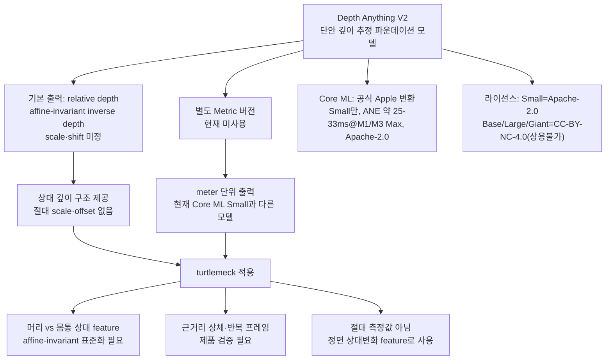

# Depth Anything V2 — 단안 깊이 추정

## 문서 요약

| 항목 | 내용 |
|---|---|
| 문서 유형 | 단안 깊이 모델 조사 |
| 적용 상태 | DA-V2 Small 채택, 국소 자세 신호는 제품 실측 필요 |
| 입력 | 단일 RGB 이미지 |
| 출력 | scale·shift가 정해지지 않은 relative inverse-depth map |
| 다루는 범위 | relative/metric 출력, 모델 크기, Core ML, 라이선스, FHP 적용 한계 |
| 제품 내 역할 | 정면 상대 depth 생성 모델의 선정 근거와 사용 범위 정의 |

`turtlemeck`은 Mac 내장 단일 RGB 카메라의 고정된 시점을 사용한다. 이 조건에서 머리와 몸통의 상대 depth 차이는 전방 머리 변화를 감지하기 위한 제품 feature 후보이며, 임상 FHP 측정값이 아니다. 이 문서는 채택한 Depth Anything V2가 해당 신호를 어느 범위까지 제공하는지 1차 출처로 검증한다. DA-V2는 자세를 추정하거나 판정하지 않는다. PoseNet 우선·Vision 2D fallback이 신체 관절·ROI를 제공하고 프로젝트 자세 분석기가 최종 판정한다.

## 요약 다이어그램

## 제품 적용 판단

DA-V2 Small은 relative-depth 생성에 채택한다. 자세 landmark나 `good`·`bad`를 출력하는 모델로 사용하지 않으며, 최종 판정은 2D body-pose가 정의한 신체 영역과 개인 baseline을 사용하는 별도 자세 분석기가 수행한다.

## 한계와 검증 상태

- 출력은 절대 cm가 아니라 scale·shift가 정해지지 않은 relative depth다.
- 공개 장면 벤치마크는 근거리 상체의 머리-몸통 국소 차이 정확도를 보장하지 않는다.
- 반복 프레임의 분산과 정상·악화 자세 분리도는 채택 모델과 별개로 제품 데이터에서 검증해야 한다.

## 문서 구성

| 문서 | 역할 |
|---|---|
| 본 README | 상태·요약·처리 흐름·제품 적용 판단 |
| [analysis.md](analysis.md) | relative/metric 로직, Core ML, 라이선스와 자세 적용 한계 분석 |
| [references.md](references.md) | 공식 저장소, 논문, Apple 모델과 한계 관련 자료 |
