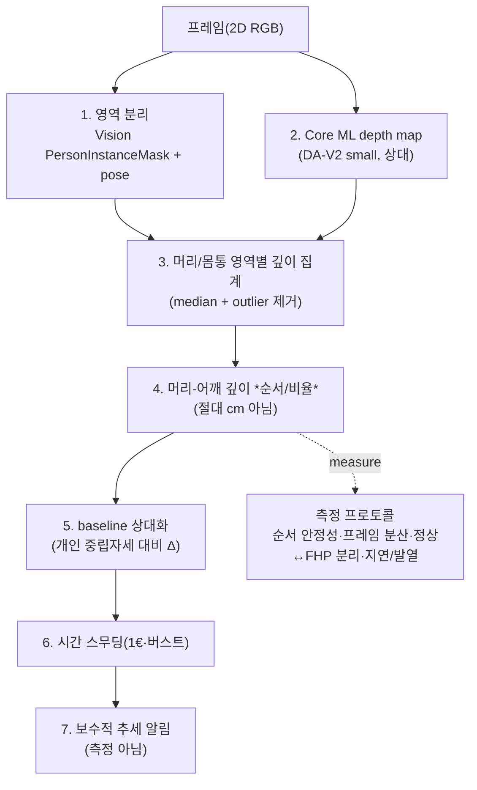

# depth를 거북목 신호로 쓰는 설계 — segmentation+depth 융합과 측정 프로토콜

앞선 문서들이 "단일 RGB AI depth로 거북목을 95% **절대 측정**하는 것은 비현실적"임을 1차 근거로 보였다([README.md](README.md), [posture-feasibility.md](posture-feasibility.md)). 그렇다면 **depth를 *보조 상대 신호*로 쓴다면 구체적으로 어떤 파이프라인인가**, 그리고 채택 전 무엇을 **자체 실측**해야 하는가. 이 문서는 그 *설계*와 *측정 계획*을 채운다 — 알고리즘 쪽 [`viewpoint-robust-geometry.md`](../algorithm/pose-estimation/viewpoint-robust-geometry.md)(각도 기하 설계)와 [`algorithm-draft.md` §0](../algorithm/algorithm-draft.md)(온디바이스 실측)에 대응하는, depth 축의 "how/측정" 문서다.

> 신뢰도 표기: **[high]** = 다수 1차 출처 일치 / **[검증필요]** = 단일·약한 근거 / **[미검증]** = 1차 근거 못 찾음(자체 실측 필요).

## 요약 다이어그램

---

## 1. 왜 segmentation과 depth를 *둘 다* 써야 하나 [high]

- **depth map에는 신체 부위 라벨이 없다.** Core ML depth(DA-V2)는 픽셀별 (상대) 깊이만 주고, "어느 픽셀이 머리/어깨/배경"인지는 모른다.
- **Vision 마스크에는 z(깊이)가 없다.** `VNGeneratePersonInstanceMaskRequest`(macOS 14+) 등은 2D 픽셀 마스크일 뿐 깊이값이 없다([apple-vision-depth.md §2](apple-vision-depth/README.md), Apple 1차 확인 [high]).
- ⇒ 거북목의 "머리가 몸통보다 앞" 신호를 뽑으려면 **둘을 결합**해야 한다: segmentation/pose로 *머리 영역*과 *어깨/몸통 영역*을 떼어내고, 그 영역들의 **depth map 값을 비교**한다. 어느 하나만으로는 불가능하다.

## 2. 영역별 깊이 집계 — 견고성 설계 [검증필요]

머리/몸통 영역의 깊이를 한 값으로 줄일 때, 단순 평균은 머리카락·옷·배경 혼입에 취약하다([depth-anything-v2 §3](depth-anything-v2/README.md)). 설계 원칙:

- **평균이 아니라 median/percentile**으로 집계해 outlier(배경 픽셀, 깊이 경계 누출)를 억제.
- pose landmark(코·귀·어깨)를 **앵커**로, 그 주변 작은 패치만 표본 추출(전체 머리 마스크보다 안정적일 수 있음 — 자체 비교 필요).
- **자기가림·경계 누출 인지:** 깊이 경계가 선명한 모델(예: Depth Pro의 sharp boundary)이 영역 분리에는 유리하나, turtlemeck은 경량 DA-V2 small이 현실 경로라 경계가 무를 수 있음 → 마스크 침식(erosion)으로 경계 픽셀 제외.
- 단, erosion은 고정 px kernel로 두지 않는다. DA-V2 Small 출력 해상도와 머리/코/귀 bbox 크기에 비례해 kernel을 정하고, 최소 표본 면적을 보존해야 작은 영역이 통째로 사라지는 실패를 막을 수 있다.

## 3. 신호의 정의 — 절대 cm가 아니라 *순서/비율*의 *변화* [high]

- depth map이 상대(affine)여도 **"머리 영역이 어깨 영역보다 가깝다"는 순서(ordering)** 는 뽑을 수 있다([depth-anything-v2 §6-1](depth-anything-v2/README.md)).
- 더 견고하게는 **머리/어깨 깊이 *비율* 또는 각도**로 표현 — 순수 scale은 분자·분모에서 상쇄된다. ⚠️ 단 affine의 *shift* 항은 비율로도 완전히 상쇄되지 않으므로([posture-feasibility.md §2.1](posture-feasibility.md)), 절대 불변이 아니라 **개인 baseline 대비 *변화*** 로만 안정적이다.
- **occlusion ordering이 절대 depth보다 견고할 수 있다 [검증필요].** "Occlusion-Ordered Semantic Instance Segmentation"(arXiv:2504.14054)은 절대 깊이보다 **가림 기반 상대 순서**가 더 신뢰 가능하다고 논증하며 segmentation과 깊이 순서를 함께 낸다 — turtlemeck의 "머리가 어깨보다 앞" 판정에 개념적으로 부합한다.

## 4. 한 모델로 seg+depth를 동시에? — human-centric 파운데이션 모델 [검증필요]

머리/몸통 분리와 깊이를 별도 파이프라인으로 묶는 대신, **사람 중심(human-centric) 모델 하나**로 2D pose·신체부위 segmentation·depth를 동시에 내는 경로도 있다.

- **Sapiens** (ECCV 2024 Oral, arXiv:2408.12569): 공통 pretrain 기반의 human-centric **모델 패밀리**로, 2D pose·신체부위 segmentation·depth·surface normal을 task별 fine-tuning checkpoint로 제공한다. "한 번의 추론으로 4개 출력을 동시에 얻는 단일 모델"은 아니다. ⚠️ 단 대형 ViT(수억~수십억 파라미터)라 **맥북 ANE 온디바이스 현실성은 미검증**, 경량 DA-V2 small과 정반대 무게.
- **MP-Mat** (arXiv:2504.14606): depth-layered(multiplane) human matting — 사람 분리와 부위 깊이 층화를 함께 다룸 [검증필요 — abstract 스니펫 기반, 관련성만].
- **함의:** 개념적으로는 공통 backbone 기반의 human-centric task 모델군이 깔끔하나, turtlemeck의 경량·상시·발열 제약에서는 **Vision 마스크(무료·내장) + DA-V2 small(경량)** 조합이 현실적이다. Sapiens류는 *정확도 상한 탐색*용 참고로 둔다.

## 5. 인접 RGB 자세 파이프라인 — 무엇을 참고할 수 있나

depth 융합은 아니지만, **일반 RGB/웹캠으로 자세를 정량화·분류**한 최근 선례는 설계·검증 방법의 참고가 된다. 다만 교차검증 결과, "정면 단일 RGB만으로 FHP를 정밀 측정했다"로 읽을 수 있는 선례는 없었다. 아래 사례들은 모두 시상면 사진, 마커, manikin, 별도 센서, 2D pose 분류 등 turtlemeck과 조건이 다르다.

| 선례 | 무엇 | turtlemeck 참고점 |
|---|---|---|
| **AutoMCA** (MDPI Automation 2025, 6(4):88) | MediaPipe Pose로 ROI를 잡고 색상 마커를 검출해 **CVA·CRA·FHD**를 자동 산출 | **시상면(sagittal) 사진 + C7/tragus/canthus 마커** 기반이다. 정면/무마커 웹캠 반례가 아니라, 자동화된 photogrammetry 선례로만 참고 [high] |
| **Posture Lab** (Wearable Tech, Cambridge 2025, wtc.2025.10005 / PMC12170950) | ArUco marker 웹캠 CV + wearable accelerometer를 Kinovea와 비교 | **검증 방법론** 참고(CV vs 기준 도구). 단 manikin 모델, ArUco 마커, CA/SA/KA 각도 일치(CA r=0.607 FHP, r=0.809 NHP)이지 depth 오차 검증 아님 [high] |
| **LSP-YOLO** (arXiv:2511.14322, 2025) | YOLOv11-Pose 경량 착석자세 분류, 엣지 실시간 | depth가 아니라 2D pose 분류지만, **경량 온디바이스 자세 인식**의 아키텍처 비교군 |
| **Physics-Informed Posture Estimation** (arXiv:2512.06783, 2025) | 단안 RGB 3D pose에 생체역학 제약 추가(MPJPE −10.2%) | 단일 웹캠에서 목/머리 3D 기하를 더 신뢰성 있게 복원하는 prior 접근(= [`monocular-limits.md` §5](../algorithm/pose-estimation/monocular-limits.md) 해부학 prior와 정합) |

## 6. 측정 프로토콜 — 채택 전 자체 실측해야 할 것 [미검증→실측]

문헌의 모든 정확도는 NYU/KITTI **방 전체 장면** 카메라에서 나왔고, **책상 거리(50~70cm) 근접 정면 인물** 도메인의 직접 검증치는 없다([README.md §1](README.md), [metric-depth-models §3](metric-depth-models/README.md)). 따라서 알고리즘 쪽 [`algorithm-draft.md` §0](../algorithm/algorithm-draft.md)의 온디바이스 실측 방식을 depth에도 적용해, **벤치마크가 아니라 turtlemeck 도메인에서** 다음을 측정해야 한다.

1. **순서 안정성:** 책상 거리 정면에서 Core ML depth가 "머리 < 어깨"(머리가 더 가까움) 순서를 **얼마나 자주 올바르게** 내는가(정상 자세·거북목 자세 각각).
2. **프레임 간 분산:** 머리-어깨 깊이차(또는 비율) 신호의 프레임 간 표준편차가 거북목 증분 신호(<15mm 환산)보다 작은가([temporal-video-depth.md](temporal-video-depth.md) §5와 연계).
3. **정상↔FHP 분리:** 같은 사용자가 정상/거북목을 취했을 때 신호 분포가 **겹치는가**(겹치면 단일 임계 무용 — 알고리즘 쪽 JMIR 78% 분포겹침과 동형 문제, [`cva-and-fhp-metrics.md` §2](../algorithm/pose-estimation/cva-and-fhp-metrics.md)).
4. **지연/발열:** Core ML depth burst 1~수 장의 ANE 지연·메모리·발열이 메뉴바 상주에 수용 가능한가([apple-vision-depth.md §3](apple-vision-depth/README.md), [README.md §4](README.md)).

> ⚠️ 이 측정 없이 depth를 도입하면, "벤치 δ1 0.95라 잘 되겠지"라는 **지표 혼동**([posture-feasibility.md §1](posture-feasibility.md))에 빠지기 쉽다. 정확도 한계의 실증 책임은 자체 데이터에 있다.

## 7. 권고 — depth는 다중 feature의 한 축, 단독 측정기가 아님

- segmentation+depth 융합으로 뽑은 **머리-어깨 상대 깊이 순서**는, 기존 2D/3D pose 파이프라인에 **한 feature로 추가**될 후보다(대체 아님). 단독 절대 측정기로 쓰지 않는다.
- 반드시 **개인 baseline 상대화 + 시간 스무딩 + 보수적 추세 알림** 위에서만 쓴다(= [README.md §2](README.md) 결론).
- 채택 여부는 §6 측정이 "Vision 상대 깊이/2D pose 대비 *추가 이득*"을 실증하느냐에 달렸다([metric-depth-models §4.2](metric-depth-models/README.md)).

## 8. 미해결 (자체 실측 필요)

- ⬜ Vision 마스크 + DA-V2 small 영역 깊이 집계의 **거북목 판정 정확도**(turtlemeck 자체 데이터, §6).
- ⬜ Sapiens류 task별 모델 또는 통합 파이프라인이 맥북 ANE에서 **상시 추론 가능**한가(무게·발열).
- ⬜ occlusion ordering(2504.14054)이 절대 depth 비교보다 실제로 더 견고한가(자체 비교).
- ⬜ 무마커 정면 웹캠에서 AutoMCA/Posture Lab식 2D 각도 측정의 조건(시상면·마커·manikin)을 얼마나 제거할 수 있는가.

---

## 참고 자료

- Sapiens: Foundation for Human Vision Models (2D pose+신체부위 seg+depth+normal, ECCV 2024 Oral): <https://arxiv.org/abs/2408.12569>
- Occlusion-Ordered Semantic Instance Segmentation (가림 기반 상대 깊이 순서): <https://arxiv.org/abs/2504.14054>
- MP-Mat (depth-layered human matting, multiplane): <https://arxiv.org/abs/2504.14606>
- AutoMCA (시상면 사진·마커 기반 자동 CVA/CRA/FHD, MDPI Automation 2025 6(4):88): <https://doi.org/10.3390/automation6040088>
- Posture Lab — ArUco marker 웹캠 CV + wearable 검증, manikin pilot (Wearable Tech, Cambridge 2025): <https://doi.org/10.1017/wtc.2025.10005> / <https://pmc.ncbi.nlm.nih.gov/articles/PMC12170950/>
- LSP-YOLO (경량 착석자세 인식, 엣지 실시간): <https://arxiv.org/abs/2511.14322>
- Physics-Informed Human Posture Estimation (단안 3D pose + 생체역학 prior): <https://arxiv.org/abs/2512.06783>
- Accuracy Does Not Guarantee Human-Likeness in Monocular Depth Estimators (69개 MDE vs 인간 깊이판단): <https://arxiv.org/abs/2512.08163>
- (교차참조) Apple 마스크·Core ML depth 경로: [apple-vision-depth/README.md](apple-vision-depth/README.md)
- (교차참조) 각도 기하 설계·게이팅: [`../algorithm/pose-estimation/viewpoint-robust-geometry.md`](../algorithm/pose-estimation/viewpoint-robust-geometry.md)
- (교차참조) 온디바이스 실측 방식: [`../algorithm/algorithm-draft.md`](../algorithm/algorithm-draft.md) §0
