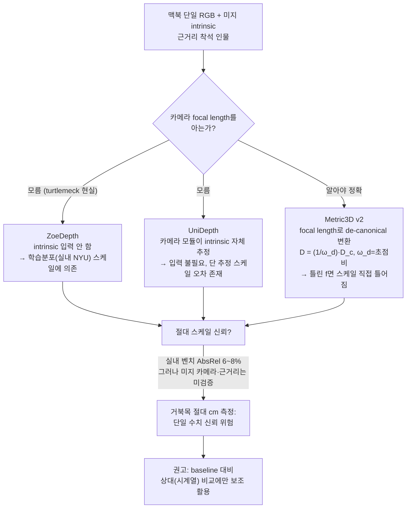

# Metric Depth 모델군 비교 — Metric3D v2 · UniDepth · ZoeDepth · 2025+ 후보

`turtlemeck`은 맥북 내장 **단일 정면 웹캠**(2D RGB, 깊이센서 없음)으로 거북목을 감지한다. 거북목의 1차 신호는 **머리-몸통의 전방 깊이차(수 cm)** 이므로, 상대(relative) depth가 아니라 **절대(metric, 절대 거리) depth**가 필요하다는 가설에서 출발한다. 이 문서는 metric depth를 직접 출력한다고 주장하는 세 모델을 1차 출처로 비교하고, "미지 intrinsic·근거리 인물" 환경에서 절대 스케일을 얼마나 믿을 수 있는지를 비판적으로 검증한다.

신뢰도 표기: **[high]** = 1차 출처(논문/공식 repo) 직접 확인 · **[검증필요]** = 1차 출처에 근접하나 본 앱 도메인 외삽 · **[미검증]** = 직접 출처 없음.

## 요약 다이어그램

---

## 1. 비교 표

| 항목 | **ZoeDepth** (2302.12288, 2023) | **Metric3D v2** (2404.15506, 2024) | **UniDepth / V2** (2403.18913 / 2502.20110, 2024) |
|---|---|---|---|
| 핵심 아이디어 | relative backbone(MiDaS) + metric bins head로 절대화 [high] | 모든 이미지를 **canonical camera space**로 변환해 focal 모호성 제거 [high] | **camera self-prompt 모듈**이 intrinsic을 스스로 추정, pseudo-spherical 출력으로 카메라·깊이 분리 [high] |
| metric을 얻는 법 | 학습 데이터(NYU/KITTI) 도메인 스케일을 metric bins head가 회귀. intrinsic **입력 안 받음** [high] | canonical 공간 예측 후 **focal length로 de-canonical 변환**: `D = (1/ω_d)·D_c`, ω_d = canonical/원본 초점비 [high] | 모델이 dense camera 표현(Δf, Δc)을 예측해 깊이를 conditioning. **추론 시 intrinsic 입력 불필요**(선택적으로 GT intrinsic 주입 가능) [high] |
| **intrinsic 의존성** | 명시적 입력 없음 → 스케일이 **학습 도메인에 암묵 고정** (미지 카메라에 취약) [high/검증필요] | **focal length 필요**. 미지 시 repo는 "기본 9개 focal 설정" 제공, 틀리면 *"focal length is not properly set"* 왜곡 경고 [high] | **없음(자체 추정)** — 세 모델 중 유일하게 "intrinsic 모름"을 설계로 흡수 [high] |
| 정확도 (zero-shot) | NYUv2: δ1=0.953, AbsRel(REL)=0.077 · KITTI: REL=0.057 [high] | NYUv2(ViT-g): δ1=0.980, AbsRel=0.067 · KITTI(ViT-g): δ1=0.977, AbsRel=0.051 [high] | NYUv2(ViT-L): δ1=0.984, A.Rel=5.78% · KITTI: δ1=0.986, A.Rel=4.21% [high] |
| zero-shot 일반화 | 8개 미지 데이터셋(실내·실외). 실내 강함, 실외 일부 음수 개선(DDAD -12.8%) [high] | 16M 이미지·수천 카메라 학습 → in-the-wild 강함, KITTI/NYU/Robust-MVD 상위 [high] | 10개 데이터셋 zero-shot SOTA, KITTI 공식 벤치 published 1위(V2) [high] |
| 백본 / 크기 | BEiT384-L (MiDaS), 총 ~344M params, 305M이 백본 [high] | DINOv2-reg ViT-S/L/giant2, ConvNeXt-L. v2-g가 최대 [high] | DINO 기반 ViT-S/B/L (+V1 ConvNeXt-L). V2-L ~34M head 외 ViT 백본 [high/검증필요] |
| 속도 | 미명시(BEiT-L 대형, 실시간 어려움) [미검증] | 미명시. ViT-giant2는 무거움 [미검증] | V2가 V1 대비 latency 73.2→25.0ms, 연산 1/3로 경량화 [high] |
| 라이선스 | **MIT** [high] | **BSD-2-Clause** [high] | **CC BY-NC 4.0 (비상업)** [high] |
| macOS/Core ML | ONNX 미명시(MiDaS 계열은 변환 사례 있음) [미검증] | **ONNX 공식 지원**(dynamic shape, HF 체크포인트 3종). Core ML 직접 언급 없음 [high] | **ONNX 지원(V2)**. Core ML 직접 언급 없음 [high] |

> A.Rel/AbsRel/REL은 동일 계열 지표(평균 상대 오차). UniDepth는 %로, ZoeDepth/Metric3D는 소수로 표기 — 즉 NYU에서 세 모델 모두 **상대 오차 약 6~8%, δ1 0.95~0.98** 수준으로 실내 벤치 정확도는 비슷하게 높다 [high].

---

## 2. 개별 서술

### 2.1 ZoeDepth (arXiv:2302.12288)

- **핵심 아이디어** [high]: relative depth의 일반화 장점과 metric depth의 절대 스케일을 결합. MiDaS의 relative backbone(BEiT384-L) 위에 도메인별 **metric bins module**(경량 head)을 얹어, relative 예측을 metric으로 회귀한다. 논문: *"the first approach that combines both worlds ... excellent generalization ... while maintaining metric scale."*
- **metric 획득 / intrinsic** [high/검증필요]: ZoeDepth는 **camera intrinsic을 입력으로 받지 않는다.** 절대 스케일은 fine-tune된 도메인(NYU 실내, KITTI 실외)의 카메라·장면 통계를 metric head가 암묵 학습한 결과다. 즉 "처음 보는 카메라"에서는 학습 도메인과 다른 focal/스케일이 **보정되지 않고** 그대로 흘러나온다 → 미지 카메라에 대한 스케일 안정성은 구조적으로 약하다(이 한계는 후속 Metric3D/UniDepth가 해결 대상으로 명시).
- **정확도** [high]: ZoeD-M12-NK — NYUv2 δ1=0.953, REL=0.077; KITTI REL=0.057. NYU 사전학습+파인튜닝으로 REL 21% 개선.
- **일반화** [high]: 8개 미지 데이터셋에 zero-shot. 실내(SUN RGB-D, iBims-1 등) 개선 뚜렷, 실외 일부는 음수 개선(DDAD -12.8%) — 실내 도메인이 상대적 강점.
- **한계** [high]: DDAD 등 실외 약점, 도메인을 "indoor/outdoor" 둘로만 나눠 더 세분화는 future work. 대형 백본(344M)으로 온디바이스 실시간 부담 [미검증].

### 2.2 Metric3D / Metric3D v2 (arXiv:2307.10984 / 2404.15506)

- **핵심 아이디어** [high]: metric 모호성의 근본 원인을 **카메라 focal length의 다양성**으로 보고, 모든 학습 이미지·깊이를 **고정 초점거리의 canonical camera space**로 변환해 네트워크 혼란을 제거. 16M 이미지·수천 카메라 모델로 학습.
- **metric 획득 / intrinsic** [high]: 이것이 turtlemeck에 가장 중요한 지점이다. 모델은 canonical 공간에서 깊이 `D_c`를 예측하고, **추론 시 실제 focal length로 de-canonical 변환**해 metric 깊이를 복원한다: `D = (1/ω_d)·D_c`, 여기서 ω_d는 canonical 초점 / 원본 초점의 비. 논문: *"The focal length is vital for metric depth estimation."* 즉 **focal length를 알아야 절대 스케일이 맞는다.** 미지 시 공식 repo는 *"As no intrinsics are provided, we provided by default 9 settings of focal length"* — 즉 focal을 추측(고정)해야 하며, 틀리면 *"Because the focal length is not properly set!"* 로 포인트클라우드가 왜곡된다.
- **정확도** [high]: NYUv2 — ViT-L δ1=0.975/AbsRel=0.063, ViT-g δ1=0.980/AbsRel=0.067. KITTI — ViT-L δ1=0.974/AbsRel=0.052, ViT-g δ1=0.977/AbsRel=0.051.
- **일반화** [high]: in-the-wild·미지 카메라 강함(canonical 변환 덕). 단 이 강함은 **올바른 focal이 주어졌을 때** 성립한다.
- **백본/라이선스** [high]: DINOv2-reg ViT-S/L/giant2 + ConvNeXt-L. **BSD-2-Clause(상업 가능)**. **ONNX 공식 지원**.

### 2.3 UniDepth / UniDepth V2 (arXiv:2403.18913 / 2502.20110)

- **핵심 아이디어** [high]: *"directly predicts metric 3D points ... without any additional information."* 추가 정보(intrinsic) 없이 단일 이미지에서 metric 3D를 직접 예측. **self-promptable camera module**이 dense 카메라 표현을 예측하고, **pseudo-spherical 출력**으로 카메라와 깊이를 분리한다.
- **metric 획득 / intrinsic** [high]: 세 모델 중 유일하게 **intrinsic을 입력으로 요구하지 않는다.** V2는 4개 토큰으로 `Δf_x, Δf_y, Δc_x, Δc_y`를 pinhole 초기화에 곱셈 residual로 예측 → 사실상 **focal length를 스스로 추정**한다. (선택적으로 GT intrinsic 주입도 가능: *"You can use ground truth intrinsics as input."*)
- **정확도** [high]: NYUv2(ViT-L) δ1=98.4%/A.Rel=5.78%, KITTI δ1=98.6%/A.Rel=4.21%. 10개 데이터셋 zero-shot SOTA, V2는 KITTI 공식 published 벤치 1위.
- **일반화·한계** [high]: 광범위 도메인에 강하나, 저자 스스로 **scale 한계를 명시**: *"UniDepth could fail to capture the specific scene scales in certain cases, e.g. in ETH3D and IBims-1"* — scale-invariant 지표는 좋아져도 **scale-dependent 지표(F_A)는 크게 떨어질 수 있다**(IBims-1에서 31.4% 하락). 즉 **상대 구조는 잘 맞아도 절대 스케일은 특정 장면에서 어긋난다.** *"would still greatly benefit from domain-specific fine-tuning."* V2 결론: *"the limited diversity of training cameras remains a challenge."*
- **속도/라이선스** [high]: V2가 V1 대비 latency 73.2→25.0ms로 1/3 경량화, ViT-S/B/L 제공, ONNX 지원. **단 CC BY-NC 4.0 — 비상업 라이선스**(상용 앱 배포에 치명적 제약).

---

## 3. 공통 분석 — 카메라 intrinsic 의존성

이것이 turtlemeck에 가장 결정적인 축이다.

- **focal length는 절대 스케일과 (근사적으로) 선형 비례한다** [high]. Metric3D v2의 복원식 `D = (1/ω_d)·D_c` (ω_d = canonical/원본 초점비)가 1차 출처로 이를 증명한다 — focal length 추정이 k배 틀리면 metric 깊이도 **약 k배 틀어진다.** 거북목의 1차 신호인 "머리가 X cm 앞으로"는 바로 이 절대 깊이의 차이이므로, **focal 오차는 측정값에 직접·비례적으로 전이된다.** 일반론으로도 *"the unbounded output range and the intertwined relationship between depths and focal lengths"* 가 미지 카메라 metric의 핵심 난제로 교차확인된다 [high].

- **맥북 웹캠 intrinsic을 알 수 있는가?** [검증필요]
  - Apple `AVCaptureDeviceFormat`은 일부 기기에서 `cameraCalibrationData`/`AVCameraCalibrationData`(intrinsicMatrix)를 제공하나, 이는 주로 **듀얼/뎁스 지원 카메라(아이폰 등)** 경로이고, **맥북 내장 단일 FaceTime 웹캠에 calibration이 노출되는지는 보장되지 않는다**(미검증, 기기별 확인 필요). 노출되지 않으면 focal은 **추정/고정**해야 한다.
  - → **Metric3D v2**는 이 경우 "9개 기본 focal" 중 하나를 골라야 하고, 그 선택이 틀린 만큼 스케일이 비례해 틀어진다. **ZoeDepth**는 학습 도메인(NYU 실내 카메라) 통계에 스케일을 암묵 고정하므로 맥북 웹캠 focal과 다르면 그만큼 어긋난다. **UniDepth**만이 focal을 스스로 추정해 "모름"을 설계로 흡수하지만, V2 저자가 인정한 *scale 실패 케이스*가 보여주듯 그 추정 자체에 오차가 남는다.

- **zero-shot 절대 스케일 오차가 거북목(수 cm)에 충분히 작은가?** [검증필요]
  - 벤치 AbsRel ~6~8%(NYU)는 **장면 평균 상대 오차**이지, "머리-어깨 5cm 깊이차"를 잴 만큼 **국소 절대 정밀도**를 보장하지 않는다. 50–70cm 거리에서 6% AbsRel은 약 3~4cm의 깊이 불확실로, 이는 측정 대상(전방 이동 수 cm)과 **동급 크기**다 → 단일 프레임 절대값으로 거북목 cm를 판정하기엔 마진이 부족하다.
  - 결정적으로 이 벤치는 **NYU/KITTI 카메라**에서 측정됐다. 맥북 웹캠은 학습에 없을 수 있고(미지 카메라), UniDepth조차 *unseen camera*·*specific scene scale*을 한계로 명시했다. **"근거리 착석 단일 인물 + 미지 웹캠"** 도메인의 절대 스케일 정확도를 직접 보고한 1차 출처는 확인되지 않았다 [미검증].

- **실내·근거리 인물 도메인 근거** [검증필요]: 세 모델 모두 NYU(실내) 벤치는 강하나, NYU는 *방 전체 장면*이지 *근접 상반신 인물*이 아니다. 근거리 인물·얼굴~어깨 깊이차에 대한 metric 정확도 전용 근거는 없다.

---

## 4. turtlemeck 적용 함의

### 4.1 가장 현실적인 후보 — UniDepth, 단 조건부

미지 intrinsic·맥북 단일 RGB라는 **제약 조합에서 가장 현실적인 후보는 UniDepth**다 [high 근거 + 검증필요 적용].
- 이유: 세 모델 중 **유일하게 intrinsic 입력을 요구하지 않고**(self-prompt로 focal 자체 추정), V2가 latency 25ms·ONNX 지원으로 **온디바이스 실시간에 가장 가깝다.**
- **그러나 두 개의 결정적 단서**:
  1. **라이선스 CC BY-NC 4.0 = 비상업.** turtlemeck이 배포/상용이면 **그대로 쓸 수 없다.** 상업 가능 후보는 ZoeDepth(MIT)·Metric3D(BSD-2)뿐.
  2. self-prompt focal 추정에도 **scale 오차가 남고**(저자 인정), 근거리 인물·미지 웹캠 절대 정확도는 미검증.
- **라이선스까지 포함한 현실 후보 재정렬**: 상업성을 전제하면 **Metric3D v2(BSD-2, ONNX)** 가 1순위 후보지만, **focal length를 알아야** 절대값이 맞는다는 정확히 그 약점이 맥북 미지 intrinsic 환경과 충돌한다 → "9개 기본 focal" 추측에 의존하게 되어 절대 스케일 신뢰가 떨어진다.

### 4.2 metric 절대값을 못 믿어도 상대 비교엔 쓸 수 있는가? — 조건부 가능

- **절대 cm 판정**: 위 분석상 단일 프레임 절대값으로는 **권장하지 않는다.**
- **baseline 대비 상대 비교**: **동일 카메라·동일 사용자**에서 같은 모델로 추론하면, focal 오차·도메인 스케일 bias가 **세션 내내 거의 일정한 곱셈 상수**로 작용한다(스케일이 k배 틀려도 그 k가 프레임 간 유지). 따라서 **baseline 자세 대비 깊이차의 *상대 변화*(시계열 추세)** 는 절대값보다 신뢰도가 높다 [검증필요 — 합리적 추론, 직접 출처 없음]. 이는 `monocular-limits.md` §5의 "baseline 상대화 + 시계열 일관성" 원리와 일치한다.
- 단, 이 경우에도 metric depth 모델을 **새 의존성으로 추가**할 가치는 별도 검증 필요 — Apple Vision의 상대 깊이 신호 위에 시계열·baseline을 적용하는 기존 경로 대비 *추가 이득*이 입증돼야 한다.

### 4.3 "95% 측정 가능" 목표에 대한 정직한 평가

- **현 근거로 "단일 웹캠 AI metric depth로 거북목 95%+ 절대 측정"은 뒷받침되지 않는다** [검증필요/미검증]. 근거:
  1. 절대 스케일이 focal length에 **비례 의존**하고(Metric3D 식으로 증명), 맥북 웹캠 focal을 신뢰 있게 얻는다는 보장이 없다.
  2. 벤치 AbsRel 6~8%(≈ 50–70cm에서 3~4cm)는 측정 대상(전방 수 cm)과 동급 마진 → 단일 측정 정밀도 부족.
  3. 모든 정확도 수치는 **NYU/KITTI 카메라·장면**에서 나온 것이고, 근거리 단일 인물 + 미지 웹캠 도메인 정확도를 보고한 1차 출처가 없다(UniDepth조차 scale 실패 케이스 명시).
  4. "95%"가 *δ1(픽셀 단위 상대 오차 비율)* 을 뜻한다면 실내 벤치에서 모델들이 이미 0.95~0.98을 보이지만, 이는 **장면 깊이의 통계적 정확도**이지 **거북목 임상 판정 정확도**가 아니다 — 지표 혼동 주의.
- **정직한 결론**: metric depth 모델은 거북목의 **보조 상대 신호**로는 탐색 가치가 있으나, **"95% 절대 측정"이라는 강한 주장은 과장이며 현 1차 출처로 정당화되지 않는다.** `monocular-limits.md`의 기존 결론(단안 깊이축은 가장 불확실한 차원, 절대 거리 신뢰 금지)을 metric 모델이 **뒤집지 못한다** — 오히려 모델 저자들 스스로 scale·미지 카메라 한계를 인정한다.

---

## 5. 2025+ 추가 후보 — 결론을 뒤집는가?

Metric depth 연구는 빠르게 개선되고 있어, 세 기본 후보 외 최신 후보도 확인했다. 결론은 동일하다: **카메라-agnostic metric depth는 좋아졌지만, head-vs-torso cm 오차나 95% FHP 정확도를 검증한 출처는 없다.**

| 모델 | 장점 | turtlemeck 제약 |
|---|---|---|
| **UniK3D** (2025) | 입력 camera 정보 없이 metric 3D pointcloud를 예측. SmallFoV/large-FoV/panoramic 등 다양한 카메라를 명시 평가 | **CC BY-NC 4.0**. 보고 지표는 metric pointcloud F1(예: SmallFoV 68.1)이지 자세/FHP 정확도 아님 |
| **Depth Any Camera** (2025) | wide-FoV·fisheye·360 카메라 robustness에 강점 | Matterport3D AbsRel 0.156 / δ1 0.7727, ScanNet++ fisheye AbsRel 0.1323 / δ1 0.8517 등 장면 지표. 라이선스 메타데이터 불일치(MIT vs CC-BY-NC-SA 태그) 재확인 필요 |
| **DepthLM** (2026) | VLM을 metric depth estimator로 전환하는 최신 연구 | 데이터 준비에 camera intrinsics·3D labels가 필요. turtlemeck의 unknown-intrinsics 웹캠 즉시 해법 아님 |
| **MoGe-2** | metric depth·point map·normal·camera FOV, ONNX 문서 제공 | 직접 비교 가능한 실내 인물/FHP 벤치 확인 부족. Core ML 공식 경로 미확인 |

**해석:** 최신 모델 중 `UniDepthV2`/`UniK3D`가 unknown-intrinsics 문제에는 가장 직접적이다. 그러나 비상업 라이선스와 posture-specific 검증 부재 때문에 제품 경로로 바로 이어지지 않는다. 상용·온디바이스 현실성까지 함께 보면 Apple 공식 Core ML `Depth Anything V2 Small`이 가장 실행 가능하지만, 그것은 기본적으로 **relative depth 보강 신호**다.

---

## 참고 자료

- ZoeDepth (arXiv:2302.12288): <https://arxiv.org/abs/2302.12288> · 본문(ar5iv): <https://ar5iv.labs.arxiv.org/html/2302.12288>
- ZoeDepth 공식 repo (MIT): <https://github.com/isl-org/ZoeDepth>
- Metric3D (arXiv:2307.10984): <https://arxiv.org/abs/2307.10984>
- Metric3D v2 (arXiv:2404.15506): <https://arxiv.org/abs/2404.15506> · 본문(HTML): <https://arxiv.org/html/2404.15506v4>
- Metric3D v2 프로젝트 페이지: <https://jugghm.github.io/Metric3Dv2/>
- Metric3D 공식 repo (BSD-2-Clause, ONNX): <https://github.com/YvanYin/Metric3D>
- UniDepth (arXiv:2403.18913): <https://arxiv.org/abs/2403.18913> · 본문(HTML): <https://arxiv.org/html/2403.18913v1>
- UniDepthV2 (arXiv:2502.20110): <https://arxiv.org/html/2502.20110v1>
- UniDepth 공식 repo (CC BY-NC 4.0): <https://github.com/lpiccinelli-eth/UniDepth>
- focal length-depth 모호성 일반론 (Monocular Depth Guide): <https://huggingface.co/blog/Isayoften/monocular-depth-estimation-guide>
- (관련 내부 문서) 단안 한계·깊이축 오차: `../../algorithm/pose-estimation/monocular-limits.md`
- UniK3D (camera-free metric 3D, CC BY-NC 4.0): <https://github.com/lpiccinelli-eth/unik3d>
- Depth Any Camera (wide-FoV/fisheye/360 metric depth): <https://huggingface.co/yuliangguo/depth-any-camera>
- DepthLM (VLM 기반 metric depth, 2026): <https://github.com/facebookresearch/DepthLM_Official>
- MoGe / MoGe-2 (metric geometry, ONNX 문서): <https://github.com/microsoft/MoGe>
