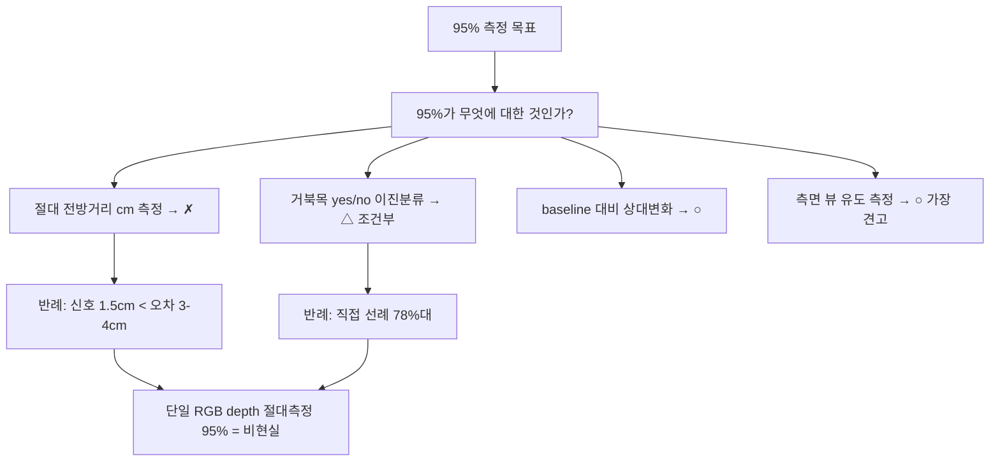

# 단일 RGB AI 깊이맵으로 거북목 95% 측정 가능한가 — 타당성 검증

사용자 목표: 맥북 **단일 정면 웹캠**에서 AI 깊이 추정(monocular depth)으로 거북목(FHP)을 **70%급 근사가 아니라 95%+ 정확도**로 측정. 이 문서는 그 타당성을 1차 출처 기반으로 **비판적·정직하게** 검증한다. 결론은 "과장도 비관도 아닌 근거 기반".

> 신뢰도: **[high]** = 다수 1차 출처 일치 / **[검증필요]** = 단일·약한 근거 / **[미검증]** = 1차 근거 못 찾음.

## 요약 다이어그램

---

## 1. "95%"를 먼저 분해해야 한다

"95% 정확도"는 측정 대상이 무엇이냐에 따라 전혀 다른 문제다. 혼동하면 잘못된 결론에 이른다.

| 해석 | 가능성 | 핵심 제약 |
|---|---|---|
| **(회귀) 절대 전방거리(cm)를 ±5%로 측정** | ✗ 비현실 | 깊이 절대오차(~3~4cm) > 신호(~1.5cm). §2 |
| **(분류) 거북목 yes/no 이진분류 정확도 95%** | △ 어려우나 조건부 | 직접 선례는 78%대. depth맵 단독 근거 없음. §3 |
| **(상대) 개인 baseline 대비 "더 숙였다" 탐지** | ○ 상대적으로 유망 | scale/계통오차 상쇄. "측정"이 아닌 "알림". §6 |
| **(측면) 측면 뷰·표준자세 유도 후 측정** | ○ 가장 견고 | 측면 CVA ICC 0.88~0.98. 단 정면 단일 웹캠 컨셉과 충돌. §6 |

> ⚠️ **지표 혼동 경고 [high].** depth 모델 논문이 보고하는 **δ1 accuracy 0.95~0.98**은 "예측 깊이가 정답의 1.25배 이내인 픽셀 비율"(= 장면 깊이 통계)이지, **거북목 판정 정확도가 아니다.** "Depth Anything δ1=0.98이니 거북목도 95% 되겠지"는 **범주 오류**다.

---

## 2. 결정적 반례 — 측정할 신호가 측정 오차보다 작다 [high]

거북목 측정의 본질은 **머리가 몸통보다 카메라 쪽으로 얼마나 나왔는가(전방 깊이차)** 를 재는 것이다. 그 신호의 크기와 AI depth의 오차를 직접 비교하면:

- **신호 크기:** 거북목의 머리 전방 이동은 **cm 단위**의 작은 신호다. Harrison 등(1996)은 흉부 대비 머리 전방 변위(C2–C7 sagittal balance)를 보고하는데, **무증상(정상) 피험자조차 평균 ~15mm 전방**이고 정상 범위를 **<16mm, 경증 16~25mm**로 본다 — 즉 15mm는 "거북목"이 아니라 *정상 기준선*이고, 거북목은 거기서 **추가로** 전방 이동한 양이다. 따라서 **정상과 거북목을 가르는 증분 신호는 종종 15mm보다도 작다.** 이 프레이밍은 SNR 논증을 더 *보수적*으로 만든다 — 측정 대상 신호가 더 작아지므로.
- **AI depth 오차:** 최고 수준 metric monocular depth(Depth-Anything-V2, ViT-L)의 실내(NYU-V2) **AbsRel ≈ 5.6%**. 50~70cm 거리에 적용하면 **평균 절대오차 ≈ 2.8~3.9cm**. Apple Depth Pro·Metric3D v2·UniDepth도 6~10%대로 같은 자릿수.
- **비교:** **평균 깊이 오차(~3cm)가 측정 대상 신호(~1.5cm)의 2배 이상이다.** 신호 대 잡음비(SNR) < 1.

> **이 비율에서는 단일 프레임 절대 측정의 SNR이 1 미만 → 신뢰할 측정이 원리적으로 불가능하다 [high].** 여기에 §4의 추가 오차원(relative scale 미정, 프레임간 flicker, 자기가림, 근거리 인물 편향)이 더해지면 반례는 더 강해진다.

> **"여러 프레임을 평균하면 오차가 √N로 줄어 신호를 잡을 수 있지 않나?" — 안 된다 [검증필요].** monocular depth 오차의 지배 성분은 *랜덤*이 아니라 **체계적(systematic) affine 왜곡**이다: 신경망(MiDaS·Depth Anything 계열 포함)은 **원거리 압축·근거리 확장(depth compression)** bias를 갖고 이미지 간 그 계수가 유의하게 상관한다(*Human-like monocular depth biases in deep neural networks*, PLOS Comput Biol 2025 — affine bias의 *존재*는 논문이 직접 보고). 여기서 **랜덤 오차만 √N로 줄고 계통 bias는 평균으로 제거되지 않는다**는 귀결은 그로부터의 타당한 추론이다(논문 verbatim 아님). ⇒ 다중 프레임 누적으로도 SNR<1을 구제하지 못한다.

⚠️ **정직한 한계 표기:** 위 AbsRel→cm 환산(60~70cm × 5.6% ≈ 3.4~3.9cm)은 산술 추정이며, NYU 벤치마크는 **방 전체 장면**에서 측정한 것이다. 책상 거리 **근접 인물·정면** 조건의 실제 오차는 이보다 **더 클 가능성**이 높아(벤치마크 도메인 밖), 반례 방향(불가)을 오히려 강화한다. [산술 추정/미검증]

### 2.1 이 반례의 적용 범위 — "절대 cm 측정"에 한정된다

위 SNR<1 논증은 **절대 거리(cm) 회귀**를 가정한다. 중요한 경계가 하나 있다.

- **깊이 *비율*과 *각도*는 (순수) scale에 대해 불변이다 [검증필요].** "두 점의 깊이 비율은 스케일 불변"(Lee & Kim, *Monocular Depth Estimation Using Relative Depth Maps*, CVPR 2019)이라는 성질에서, 거북목을 *절대 cm*가 아니라 **머리 깊이 / 어깨 깊이 비율(또는 각도)** 로 표현하면 미지의 scale·focal이 분자·분모에서 상당 부분 **상쇄**된다 → 그 표현에서는 SNR이 절대 cm보다 **유리**해질 수 있다(§6의 baseline 상대화가 같은 원리). ⚠️ **단, 비율이 상쇄하는 것은 순수 *scale*뿐이다.** MiDaS·Depth Anything류 기본 출력은 scale+shift의 **affine** 모호성을 가지므로(§4-1), shift 항이 남는 한 비율도 완전 불변이 아니다 — 이는 바로 아래 "비율이면 풀린다도 과장"을 오히려 강화한다.
- **그러나 "비율이면 풀린다"도 과장이다:** (a) AbsRel은 *장면 평균*이라 머리/어깨 **국소(local)** 깊이 오차가 그와 같다는 보장이 없고(국소가 더 클 수 있음), (b) depth 모델의 *ordering(머리가 어깨보다 앞)* 안정성 자체가 근접 인물·정면에서 직접 검증된 바 없다.
- **결론:** SNR<1은 "절대 측정"을 닫지만, **비율/각도 + baseline 상대화** 경로는 닫지 못한다 — 단 그 경로의 실효는 **자체 실측**으로만 확인된다(§7 미해결). 이것이 "절대측정 ✗ / 상대신호 ○"라는 본 문서 결론의 정밀한 근거다.

---

## 3. 선례 분석 — depth로 성공한 것은 "하드웨어 센서"뿐 [high]

### 3.1 PreventFHP — 가장 직접적 선례이자 결정적 단서

정면 카메라로 성공한 유일한 FHP 시스템 PreventFHP(Lee et al., 2014 IEEE Haptics Symp)는 turtlemeck과 거의 동일한 컨셉이다 — **모니터 위 정면 카메라로 카메라↔이마 거리와 카메라↔몸통 거리의 차이**를 임계와 비교. **정확도 98.0%, 오경보율 2.0%** 보고.

> **그러나 핵심 단서: 이것은 하드웨어 depth 센서(Microsoft Kinect)** 이지, RGB로부터 추정한 depth가 아니다. *"depth image analysis was used to measure the distances between the camera and the forehead, as well as between the camera and the torso."*([algorithm/pose-estimation/viewpoint-robust-geometry.md §3](../algorithm/pose-estimation/viewpoint-robust-geometry.md)에서도 동일 귀속)

즉 **"정면 + 깊이차"라는 turtlemeck 가설의 물리 원리는 검증됐다.** 검증되지 않은 것은 정확히 사용자가 메우려는 지점 — **"단일 RGB로 그 깊이를 충분히 정확하게 얻을 수 있는가"** 이고, §2가 그 답을 "현재로선 아니오"로 가리킨다.

PreventFHP 98.0% 정확도·오경보 2.0%는 **IEEE 1차 abstract(doc 6775470)에 직접 보고**된다. 메커니즘 인용문 verbatim만 후속 논문 재인용 경유이며, 원논문은 "저가 상용 depth camera(= Kinect)"를 명시한다.

### 3.2 단일 RGB 추정 depth 자세측정 — 정면 거북목 선례는 부재 [high]

**단일 RGB monocular depth맵으로 *정면 거북목*을 측정·검증한 선행연구는 발견되지 않았다.** 단일 RGB로 자세를 다룬 연구는 대부분 depth맵이 아니라 **2D/3D pose keypoint**를 쓴다.

⚠️ **인접 반례 — GAMA-Net(arXiv:2507.22691, 2025):** 단일 RGB에서 등 깊이(back depth)를 추정해 척추 형태를 "최대 97%"로 추정한다는 연구는 **존재한다.** 그러나 turtlemeck엔 적용 불가다: ① **후면(등 노출 surface) 뷰**, ② GT가 **하드웨어 depth 스캐너**(monocular는 추론 입력일 뿐 — PreventFHP와 동일 패턴), ③ 대상이 **척추측만(scoliosis)** = 등 표면에 수 cm급으로 드러나는 *큰 측방* 신호(정면 거북목의 ~cm 전후 미세변위와 신호 종류·크기가 다름), ④ **"97%"는 δ1/δ2/δ3 threshold accuracy**(§1에서 경고한 장면-통계 지표)이지 자세 절대 측정 정확도가 아니다. ⇒ "정면·전후 미세변위" 조건의 선례 부재는 유효하며, 이 사례는 오히려 §1의 지표 혼동을 실증한다.

### 3.3 가장 근접한 단일 RGB 선례조차 78%대

정면 단일 RGB → 3D pose(VideoPose3D) → GCN으로 거북목을 분류한 가장 직접적 연구(JMIR Formative 2024, e55476): **테스트 정확도 78.27%, FHP 민감도(recall) 73.97%, F1 77.54%**(2,387 샘플, 물리치료사 라벨). **95% 목표와 17%p 차이.** 이 연구는 애초에 "단일 어깨 각만으론 FHP/정상 분포가 겹쳐 부족"하다는 결론에서 출발한, 정면 단일 RGB의 한계를 보여주는 사례다([algorithm/pose-estimation/viewpoint-robust-geometry.md §1](../algorithm/pose-estimation/viewpoint-robust-geometry.md)).

### 3.4 반례 후보 감사 — 95%에 가까운 결과는 조건이 다르다 [high]

웹캠-only 목표를 반박할 수 있는지 확인하기 위해 FHP·머리자세 관련 "높은 정확도" 선례를 별도로 점검했다.

| 선례 | 보고 수치 | 왜 turtlemeck 반례가 아닌가 |
|---|---:|---|
| 정면/단일 이미지 2D→3D pose→GCN (JMIR 2024) | **78.27% acc / 77.54% F1** | 가장 유사한 RGB-only 선례지만 95%에 크게 못 미침 |
| 얼굴 이미지 FHP 분류 (IJASEIT 2024) | **0.69 acc / 0.69 recall** | 정면 얼굴 기반 직접분류도 낮음 |
| 측면 landmark + ML (BMC Med Inform Decis Mak 2023) | **82.4% acc / 85.5% spec** | 측면 sagittal feature 기반, 정면 웹캠 아님 |
| CVA 앱/사진 계측 | sensitivity **94.4%**, specificity **84.6%** 또는 ICC 0.9대 | 마커(C7·tragus)·측면사진 계측 신뢰도이며 end-to-end 정면 FHP 분류가 아님 |
| Kinect depth head/posture 계측 | ICC **>0.98~0.99**, 오차 수 도 | **하드웨어 depth** 사용, monocular RGB 아님 |
| wearable magnetometer FHP 시스템 | calibration mode **~95.6%** | 착용 센서 기반, 웹캠-only 조건과 충돌 |

**결론:** 확인한 1차/공식 근거 중 **단일 정면 RGB 또는 monocular estimated depth만으로 일반 사용자 FHP를 95%+ 측정·분류한 반례는 없었다.** 95% 근처 결과는 측면/마커/하드웨어 depth/착용 센서/다른 지표 중 하나를 전제로 한다.

---

## 4. 단일 RGB depth의 추가 오차원 [high]

§2의 평균 오차에 더해, 거북목 측정을 더 어렵게 하는 구조적 요인들:

1. **Scale/shift ambiguity.** 강력한 모델 다수(Depth Anything 등)는 affine-invariant **relative** depth라 절대 cm 자체가 없다. metric 변환·metric 모델도 §2의 절대오차가 남고, intrinsic(focal) 의존 모델은 **미지의 맥북 웹캠 focal**에서 스케일이 틀어진다([metric-depth-models](metric-depth-models/README.md)).
2. **프레임간 일관성(temporal flicker).** 단일 이미지 depth 모델은 비디오 적용 시 프레임마다 scale이 흔들려 수 mm 신호가 flicker 노이즈에 묻힌다.
3. **자기가림·텍스처 부재.** 옷·머리카락·벽 등에서 오차가 크고, 머리/목/어깨 픽셀에 의자·배경이 혼입된다(깊이맵에서 "어느 픽셀이 머리/몸통"인지 분리하려면 별도 segmentation/pose가 필요 — Apple Vision segmentation은 z값이 없어 영역 분리 보조만 가능, [apple-vision-depth](apple-vision-depth/README.md)).
4. **정면 뷰의 기하학적 불리함.** 거북목의 전후(A-P) 변위는 정면에서 카메라 광축과 일치해 2D 투영으로는 거의 사라진다 → 오로지 depth축에 의존 → §2의 깊이 오차에 전적으로 취약. 임상적으로도 거북목은 **시상면(측면 뷰)** 에서 가장 잘 보인다.

---

## 5. 반례의 반례 — "그래도 가능하다"는 주장 검토

균형을 위해 95%를 뒷받침할 수 있는 근거도 검토했다. 모두 **조건이 turtlemeck과 다르다.**

- **측면 사진 CVA는 매우 신뢰도 높다**(photogrammetry 타당성 r≈0.89, ICC 0.88~0.98). → 단 **측면 뷰 + 해부학적 마커(tragus·C7)** 전제. 정면 단일 웹캠·마커 없음과 근본적으로 다르다.
- **2D pose 기반 앉음자세 분류는 90%+ 보고 사례.** → 단 depth가 아니라 2D 키포인트 기하이고, "거북목 yes/no"가 아니라 더 큰 자세 카테고리 분류라 과제 난이도가 다르다.
- **metric depth δ1 0.95~0.98.** → §1의 지표 혼동. 장면 통계지 거북목 정확도 아님.
- **상업 웹캠 자세앱의 "95%+" 자기보고**(예: SitSense류 acc ~97%·F1 ~95% 주장). → **1차 논문이 아닌 제품 자기보고**라 검증 불가 [검증필요]. 게다가 이들은 **depth가 아니라 2D pose(MediaPipe) + 개인 baseline 상대화**로 동작하며 스스로 "임상 절대 측정이 아닌 상대 변화"라 포지셔닝한다 — 즉 본 문서 §6 권고와 같은 설계지 "AI depth 절대측정 95%"의 근거가 아니다.

⇒ "95% 가능" 근거들은 전부 **(a) 측면 뷰, (b) 마커/표준화, (c) 더 거친 분류 과제, (d) 다른 지표, (e) depth 아닌 2D pose+baseline**라는 조건에서만 성립하며, **정면 단일 웹캠 + 마커 없음 + 미세 전방 이동 + depth 절대 측정**이라는 turtlemeck 조건에는 적용되지 않는다.

---

## 6. 조건부 성립 시나리오 — 95%를 어떻게 재정의하면 현실적인가

"AI depth로 95% **절대 측정**"은 비현실적이지만, 목표를 재정의하면 실용 정확도는 가능하다.

1. **상대 변화 알림으로 재정의(가장 실용적).** 절대 cm가 아니라 **같은 세션 내 개인 baseline 대비 상대 깊이/각도 변화**만 본다. scale/계통오차가 상쇄되고, depth는 절대값이 아니라 **순서(머리가 어깨보다 앞)** 신호로 쓰인다. "측정 기기"가 아니라 "자세 리마인더" 포지셔닝. → 기존 [algorithm](../algorithm/algorithm-draft.md)의 baseline 상대화 결론과 정확히 일치.
2. **depth를 pose의 보강 신호로.** depth맵 단독이 아니라, 기존 2D/3D pose 파이프라인에 **머리-어깨 상대 깊이 순서**를 한 축으로 추가(다중 feature). Core ML `coreml-depth-anything-v2-small`은 ~50MB·25ms로 이 보강을 *기술적으로는* 감당한다([apple-vision-depth](apple-vision-depth/README.md), [depth-anything-v2](depth-anything-v2/README.md)).
3. **개인 baseline 보정 필수.** 세션 시작 시 중립 자세를 캡처해 상대 비교의 기준점을 만든다.
4. **측면 뷰 유도(가장 견고한 정밀화).** 정밀 판정이 필요하면 사용자에게 측면/3-4 착석 또는 카메라 측면 배치를 유도. 측면 CVA는 임상적으로 신뢰 가능. 단 현재 정면 단일 웹캠 컨셉을 넓혀야 한다.

> 이 조합이면 실용 정확도(80%대 후반~90%대)는 노려볼 여지가 있으나, **이는 "AI depth맵으로 95% 측정"이 아니라 "pose + depth 보강 + baseline + 측면유도"라는 다른 설계**다.

---

## 7. 결론 및 권고

- **단일 웹캠 + AI monocular depth로 거북목을 95%+ 절대 측정하는 것은 현재 1차 근거상 비현실적이다 [high].** 측정할 신호(~1.5cm)가 최선의 깊이 오차(~3~4cm)보다 작고(SNR<1), 단일 RGB 추정 depth로 자세를 측정한 검증된 선례가 없으며, 가장 근접한 선례도 78%대다.
- **AI depth는 기존 결론을 뒤집지 못하고 정량적으로 보강한다.** "절대 측정 불가, baseline 상대 신호가 한계"는 depth 모델 도입 후에도 유효하다.
- **현실적 권고:** depth를 *절대 측정 도구*가 아니라 *상대 보강 신호*로, ①목표 재정의(측정→상대변화 알림) ②pose+depth 다중 feature ③개인 baseline 보정 ④측면 뷰 유도를 결합. 95%는 "거북목 절대 측정"이 아니라 "명확한 악화의 안정적 탐지"로 재해석할 때 의미를 갖는다.
- **미해결(자체 실측 필요):** Core ML depth를 책상 거리 정면 인물에 실제 적용했을 때의 머리-어깨 상대 깊이 순서 안정성·프레임간 분산. 벤치마크가 아닌 turtlemeck 도메인 직접 측정이 없으면 위 결론의 정량 부분은 보수적으로 유지한다.

---

## 참고 자료

- 거북목 머리 전방 이동 ~15mm (Harrison 등 / Dynamic Chiropractic): <https://dynamicchiropractic.com/article/31630-the-forward-head-posture>
- Depth Anything V2 AbsRel 0.056 (arXiv:2406.09414): <https://arxiv.org/html/2406.09414v2>
- monocular depth metric/relative·scale-shift ambiguity 개요: <https://huggingface.co/blog/Isayoften/monocular-depth-estimation-guide>
- PreventFHP (Kinect depth, 98%) — IEEE Haptics Symp 2014: <https://ieeexplore.ieee.org/document/6775470/>
- 단일 RGB→3D pose→GCN FHP 분류 78.27% (JMIR Formative 2024, e55476): <https://formative.jmir.org/2024/1/e55476> / <https://www.ncbi.nlm.nih.gov/pmc/articles/PMC11384178/>
- 측면 landmark + ML FHP 분류 82.4% (BMC Med Inform Decis Mak 2023): <https://link.springer.com/article/10.1186/s12911-023-02285-2>
- 얼굴 이미지 FHP 분류 0.69 accuracy (IJASEIT 2024): <https://ijaseit.insightsociety.org/index.php/ijaseit/article/view/18519>
- Kinect head tracker, hardware depth 기반 고신뢰 계측: <https://mrl.snu.ac.kr/research/ProjectKHT/kht_paper.pdf>
- Kinect semi-automatic head posture scoring: <https://www.dovepress.com/accuracy-and-correlation-of-the-kinect-based-semi-automatic-scoring-me-peer-reviewed-fulltext-article-OPTH>
- 측면 CVA photogrammetry 신뢰도 (ICC 0.88~0.98): <https://pmc.ncbi.nlm.nih.gov/articles/PMC11957747/>
- FHP 시상면/측면 뷰 우위 (Physiopedia): <https://www.physio-pedia.com/Forward_Head_Posture>
- 단안 깊이축 오차 in-plane의 2~3배 (Nature Sci Rep 2025): <https://pmc.ncbi.nlm.nih.gov/articles/PMC12589393/>
- monocular depth 오차의 체계적 affine bias(평균으로 안 줄어듦) (PLOS Comput Biol 2025): <https://journals.plos.org/ploscompbiol/article?id=10.1371/journal.pcbi.1013020>
- 두 점의 깊이 비율은 (순수)scale 불변 — Lee & Kim, Monocular Depth Estimation Using Relative Depth Maps (CVPR 2019): <https://openaccess.thecvf.com/content_CVPR_2019/html/Lee_Monocular_Depth_Estimation_Using_Relative_Depth_Maps_CVPR_2019_paper.html>
- 단일 RGB→back depth→척추측만 추정 GAMA-Net(δ-threshold "97%", 후면·하드웨어 GT, 도메인 불일치) (arXiv:2507.22691, 2025): <https://arxiv.org/abs/2507.22691>
