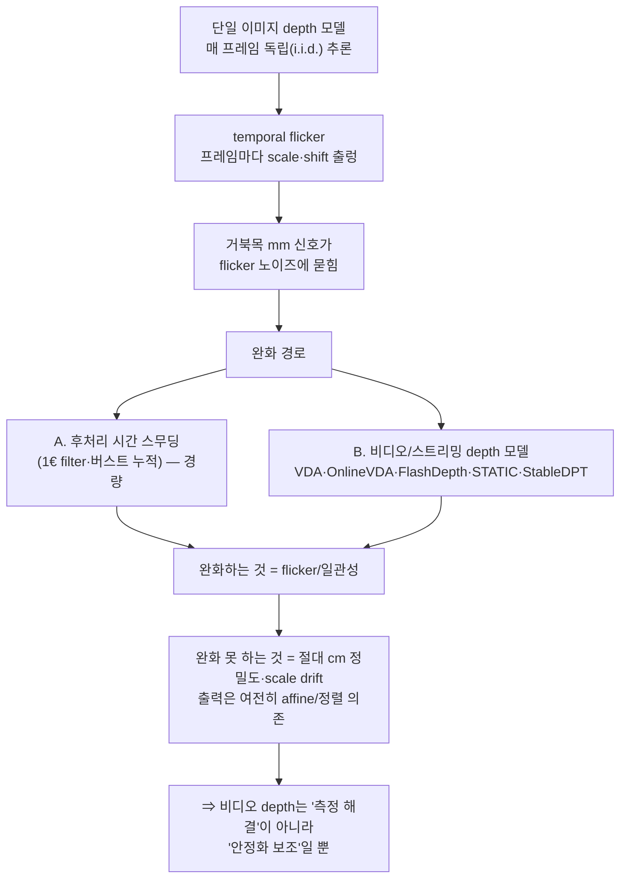

# 시계열·비디오 depth 일관성 — flicker는 줄여도 절대정밀도는 못 푼다

`turtlemeck`이 Core ML monocular depth를 도입한다면, **단일 이미지 depth 모델을 매 프레임 독립 추론**할 때 생기는 시간적 불안정(temporal flicker)이 거북목의 mm급 신호를 노이즈에 묻을 수 있다. 이 문서는 그 flicker의 원인, 이를 줄이는 비디오/스트리밍 depth 모델군, 그리고 **"flicker를 줄여도 절대 cm 정밀도와 scale drift는 그대로"**라는 핵심 한계를 1차 출처로 정리한다. 기존 [`../algorithm/pose-estimation/monocular-limits.md` §5](../algorithm/pose-estimation/monocular-limits.md)의 시계열 일관성 논지를 depth 모델 축으로 잇는다.

> 신뢰도 표기: **[high]** = 다수 1차 출처 일치 / **[검증필요]** = 단일·약한 근거 / **[미검증]** = 1차 근거 못 찾음.

## 요약 다이어그램

---

## 1. flicker의 원인 — i.i.d. 가정 [high]

- 단일 이미지 depth 모델은 각 프레임을 독립적으로 처리하므로, 같은 장면이라도 추정 scale·shift가 흔들린다. Video Depth Anything은 Depth Anything V2 같은 static-image depth 모델이 비디오에서 flicker와 motion blur를 낸다고 설명하고, oVDA는 non-metric single-image 모델을 프레임별 적용하면 temporal flicker가 생긴다고 명시한다. ChronoDepth도 single-image depth가 프레임 간 i.i.d. 가정에 놓여 temporal inconsistency에 취약하다고 정리한다. [high]
- turtlemeck 함의: 머리·어깨 영역의 평균 깊이를 매 프레임 뽑으면, **머리-어깨 깊이차 자체가 프레임마다 출렁인다.** 거북목의 증분 신호(§[posture-feasibility.md §2](posture-feasibility.md), 종종 <15mm)는 이 flicker보다 작을 수 있어, 단일 프레임 비교는 신뢰 불가.

## 2. 비디오/스트리밍 depth 모델군 — 무엇을 고치고 무엇을 못 고치나

flicker를 직접 겨냥한 2024–2026 모델들을 비교한다. **공통점: 시간적 일관성은 개선하지만 절대 metric 정밀도는 별개 문제**다.

| 모델 | 접근 | 지연/실시간성 | turtlemeck 관점 |
|---|---|---|---|
| **Video Depth Anything** (2501.12375, CVPR'25 Highlight) | Depth Anything V2 백본 + spatial-temporal head, 초장시간 영상 일관성 | Small 30 FPS 보고(A100 기준) | flicker↓ 확립. 단 **출력은 affine-invariant**이고, 평가는 whole-video scale/shift alignment 뒤 성능이라 절대 cm 보장은 아님 [high] |
| **Online Video Depth Anything** (2510.09182, 2025) | causal·저메모리 스트리밍, cached latent feature | 42 FPS(A100), 20 FPS(Jetson) 보고 | 라이브 웹캠 구조에 더 적합하지만, 저자도 긴 시퀀스 scale drift와 trailing artifact를 한계로 명시 [high/검증필요] |
| **FlashDepth** (2504.07093, 2025) | 2K 해상도 실시간 스트리밍 depth | **2044×1148 24 FPS** 보고(A100) | 고해상도 실시간 후보지만 서버 GPU 기준. 모델 규모·발열·Core ML 변환은 별도 검증 필요 [검증필요] |
| **STATIC** (2412.01090, 2024) | Surface normal 기반 static/dynamic 영역 분리 + SNS/MS 모듈 | 4×RTX 4090 학습 보고 | optical flow·카메라 파라미터 없이 temporal consistency를 학습하지만, 단순 후처리가 아니라 별도 video depth 모델이므로 온디바이스 적용성은 낮음 [high/검증필요] |
| **StableDPT** (2601.02793, 2026) | 임의 image depth 모델 + temporal cross-attention 어댑터 | 플러그인형 | Core ML로 올린 DA-V2 small에 **시간 안정화 어댑터**를 덧대는 개념과 정합 [검증필요] |

> ⚠️ 위 지표·FPS는 각 논문 자체 보고(대개 일반 영상·서버 GPU)이며, **맥북 ANE·책상 근접 인물 도메인 실측은 어느 출처에도 없다 [미검증].**

## 3. 핵심 한계 — flicker를 없애도 절대 cm는 안 풀린다 [high]

- 시간 일관성 개선은 **프레임 간 *상대적* 떨림**을 줄이는 것이지, **절대 깊이값의 정확도**를 올리는 것이 아니다. Video Depth Anything은 "affine-invariant depth"를 채택하고 전체 비디오에 같은 scale·shift를 공유한다고 설명한다. 즉 metric 벤치 수치가 좋아도, 이는 GT와의 scale/shift alignment 뒤 평가이지 turtlemeck이 바로 쓸 수 있는 절대 cm가 아니다.
- **scale drift도 남는다.** 상대(affine) 출력 모델은 장면 변화에 따라 전역 scale이 천천히 흐를 수 있어, 긴 세션에서 baseline 대비 비교의 기준이 미끄러질 수 있다. oVDA는 scale drift를 경쟁 모델보다 낮췄지만, 1000프레임 이후에도 여전히 drift가 남는다고 한계를 적었다.
- ⇒ §[posture-feasibility.md §2](posture-feasibility.md)의 SNR<1 반례는 비디오 depth로 **구제되지 않는다.** 비디오 depth는 "측정 가능성"을 바꾸지 못하고, 채택 시 **노이즈 안정화 보조**로만 가치가 있다.

## 4. turtlemeck 적용 — 경량 시계열이 이미 그 원리다 [high]

1. **기존 버스트 누적 + 1€ 스무딩이 시간 일관성의 경량 구현이다.** 새 비디오 depth 모델을 도입하지 않아도, depth를 보조 신호로 쓸 때 **버스트 내 프레임 간 일관성**(중앙값·연속성)을 활용하면 flicker를 상당 부분 흡수한다(= [`monocular-limits.md` §5](../algorithm/pose-estimation/monocular-limits.md)).
2. **무거운 비디오 depth 모델은 비권장(상시 추론).** Online VDA/FlashDepth류 스트리밍은 라이브에 구조적으로 맞지만, **연속 추론 발열·배터리**([README.md §4](README.md))가 메뉴바 상주 앱과 충돌한다. 주기 burst 구조를 유지하라.
3. **StableDPT류 어댑터는 "탐색 가치"로만.** Core ML DA-V2 small에 시간 안정화 어댑터를 덧대는 경로는 개념상 정합하나, Core ML 변환·ANE 실측이 전무하므로 [미검증]. 채택 전 자체 변환·지연·발열 측정이 선결.

## 5. 미해결 (자체 실측 필요)

- 책상 근접 정면 인물에서 **머리-어깨 깊이차의 프레임 간 분산**(flicker 크기)이 거북목 증분 신호(<15mm)보다 작은가/큰가 — turtlemeck 도메인 직접 측정 없음.
- 버스트 누적 + 1€만으로 충분한가, 아니면 STATIC/StableDPT류 시간보정이 유의미한 SNR 이득을 주는가.
- 맥북 ANE에서 스트리밍 depth(Online VDA/FlashDepth)의 실제 지연·발열·throttling.

---

## 참고 자료

- Video Depth Anything (static-image depth의 flicker, affine-invariant 출력, 초장시간 일관성, CVPR 2025 Highlight): <https://arxiv.org/abs/2501.12375>
- Online Video Depth Anything (single-image non-metric depth의 flicker, causal·저메모리 스트리밍, scale drift 한계): <https://arxiv.org/abs/2510.09182>
- FlashDepth (2K 실시간 스트리밍 video depth, 24 FPS): <https://arxiv.org/abs/2504.07093>
- STATIC (Surface Temporal Affine, optical-flow·카메라 파라미터 없는 video depth 모델): <https://arxiv.org/abs/2412.01090>
- StableDPT (image depth 모델에 temporal cross-attention 어댑터): <https://arxiv.org/abs/2601.02793>
- ChronoDepth (single-image depth의 i.i.d. 가정과 temporal inconsistency 정리): <https://arxiv.org/abs/2406.01493>
- (교차참조) 시계열 일관성·깊이 모호성 완화: [`../algorithm/pose-estimation/monocular-limits.md`](../algorithm/pose-estimation/monocular-limits.md) §5
- (교차참조) 단일프레임 SNR<1 반례: [posture-feasibility.md](posture-feasibility.md) §2
