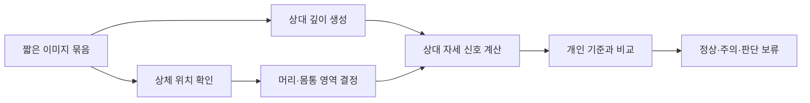

# 8분 발표 자료

발표 자료는 10장으로 구성한다. 슬라이드에는 핵심 문장과 그림만 넣고, 상세 내용은 발표 대본으로 설명한다. 이 구성을 옮긴 편집용 초안이 `turtlemeck-presentation.pptx`에 있으며, 글꼴 설치와 마무리 절차는 [제작 실행 가이드](production-guide.md)를 따른다.

## 시간 구성

| 슬라이드 | 내용 | 시간 |
|---:|---|---:|
| 1 | 작품 소개 | 20초 |
| 2 | 개발 배경 | 40초 |
| 3 | 해결하려는 문제 | 40초 |
| 4 | 사용자 흐름 | 50초 |
| 5 | 분석 방법 | 70초 |
| 6 | 판단 안정성 | 50초 |
| 7 | 개인정보와 적용 범위 | 35초 |
| 8 | 실행 시연 | 100초 |
| 9 | 프로그램 구조 | 40초 |
| 10 | 결론 | 35초 |
| 합계 |  | 8분 |

## 1. 작품 소개

슬라이드 제목: 카메라로 자세 습관을 점검하는 macOS 앱

화면에 표시할 내용:

- turtlemeck
- 별도 장비 없이 내장 카메라 사용
- 개인 기준 자세와 비교해 필요한 순간에 알림

발표 대본:

안녕하세요. turtlemeck는 장시간 컴퓨터를 사용할 때 자세를 스스로 확인하기 어려운 문제를 해결하기 위해 만든 macOS 메뉴 막대 앱입니다. 별도 센서 없이 Mac 내장 카메라를 사용하고, 사용자의 바른 자세를 기준으로 변화가 계속될 때 알림을 제공합니다.

권장 화면: 앱 아이콘과 메뉴 막대 화면을 함께 배치한다.

## 2. 개발 배경

슬라이드 제목: 자세는 자주 무너지지만 계속 의식하기 어렵다

화면에 표시할 내용:

- 장시간 노트북 작업으로 나빠진 목·어깨, 가족의 목디스크 수술 경험
- 화면에 집중하면 자세 변화를 알아차리기 어려움
- 타이머 알림은 실제 자세와 관계없이 울림
- 수업에서 배운 내용으로, 모든 노트북에 있는 웹캠 하나만 사용

발표 대본:

이 작품은 팀원의 경험에서 시작했습니다. 하루 종일 노트북 화면만 들여다보면서 목과 어깨가 나빠지는 것을 느꼈고, 최근에는 가족 중 삼촌이 목디스크로 수술을 받았습니다. 그런데 컴퓨터 작업에 집중하면 머리가 앞으로 이동하거나 상체가 구부러져도 바로 알아차리기 어렵고, 일정 시간마다 울리는 일반 알림은 현재 자세와 관계없이 사용자를 방해합니다. 그래서 인공지능 수업에서 배운 내용을 바탕으로, 별도 장비 없이 모든 노트북에 있는 웹캠 하나로 실제 자세 변화를 확인하는 도구를 만들기로 했습니다. 가족과 주변 사람들이 모두 MacBook을 사용하고 있어 macOS 전용 앱으로 개발했습니다.

권장 화면: 바른 자세와 앞으로 기운 자세를 단순한 실루엣으로 비교한다.

## 3. 해결하려는 문제

슬라이드 제목: 측정이 아니라 습관 형성을 돕는다

화면에 표시할 내용:

- 개인마다 다른 기준 자세 반영
- 순간 동작보다 지속되는 변화 확인
- 방해를 줄인 알림
- 의료 진단이나 절대 거리 측정은 하지 않음

발표 대본:

turtlemeck의 목표는 목의 각도나 거리를 의료적으로 측정하는 것이 아닙니다. 사용자가 직접 잡은 중립 자세를 기준으로 두고, 평소보다 머리가 몸통 앞쪽으로 이동한 상태가 이어지는지를 확인합니다. 한 번의 불안정한 결과로 바로 경고하지 않고, 의미 있는 변화가 계속될 때만 알려 주는 자세 습관 도구입니다.

## 4. 사용자 흐름

슬라이드 제목: 한 번 보정하고, 필요한 순간에 확인한다

화면에 표시할 내용:

```text
앱 실행 → 카메라 권한 → 기준 자세 보정 → 주기적 점검 → 상태 확인·알림
```

- 메뉴 막대에서 현재 상태와 다음 점검 시간 확인
- 점검 주기 15~180초 설정
- 확인, 중지, 재보정 제공
- 오늘의 자세 시간과 알림 횟수 제공

발표 대본:

최초 실행 시 카메라 권한을 허용하고 바른 자세를 유지하면 개인 기준이 저장됩니다. 이후 앱은 설정한 주기에 따라 짧게 자세를 점검합니다. 사용자는 메뉴 막대에서 현재 상태와 다음 점검 시간을 볼 수 있고, 필요할 때 즉시 확인하거나 점검을 중지하고 다시 보정할 수 있습니다. 오늘의 바른 자세 시간과 주의 자세 시간도 함께 제공합니다.

권장 화면: 최초 보정 화면, 정상 상태, 오늘 요약 화면을 순서대로 배치한다.

## 5. 분석 방법

슬라이드 제목: 위치와 상대 깊이를 결합해 개인 기준과 비교한다

화면에 표시할 내용:



- PoseNet과 Vision 2D: 머리와 어깨 위치 확인
- Depth Anything V2 Small: 한 이미지 안의 상대적인 가까움과 멂 표현
- 자세 분석 로직: 머리와 몸통의 상대 신호를 기준 자세와 비교

발표 대본:

한 번의 점검에서는 짧게 여러 장을 촬영합니다. 먼저 PoseNet을 사용하고 필요한 경우 Apple Vision 2D를 사용해 머리와 양쪽 어깨 위치를 찾습니다. Depth Anything V2 Small은 같은 이미지에서 물체 사이의 상대적인 가까움과 멂을 표현하는 깊이 지도를 만듭니다. 앱은 두 결과를 이용해 머리와 몸통 영역을 정하고 상대적인 자세 신호를 계산합니다. 이 값은 센티미터 같은 절대 거리가 아니라 개인의 기준 자세와 비교하기 위한 값입니다.

권장 화면: 원본 이미지, 상체 위치 표시, 상대 깊이 이미지, 최종 상태를 같은 순서로 보여 준다. 촬영 당사자의 동의를 받은 자료만 사용한다.

## 6. 판단 안정성

슬라이드 제목: 애매한 입력은 나쁜 자세로 단정하지 않는다

화면에 표시할 내용:

- 여러 장(최대 5장)의 대표값 사용
- 사람·상체·깊이 품질 확인
- 개인 기준과 비교
- 연속된 악화 결과에서 주의 상태 확정
- 판단하기 어려우면 `noEval`

발표 대본:

단일 이미지에는 움직임과 카메라 노이즈가 포함될 수 있어 한 번의 점검에서 여러 장, 최대 5장의 결과를 모아 대표값을 사용합니다. 사람이 보이지 않거나 모델·깊이 정보가 불안정한 경우에는 해당 결과를 제외하고 판단을 보류합니다. 신뢰 가능한 머리는 보이지만 가림·잘림·머리 처짐 때문에 정상 자세를 확인할 수 없는 패턴은 기술 실패와 구분해 악화 증거로 봅니다. 이 경우도 한 번만으로 단정하지 않고 악화 결과가 연속해서 확인될 때 주의 상태로 바꿉니다.

권장 화면: `good`, `bad`, `noEval` 세 상태의 의미를 간단한 표로 보여 준다.

## 7. 개인정보와 적용 범위

슬라이드 제목: 자세 분석은 기기 안에서 끝난다

화면에 표시할 내용:

- 모델과 분석 로직을 앱에 포함
- 운영 모드에서 이미지 저장·전송 없음
- 설정, 개인 기준과 자세 통계만 로컬 저장
- 웰니스 알림 도구이며 의료기기가 아님

발표 대본:

분석 모델과 판단 로직은 앱에 포함되어 있어 운영 모드의 이미지가 외부 서버로 전송되지 않습니다. 촬영 이미지 자체도 저장하지 않고 설정, 개인 기준과 자세 통계만 기기에 저장합니다. 이 앱은 자세 습관을 돕는 일반 웰니스 도구이며 질병을 진단하거나 치료하는 의료기기가 아닙니다.

## 8. 실행 시연

슬라이드 제목: 실제 사용 흐름

시연 순서:

1. 메뉴 막대에서 앱을 연다.
2. 기준 자세 보정 상태를 보여 준다.
3. 바른 자세에서 `확인`을 실행하고 정상 상태를 보여 준다.
4. 점검 주기를 15초로 설정한다.
5. 머리를 앞으로 이동한 자세를 두 번의 점검 동안 유지한다.
6. 주의 상태와 자세 알림을 보여 준다.
7. 자세를 바로잡은 뒤 회복 상태와 오늘 요약을 보여 준다.
8. 알림 중지, 20분 스누즈와 재보정 기능을 짧게 보여 준다.

발표 대본:

먼저 앱을 열면 현재 상태와 다음 점검 시간을 확인할 수 있습니다. 기준 자세는 좋은 자세를 유지한 상태에서 보정합니다. 바른 자세에서는 정상으로 표시됩니다. 점검 주기를 15초로 바꾸고 머리가 앞으로 이동한 자세를 유지하겠습니다. 한 번의 결과가 아니라 연속된 악화 결과가 확인되면 주의 상태로 바뀌고 알림이 표시됩니다. 자세를 바로잡으면 다시 정상 상태로 회복하고 오늘 요약에 상태 변화가 반영됩니다.

시연 전에 카메라·알림 권한과 기준 자세 보정을 완료한다. 현장 판정이 지연될 경우를 대비해 같은 과정을 녹화한 영상을 발표 자료에 넣는다.

## 9. 프로그램 구조

슬라이드 제목: 입력, 판단, 상태와 출력을 분리했다

화면에 표시할 내용:

```text
카메라 입력
  ↓
상체 위치·상대 깊이
  ↓
프레임 분석·여러 장 집계
  ↓
개인 기준 비교·상태 전이
  ↓
메뉴 막대 UI·알림·로컬 통계
```

- Swift와 SwiftUI 기반 macOS 앱
- Core ML·Vision·AVFoundation 사용
- 분석 단계별 테스트와 빌드 검증
- Apple Silicon과 Intel을 포함하는 Universal2 패키지

발표 대본:

프로그램은 카메라 입력, 모델 실행, 자세 신호 계산, 상태 전이, 사용자 화면과 알림을 분리했습니다. Swift와 SwiftUI를 사용하고 카메라, Vision과 Core ML 같은 macOS 기본 프레임워크를 활용했습니다. 판단 로직은 입력 품질, 개인 기준 비교와 상태 전이를 각각 테스트하며, 최종 앱은 Apple Silicon과 Intel Mac에서 실행할 수 있도록 Universal2로 패키징합니다.

## 10. 결론

슬라이드 제목: 사용자를 감시하지 않고 자세를 떠올리게 한다

화면에 표시할 내용:

- 별도 장비 없는 자세 습관 도구
- 개인 기준과 지속성 중심의 판단
- 온디바이스 처리와 최소 저장
- macOS 작업 흐름을 방해하지 않는 메뉴 막대 앱

발표 대본:

turtlemeck는 자세를 정밀 진단하는 시스템이 아니라 사용자가 자세를 다시 떠올릴 수 있게 돕는 도구입니다. 별도 장비 없이 개인 기준과 지속되는 변화에 집중하고, 모든 분석을 기기 안에서 처리합니다. 메뉴 막대에 조용히 머물다가 필요한 순간에만 알려 주어 장시간 컴퓨터 작업 중 바른 자세 습관을 만드는 것이 이 작품의 목표입니다. 감사합니다.

## 예상 질문

### 왜 일반 타이머 알림보다 나은가

정해진 시간마다 무조건 알리지 않고 실제 자세 변화가 계속될 때만 알린다. 사용자는 점검 주기와 알림 방식을 조정하거나 잠시 중지할 수 있다.

### 깊이 모델만으로 자세를 판단하는가

아니다. 2D 상체 위치로 머리와 몸통 영역을 정하고 Depth Anything V2의 상대 깊이 정보와 결합한다. 최종 판단은 개인 기준, 여러 프레임의 안정성과 연속된 상태 변화를 함께 사용한다.

### 실제 거리나 목 각도를 측정하는가

아니다. 단안 카메라의 상대 깊이를 개인 기준과 비교하며 절대 거리나 임상 각도를 제공하지 않는다.

### 사람이 움직이거나 화면에서 벗어나면 어떻게 되는가

사람 부재·모델·깊이 품질 같은 기술적 입력이 부족하면 `noEval`로 처리한다. 신뢰 가능한 머리는 보이지만 가림·잘림·머리 처짐 때문에 정상 자세를 확인할 수 없는 패턴은 악화 증거로 구분하되, 한 번만으로 주의 상태를 확정하지 않는다.

### 영상은 어디에 저장되는가

운영 모드에서는 저장하거나 외부로 전송하지 않는다. 기준 자세의 수치와 자세 통계, 설정만 로컬에 저장한다. 개발자용 디버그 모드는 검증을 위해 명시적으로 실행한 경우에만 로컬 디버그 파일을 만든다.

### 의료기기인가

아니다. 질병이나 통증을 진단·치료·예방하지 않는 일반 웰니스 및 자세 알림 도구다.
