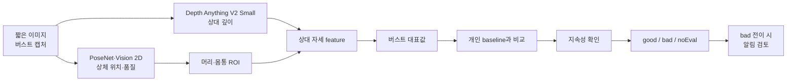
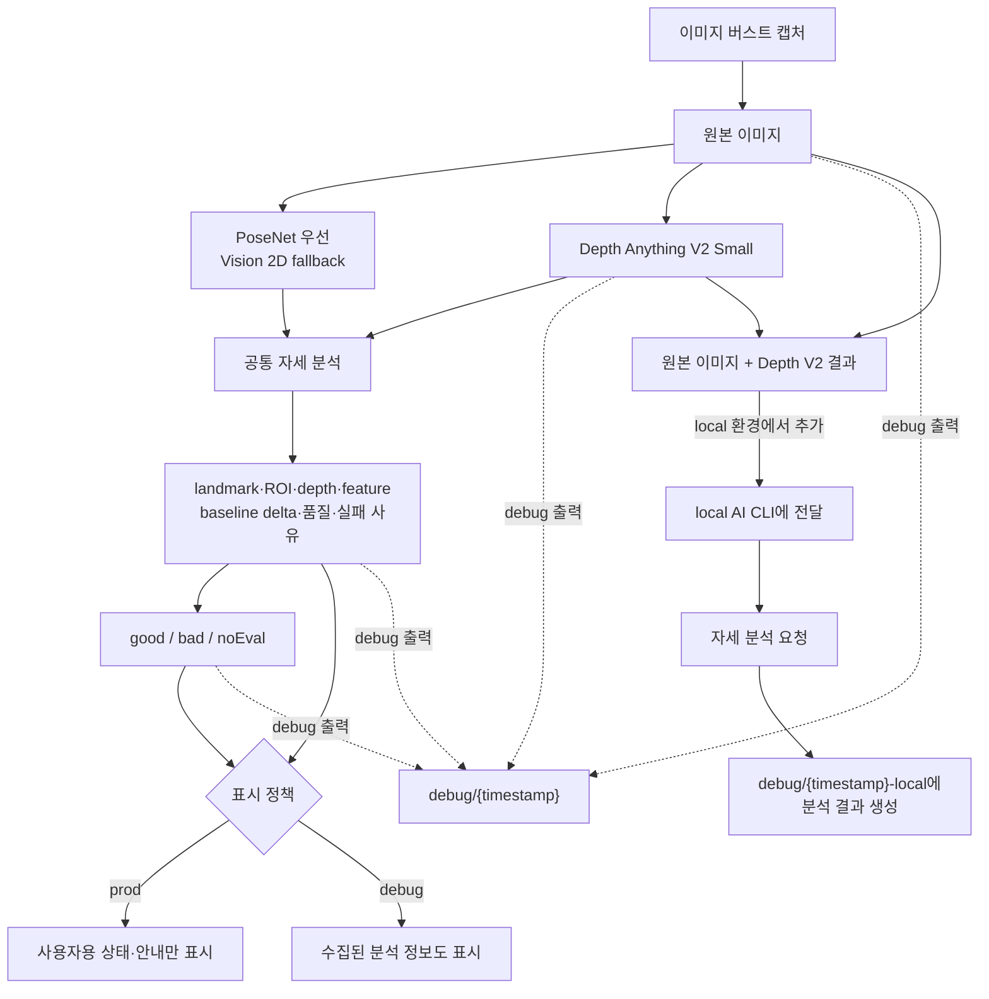

# 자세 분석 워크플로우

이 문서는 제품의 자세 분석 흐름을 빠르게 이해하기 위한 개론이다. 상세한 판단 로직과 기술 근거는 하위 문서에서 관리한다.

## 목표

Mac 내장 카메라의 고정된 시점에서 짧은 이미지 버스트를 사용해, 사용자가 저장한 기준 자세에서 머리·몸통 상대 신호가 충분히 벗어난 상태가 지속되는지 판단하고 필요한 경우 알림을 보낸다.

분석 세션은 최소 15초 간격으로 실행하며, 한 세션에서 최대 5장을 캡처하고 유효 프레임이 2장 이상일 때 판정한다. 정상 동작에서는 대체로 5장이 수집된다.

결과는 자세 습관을 위한 웰니스 신호다. 실제 이동 거리, 임상 CVA 또는 질환을 측정하지 않는다.

## 전체 흐름



## 역할 분담

| 구성 | 역할 | 담당하지 않는 것 |
|---|---|---|
| 카메라 | 같은 조건의 짧은 RGB 이미지 버스트 수집 | 자세 판정 |
| PoseNet + Apple Vision 2D | 상체 landmark 탐지, ROI와 입력 품질 결정. PoseNet 우선, Vision fallback | 앞뒤 거리와 최종 자세 판정 |
| Depth Anything V2 Small | 한 이미지 안의 relative inverse-depth map 생성 | 신체 부위, 절대 거리, 자세 판정 |
| 자세 분석기 | 머리·몸통 상대 신호 생성, baseline 비교, 품질·시간 조건 적용 | 의료 진단 |
| 알림 정책 | 확정된 `bad` 상태의 알림 시점과 반복 제한 | 자세 재판정 |

## 실행 환경과 출력 구분

자세 판정 경로와 정보 출력을 분리한다.

1. prod와 debug는 같은 자세 분석을 실행하고 같은 정보를 수집한다.
2. debug 설정은 수집한 정보를 화면과 파일로 추가 출력하지만 결정 과정에는 관여하지 않는다.
3. local 워크플로우는 공통 분석에 더해 원본 이미지와 Depth V2 결과를 local AI CLI에 전달하고 별도 자세 분석을 요청한다.



### 공통 수집 정보

prod와 debug는 다음 정보를 동일하게 생성하고 수집한다.

- 캡처한 원본 프레임
- 2D body-pose landmark와 confidence
- Depth Anything V2 Small의 relative depth map
- 머리·몸통·기준 ROI
- 프레임별 feature와 버스트 대표값·산포(중앙값 절대 편차)
- baseline 중심값과 delta
- 품질 값, 프레임 제외 사유와 `noEval` 사유
- 최종 상태와 단계별 처리 시간

여기서 수집은 분석 과정에서 값을 생성하고 사용할 수 있게 유지한다는 뜻이다. 화면과 파일 출력 여부는 별도 정책이며 자세 분석 순서에 영향을 주지 않는다.

### prod와 debug 출력

| 항목 | prod | debug |
|---|---|---|
| 캡처·분석 | 전체 공통 파이프라인 실행 | prod와 동일 |
| 수집 정보 | 자세 분석에 필요한 전체 정보 | prod와 동일 |
| 사용자 화면 | 확정 상태와 필요한 안내만 표시 | landmark, ROI, depth, feature, delta, 품질과 실패 사유도 표시 |
| 임시 파일 | 생성하지 않음 | `debug/{timestamp}`에 생성 |
| 판정 결과 | 공통 파이프라인 결과 | prod와 동일 |
| baseline·임계·상태 전이 | 공통 설정 사용 | prod와 동일 |

debug 출력을 켜거나 꺼도 캡처, 모델 실행, feature, baseline 비교, 상태 전이와 알림 판정은 달라지지 않는다. 화면 표시와 파일 저장은 공통 분석 결과를 읽기만 한다.

### debug 산출물 경로

프로젝트 루트의 `debug/`에 모든 임시 이미지와 데이터를 모은다. 한 번의 debug 분석 세션은 시작 시각을 `yyyyMMdd-HHmmss` 형식으로 만들고, 일반 분석과 local AI CLI가 같은 값을 사용한다.

```text
debug/
├── 20260720-230451/
│   ├── capture-1.png
│   ├── overlay-1.png
│   ├── depth-1.png
│   ├── frame-1.json
│   └── session.json
└── 20260720-230451-local/
    ├── request.md
    └── analysis.md
```

- `debug/{timestamp}`: 캡처 원본, landmark·ROI overlay, Depth V2 이미지, 프레임별 데이터와 세션 판정 데이터를 출력한다.
- `debug/{timestamp}-local`: local AI CLI를 사용할 때만 만들고, 요청문과 분석 결과를 출력한다.
- 두 디렉토리는 같은 `{timestamp}`를 사용해 하나의 분석 세션임을 식별한다.
- 한 세션에서 캡처하는 이미지(최대 5장)는 `1`부터 번호를 붙이고 앞에 `0`을 채우지 않는다.
- 같은 프레임의 `capture-1.png`, `overlay-1.png`, `depth-1.png`, `frame-1.json`은 같은 번호를 사용한다.
- `depth-{n}.png`는 상대 깊이를 확인하기 위한 시각화이며 절대 거리 데이터가 아니다.
- `session.json`에는 버스트 대표값, baseline delta, 품질, 실패 사유, 이번 버스트의 평가 결과, 현재 제품 상태와 처리 시간을 기록한다.
- local AI CLI에는 depth 이미지가 상대 깊이라는 조건과 함께 분석 텍스트만 반환하도록 요청한다. 응답(stdout·stderr)은 호출자가 `analysis.md`에 기록하고, 실제로 전달한 요청은 `request.md`에 기록한다.
- 임시 파일은 `debug/` 밖에 생성하지 않는다. 환경 변수 `TURTLEMECK_DEBUG_ROOT`를 절대 경로로 설정하면 debug 루트를 옮길 수 있다.
- local AI CLI가 활성화되면 debug 설정과 무관하게 `debug/{timestamp}` 산출물도 함께 생성된다. 두 경로 모두 명시적으로 켠 경우에만 동작한다.

### local AI CLI 추가 경로

local 워크플로우에서는 공통 파이프라인과 별도로 다음 단계를 추가한다.

1. 공통 캡처에서 사용한 원본 이미지를 가져온다.
2. 같은 이미지에서 생성한 Depth Anything V2 Small 결과를 가져온다.
3. 원본 이미지와 depth 결과를 하나의 분석 입력으로 묶는다.
4. 입력을 local AI CLI에 전달한다.
5. 원본 이미지와 depth 정보를 함께 보고 자세를 분석하도록 요청한다.
6. CLI 응답을 받아 `debug/{timestamp}-local`의 `analysis.md`에 기록한다.
7. local AI CLI의 응답을 공통 판정 결과와 분리한다.

local AI CLI 경로는 공통 자세 분석을 대체하지 않는다. CLI 응답을 feature, baseline, `good`·`bad`·`noEval`, 알림 판정에 다시 입력하지 않는다. CLI 실행 실패도 공통 판정 결과를 변경하지 않는다.

local AI CLI에는 `debug/{timestamp}`의 `capture-{n}.png`와 `depth-{n}.png`를 전달한다. 비교를 위해 별도 이미지를 다시 캡처하거나 depth를 다시 생성하지 않는다. CLI가 만든 파일은 `debug/{timestamp}-local`에만 저장한다.

## 판정 개요

1. 짧은 이미지 버스트로 최대 5장을 캡처한다.
2. PoseNet을 우선 사용하고 필요하면 Vision 2D로 fallback하여 머리와 양쪽 어깨 위치·품질을 확인한다.
3. 같은 이미지에서 Depth Anything V2 Small로 상대 깊이 지도를 만든다.
4. 머리·몸통 ROI의 상대 깊이 차이를 프레임 간 비교 가능한 feature로 정규화한다.
5. 유효한 여러 프레임의 대표값을 개인 baseline과 비교한다.
6. 입력이 부족하거나 결과가 불안정하면 `noEval`로 처리한다.
7. 한 정기 점검에서 악화가 나오면 후보로 유지하고, 해당 캡처 시작 시각에서 설정된 점검 주기가 지난 뒤 다음 정기 점검도 악화일 때만 `bad`를 확정하고 알림을 검토한다. 별도 즉시 재촬영은 하지 않는다.

## 보정과 재보정 흐름

baseline이 없으면 자세 판정을 시작할 수 없으므로, 최초 실행 시 기준 자세 보정을 먼저 진행한다. baseline이 없는 동안에는 `확인`과 `중지`를 비활성화한다.

1. 최초 실행(또는 baseline 없음) 시 기준 자세 수집을 시작한다.
2. 한 번의 수집은 카메라를 1회 활성화해 버스트를 캡처한다. 유효한 기준 자세를 얻으면 baseline을 저장하고 정기 점검을 시작한다.
3. 신호 품질이 부족해 수집에 실패하면 10초 대기 후 다시 수집하며, 수집은 총 3회까지만 실행한다. 카메라 사용 불가 계열 실패(권한 거부, 프레임 0장 등)는 재시도 없이 즉시 종료하고 카메라 사용 불가 상태로 표시한다.
4. 3회 모두 실패하면 최종 실패로 종료하고 동작을 중단한다.
   - 추가 점검을 예약하지 않으며, `확인`과 `중지`는 비활성 상태를 유지한다.
   - 상태를 `보정 필요`로 표시하고 재보정 안내만 남긴다. 이후에는 사용자의 수동 실행이 필요하다.
5. 사용자가 `보정`을 누르면 위 흐름을 다시 시작하고, 성공 시 정기 점검을 재개한다.

운영 중 baseline이 무효화된 경우(카메라 구성 변경 등)에도 같은 흐름으로 정기 점검을 중단하고 재보정을 기다린다.

## 결과 의미

| 결과 | 의미 |
|---|---|
| `good` | 품질을 충족한 신호가 사용자가 저장한 baseline 기준 범위에 있음 |
| `bad` | 사용자가 저장한 baseline에서 충분히 벗어난 신호가 일정 시간 지속됨 |
| `noEval` | 사람, ROI, depth, 안정성 또는 baseline이 부족해 판단할 수 없음 |

`noEval`은 정상 상태가 아니다. 정상 또는 악화 증거에 포함하지 않는다.

## 사용하지 않는 경로

- Apple Vision 3D와 하드웨어 depth fallback
- 정면·측면·3/4 시점별 자동 알고리즘 전환
- 별도 얼굴·사람 분할 모델
- 절대 거리와 임상 CVA 변환
- 일상 결과를 사용한 baseline 자동 갱신
- 비디오 depth 모델과 복잡한 시계열 필터

## 상세 문서

| 문서 | 내용 |
|---|---|
| [자세 분석 상세 워크플로우](algorithm/posture-analysis-workflow.md) | 캡처부터 상태 전이·알림까지의 상세 판단 순서 |
| [2D 자세 모델 비교](algorithm/pose-estimation/comparison.md) | PoseNet 채택 근거와 Vision fallback 역할 |
| [Apple Core ML 샘플 PoseNet](algorithm/apple-posenet/README.md) | 번들 모델, 17개 관절, decoder와 좌표계 경계 |
| [Apple Vision 2D](algorithm/apple-body-pose/analysis.md) | 운영체제 fallback API의 19개 point와 confidence 계약 |
| [Apple Vision 3D](algorithm/apple-body-pose/related-vision-3d.md) | 3D skeleton과 현재 제외 근거 |
| [상체 자세 추정 로직](algorithm/pose-estimation/analysis.md) | 자세 분석 원리, 실패 조건과 적용 경계 |
| [Depth Anything V2 분석](depth-estimation/depth-anything-v2/analysis.md) | relative depth의 역할과 해석 범위 |
| [relative depth feature 설계](depth-estimation/etc/related-feature-design.md) | ROI 통계와 affine-invariant 정규화 후보 |
| [개인 baseline 보정](algorithm/pose-estimation/related-baseline-calibration.md) | baseline 생성과 갱신 경계 |
| [시계열·비디오 depth 조사](depth-estimation/etc/related-temporal-video-depth.md) | 버스트 집계 채택과 video depth 미채택 근거 |
| [자세 적용 타당성](depth-estimation/etc/related-posture-feasibility.md) | depth 지표와 자세 판정 성능의 구분 |
