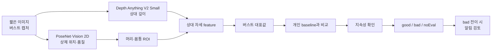
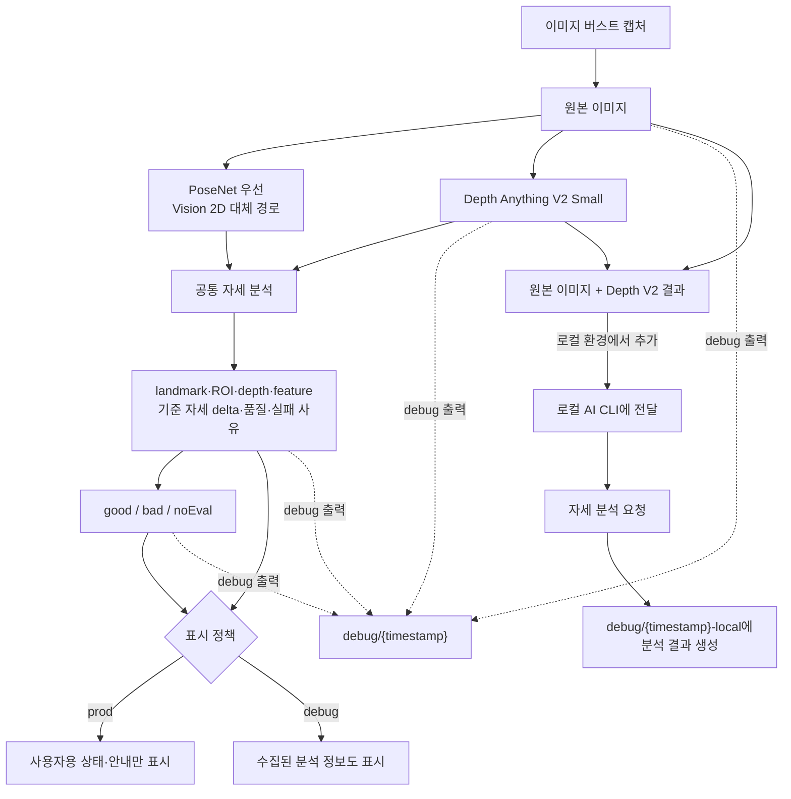

# 자세 분석 워크플로우

이 문서는 제품의 자세 분석 흐름을 빠르게 이해하기 위한 개론이다.
상세한 판단 로직과 기술 근거는 하위 문서에서 관리한다.

## 목표

Mac 내장 카메라의 고정된 시점에서 짧은 이미지 버스트를 사용해, 사용자가 저장한 기준 자세에서 머리·몸통 상대 신호가 충분히 벗어난 상태가 지속되는지 판단하고 필요한 경우 알림을 보낸다.

분석 세션은 최소 15초 간격으로 실행한다.
카메라를 시작한 뒤 처음 0.8초는 워밍업 구간으로 버리고, 이어지는 2.4초 동안 최소 0.4초 간격으로 후보 프레임을 분석 큐에 등록한다.
한 세션에서 등록하는 후보 프레임은 최대 5개이며, 밝기 게이트에서 제외된 프레임도 이 한도에 포함된다.
유효 프레임이 2개 이상이고 버스트 품질 조건을 충족할 때 판정한다.

결과는 자세 습관을 위한 웰니스 신호다.
실제 이동 거리, 임상 CVA 또는 질환을 측정하지 않는다.

## 전체 흐름


```mermaid
flowchart LR
    A["짧은 이미지<br/>버스트 캡처"] --> B["PoseNet·Vision 2D<br/>상체 위치·품질"]
    A --> C["Depth Anything V2 Small<br/>상대 깊이"]
    B --> D["머리·몸통 ROI"]
    C --> E["상대 자세 feature"]
    D --> E
    E --> F["버스트 대표값"]
    F --> G["개인 baseline과 비교"]
    G --> H["지속성 확인"]
    H --> I["good / bad / noEval"]
    I --> J["bad 전이 시<br/>알림 검토"]
```

## 역할 분담

| 구성 | 역할 | 담당하지 않는 것 |
|---|---|---|
| 카메라 | 같은 조건의 짧은 RGB 이미지 버스트 수집 | 자세 판정 |
| PoseNet + Apple Vision 2D | 상체 landmark 탐지, ROI와 입력 품질 결정. PoseNet 우선, Vision 대체 경로 | 앞뒤 거리와 최종 자세 판정 |
| Depth Anything V2 Small | 한 이미지 안의 relative inverse-depth map 생성 | 신체 부위, 절대 거리, 자세 판정 |
| 자세 분석기 | 머리·몸통 상대 신호 생성, 기준 자세 비교, 품질·시간 조건 적용 | 의료 진단 |
| 알림 정책 | 확정된 `bad` 상태의 알림 시점과 반복 제한 | 자세 재판정 |

## 실행 환경과 출력 구분

자세 판정 경로와 정보 출력을 분리한다.

1. prod와 debug는 같은 자세 분석을 실행하고 같은 정보를 수집한다.
2. `debug` 설정은 수집한 정보를 화면과 파일로 추가 출력하지만 결정 과정에는 관여하지 않는다.
3. 로컬 워크플로우는 공통 분석에 더해 원본 이미지와 Depth V2 결과를 외부 로컬 AI CLI에 전달하고 별도 자세 분석을 요청한다.


```mermaid
flowchart TD
    CAPTURE["이미지 버스트 캡처"] --> ORIGINAL["원본 이미지"]
    ORIGINAL --> POSE["PoseNet 우선<br/>Vision 2D 대체 경로"]
    ORIGINAL --> DEPTH["Depth Anything V2 Small"]

    POSE --> CORE["공통 자세 분석"]
    DEPTH --> CORE
    CORE --> DATA["landmark·ROI·depth·feature<br/>기준 자세 delta·품질·실패 사유"]
    DATA --> STATE["good / bad / noEval"]

    DATA --> VIEW{"표시 정책"}
    STATE --> VIEW
    VIEW -- "prod" --> PRODVIEW["사용자용 상태·안내만 표시"]
    VIEW -- "debug" --> DEBUGVIEW["수집된 분석 정보도 표시"]

    ORIGINAL -. "debug 출력" .-> DEBUGDIR["debug/{timestamp}"]
    DEPTH -. "debug 출력" .-> DEBUGDIR
    DATA -. "debug 출력" .-> DEBUGDIR
    STATE -. "debug 출력" .-> DEBUGDIR

    ORIGINAL --> LOCALPAIR["원본 이미지 + Depth V2 결과"]
    DEPTH --> LOCALPAIR
    LOCALPAIR -- "로컬 환경에서 추가" --> CLI["로컬 AI CLI에 전달"]
    CLI --> REQUEST["자세 분석 요청"]
    REQUEST --> LOCALRESULT["debug/{timestamp}-local에<br/>분석 결과 생성"]
```

### 공통 수집 정보

prod와 debug는 다음 정보를 동일하게 생성하고 수집한다.

- 캡처한 원본 프레임
- 2D body-pose landmark와 confidence
- Depth Anything V2 Small의 relative depth map
- 머리·몸통·기준 ROI
- 프레임별 reference ROI IQR과 부호 있는 feature
- 버스트 feature 중앙값과 MAD
- 기준 자세 중심값과 부호 있는 delta
- 품질 값, 프레임 제외 사유와 `noEval` 사유
- 최종 상태와 단계별 처리 시간

여기서 수집은 분석 과정에서 값을 생성하고 사용할 수 있게 유지한다는 뜻이다.
화면과 파일 출력 여부는 별도 정책이며 자세 분석 순서에 영향을 주지 않는다.

### prod와 debug 출력

| 항목 | prod | debug |
|---|---|---|
| 캡처·분석 | 전체 공통 파이프라인 실행 | prod와 동일 |
| 수집 정보 | 자세 분석에 필요한 전체 정보 | prod와 동일 |
| 사용자 화면 | 확정 상태와 필요한 안내만 표시 | landmark, ROI, depth, feature, delta, 품질과 실패 사유도 표시 |
| 임시 파일 | 생성하지 않음 | `debug/{timestamp}`에 생성 |
| 판정 결과 | 공통 파이프라인 결과 | prod와 동일 |
| 기준 자세·임계·상태 전이 | 공통 설정 사용 | prod와 동일 |

debug 출력을 켜거나 꺼도 캡처, 모델 실행, feature, 기준 자세 비교, 상태 전이와 알림 판정은 달라지지 않는다.
화면 표시와 파일 저장은 공통 분석 결과를 읽기만 한다.

### 디버그 산출물 경로

기본 디버그 루트는 소스 파일·앱 번들·실행 파일·현재 작업 디렉토리에서 `Package.swift` 또는 `.build`를 찾아 결정한 프로젝트 루트의 `debug/`다.
절대 경로인 `TURTLEMECK_DEBUG_ROOT`가 있으면 자동 탐색 결과보다 우선한다.
프로젝트 루트를 찾지 못하고 유효한 재정의 경로도 없으면 파일을 출력하지 않는다.
한 번의 debug 분석 세션은 시작 시각을 `yyyyMMdd-HHmmss` 형식으로 만들고, 일반 분석과 로컬 AI CLI가 같은 값을 사용한다.

```text
debug/
├── 20260720-230451/
│   ├── capture-1.png
│   ├── overlay-1.png
│   ├── depth-1.png
│   ├── frame-1.json
│   └── session.json
└── 20260720-230451-local/
    ├── request.md
    └── analysis.md
```

- `debug/{timestamp}`: 캡처 원본, landmark·ROI overlay, Depth V2 이미지, 프레임별 데이터와 세션 판정 데이터를 출력한다.
- `debug/{timestamp}-local`: 로컬 AI CLI를 사용할 때만 만들고, 요청문과 분석 결과를 출력한다.
- 두 디렉토리는 같은 `{timestamp}`를 사용해 하나의 분석 세션임을 식별한다.
- 한 세션에서 캡처하는 이미지(최대 5장)는 `1`부터 번호를 붙이고 앞에 `0`을 채우지 않는다.
- 같은 프레임의 `capture-1.png`, `overlay-1.png`, `depth-1.png`, `frame-1.json`은 같은 번호를 사용한다.
- `depth-{n}.png`는 상대 깊이를 확인하기 위한 시각화이며 절대 거리 데이터가 아니다.
- `session.json`에는 버스트 대표값, 기준 자세 delta, 품질, 실패 사유, 이번 버스트의 평가 결과, 현재 제품 상태와 처리 시간을 기록한다.
- 로컬 AI CLI에는 depth 이미지가 상대 깊이라는 조건과 함께 분석 텍스트만 반환하도록 요청한다. 응답(stdout·stderr)은 호출자가 `analysis.md`에 기록하고, 실제로 전달한 요청은 `request.md`에 기록한다.
- 앱의 내장 출력기는 선택한 디버그 루트에만 파일을 생성한다.
- 로컬 AI CLI가 활성화되면 debug 설정과 무관하게 공통 debug 산출물도 함께 생성한다.
- 공통 디버그 루트를 결정하지 못하면 로컬 AI CLI도 실행하지 않는다.

### 로컬 AI CLI 추가 경로

로컬 워크플로우에서는 공통 파이프라인과 별도로 다음 단계를 추가한다.

1. 공통 캡처에서 사용한 원본 이미지를 가져온다.
2. 같은 이미지에서 생성한 Depth Anything V2 Small 결과를 가져온다.
3. 원본 이미지와 depth 결과를 하나의 분석 입력으로 묶는다.
4. 입력을 로컬 AI CLI에 전달한다.
5. 원본 이미지와 depth 정보를 함께 보고 자세를 분석하도록 요청한다.
6. CLI 응답을 받아 `debug/{timestamp}-local`의 `analysis.md`에 기록한다.
7. 로컬 AI CLI의 응답을 공통 판정 결과와 분리한다.

로컬 AI CLI 경로는 공통 자세 분석을 대체하지 않는다.
CLI 응답을 feature, 기준 자세, `good`·`bad`·`noEval`, 알림 판정에 다시 입력하지 않는다.
CLI 실행 실패도 공통 판정 결과를 변경하지 않는다.

로컬 AI CLI는 `TURTLEMECK_LOCAL_AI_EXECUTABLE`에 절대 실행 파일 경로가 있을 때만 활성화한다.
선택 인자는 `TURTLEMECK_LOCAL_AI_ARGUMENTS_JSON`의 JSON 문자열 배열로 전달한다.
로컬 AI CLI에는 `debug/{timestamp}`의 `capture-{n}.png`와 `depth-{n}.png`를 전달한다.
비교를 위해 별도 이미지를 다시 캡처하거나 depth를 다시 생성하지 않는다.
호출자는 요청문과 stdout·stderr만 `debug/{timestamp}-local`에 기록한다.

외부 프로세스의 작업 디렉토리는 `debug/{timestamp}-local`이지만, 별도 샌드박스나 실행 파일 허용 목록은 적용하지 않는다.
입력 디렉토리를 수정하지 말라는 요청은 프롬프트 규칙일 뿐 파일 접근을 강제하는 보안 경계가 아니다.
따라서 사용자가 신뢰하는 실행 파일과 인자만 설정해야 한다.

## 판정 개요

1. 0.8초 워밍업 뒤 후보 프레임을 최대 5개까지 분석 큐에 등록하고 밝기 게이트를 적용한다.
2. PoseNet을 우선 사용하고 필요하면 Vision 2D로 fallback하여 머리와 양쪽 어깨 위치·품질을 확인한다.
3. 같은 이미지에서 Depth Anything V2 Small로 상대 깊이 지도를 만든다.
4. 표준 입력은 두 어깨의 Euclidean 폭을 사용하고, 한쪽 귀만 보이는 측면 기하가 검증되면 두 어깨의 수평 폭을 사용한다.
5. 머리·몸통 ROI의 상대 깊이 차이를 프레임의 reference ROI IQR로 정규화한다.
6. 유효한 프레임 feature의 중앙값과 MAD를 버스트 대표값과 안정성 값으로 사용한다.
7. 부호 있는 `delta = feature - baseline.center`는 진단에 보존하고, 판정은 `abs(delta)`를 사용한다.
8. 프레임의 기술적 실패는 제외 사유로 기록하고, 남은 유효 프레임이 충분하면 같은 버스트의 분석을 계속한다.
9. 유효 프레임 수·비율이 부족하거나 버스트 MAD가 크면 버스트를 `noEval`로 처리한다.
10. 신뢰 가능한 머리는 있지만 가림·잘림·머리 처짐 등 자세 때문에 정상 자세를 확인할 수 없는 프레임이 최소 2개이면서 과반이면 악화 증거로 처리한다.
11. 한 점검에서 악화가 나오면 후보로 유지하고, 최소 15초 뒤의 다음 점검도 악화일 때만 `bad`를 확정하고 알림을 검토한다.
12. 자동 점검은 해당 캡처 시작 시각에서 설정된 주기가 지난 뒤 실행하며 별도 확인 타이머는 만들지 않는다.
13. 사용자가 `확인`으로 다음 점검을 앞당겨도 15초 하한과 같은 지속성 판정을 적용한다.

## 보정과 재보정 흐름

기준 자세가 없으면 자세 판정을 시작할 수 없으므로, 최초 실행 시 기준 자세 보정을 먼저 진행한다.
기준 자세가 없는 동안에는 `확인`과 `중지`를 비활성화한다.

1. 앱 시작 시 저장된 기준 자세가 없으면 최초 보정을 자동으로 시작한다.
2. 사용자가 `보정`을 누르면 기준 자세 유무와 관계없이 같은 보정 흐름을 시작한다.
3. 한 번의 수집은 카메라를 1회 활성화해 버스트를 캡처한다.
4. 유효한 기준 자세를 얻으면 기준값을 새로 저장하고 정기 점검을 시작한다.
5. 신호 품질이 부족해 수집에 실패하면 10초 대기 후 다시 수집하며, 품질 판정까지 완료된 수집 시도는 총 3회까지만 실행한다.
6. 절전이나 세션 중단으로 완료되지 못한 수집은 시도 횟수에 넣지 않고 복귀 후 다시 시작한다.
7. 카메라 사용 불가 계열 실패는 재시도 없이 즉시 종료하고, 권한 거부는 권한 허용 안내로 구분한다.
8. 3회 모두 실패하면 최종 실패로 종료하고 동작을 중단한다.
   - 추가 점검을 예약하지 않으며, `확인`과 `중지`는 비활성 상태를 유지한다.
   - 상태를 `보정 필요`로 표시하고 재보정 안내만 남긴다. 이후에는 사용자의 수동 실행이 필요하다.
9. 성공한 보정만 기존 기준값을 교체한다.

운영 중 기준값의 수치·버전·카메라 구성이 유효하지 않거나, 현재 어깨 중점 y가 보정보다 `0.05`를 초과해 달라지거나 어깨 폭이 `10%`를 초과해 달라지면 정기 점검을 중단한다.
이 경우 자동 재보정을 시작하지 않고 사용자가 `보정`을 누르기를 기다린다.

## 결과 의미

| 결과 | 의미 |
|---|---|
| `good` | 품질을 충족한 신호가 사용자가 저장한 기준 자세 범위에 있음 |
| `bad` | 사용자가 저장한 기준 자세에서 충분히 벗어난 신호 또는 자세 때문에 정상 확인이 불가능한 패턴이 일정 시간 지속됨 |
| `noEval` | 사람, ROI, depth, 안정성 또는 기준 자세가 부족해 판단할 수 없음 |

`noEval`은 정상 상태가 아니다.
정상 또는 악화 증거에 포함하지 않는다.

## 사용하지 않는 경로

- Apple Vision 3D와 하드웨어 depth 대체 경로
- 정면·측면·3/4 시점별 자동 알고리즘 전환
- 별도 얼굴·사람 분할 모델
- 절대 거리와 임상 CVA 변환
- 일상 결과를 사용한 기준 자세 자동 갱신
- 비디오 depth 모델과 복잡한 시계열 필터

## 상세 문서

| 문서 | 내용 |
|---|---|
| [자세 분석 상세 워크플로우](algorithm/posture-analysis-workflow.md) | 캡처부터 상태 전이·알림까지의 상세 판단 순서 |
| [2D 자세 모델 비교](algorithm/pose-estimation/comparison.md) | PoseNet 채택 근거와 Vision 대체 경로 역할 |
| [Apple Core ML 샘플 PoseNet](algorithm/apple-posenet/README.md) | 번들 모델, 17개 관절, decoder와 좌표계 경계 |
| [Apple Vision 2D](algorithm/apple-body-pose/analysis.md) | 운영체제 대체 경로 API의 19개 point와 confidence 계약 |
| [상체 자세 추정 로직](algorithm/pose-estimation/analysis.md) | 자세 분석 원리, 실패 조건과 적용 경계 |
| [Depth Anything V2 분석](depth-estimation/depth-anything-v2/analysis.md) | relative depth의 역할과 해석 범위 |
| [relative depth feature 설계](depth-estimation/etc/related-feature-design.md) | ROI 통계와 affine-invariant 정규화 후보 |
| [개인 기준 자세 보정](algorithm/pose-estimation/related-baseline-calibration.md) | 기준값 생성과 갱신 경계 |
| [자세 적용 타당성](depth-estimation/etc/related-posture-feasibility.md) | depth 지표와 자세 판정 성능의 구분 |
